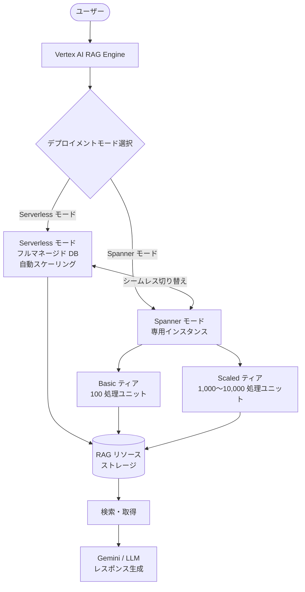

# Generative AI on Vertex AI: RAG Engine Serverless モード

**リリース日**: 2026-04-03

**サービス**: Generative AI on Vertex AI

**機能**: RAG Engine Serverless モード

**ステータス**: Public Preview

[このアップデートのインフォグラフィックを見る](https://takech9203.github.io/google-cloud-news-summary/20260403-vertex-ai-rag-engine-serverless-mode.html)

## 概要

Vertex AI RAG Engine に新たな Serverless モードが Public Preview として追加された。Serverless モードは、RAG リソースの保存に使用されるデータベースのプロビジョニングとスケーリングを完全に抽象化したフルマネージドなデータベースを提供する。これにより、ユーザーはインフラストラクチャの管理を意識することなく RAG アプリケーションの構築に集中できるようになる。

従来の Vertex AI RAG Engine では、バックエンドとして Spanner インスタンスを使用する RagManagedDb が提供されており、Basic ティアと Scaled ティアの選択が可能だった。今回の Serverless モードの追加により、Spanner モード (専用の分離されたデータベースインスタンスを提供) と Serverless モード (フルマネージドなサーバーレスデータベース) の 2 つのデプロイメントモードが選択可能になった。さらに、両モード間のシームレスな切り替えもサポートされている。

このアップデートは、RAG アプリケーションを迅速にプロトタイピングしたい開発者や、インフラ管理の負担を軽減したい運用チームにとって特に有益である。

**アップデート前の課題**

- RAG Engine の利用には Spanner インスタンスのプロビジョニングが必要で、Basic ティア (100 処理ユニット) または Scaled ティア (1,000〜10,000 処理ユニット) を明示的に選択・管理する必要があった
- データベースのスケーリング設定を自分で管理する必要があり、ワークロードの変動に応じた調整が運用負担となっていた
- 小規模な検証やプロトタイピングの段階でも、Spanner インスタンスの費用が発生していた

**アップデート後の改善**

- Serverless モードにより、データベースのプロビジョニングとスケーリングが完全に自動化され、インフラ管理が不要になった
- Serverless モードと Spanner モードの間でシームレスに切り替えが可能になり、開発フェーズから本番環境への移行が柔軟になった
- フルマネージドなサーバーレスデータベースにより、初期設定の手間が大幅に削減された

## アーキテクチャ図



Vertex AI RAG Engine の 2 つのデプロイメントモードと、それらの間のシームレスな切り替えを示す図。Serverless モードはプロビジョニング不要のフルマネージド構成を提供し、Spanner モードは Basic と Scaled の 2 ティアによる専用インスタンスを提供する。

## サービスアップデートの詳細

### 主要機能

1. **Serverless モード (フルマネージドデータベース)**
   - RAG リソースの保存用にフルマネージドなデータベースを提供
   - データベースのプロビジョニングとスケーリングを完全に抽象化
   - ユーザーはインフラ管理を意識せずに RAG アプリケーションの開発に集中可能

2. **Spanner モード (専用データベースインスタンス)**
   - 従来の RagManagedDb に相当する、専用で分離されたデータベースインスタンスを提供
   - Basic ティア: 100 処理ユニット (0.1 ノード相当) の固定構成、コスト効率重視
   - Scaled ティア: 最小 1 ノード (1,000 処理ユニット) から最大 10 ノード (10,000 処理ユニット) のオートスケーリング構成

3. **モード間のシームレス切り替え**
   - Serverless モードと Spanner モードの間で、データを保持したまま切り替え可能
   - 開発・検証フェーズでは Serverless モード、本番環境では Spanner モードの Scaled ティアといった使い分けが可能

## 技術仕様

### デプロイメントモード比較

| 項目 | Serverless モード | Spanner モード (Basic) | Spanner モード (Scaled) |
|------|-------------------|------------------------|--------------------------|
| ステータス | Public Preview | GA | GA |
| データベース管理 | フルマネージド | ユーザー管理 (固定構成) | ユーザー管理 (オートスケーリング) |
| プロビジョニング | 不要 | 自動 (100 処理ユニット) | 自動 (1,000〜10,000 処理ユニット) |
| スケーリング | 自動 | 固定 | オートスケーリング |
| 推奨用途 | プロトタイピング、小〜中規模 | 実験、小規模データ | 本番環境、大規模データ |

### API 構成

RagEngineConfig リソースを通じてデプロイメントモードを設定する。

```python
from vertexai import rag
import vertexai

PROJECT_ID = "YOUR_PROJECT_ID"
LOCATION = "YOUR_RAG_ENGINE_LOCATION"

vertexai.init(project=PROJECT_ID, location=LOCATION)

# Serverless モードの設定例
rag_engine_config_name = f"projects/{PROJECT_ID}/locations/{LOCATION}/ragEngineConfig"
new_rag_engine_config = rag.RagEngineConfig(
    name=rag_engine_config_name,
    rag_managed_db_config=rag.RagManagedDbConfig(
        serverless=rag.Serverless()
    ),
)
updated_config = rag.rag_data.update_rag_engine_config(
    rag_engine_config=new_rag_engine_config
)
```

## 設定方法

### 前提条件

1. Google Cloud プロジェクトで Vertex AI API が有効化されていること
2. 適切な IAM 権限 (Vertex AI ユーザーロール以上) が付与されていること
3. RAG Engine がサポートされているリージョンを使用すること

### 手順

#### ステップ 1: Serverless モードへの切り替え

```bash
# REST API を使用した Serverless モードの設定
curl -X PATCH \
  -H "Content-Type: application/json" \
  -H "Authorization: Bearer $(gcloud auth print-access-token)" \
  https://${LOCATION}-aiplatform.googleapis.com/v1beta1/projects/${PROJECT_ID}/locations/${LOCATION}/ragEngineConfig \
  -d '{"ragManagedDbConfig": {"serverless": {}}}'
```

Serverless モードを選択すると、データベースのプロビジョニングとスケーリングが自動的に処理される。

#### ステップ 2: Spanner モードへの切り替え (必要に応じて)

```bash
# Spanner モード (Basic ティア) への切り替え
curl -X PATCH \
  -H "Content-Type: application/json" \
  -H "Authorization: Bearer $(gcloud auth print-access-token)" \
  https://${LOCATION}-aiplatform.googleapis.com/v1beta1/projects/${PROJECT_ID}/locations/${LOCATION}/ragEngineConfig \
  -d '{"ragManagedDbConfig": {"spanner": {"basic": {}}}}'
```

本番ワークロードへの移行時に、Spanner モードの Scaled ティアに切り替えることで、専用インスタンスによる高いパフォーマンスとスケーラビリティを確保できる。

## メリット

### ビジネス面

- **初期導入コストの削減**: データベースのプロビジョニングが不要になることで、RAG アプリケーションの構築開始までの時間とコストが大幅に削減される
- **運用負担の軽減**: インフラ管理が完全に自動化されるため、運用チームはアプリケーションのロジックに集中できる
- **柔軟なスケーリング戦略**: 開発フェーズから本番環境まで、モード切り替えにより段階的にスケールアップが可能

### 技術面

- **インフラ抽象化**: データベースのプロビジョニングとスケーリングが完全に抽象化され、宣言的な構成のみで利用可能
- **シームレスなモード切り替え**: Serverless モードと Spanner モード間でデータを保持したまま切り替えが可能
- **既存の RAG Engine 機能との互換性**: KNN/ANN 検索、VPC-SC セキュリティコントロール、CMEK などの既存機能はモードに関係なく利用可能

## デメリット・制約事項

### 制限事項

- 現時点では Public Preview であり、本番環境での利用には SLA の確認が必要
- Serverless モードの具体的なパフォーマンス特性や処理ユニットの上限は、公式ドキュメントで要確認
- Data Residency および AXT セキュリティコントロールは RAG Engine 全体で未サポート

### 考慮すべき点

- Preview 段階のため、GA に向けて仕様変更が入る可能性がある
- 大規模な本番ワークロードでは、Spanner モードの Scaled ティアの方が性能要件を満たしやすい場合がある
- モード切り替え時のダウンタイムや影響範囲について、事前に検証することを推奨

## ユースケース

### ユースケース 1: RAG アプリケーションの迅速なプロトタイピング

**シナリオ**: 新しい社内ナレッジベースの RAG アプリケーションを検証したい。データベースの構成管理に時間をかけずに、すぐに動作確認を始めたい。

**実装例**:
```python
from vertexai import rag
import vertexai

vertexai.init(project="my-project", location="us-central1")

# Serverless モードで RAG Engine を構成
config = rag.RagEngineConfig(
    name="projects/my-project/locations/us-central1/ragEngineConfig",
    rag_managed_db_config=rag.RagManagedDbConfig(
        serverless=rag.Serverless()
    ),
)
rag.rag_data.update_rag_engine_config(rag_engine_config=config)

# RAG コーパスの作成とドキュメントのインポートをすぐに開始可能
corpus = rag.create_corpus(display_name="knowledge-base-prototype")
```

**効果**: データベースのプロビジョニング待ちなしで即座に RAG アプリケーションの開発・検証を開始でき、プロトタイピング期間を短縮できる。

### ユースケース 2: 開発環境から本番環境への段階的移行

**シナリオ**: Serverless モードで開発・検証を行った RAG アプリケーションを、本番環境に移行する際に Spanner モードの Scaled ティアに切り替えたい。

**効果**: データを保持したまま Serverless モードから Spanner モード (Scaled ティア) にシームレスに切り替えることで、再構築やデータ移行の手間を省きつつ、本番環境に適したパフォーマンスとスケーラビリティを確保できる。

## 料金

Vertex AI RAG Engine の料金はデプロイメントモードにより異なる。Spanner モードでは、バックエンドの Spanner インスタンスに対する標準的な Spanner SKU 料金が発生する。

- **Spanner モード (Basic ティア)**: 100 処理ユニット (0.1 ノード相当) の固定料金
- **Spanner モード (Scaled ティア)**: 1〜10 ノードのオートスケーリング、使用量に応じた料金
- **Serverless モード**: Public Preview 時点の料金体系については公式ドキュメントを参照

その他、データ取り込み、エンベディング生成、LLM による応答生成にはそれぞれの利用コストが発生する。詳細は料金ページを参照。

## 利用可能リージョン

Vertex AI RAG Engine は以下のリージョンでサポートされている (GA およびプレビュー段階を含む)。

| リージョン | ロケーション | ステージ |
|-----------|------------|---------|
| us-central1 | アイオワ | Allowlist, GA |
| us-east4 | バージニア | Allowlist, GA |
| us-east1 | サウスカロライナ | Allowlist, Preview |
| europe-west3 | フランクフルト | GA |
| europe-west4 | オランダ | GA |
| asia-northeast1 | 東京 | Preview |
| asia-southeast1 | シンガポール | Preview |

上記は主要リージョンの抜粋。その他、アジア太平洋、ヨーロッパ、北米の計 22 リージョンで利用可能。

## 関連サービス・機能

- **Cloud Spanner**: RAG Engine の Spanner モードのバックエンドとして使用される分散型リレーショナルデータベース。Serverless モードはこの Spanner の管理を抽象化する
- **Vertex AI Generative AI (Gemini)**: RAG Engine と組み合わせてグラウンディングされた応答を生成する LLM。Gemini 2.5/3.x シリーズなどをサポート
- **Vertex AI エンベディングモデル**: RAG コーパスにインデックスされるドキュメントのベクトルエンベディングを生成するモデル (text-embedding-004 など)
- **Cloud Storage / Google Drive**: RAG Engine へのデータ取り込み元として利用可能なデータソース
- **VPC Service Controls**: RAG Engine のセキュリティ境界を定義するためのサービス

## 参考リンク

- [このアップデートのインフォグラフィック](https://takech9203.github.io/google-cloud-news-summary/20260403-vertex-ai-rag-engine-serverless-mode.html)
- [公式リリースノート](https://cloud.google.com/release-notes#April_03_2026)
- [RAG Engine 概要](https://cloud.google.com/vertex-ai/generative-ai/docs/rag-engine/rag-overview)
- [RagManagedDb の理解](https://cloud.google.com/vertex-ai/generative-ai/docs/rag-engine/understanding-ragmanageddb)
- [ベクトルデータベースの選択肢](https://cloud.google.com/vertex-ai/generative-ai/docs/rag-engine/vector-db-choices)
- [RAG Engine の料金](https://cloud.google.com/vertex-ai/generative-ai/docs/rag-engine/rag-engine-billing)
- [Spanner の料金](https://cloud.google.com/spanner/pricing)
- [RAG API v1beta1 リファレンス](https://cloud.google.com/vertex-ai/generative-ai/docs/model-reference/rag-api)

## まとめ

Vertex AI RAG Engine の Serverless モードは、RAG アプリケーション開発における最大の摩擦の一つであったデータベースのプロビジョニングとスケーリング管理を解消する重要なアップデートである。Serverless モードと Spanner モードのシームレスな切り替えにより、プロトタイピングから本番環境まで一貫した開発体験が実現される。RAG アプリケーションを構築・運用しているチームは、Serverless モードの Preview 機能を評価し、開発ワークフローへの組み込みを検討することを推奨する。

---

**タグ**: #VertexAI #RAGEngine #Serverless #GenerativeAI #Spanner #PublicPreview #MachineLearning #VectorDatabase
