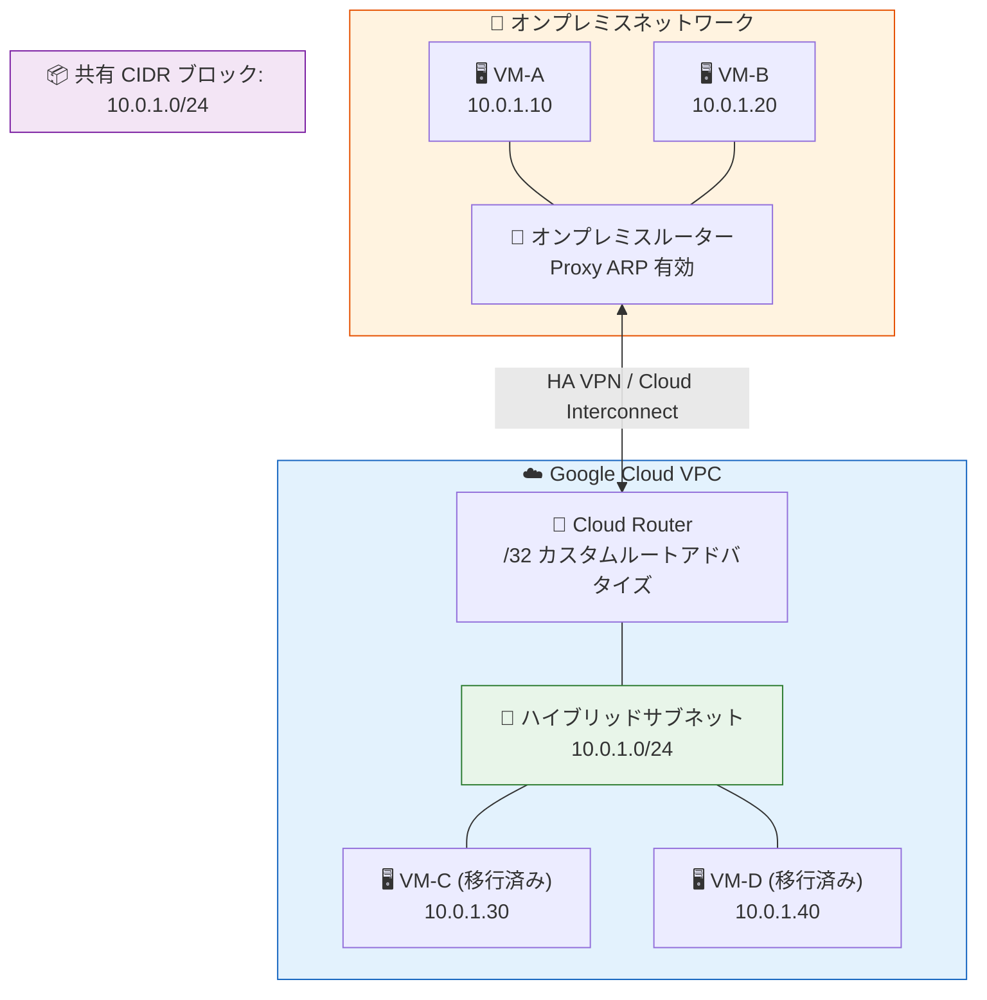

# Virtual Private Cloud: Hybrid Subnets が General Availability に昇格

**リリース日**: 2026-04-03

**サービス**: Virtual Private Cloud (VPC)

**機能**: Hybrid Subnets (ハイブリッドサブネット)

**ステータス**: General Availability (GA)

📊 [このアップデートのインフォグラフィックを見る](https://takech9203.github.io/google-cloud-news-summary/20260403-vpc-hybrid-subnets-ga.html)

## 概要

Virtual Private Cloud (VPC) の Hybrid Subnets 機能が General Availability (GA) に昇格した。Hybrid Subnets は、オンプレミスネットワークと VPC ネットワーク間で同一の CIDR ブロックを共有し、IP アドレスを変更することなくワークロードを Google Cloud に段階的に移行できる機能である。2023 年 3 月に Preview として提供が開始され、約 3 年の検証期間を経て本番環境での利用が推奨される GA ステータスに到達した。

Hybrid Subnets は、オンプレミスのサブネットと VPC サブネットを単一の論理サブネットとして結合する。これにより、移行期間中も内部 IP アドレスを使用した通信が維持され、ワークロードを 1 つずつ段階的に移行できる。すべてのワークロードの移行が完了した後は、ハイブリッドサブネットルーティングを無効化して通常のルーティング動作に戻すことが可能である。

この機能は、大規模なデータセンター移行やリフトアンドシフトプロジェクトにおいて、IP アドレスの再割り当てに伴うダウンタイムや設定変更のリスクを排除したい Solutions Architect やネットワークエンジニアにとって重要なアップデートである。

**アップデート前の課題**

- オンプレミスから Google Cloud への移行時に IP アドレスの変更が必要であり、DNS 設定やファイアウォールルール、アプリケーション設定の大規模な書き換えが発生していた
- 移行期間中、オンプレミスと VPC 間で同一サブネット内の内部通信を維持することが困難だった
- ワークロードを一括で移行する必要があり、段階的な移行が技術的に複雑だった
- Preview ステータスであったため、本番環境での利用にはサポートや SLA の制限があった

**アップデート後の改善**

- GA 昇格により、本番環境での利用が正式にサポートされ、SLA が適用される
- 同一 CIDR ブロックの共有により、IP アドレスを変更せずにワークロードを段階的に移行可能になった
- 移行期間中も内部 IP アドレスを使用したオンプレミス/VPC 間の通信が維持される
- Layer 3 ルーティングベースのアプローチにより、Layer 2 トンネリングに伴うレイテンシやスループットの劣化を回避できる

## アーキテクチャ図



オンプレミスネットワークと Google Cloud VPC が同一の CIDR ブロック (10.0.1.0/24) を共有し、HA VPN または Cloud Interconnect を介して接続される。Cloud Router は移行済み VM の /32 ルートをアドバタイズし、オンプレミスルーターは Proxy ARP を使用してトラフィックを適切にルーティングする。

## サービスアップデートの詳細

### 主要機能

1. **単一論理サブネットの構成**
   - オンプレミスのネットワークセグメントと VPC サブネットを結合し、単一の論理サブネットとして動作させる
   - VPC サブネットのプライマリ IPv4 アドレス範囲がオンプレミスの CIDR ブロックと一致する必要がある
   - セカンダリ IPv4 アドレス範囲もサポート

2. **段階的ワークロード移行**
   - 個別の VM やワークロードを 1 つずつ移行可能
   - 移行済み VM の IP アドレスを Cloud Router のカスタムアドバタイズドルートとして /32 で個別にアドバタイズ
   - 移行完了後にハイブリッドサブネットルーティングを無効化して通常運用に復帰

3. **Layer 3 ルーティングアーキテクチャ**
   - OSI モデルの Layer 3 でパケットをルーティングし、Layer 2 トンネリングを回避
   - ネットワークトロンボーニング（トラフィックが中央ノードを経由する問題）を防止
   - Hybrid Subnets を使用しない場合と同等のネットワークパフォーマンスを実現

4. **VPC Network Peering との連携**
   - ハイブリッドサブネットルーティングが有効な VPC ネットワークを VPC Network Peering で他の VPC に接続可能
   - ピアリングネットワークのクライアントから共有 CIDR ブロック内の宛先（Google Cloud リソースおよびオンプレミスリソース）にアクセス可能

## 技術仕様

### 接続要件

| 項目 | 詳細 |
|------|------|
| 接続方式 | HA VPN トンネル、Dedicated Interconnect VLAN、Partner Interconnect VLAN |
| リージョン要件 | VPN トンネル/VLAN アタッチメント、Cloud Router、ハイブリッドサブネットはすべて同一リージョン |
| ルーティング | Cloud Router カスタムアドバタイズドルート (/32) を使用 |
| オンプレミス要件 | Proxy ARP の構成、共有 CIDR ブロックのルートアドバタイズ |
| IP アドレス | プライマリおよびセカンダリ IPv4 アドレス範囲をサポート |
| IPv6 | 非対応 |

### リソース制限

| 項目 | 上限 |
|------|------|
| VPC ネットワークあたりのハイブリッドサブネット数 | 25 |
| VPC ネットワークあたりのインスタンス数 | 130 |
| VPC ネットワークあたりの内部パススルー NLB フォワーディングルール | 25 |
| VPC Network Peering 使用時のリージョンあたりの動的ルート数 | 50 |
| VPC ネットワークあたりのカスタムルート（静的 + 動的） | 300 |

### 必要な IAM ロール

```
roles/compute.networkAdmin (Compute Network Admin)
```

## 設定方法

### 前提条件

1. VPC ネットワークの作成または既存ネットワークの特定
2. Compute Engine API の有効化
3. Network Connectivity API の有効化
4. HA VPN または Cloud Interconnect によるオンプレミスとの接続確立
5. オンプレミスルーターでの Proxy ARP 設定

### 手順

#### ステップ 1: ハイブリッドサブネットルーティングの有効化

```bash
gcloud compute networks subnets update SUBNET_NAME \
    --region=REGION \
    --allow-cidr-routes-overlap
```

VPC サブネットのプライマリ IPv4 アドレス範囲がオンプレミスの CIDR ブロックと一致していることを確認する。

#### ステップ 2: Cloud Router のカスタムルートアドバタイズメント設定

```bash
gcloud compute routers update-bgp-peer ROUTER_NAME \
    --peer-name=PEER_NAME \
    --region=REGION \
    --advertisement-mode=CUSTOM
```

BGP セッションをカスタムルートのみをアドバタイズするモードに設定する。この時点ではルートを追加しない。

#### ステップ 3: VM 移行時のルートアドバタイズ

```bash
gcloud compute routers update-bgp-peer ROUTER_NAME \
    --peer-name=PEER_NAME \
    --region=REGION \
    --add-advertisement-ranges=VM_IP/32
```

VM を VPC に移行するたびに、その VM の /32 ルートをカスタムアドバタイズドルートとして追加する。

#### ステップ 4: 移行完了後の無効化

```bash
gcloud compute networks subnets update SUBNET_NAME \
    --region=REGION \
    --no-allow-cidr-routes-overlap
```

すべてのワークロード移行完了後、ハイブリッドサブネットルーティングを無効化して通常のルーティングに戻す。

## メリット

### ビジネス面

- **移行リスクの最小化**: IP アドレスの変更が不要なため、DNS やファイアウォール設定の大規模変更を回避でき、移行失敗のリスクが大幅に低減する
- **段階的な移行によるコスト最適化**: ワークロードを 1 つずつ移行できるため、一括移行に伴うダウンタイムウィンドウの確保や大規模な体制構築が不要
- **GA 昇格による本番利用の安心感**: SLA が適用され、エンタープライズの本番ワークロードでの採用が可能になった

### 技術面

- **Layer 3 ルーティングによるパフォーマンス維持**: Layer 2 トンネリングを回避し、レイテンシやスループットの劣化なく移行期間中の通信品質を維持
- **既存ファイアウォールとの互換性**: Layer 2 オーバーレイを使用しないため、既存のファイアウォールルールがそのまま適用可能
- **VPC Network Peering との統合**: ピアリングネットワークからもハイブリッドサブネット内のリソースにアクセス可能

## デメリット・制約事項

### 制限事項

- IPv6 トラフィックは非対応
- ブロードキャストおよびマルチキャストトラフィックは非対応
- IP アドレスの競合検出機能がないため、手動での IP アドレス管理が必要
- VPC サブネットのプライマリ IPv4 範囲の最初の 2 つと最後の 2 つの IP アドレスは Google Cloud リソースで使用不可
- Network Connectivity Center (NCC) との併用は非推奨（予測不可能なルーティング動作の可能性）
- Hybrid NAT との併用は非対応
- ハイブリッド接続 NEG のセントラライズドヘルスチェックとの併用は非対応

### 考慮すべき点

- オンプレミスネットワークが Proxy ARP をサポートしている必要がある（AWS や Azure などの他クラウドプロバイダからの移行は非対応）
- オンプレミスネットワークが /32 ルートアドバタイズメントを受け入れる必要がある（Layer 3 Partner Interconnect の場合はパートナーに確認が必要）
- VPN トンネル/VLAN アタッチメント、Cloud Router、ハイブリッドサブネットはすべて同一リージョンに配置する必要がある
- Google Cloud VMware Engine を移行先とするシナリオは非対応（VMware HCX の利用を推奨）
- ソースネットワークのワークロードから Private Google Access や Private Service Connect エンドポイントへのアクセスは不可

## ユースケース

### ユースケース 1: データセンターからの段階的リフトアンドシフト移行

**シナリオ**: 企業がオンプレミスデータセンターの 100 台以上の VM を Google Cloud に移行する計画があるが、全 VM の IP アドレスを変更すると DNS レコード、ファイアウォールルール、アプリケーション設定の大規模な書き換えが必要になる。

**効果**: Hybrid Subnets を使用することで、IP アドレスを保持したまま VM を 1 台ずつ移行できる。移行中もオンプレミスと VPC 間の内部通信が維持されるため、段階的な移行スケジュールを組むことが可能。移行完了後にハイブリッドサブネットルーティングを無効化するだけで通常運用に移行できる。

### ユースケース 2: VMware 環境からの Compute Engine への移行

**シナリオ**: オンプレミスの VMware 環境から Compute Engine への VM 移行において、一部の VM が相互依存しており、移行中の通信断を許容できない。

**効果**: Migrate to Virtual Machines と組み合わせて使用することで、VMware VM を Compute Engine に移行する際に、移行済み VM と未移行 VM の間の内部通信を IP アドレス変更なしで維持できる。マルチステージ移行をサポートし、ビジネス継続性を確保しながら移行を進められる。

### ユースケース 3: VPC 間のワークロード移行

**シナリオ**: 組織再編やプロジェクト統合に伴い、ある VPC ネットワークから別の VPC ネットワークへワークロードを移行する必要がある。

**効果**: Hybrid Subnets はオンプレミスからの移行だけでなく、VPC 間の移行もサポートしている。2 つの VPC ネットワーク間で同一 CIDR ブロックを共有し、段階的にワークロードを移行できる。

## 料金

Hybrid Subnets の料金情報については、[Virtual Private Cloud の料金ページ](https://cloud.google.com/vpc/pricing#hybrid-subnets)を参照のこと。Hybrid Subnets の利用に際しては、基盤となる接続サービス（HA VPN または Cloud Interconnect）の料金が別途発生する。

## 関連サービス・機能

- **Cloud VPN (HA VPN)**: Hybrid Subnets のオンプレミス接続に使用する VPN サービス。暗号化されたトンネルを提供
- **Cloud Interconnect**: Hybrid Subnets のオンプレミス接続に使用する専用線/パートナー接続サービス。より高帯域・低レイテンシの接続を提供
- **Cloud Router**: BGP によるカスタムアドバタイズドルートの管理に使用。移行済み VM の /32 ルートを動的にアドバタイズ
- **Migrate to Virtual Machines**: VMware 環境からの VM 移行ツール。Hybrid Subnets と組み合わせて IP アドレスを保持した移行を実現
- **VPC Network Peering**: ハイブリッドサブネットが有効な VPC を他の VPC と接続し、共有 CIDR ブロック内のリソースへのアクセスを拡張

## 参考リンク

- 📊 [インフォグラフィック](https://takech9203.github.io/google-cloud-news-summary/20260403-vpc-hybrid-subnets-ga.html)
- [公式リリースノート](https://cloud.google.com/release-notes#April_03_2026)
- [Hybrid Subnets ドキュメント](https://cloud.google.com/vpc/docs/hybrid-subnets)
- [Hybrid Subnets 接続の準備](https://cloud.google.com/vpc/docs/prepare-for-hybrid-subnet-connectivity)
- [VPC 料金ページ](https://cloud.google.com/vpc/pricing#hybrid-subnets)
- [ネットワーク接続プロダクトの選択](https://cloud.google.com/network-connectivity/docs/how-to/choose-product)

## まとめ

Hybrid Subnets の GA 昇格は、オンプレミスから Google Cloud への大規模移行を計画している組織にとって重要なマイルストーンである。IP アドレスの変更なしに段階的な移行を実現する本機能は、移行リスクの低減とビジネス継続性の確保に直結する。オンプレミスからの移行プロジェクトを検討中の場合は、Hybrid Subnets の導入を含めたネットワーク設計の見直しを推奨する。

---

**タグ**: #VPC #HybridSubnets #Migration #Networking #GA #OnPremises #CloudInterconnect #CloudVPN
