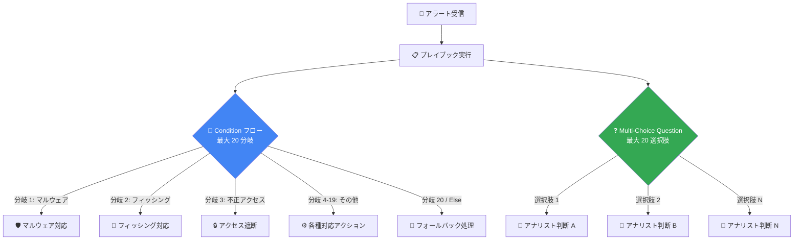

# Google SecOps: Playbook の Condition / Multi-Choice Question フローの分岐上限が 20 に拡大

**リリース日**: 2026-04-04

**サービス**: Google SecOps (SOAR)

**機能**: Playbook Condition and Multi-Choice Question Flows - 分岐数上限の拡大 / SOAR Release 6.3.81 全リージョン展開

**ステータス**: Feature / Announcement

📊 [このアップデートのインフォグラフィックを見る](https://takech9203.github.io/google-cloud-news-summary/20260404-google-secops-playbook-branching.html)

## 概要

Google SecOps SOAR のプレイブック機能において、Condition フローおよび Multiple Choice Question フローでサポートされる分岐数の上限が従来の 6 から 20 に大幅に拡大された。これにより、単一のステップ内でより複雑な分岐ロジックを構築できるようになり、セキュリティオペレーションの自動化における柔軟性が向上する。

また、SOAR Release 6.3.81 が全リージョンで利用可能になったことが発表された。本リリースは 2026 年 3 月 29 日に第一フェーズのリージョンへのロールアウトが開始されており、内部修正およびカスタマー向けバグ修正を含む。

本アップデートの主な対象ユーザーは、Google SecOps SOAR を利用してセキュリティインシデント対応を自動化している SOC (Security Operations Center) チーム、セキュリティエンジニア、およびセキュリティアナリストである。

**アップデート前の課題**

- Condition フローおよび Multi-Choice Question フローの分岐数が最大 6 に制限されており、複雑な判断ロジックを単一ステップで表現できなかった
- 6 分岐を超える条件分岐が必要な場合、複数のステップに分割して Condition を連鎖させる必要があり、プレイブックの設計が複雑化していた
- アラートの種類やエンティティの属性に基づく細かな振り分けが困難で、自動化の範囲が限定されていた

**アップデート後の改善**

- 単一ステップで最大 20 の分岐を作成できるようになり、複雑な条件分岐を簡潔に表現可能になった
- プレイブックの階層が浅くなり、設計・保守・デバッグが容易になった
- より多くのアラートカテゴリやインシデントタイプに対応した精緻な自動応答フローを構築できるようになった

## アーキテクチャ図

Condition フローでは自動的な条件評価に基づいて最大 20 の分岐先へルーティングされ、Multi-Choice Question フローではアナリストの手動選択に基づいて最大 20 の分岐先へルーティングされる。

## サービスアップデートの詳細

### 主要機能

1. **Condition フローの分岐数拡大 (6 → 20)**
   - プレイブック内の Condition フローで作成できる分岐数が最大 20 に増加
   - 各分岐には OR 条件が設定され、プレースホルダー、既存のケースデータ、前のアクションの結果に基づく条件を設定可能
   - フォールバックブランチ (前のアクションが失敗した場合の代替経路) も引き続きサポート
   - Else ブランチ (どの条件にも一致しない場合の経路) も引き続き利用可能

2. **Multi-Choice Question フローの選択肢数拡大 (6 → 20)**
   - アナリストが手動で回答する Multiple Choice Question の選択肢数が最大 20 に増加
   - インシデント対応時のより詳細な判断分岐が可能に
   - 各選択肢に対応する個別のアクションチェーンを設定可能

3. **SOAR Release 6.3.81 全リージョン展開**
   - 2026 年 3 月 29 日に第一フェーズのリージョンへロールアウト開始
   - 2026 年 4 月 4 日に全リージョンで利用可能に
   - 内部修正およびカスタマー向けバグ修正を含む

## 技術仕様

### Condition / Multi-Choice Question フローの比較

| 項目 | アップデート前 | アップデート後 |
|------|---------------|---------------|
| Condition フロー最大分岐数 | 6 | 20 |
| Multi-Choice Question 最大選択肢数 | 6 | 20 |
| フォールバックブランチ | サポート | サポート (変更なし) |
| Else ブランチ | サポート | サポート (変更なし) |
| 論理演算子 (AND/OR) | サポート | サポート (変更なし) |

### Condition フローで使用可能な演算子

| 演算子 | 説明 |
|--------|------|
| Equals to / Does not equal to | 完全一致 / 不一致 |
| Contains / Does not contain | 部分一致 / 部分不一致 |
| Starts with | 前方一致 |
| Greater than / Smaller than | 数値の大小比較 |

### SOAR Release 6.3.81 のロールアウトスケジュール

| フェーズ | 日付 | 対象リージョン |
|----------|------|---------------|
| 第一フェーズ | 2026-03-29 | 日本、インド、オーストラリア、カナダ、ドイツ、スイス |
| 全リージョン | 2026-04-04 | シンガポール、カタール、サウジアラビア、イスラエル、英国、イタリア、EU、US を含む全リージョン |

## 設定方法

### 前提条件

1. Google SecOps SOAR が有効化された Google Cloud プロジェクト
2. プレイブック編集権限を持つユーザーアカウント (SOAR の Permission Groups または Google Cloud IAM で設定)

### 手順

#### ステップ 1: Condition フローの追加

1. Response > Playbooks ページで対象のプレイブックを開く
2. Open Step Selection をクリック
3. Flow セクションから Condition をドラッグしてプレイブックに配置
4. Condition をダブルクリックして設定ダイアログを開く

#### ステップ 2: 分岐の設定 (最大 20)

1. 必要な分岐数を指定 (最大 20)
2. 各分岐にパラメータを設定:
   - 評価対象のプレースホルダーを選択
   - 演算子を選択 (Equals to, Contains, Starts with など)
   - 値を設定
3. 必要に応じてフォールバックブランチを定義
4. Save をクリック

#### ステップ 3: Multi-Choice Question フローの追加

1. Multi-Choice Questions をドラッグしてプレイブックに配置
2. ダブルクリックして設定ダイアログを開く
3. 質問テキストと選択肢 (最大 20) を入力
4. Save をクリック
5. 各分岐に対応するアクションを設定

## メリット

### ビジネス面

- **インシデント対応の精度向上**: より多くの条件分岐により、インシデントの種類に応じた的確な自動対応が可能になる
- **SOC の運用効率向上**: プレイブックの設計がシンプルになることで、作成・保守の工数が削減される
- **対応時間の短縮**: 複雑な判断を単一ステップで完結させることで、プレイブック全体の実行時間が改善される可能性がある

### 技術面

- **プレイブック設計の簡素化**: 複数ステップにまたがる条件分岐を単一ステップに集約できる
- **保守性の向上**: プレイブックの階層が浅くなり、可読性とデバッグ効率が向上する
- **拡張性の向上**: 新しいアラートカテゴリやインシデントタイプの追加に柔軟に対応可能

## デメリット・制約事項

### 制限事項

- 分岐数の上限は 20 であり、それ以上の分岐が必要な場合は引き続き複数ステップへの分割が必要
- Multi-Item フィールド (リスト) に対する Equals 演算子は常に False を返すため、リストデータの比較には Contains 演算子の使用が必要

### 考慮すべき点

- 分岐数が多いプレイブックは視覚的に複雑になるため、適切な命名と文書化が重要
- 多数の分岐を使用する場合、テストケースの数も増加するため、プレイブックシミュレーターでの十分な検証が推奨される
- フォールバックブランチの設定を適切に行い、前のアクションが失敗した場合のハンドリングを確保すること

## ユースケース

### ユースケース 1: アラートの自動トリアージと振り分け

**シナリオ**: 複数の検出ツールから多様なアラートが発生し、アラートの種類ごとに異なる対応フローが必要な SOC チーム。従来は 6 分岐の制限のため、アラートカテゴリを粗くグループ化する必要があった。

**効果**: 最大 20 の分岐を活用することで、マルウェア、フィッシング、不正アクセス、内部脅威、DDoS、ランサムウェアなど、アラートの詳細なカテゴリごとに個別の対応フローを単一ステップで実装可能。トリアージの精度が向上し、誤った対応フローへのルーティングが削減される。

### ユースケース 2: エスカレーション判断の自動化

**シナリオ**: インシデントの重大度、影響を受けるアセットの種類、発生時間帯、影響範囲などの複合条件に基づいて、適切なエスカレーション先を決定する必要がある場合。

**効果**: Multi-Choice Question フローで 20 の選択肢を提供し、アナリストが詳細なエスカレーション判断を行えるようになる。例えば、担当チーム (ネットワーク、エンドポイント、クラウド、ID管理など) と対応レベル (即時対応、24時間以内、次営業日など) の組み合わせをカバーできる。

## 料金

Google SecOps は Standard、Enterprise、Enterprise Plus の 3 つのパッケージで提供されている。料金はデータ取り込み量 (ingestion volume) に基づく。プレイブック機能は SOAR コンポーネントの一部として含まれており、Condition / Multi-Choice Question フローの分岐数拡大に伴う追加料金は発生しない。

- **Standard**: コアの SOAR 機能を含む (300 以上のプリビルトインテグレーション、最大 1,000 の単一イベント検出ルール)
- **Enterprise**: Standard に加え、Gemini によるプレイブック作成支援、UEBA などを含む
- **Enterprise Plus**: Enterprise に加え、Mandiant / VirusTotal 脅威インテリジェンス、高度なデータパイプラインを含む

詳細な料金については営業担当または Google Cloud パートナーに問い合わせが必要。

## 関連サービス・機能

- **Google SecOps SIEM**: アラートの検出・取り込みを担い、SOAR プレイブックのトリガーとなるアラートを生成する
- **Gemini in Security Operations**: Enterprise パッケージ以上で利用可能。自然言語によるプレイブック作成支援機能を提供する
- **Google Cloud IAM**: SOAR の Permission Groups からの移行が GA となっており、きめ細かなアクセス制御が可能
- **Chronicle Marketplace**: 300 以上のプリビルトインテグレーションを提供し、プレイブックのアクションとして利用可能

## 参考リンク

- 📊 [インフォグラフィック](https://takech9203.github.io/google-cloud-news-summary/20260404-google-secops-playbook-branching.html)
- [公式リリースノート](https://cloud.google.com/release-notes#April_04_2026)
- [Use flows in playbooks - 公式ドキュメント](https://docs.cloud.google.com/chronicle/docs/soar/respond/working-with-playbooks/using-flows-in-playbooks)
- [Google SecOps SOAR リリースノート](https://docs.cloud.google.com/chronicle/docs/soar/release-notes)
- [Google SecOps パッケージと料金](https://docs.cloud.google.com/chronicle/docs/secops/secops-packages)
- [Google SecOps SOAR ドキュメント](https://docs.cloud.google.com/chronicle/docs/soar)

## まとめ

Google SecOps SOAR のプレイブック Condition / Multi-Choice Question フローの分岐上限が 6 から 20 に拡大されたことで、セキュリティインシデント対応の自動化における設計の自由度が大幅に向上した。SOC チームは、より精緻な条件分岐ロジックを単一ステップ内で構築できるようになり、プレイブックの保守性と対応精度の両方が改善される。既存のプレイブックで分岐数の制限により複数ステップに分割していた箇所がある場合は、単一の Condition フローへの統合を検討することを推奨する。

---

**タグ**: #GoogleSecOps #SOAR #Playbook #セキュリティ自動化 #インシデント対応 #ConditionFlow #BranchingLogic
