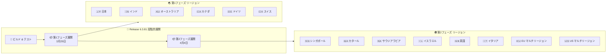

# Google SecOps SOAR: Release 6.3.81 全リージョン展開完了

**リリース日**: 2026-04-04

**サービス**: Google SecOps SOAR

**機能**: Release 6.3.81

**ステータス**: General Availability (全リージョン展開完了)

📊 [このアップデートのインフォグラフィックを見る](https://takech9203.github.io/google-cloud-news-summary/20260404-secops-soar-release-6-3-81.html)

## 概要

Google SecOps SOAR (Security Orchestration, Automation, and Response) の Release 6.3.81 が全リージョンで利用可能になった。本リリースは 2026 年 3 月 29 日に第 1 フェーズのリージョンへの展開が開始され、4 月 4 日に全リージョンへの展開が完了した。

本リリースには内部バグ修正および顧客報告のバグ修正が含まれている。Google SecOps SOAR は、セキュリティオーケストレーション、自動化、レスポンスを統合したプラットフォームであり、脅威の検出、調査、対応のワークフローを効率化するために設計されている。定期的なリリースにより、プラットフォームの安定性と信頼性が継続的に向上している。

## アーキテクチャ図

Google SecOps SOAR の段階的リリースプロセスを示す。リリースは通常日曜日に行われ、第 1 フェーズのリージョンへの展開後、約 1 週間後に第 2 フェーズのリージョンへ展開される。

## サービスアップデートの詳細

### 主要機能

1. **内部バグ修正**
   - Google 内部で検出されたバグの修正が含まれる
   - プラットフォームの安定性と信頼性の向上に寄与

2. **顧客報告のバグ修正**
   - 顧客から報告された不具合の修正が含まれる
   - プラットフォームの運用品質の改善

## 技術仕様

### リリース展開スケジュール

| フェーズ | 展開日 | 対象リージョン |
|---------|--------|---------------|
| 第 1 フェーズ | 2026-03-29 | 日本、インド、オーストラリア、カナダ、ドイツ、スイス |
| 第 2 フェーズ (全リージョン) | 2026-04-04 | シンガポール、カタール、サウジアラビア、イスラエル、英国 (ロンドン)、イタリア、EU マルチリージョン、US マルチリージョン |

### 最近のリリース履歴

| バージョン | 第 1 フェーズ展開日 | 全リージョン展開日 | 主な内容 |
|-----------|-------------------|------------------|---------|
| 6.3.81 | 2026-03-29 | 2026-04-04 | 内部・顧客バグ修正 |
| 6.3.80 | 2026-03-15 | 2026-03-28 | 内部・顧客バグ修正 |
| 6.3.79 | 2026-03-08 | 2026-03-14 | 内部・顧客バグ修正 |
| 6.3.78 | 2026-03-01 | 2026-03-07 | 内部・顧客バグ修正 |

## 利用可能リージョン

Release 6.3.81 は以下の全リージョンで利用可能。

**第 1 フェーズ リージョン (先行展開)**
- 日本
- インド
- オーストラリア
- カナダ
- ドイツ
- スイス

**第 2 フェーズ リージョン**
- シンガポール
- カタール
- サウジアラビア
- イスラエル
- 英国 (ロンドン)
- イタリア
- EU (マルチリージョン)
- US (マルチリージョン)

自分のアカウントが割り当てられているリージョンが不明な場合は、Google SecOps の担当者に確認することが推奨される。

## 関連サービス・機能

- **Google SecOps SIEM**: SOAR と統合されたセキュリティ情報・イベント管理プラットフォーム。アラートの取り込みとケース管理が連携する
- **Google Cloud IAM**: SOAR のパーミッショングループが Google Cloud IAM へ移行中 (GA)。きめ細かなアクセス制御が可能
- **Google Cloud Logging**: SOAR の運用ログを Logs Explorer で一元的に監視・分析可能
- **Gemini**: プレイブックの自動生成機能で連携 (GA)

## 参考リンク

- 📊 [インフォグラフィック](https://takech9203.github.io/google-cloud-news-summary/20260404-secops-soar-release-6-3-81.html)
- [公式リリースノート](https://cloud.google.com/chronicle/docs/soar/release-notes#March_29_2026)
- [SOAR 段階的リリース計画](https://cloud.google.com/chronicle/docs/soar/overview-and-introduction/soar-gradual-release)
- [Google SecOps SOAR 概要](https://cloud.google.com/chronicle/docs/soar/overview-and-introduction/soar-overview)
- [ドキュメント](https://cloud.google.com/chronicle/docs/secops/google-secops-soar-toc)

## まとめ

Google SecOps SOAR Release 6.3.81 は内部および顧客報告のバグ修正を含む定期メンテナンスリリースであり、全リージョンへの展開が完了した。SOAR プラットフォームを利用中の組織は、自動的にアップデートが適用されるため特別な対応は不要だが、最近 GA となった Google Cloud IAM へのパーミッション移行 (2026 年 3 月 17 日発表) や、Stage 2 のクラウド移行期限延長 (2026 年 9 月 30 日まで) など、関連する重要なアナウンスも併せて確認することを推奨する。

---

**タグ**: #GoogleSecOps #SOAR #SecurityOperations #ReleaseNotes #BugFix #Chronicle
