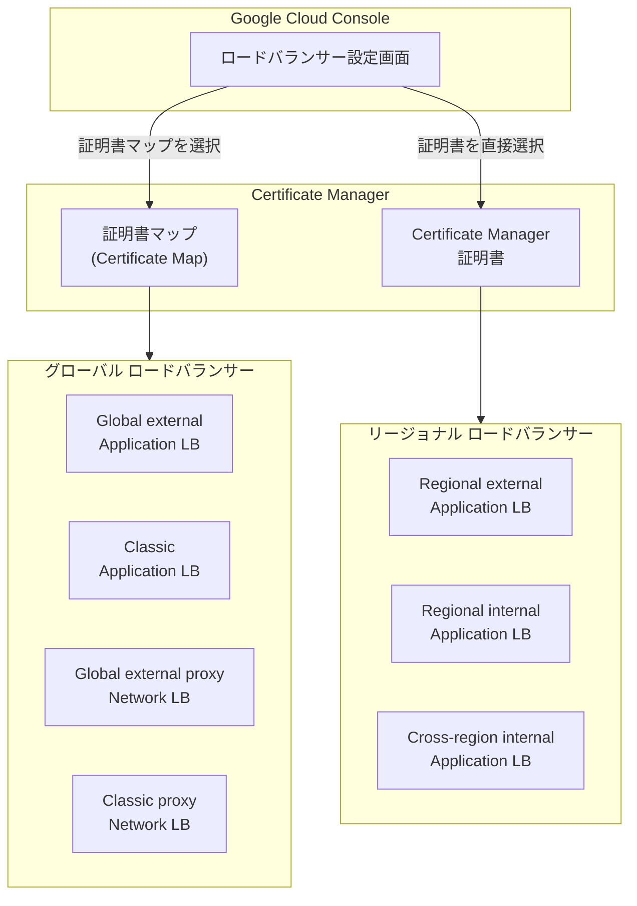

# Cloud Load Balancing: Certificate Manager 証明書が Google Cloud コンソールで利用可能に (GA)

**リリース日**: 2026-04-05

**サービス**: Cloud Load Balancing

**機能**: Certificate Manager certificates available in Google Cloud console

**ステータス**: GA (General Availability)

[このアップデートのインフォグラフィックを見る](https://takech9203.github.io/google-cloud-news-summary/20260405-cloud-load-balancing-certificate-manager-console.html)

## 概要

Google Cloud は、ロードバランサーのプロビジョニング時に Certificate Manager の証明書を Google Cloud コンソールから直接選択・設定できる機能を一般提供 (GA) として公開しました。これにより、TLS 証明書の管理とロードバランサーへの展開が、コンソール上のワークフローで一元的に行えるようになります。

これまで Certificate Manager の証明書をロードバランサーに関連付けるには、gcloud CLI や API を使用する必要がある場面がありましたが、今回のアップデートにより、コンソール上でロードバランサーを作成・編集する際に、証明書マップ (Certificate Map) や Certificate Manager 証明書を直接選択できるようになりました。対象はグローバルおよびリージョナルの主要なロードバランサータイプです。

**アップデート前の課題**

- ロードバランサーのプロビジョニング時に Certificate Manager の証明書マップや証明書をコンソールから直接選択できず、gcloud CLI や API での操作が必要だった
- コンソールとCLI を行き来する運用が必要で、設定ミスのリスクや作業効率の低下につながっていた
- 証明書管理とロードバランサー設定が別々のワークフローとなっており、統合的な管理が困難だった

**アップデート後の改善**

- ロードバランサーのプロビジョニング画面から直接 Certificate Manager の証明書マップや証明書を選択可能になった
- コンソール上で証明書の選択からロードバランサーの構成まで一貫したワークフローで操作できるようになった
- CLI に不慣れなユーザーでも Certificate Manager の高度な証明書管理機能を活用できるようになった

## アーキテクチャ図



グローバルロードバランサーには証明書マップ経由で、リージョナルロードバランサーには Certificate Manager 証明書を直接アタッチする形で、コンソールから設定を行います。

## サービスアップデートの詳細

### 主要機能

1. **証明書マップの選択 (グローバルロードバランサー向け)**
   - ロードバランサーのプロビジョニング画面で証明書マップを直接選択可能
   - 対象: Global external Application Load Balancer、Classic Application Load Balancer、Global external proxy Network Load Balancer、Classic proxy Network Load Balancer
   - 証明書マップは数千の証明書マップエントリをサポートし、ホスト名ベースの細かな証明書選択が可能

2. **Certificate Manager 証明書の直接選択 (リージョナルロードバランサー向け)**
   - ロードバランサーのターゲットプロキシに Certificate Manager 証明書を直接アタッチ
   - 対象: Regional external Application Load Balancer、Regional internal Application Load Balancer、Cross-region internal Application Load Balancer
   - ターゲットプロキシあたり最大 100 の Certificate Manager 証明書を参照可能

3. **統合されたコンソールワークフロー**
   - 証明書の作成・選択からロードバランサーの構成まで、コンソール上で一貫した操作が可能
   - Google マネージド証明書とセルフマネージド証明書の両方に対応

## 技術仕様

### 対応ロードバランサーと証明書設定方式

| ロードバランサータイプ | 証明書設定方式 | スコープ |
|------|------|------|
| Global external Application Load Balancer | 証明書マップ | グローバル |
| Classic Application Load Balancer | 証明書マップ | グローバル |
| Global external proxy Network Load Balancer | 証明書マップ | グローバル |
| Classic proxy Network Load Balancer | 証明書マップ | グローバル |
| Regional external Application Load Balancer | 証明書の直接アタッチ | リージョナル |
| Regional internal Application Load Balancer | 証明書の直接アタッチ | リージョナル |
| Cross-region internal Application Load Balancer | 証明書の直接アタッチ | クロスリージョン |

### 必要な IAM ロール

| ロール | 説明 |
|------|------|
| `roles/certificatemanager.editor` | Certificate Manager Editor - 証明書の作成・編集が可能 |
| `roles/certificatemanager.owner` | Certificate Manager Owner - 証明書の完全な管理が可能 |
| `roles/certificatemanager.viewer` | Certificate Manager Viewer - 証明書の参照のみ |

## 設定方法

### 前提条件

1. Google Cloud プロジェクトで Certificate Manager API が有効であること
2. 適切な IAM ロール (`roles/certificatemanager.editor` 以上) が付与されていること
3. Certificate Manager で証明書が作成済みであること

### 手順

#### ステップ 1: Certificate Manager で証明書を作成

```bash
# Google マネージド証明書を DNS 認証で作成する例
gcloud certificate-manager certificates create my-certificate \
    --domains="example.com,www.example.com" \
    --dns-authorizations=my-dns-auth
```

コンソールからは [Certificate Manager ページ](https://console.cloud.google.com/security/ccm/list) で「Add Certificate」をクリックして作成できます。

#### ステップ 2: 証明書マップを作成 (グローバルロードバランサーの場合)

```bash
# 証明書マップを作成
gcloud certificate-manager maps create my-cert-map

# 証明書マップエントリを作成
gcloud certificate-manager maps entries create my-cert-map-entry \
    --map="my-cert-map" \
    --certificates="my-certificate" \
    --hostname="example.com"
```

#### ステップ 3: ロードバランサーのプロビジョニング時に証明書を選択

コンソールでロードバランサーを作成する際、フロントエンド設定で以下を選択します:

- **グローバルロードバランサー**: 証明書マップを選択
- **リージョナルロードバランサー**: Certificate Manager 証明書を直接選択

## メリット

### ビジネス面

- **運用効率の向上**: コンソール上で証明書管理とロードバランサー設定を一元的に行えるため、設定にかかる時間を短縮できる
- **ヒューマンエラーの削減**: GUI ベースの操作により、CLI でのコマンド入力ミスを防止できる
- **チーム間の連携強化**: CLI に不慣れなインフラ管理者やセキュリティ担当者も証明書設定に参加しやすくなる

### 技術面

- **統合ワークフロー**: 証明書の選択とロードバランサーの構成が単一のコンソール画面で完結する
- **大規模証明書管理**: 証明書マップにより数千の証明書を管理でき、Compute Engine SSL 証明書の 15 件制限を超える運用が可能
- **柔軟な認証方式**: DNS 認証、ロードバランサー認証、CA Service 連携など、多様な認証方式をコンソールから選択可能

## デメリット・制約事項

### 制限事項

- ロードバランサー認証を使用する場合、Google マネージド証明書の SAN フィールドに設定できるドメイン数は最大 5 つ (DNS 認証の場合は最大 100)
- `ALL_REGIONS` スコープの証明書はロードバランサー認証をサポートしない
- Global external Application Load Balancer または SSL ベースの Global external proxy Network Load Balancer では、Compute Engine SSL 証明書と比較して一部のロケーションで TLS ハンドシェイクレイテンシが高くなる可能性がある
- リージョナル Google マネージド証明書は DNS ベースの認証のみをサポートし、Public CA から取得される

### 考慮すべき点

- 既に gcloud CLI や Terraform で証明書管理を自動化している場合、コンソールでの操作は補助的な位置付けとなる
- 大規模な本番環境では Infrastructure as Code (Terraform 等) による管理が引き続き推奨される

## ユースケース

### ユースケース 1: 新規 Web アプリケーションの HTTPS 設定

**シナリオ**: 新規に Web アプリケーションをデプロイする際、Global external Application Load Balancer を作成し、HTTPS 通信を有効化する必要がある。

**効果**: コンソール上でロードバランサーのプロビジョニングと同時に Certificate Manager の証明書マップを選択でき、迅速に HTTPS 対応の環境を構築できる。

### ユースケース 2: マルチリージョンの内部アプリケーション

**シナリオ**: 社内向けアプリケーションを複数リージョンで展開しており、Cross-region internal Application Load Balancer を使用している。各リージョンに対応する TLS 証明書を管理する必要がある。

**効果**: コンソールからリージョンごとの Certificate Manager 証明書を直接選択してアタッチでき、複雑なマルチリージョン構成の証明書管理が簡素化される。

## 料金

Certificate Manager 自体の使用料金は、証明書の数やタイプに基づきます。今回のコンソール統合機能の利用に追加料金はかかりません。Cloud Load Balancing の料金は別途発生します。最新の料金情報は公式の料金ページをご確認ください。

## 関連サービス・機能

- **Certificate Manager**: TLS 証明書のライフサイクル管理を提供するサービス。Google マネージド証明書の自動発行・更新に対応
- **Cloud Load Balancing**: グローバルおよびリージョナルの負荷分散サービス。今回のアップデートで Certificate Manager とのコンソール統合が強化された
- **Certificate Authority Service (CA Service)**: プライベート CA の管理サービス。Certificate Manager と連携してプライベート証明書の発行が可能
- **Compute Engine SSL 証明書**: 従来の SSL 証明書管理方式。Certificate Manager は、より柔軟で大規模な証明書管理が可能な後継サービス

## 参考リンク

- [インフォグラフィック](https://takech9203.github.io/google-cloud-news-summary/20260405-cloud-load-balancing-certificate-manager-console.html)
- [公式リリースノート](https://docs.cloud.google.com/release-notes#April_05_2026)
- [Certificate Manager 概要](https://cloud.google.com/certificate-manager/docs/overview)
- [Certificate Manager 証明書の管理](https://cloud.google.com/certificate-manager/docs/certificates)
- [Certificate Manager のコアコンポーネント](https://cloud.google.com/certificate-manager/docs/core-components)
- [Cloud Load Balancing SSL 証明書の概要](https://cloud.google.com/load-balancing/docs/ssl-certificates)
- [Certificate Manager 料金ページ](https://cloud.google.com/certificate-manager/pricing)

## まとめ

今回のアップデートにより、Certificate Manager の証明書を Google Cloud コンソール上でロードバランサーのプロビジョニング時に直接選択・設定できるようになりました。これは GA としてリリースされており、本番環境での利用が可能です。CLI を使わずにコンソール上で証明書管理とロードバランサー構成を一貫して行えるため、運用効率の向上とヒューマンエラーの削減が期待できます。既存の環境でも、コンソールからの証明書設定を試すことを推奨します。

---

**タグ**: Cloud Load Balancing, Certificate Manager, TLS, SSL, Google Cloud Console, GA, セキュリティ, 証明書管理
