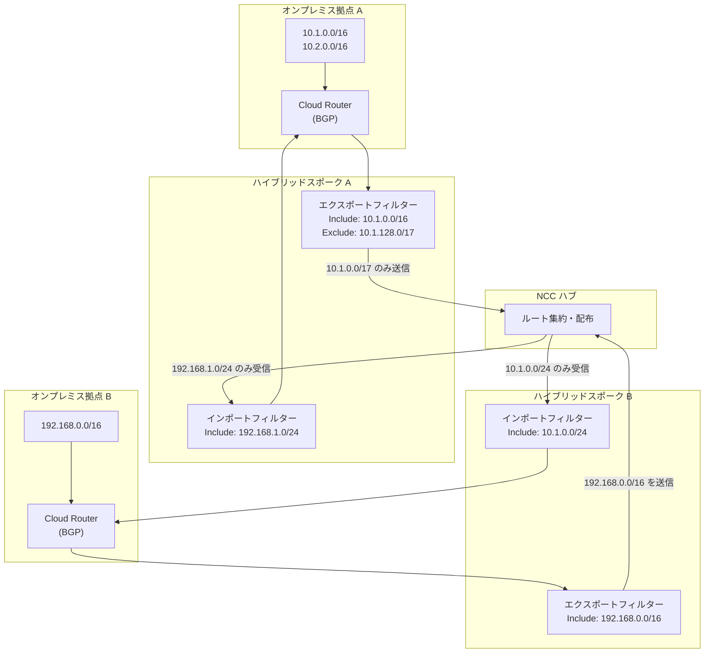

# Network Connectivity Center: ハイブリッドスポーク向け Include/Exclude スポークフィルターが公開プレビュー

**リリース日**: 2026-04-05

**サービス**: Network Connectivity Center

**機能**: Include and exclude spoke filters for hybrid spokes

**ステータス**: Preview (公開プレビュー)

[このアップデートのインフォグラフィックを見る](https://takech9203.github.io/google-cloud-news-summary/20260405-network-connectivity-center-spoke-filters.html)

## 概要

Google Cloud は、Network Connectivity Center (NCC) のハイブリッドスポークに対する Include/Exclude スポークフィルター機能を公開プレビューとして提供開始しました。この機能により、ハイブリッドスポーク (VLAN アタッチメント、VPN トンネル、Router Appliance) がハブとの間でやり取りするルートやサブネットを、きめ細かく制御できるようになります。

スポークフィルターにはエクスポートフィルターとインポートフィルターの 2 種類があります。エクスポートフィルターはスポークからハブに送信するサブネットやルートを制御し、インポートフィルターはハブからスポークが受け入れるサブネットやルートを制御します。これまで VPC スポークではエクスポートフィルターのみがサポートされていましたが、今回のアップデートにより、ハイブリッドスポークでエクスポートとインポートの両方のフィルターが利用可能になりました。

この機能は、マルチサイト接続やハイブリッドクラウド環境において、ネットワークのセグメンテーションやルート制御を強化したい企業ネットワーク管理者やクラウドアーキテクトを対象としています。

**アップデート前の課題**

- ハイブリッドスポーク間のルート交換をきめ細かく制御する手段が限られており、すべてのルートがハブを通じて伝播されてしまっていた
- オンプレミス拠点間で不要なルートが広告されることで、ルーティングテーブルの肥大化やセキュリティ上のリスクが生じていた
- 特定のサブネット範囲のみを選択的にハブに送信したり、ハブから受信したりする制御が VPC スポークのエクスポートフィルターに限定されていた

**アップデート後の改善**

- ハイブリッドスポークで Include/Exclude のエクスポートフィルターを使用し、ハブに送信するルートを任意の IPv4 アドレス範囲で制御可能になった
- ハイブリッドスポークで Include/Exclude のインポートフィルターを使用し、ハブから受け入れるルートを任意の IPv4 アドレス範囲で制御可能になった
- Exclude フィルターが Include フィルターより優先されるため、広い範囲を許可した上で特定の範囲だけを除外するという柔軟な設定が可能になった

## アーキテクチャ図



ハイブリッドスポーク A と B がそれぞれエクスポートフィルターとインポートフィルターを持ち、NCC ハブを介したルート交換を制御する構成を示しています。Exclude フィルターにより、Include で許可した範囲の中から特定のサブネットを除外できます。

## サービスアップデートの詳細

### 主要機能

1. **エクスポートフィルター (Export Filters)**
   - スポークからハブに送信するダイナミックルートを IPv4 アドレス範囲で制御
   - Include Export Ranges で許可する範囲を指定し、Exclude Export Ranges で除外する範囲を指定
   - Exclude が Include より優先され、Exclude 範囲は Include 範囲に完全に含まれている必要がある
   - ダイナミックルートが Include 範囲に完全に含まれ、かつ Exclude 範囲と交差しない場合のみハブに送信される

2. **インポートフィルター (Import Filters)**
   - ハブからスポークが受け入れるサブネットルートやトランジットダイナミックルートを IPv4 アドレス範囲で制御
   - Include Import Ranges で受け入れる範囲を指定し、Exclude Import Ranges で除外する範囲を指定
   - `ALL_IPV4_RANGES` キーワードにより全 IPv4 アドレス (0.0.0.0/0 相当) を一括指定可能
   - サイト間データ転送が有効な場合、デフォルトでは他のハイブリッドスポークからのトランジットダイナミックルートのみがインポート対象

3. **サポート対象のスポークタイプ**
   - VLAN アタッチメントスポーク (Cloud Interconnect 経由): エクスポートフィルターとインポートフィルターの両方をサポート
   - VPN トンネルスポーク: エクスポートフィルターとインポートフィルターの両方をサポート
   - Router Appliance スポーク: エクスポートフィルターとインポートフィルターの両方をサポート

## 技術仕様

### フィルタールールの評価ロジック

| シナリオ | 結果 |
|------|------|
| ダイナミックルートが Include Export 範囲に完全に含まれ、Exclude Export 範囲と交差しない | ハブに送信される |
| ダイナミックルートが Include Export 範囲に完全に含まれるが、Exclude Export 範囲と交差する | ハブに送信されない |
| ダイナミックルートが Include Export 範囲に完全に含まれない (部分的な交差を含む) | ハブに送信されない |
| ダイナミックルートが Exclude Export 範囲に完全に含まれる | ハブに送信されない |

### フィルター設定の制約

| 項目 | 詳細 |
|------|------|
| Include/Exclude 範囲の最大数 | 各フィルターにつき最大 16 個の重複しない CIDR |
| CIDR の重複 | Include/Exclude 内の CIDR 同士は重複・包含不可 |
| Exclude と Include の関係 | Exclude 範囲の IP は Include 範囲に完全に含まれる必要あり |
| キーワードサポート | Include Import Ranges で `ALL_IPV4_RANGES` が使用可能、Exclude ではキーワード不可 |
| 対応アドレスファミリー | IPv4 のみ (プレビュー段階) |

## 設定方法

### 前提条件

1. NCC ハブが作成済みであること
2. ハイブリッドスポーク (VLAN アタッチメント、VPN トンネル、または Router Appliance) が存在すること
3. `networkconnectivity.spokes.update` 権限、または `roles/networkconnectivity.spokeAdmin` もしくは `roles/networkconnectivity.hubAdmin` ロールが付与されていること

### 手順

#### ステップ 1: 既存のハイブリッドスポークにフィルターを追加する

VLAN アタッチメントスポークの場合:

```bash
gcloud network-connectivity spokes linked-interconnect-attachments update SPOKE_NAME \
  --region=REGION \
  --include-export-ranges=10.0.0.0/8,172.16.0.0/12 \
  --exclude-export-ranges=10.128.0.0/16 \
  --include-import-ranges=192.168.0.0/16 \
  --exclude-import-ranges=192.168.255.0/24
```

VPN トンネルスポークの場合:

```bash
gcloud network-connectivity spokes linked-vpn-tunnels update SPOKE_NAME \
  --region=REGION \
  --include-export-ranges=10.0.0.0/8 \
  --exclude-export-ranges=10.255.0.0/16 \
  --include-import-ranges=ALL_IPV4_RANGES \
  --exclude-import-ranges=172.16.0.0/12
```

Router Appliance スポークの場合:

```bash
gcloud network-connectivity spokes linked-router-appliances update SPOKE_NAME \
  --region=REGION \
  --include-export-ranges=192.168.0.0/16 \
  --include-import-ranges=10.0.0.0/8 \
  --exclude-import-ranges=10.200.0.0/16
```

各パラメータにカンマ区切りで複数の CIDR を指定できます (最大 16 個)。

#### ステップ 2: フィルター設定を確認する

```bash
gcloud network-connectivity spokes describe SPOKE_NAME \
  --region=REGION
```

出力に `includeExportRanges`、`excludeExportRanges`、`includeImportRanges`、`excludeImportRanges` が表示され、設定が反映されていることを確認します。

## メリット

### ビジネス面

- **ネットワークセキュリティの強化**: 特定のサブネットのみを選択的に広告することで、不要なルート伝播を防止し、ネットワーク分離を実現
- **コンプライアンス対応**: 拠点間で共有すべきネットワーク範囲を明示的に制御でき、データ主権やネットワーク分離の要件に対応

### 技術面

- **ルーティングテーブルの最適化**: 必要なルートのみをハブ経由で交換することで、ルーティングテーブルの肥大化を防止
- **柔軟なポリシー設定**: Include で広い範囲を許可し、Exclude で特定範囲を除外する階層的なフィルタリングにより、複雑なネットワークポリシーを実現
- **トランジットルート制御**: サイト間データ転送におけるトランジットダイナミックルートの再広告を精密に制御可能

## デメリット・制約事項

### 制限事項

- 現時点では IPv4 アドレス範囲のみがサポートされており、IPv6 には対応していない
- 各フィルターにつき最大 16 個の CIDR に制限されている
- 公開プレビュー段階のため、SLA の対象外であり、本番環境での利用には注意が必要
- NCC Gateway スポークではスポークフィルターはサポートされていない

### 考慮すべき点

- Exclude 範囲は Include 範囲に完全に含まれる必要があるため、フィルター設計時に CIDR の包含関係を正確に把握する必要がある
- ダイナミックルートが Include 範囲に「完全に」含まれる必要があるため、部分的に交差するルートは送信されない点に注意
- サイト間データ転送が無効な場合、インポートフィルターのデフォルト Include 範囲は空になるため、明示的な設定が推奨される

## ユースケース

### ユースケース 1: マルチサイト環境でのネットワークセグメンテーション

**シナリオ**: 東京と大阪のオンプレミス拠点が NCC ハブを介して接続されているが、東京拠点の開発環境ネットワーク (10.100.0.0/16) は大阪拠点に広告したくない。

**実装例**:
```bash
# 東京拠点のハイブリッドスポーク設定
gcloud network-connectivity spokes linked-interconnect-attachments update tokyo-spoke \
  --region=asia-northeast1 \
  --include-export-ranges=10.0.0.0/8 \
  --exclude-export-ranges=10.100.0.0/16
```

**効果**: 東京拠点の本番環境ネットワークのみが大阪拠点に広告され、開発環境はネットワーク的に分離される。

### ユースケース 2: ハブからの選択的ルートインポート

**シナリオ**: 複数の拠点が NCC ハブに接続されているが、特定の拠点では管理系ネットワーク (172.16.0.0/24) のルートのみをハブから受信したい。

**実装例**:
```bash
# 管理専用拠点のハイブリッドスポーク設定
gcloud network-connectivity spokes linked-vpn-tunnels update mgmt-spoke \
  --region=us-central1 \
  --include-import-ranges=172.16.0.0/24 \
  --include-export-ranges=172.16.1.0/24
```

**効果**: 管理専用拠点はハブから管理系ネットワークのルートのみを受信し、他の業務系ネットワークのルートは受信しない。ルーティングテーブルがシンプルに保たれ、意図しない通信経路が生じない。

## 関連サービス・機能

- **Cloud Interconnect**: VLAN アタッチメントスポークの基盤となるサービスで、オンプレミスと Google Cloud を専用線で接続
- **Cloud VPN**: VPN トンネルスポークの基盤となるサービスで、IPsec VPN によるハイブリッド接続を提供
- **Cloud Router**: ハイブリッドスポーク内で BGP セッションを管理し、ダイナミックルートの送受信を担当
- **VPC スポークのエクスポートフィルター**: 今回のハイブリッドスポーク向けフィルターと同様の概念で、VPC スポークでは IPv4/IPv6 のエクスポートフィルターが GA で利用可能

## 参考リンク

- [インフォグラフィック](https://takech9203.github.io/google-cloud-news-summary/20260405-network-connectivity-center-spoke-filters.html)
- [公式リリースノート](https://docs.cloud.google.com/release-notes#April_05_2026)
- [スポークフィルターの概要ドキュメント](https://cloud.google.com/network-connectivity/docs/network-connectivity-center/concepts/spoke-filters-overview)
- [ハブとスポークの操作ガイド](https://cloud.google.com/network-connectivity/docs/network-connectivity-center/how-to/working-with-hubs-spokes)
- [Network Connectivity Center の概要](https://cloud.google.com/network-connectivity/docs/network-connectivity-center/concepts/overview)

## まとめ

Network Connectivity Center のハイブリッドスポーク向け Include/Exclude スポークフィルターにより、オンプレミス拠点間やハイブリッドクラウド環境でのルート交換をきめ細かく制御できるようになりました。現時点では公開プレビューかつ IPv4 のみの対応ですが、マルチサイト環境でのネットワークセグメンテーションやルーティングテーブルの最適化に大きく貢献する機能です。ハイブリッド接続を利用している組織は、テスト環境でフィルター設計を検証し、GA 移行に備えることを推奨します。

---

**タグ**: #NetworkConnectivityCenter #NCC #SpokeFilters #HybridSpoke #ルートフィルタリング #ネットワークセキュリティ #Preview #Networking
