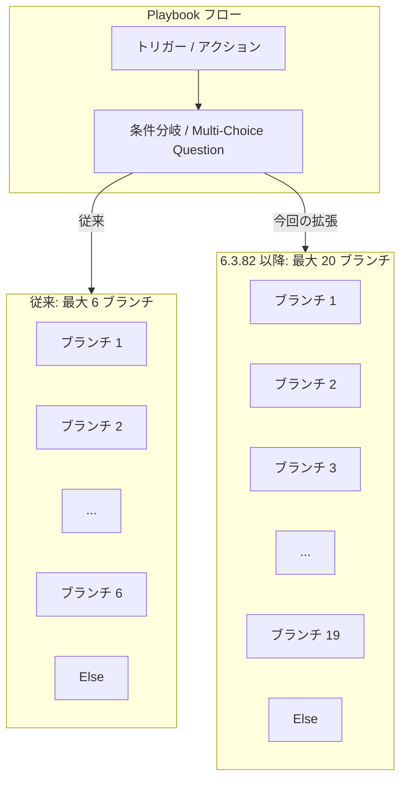

# Google SecOps SOAR: Release 6.3.82 第 1 フェーズ展開開始

**リリース日**: 2026-04-05

**サービス**: Google SecOps SOAR

**機能**: Release 6.3.82

**ステータス**: GA (第 1 フェーズ リージョンへの展開中)

📊 [このアップデートのインフォグラフィックを見る](https://takech9203.github.io/google-cloud-news-summary/20260405-secops-soar-release-6-3-82.html)

## 概要

Google SecOps SOAR (Security Orchestration, Automation, and Response) の Release 6.3.82 が第 1 フェーズのリージョンへの展開を開始した。本リリースには内部バグ修正および顧客報告のバグ修正に加え、プレイブックのフロー機能における重要な機能強化が含まれている。

具体的には、Playbook Condition (条件分岐) および Multi-Choice Question (多選択質問) フローでサポートされるブランチの最大数が 6 から 20 に大幅に拡張された。これにより、単一のステップ内でより複雑な分岐ロジックを構築することが可能になり、セキュリティオペレーションの自動化ワークフローの柔軟性が大きく向上する。

Google SecOps SOAR は、セキュリティオーケストレーション、自動化、レスポンスを統合したプラットフォームであり、脅威の検出、調査、対応のワークフローを効率化するために設計されている。

## アーキテクチャ図

プレイブック内の条件分岐および多選択質問フローにおけるブランチ数の拡張を示す。従来の最大 6 ブランチから、最大 20 ブランチへと大幅に拡張された。

## サービスアップデートの詳細

### 主要機能

1. **Playbook Condition および Multi-Choice Question フローの拡張**
   - Playbook Condition (条件分岐) でサポートされるブランチの最大数が 6 から 20 に増加 (条件ブランチ最大 19 + Else ブランチ)
   - Multi-Choice Question (多選択質問) でサポートされる選択肢の最大数も 6 から 20 に増加
   - 単一のステップ内でより複雑な分岐ロジックの構築が可能に
   - プレースホルダー、既存のケースデータ、Previous Actions フローに基づいた条件設定が可能

2. **内部バグ修正**
   - Google 内部で検出されたバグの修正が含まれる
   - プラットフォームの安定性と信頼性の向上に寄与

3. **顧客報告のバグ修正**
   - 顧客から報告された不具合の修正が含まれる
   - プラットフォームの運用品質の改善

## 技術仕様

### ブランチ数の変更

| 項目 | 変更前 | 変更後 |
|------|--------|--------|
| Condition フローの最大ブランチ数 | 6 (5 条件 + Else) | 20 (19 条件 + Else) |
| Multi-Choice Question の最大選択肢数 | 6 | 20 |

### リリース展開スケジュール

| フェーズ | 展開日 | 対象リージョン |
|---------|--------|---------------|
| 第 1 フェーズ | 2026-04-05 | 日本、インド、オーストラリア、カナダ、ドイツ、スイス |
| 第 2 フェーズ (全リージョン) | 2026-04-12 (予定) | シンガポール、カタール、サウジアラビア、イスラエル、英国 (ロンドン)、イタリア、EU マルチリージョン、US マルチリージョン |

### 最近のリリース履歴

| バージョン | 第 1 フェーズ展開日 | 全リージョン展開日 | 主な内容 |
|-----------|-------------------|------------------|---------|
| 6.3.82 | 2026-04-05 | (展開中) | ブランチ数拡張、内部・顧客バグ修正 |
| 6.3.81 | 2026-03-29 | 2026-04-04 | 内部・顧客バグ修正 |
| 6.3.80 | 2026-03-15 | 2026-03-28 | 内部・顧客バグ修正 |
| 6.3.79 | 2026-03-08 | 2026-03-14 | 内部・顧客バグ修正 |

## メリット

### ビジネス面

- **より高度なセキュリティ自動化**: ブランチ数の拡張により、複雑なセキュリティインシデント対応シナリオを単一のプレイブックステップ内で表現できるようになり、対応の迅速化と正確性向上が期待できる
- **運用効率の向上**: 従来は複数のステップに分割する必要があった複雑な分岐ロジックを 1 つのステップに集約できるため、プレイブックの設計・管理が容易になる

### 技術面

- **プレイブック設計の柔軟性向上**: 最大 20 の分岐を持つ条件フローにより、アラートの種類、重要度、発生元など多様な条件に基づいた詳細なルーティングが可能
- **Multi-Choice Question の実用性向上**: アナリストに提示する選択肢を最大 20 まで設定可能になり、より精緻なケース分類や対応判断が実現

## 利用可能リージョン

Release 6.3.82 は現在、第 1 フェーズのリージョンに展開中。

**第 1 フェーズ リージョン (展開中)**
- 日本
- インド
- オーストラリア
- カナダ
- ドイツ
- スイス

**第 2 フェーズ リージョン (展開予定)**
- シンガポール
- カタール
- サウジアラビア
- イスラエル
- 英国 (ロンドン)
- イタリア
- EU (マルチリージョン)
- US (マルチリージョン)

自分のアカウントが割り当てられているリージョンが不明な場合は、Google SecOps の担当者に確認することが推奨される。

## 関連サービス・機能

- **Google SecOps SIEM**: SOAR と統合されたセキュリティ情報・イベント管理プラットフォーム。アラートの取り込みとケース管理が連携する
- **Google Cloud IAM**: SOAR のパーミッショングループが Google Cloud IAM へ移行中 (GA)。きめ細かなアクセス制御が可能
- **Gemini**: プレイブックの自動生成機能で連携 (GA)

## 参考リンク

- 📊 [インフォグラフィック](https://takech9203.github.io/google-cloud-news-summary/20260405-secops-soar-release-6-3-82.html)
- [公式リリースノート](https://cloud.google.com/chronicle/docs/soar/release-notes#April_05_2026)
- [SOAR 段階的リリース計画](https://cloud.google.com/chronicle/docs/soar/overview-and-introduction/soar-gradual-release)
- [プレイブックでのフローの使用](https://cloud.google.com/chronicle/docs/soar/respond/working-with-playbooks/using-flows-in-playbooks)
- [Google SecOps SOAR 概要](https://cloud.google.com/chronicle/docs/soar/overview-and-introduction/soar-overview)
- [ドキュメント](https://cloud.google.com/chronicle/docs/secops/google-secops-soar-toc)

## まとめ

Google SecOps SOAR Release 6.3.82 は、Playbook Condition および Multi-Choice Question フローのブランチ数を 6 から 20 に拡張する機能強化と、内部および顧客報告のバグ修正を含むリリースである。ブランチ数の拡張により、セキュリティオペレーションの自動化ワークフローで、より複雑な分岐ロジックを単一ステップ内で構築できるようになった。現在、第 1 フェーズのリージョン (日本、インド、オーストラリア、カナダ、ドイツ、スイス) に展開中であり、約 1 週間後に全リージョンへの展開が予定されている。

---

**タグ**: #GoogleSecOps #SOAR #SecurityOperations #ReleaseNotes #BugFix #Playbook #Chronicle
