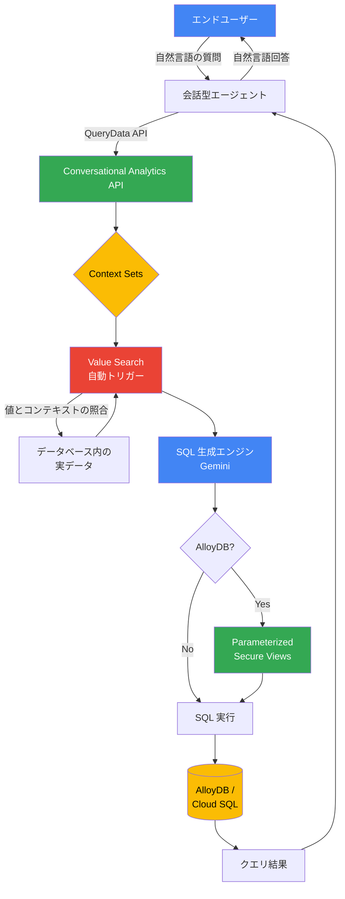

# AlloyDB / Cloud SQL: Context Sets による自然言語データクエリの精度向上 (Preview)

**リリース日**: 2026-04-06

**サービス**: AlloyDB for PostgreSQL, Cloud SQL for MySQL, Cloud SQL for PostgreSQL

**機能**: Context Sets (旧 Data Agents) の Preview アップデート -- Value Search クエリによる SQL 生成精度向上と AlloyDB 版での Parameterized Secure Views (PSV) サポート

**ステータス**: Preview

[このアップデートのインフォグラフィックを見る](https://takech9203.github.io/google-cloud-news-summary/20260406-alloydb-cloud-sql-context-sets.html)

## 概要

Google Cloud は、AlloyDB for PostgreSQL、Cloud SQL for MySQL、Cloud SQL for PostgreSQL の 3 サービスにおいて、Context Sets（旧称 Data Agents）機能の Preview アップデートを発表しました。Context Sets は、データベース内のデータに対して自然言語で問い合わせを行うための仕組みであり、QueryData API などのツールを通じて会話型エージェントの構築を可能にします。

今回の Preview アップデートでは、Value Search クエリの自動トリガーにより SQL 生成の精度が大幅に向上しました。Value Search クエリは、ユーザーの自然言語入力に含まれる値をデータベース内の実際の値やそのコンテキストと照合し、より正確な SQL を生成します。この処理は自動的にトリガーされるため、ユーザーやアプリケーション開発者が明示的に設定する必要はありません。

さらに、AlloyDB for PostgreSQL 版では Parameterized Secure Views (PSV) のサポートが追加されました。PSV は、自然言語クエリから生成される SQL に対して行レベルのアクセス制御を提供し、エンドユーザーが許可されたデータのみにアクセスできるようセキュリティを強化します。

**アップデート前の課題**

- 自然言語クエリに含まれる特定の値（例: 顧客名、地域名）がデータベース内の実際の値と一致しない場合、生成される SQL の精度が低下していた
- Value Search のような値照合を行うには追加の設定や手動での調整が必要だった
- 自然言語から生成された SQL クエリに対するセキュリティ制御が限定的で、行レベルのアクセス制御を自然言語クエリに適用するのが困難だった

**アップデート後の改善**

- Value Search クエリが自動トリガーされるようになり、値の照合とコンテキストの理解が向上し、SQL 生成精度が改善された
- 開発者は追加設定なしで精度向上の恩恵を受けられるようになった
- AlloyDB 版では PSV を活用して、自然言語クエリから生成された SQL に対しても行レベルのセキュリティを適用できるようになった

## アーキテクチャ図



エンドユーザーの自然言語による質問が QueryData API を通じて Context Sets に送信され、Value Search が自動的にデータベース内の値を照合した上で、Gemini がより正確な SQL を生成します。AlloyDB 版では PSV を通じてセキュリティフィルタリングが適用されます。

## サービスアップデートの詳細

### 主要機能

1. **Value Search クエリの自動トリガー**
   - ユーザーの自然言語入力に含まれる値（例: 「東京リージョンの顧客」における「東京」）を、データベース内の実際の値と自動的に照合
   - 値のコンテキスト（どのテーブル、どのカラムに属するか）を理解し、適切な SQL 条件を生成
   - 明示的な設定は不要で、自動的にトリガーされる

2. **SQL 生成精度の向上**
   - Value Search によるコンテキスト照合により、曖昧な値の参照が正確に解決される
   - テンプレートとファセットによるクエリストアと組み合わせて、より高精度な SQL を生成
   - 曖昧な入力に対しては自動的に曖昧さ解消のための質問を生成可能

3. **Parameterized Secure Views (PSV) サポート (AlloyDB 版のみ)**
   - `WITH (security_barrier)` オプションを使用した PostgreSQL セキュアビューの拡張
   - アプリケーションレベルの認証情報に基づく名前付きビューパラメータによる行レベルアクセス制御
   - AI による自然言語生成クエリに対するセキュリティエンベロープの提供

## 技術仕様

### 対応データベース

| データベース | Value Search | PSV サポート |
|---|---|---|
| AlloyDB for PostgreSQL | 対応 | 対応 |
| Cloud SQL for MySQL | 対応 | 非対応 |
| Cloud SQL for PostgreSQL | 対応 | 非対応 |

### Context Sets の構成要素

| 要素 | 説明 |
|---|---|
| テンプレート (Templates) | 代表的な自然言語の質問と対応する SQL クエリのペア |
| ファセット (Facets) | フィルタリング条件に対応する SQL スニペットと自然言語の意図の組み合わせ |
| スキーマコンテキスト | テーブル、ビュー、カラムに対するメタデータ記述 |
| Value Search | データベース内の値とそのコンテキストの自動照合 |

### QueryData API リクエスト例 (AlloyDB)

```json
{
  "parent": "projects/PROJECT_ID/locations/REGION",
  "prompt": "東京リージョンで融資対象の口座はいくつありますか？",
  "context": {
    "datasource_references": [
      {
        "alloydb": {
          "database_reference": {
            "project_id": "PROJECT_ID",
            "region": "REGION",
            "cluster_id": "CLUSTER_ID",
            "instance_id": "INSTANCE_ID",
            "database_id": "DATABASE_ID"
          },
          "agent_context_reference": {
            "context_set_id": "projects/PROJECT_ID/locations/REGION/contextSets/CONTEXT_SET_ID"
          }
        }
      }
    ]
  },
  "generation_options": {
    "generate_query_result": true,
    "generate_natural_language_answer": true,
    "generate_explanation": true,
    "generate_disambiguation_question": true
  }
}
```

### Parameterized Secure Views の作成例 (AlloyDB)

```sql
-- パラメータ付きセキュアビューの作成
CREATE VIEW schema.secure_checked_items
WITH (security_barrier) AS
SELECT bag_id, timestamp, location
FROM schema.checked_items t
WHERE customer_id = $@app_end_userid;

-- ビューへのアクセス権限付与
GRANT SELECT ON schema.secure_checked_items TO psv_user;

-- パラメータ付きクエリの実行
SELECT * FROM parameterized_views.execute_parameterized_query(
  query => 'SELECT * FROM schema.secure_checked_items',
  param_names => ARRAY['app_end_userid'],
  param_values => ARRAY['303']
);
```

## 設定方法

### 前提条件

1. AlloyDB for PostgreSQL、Cloud SQL for MySQL、または Cloud SQL for PostgreSQL のインスタンスが稼働していること
2. Gemini for Google Cloud が有効化されていること
3. Cloud SQL の場合、Data API アクセスが有効化されていること

### 手順

#### ステップ 1: データエージェント (Context Sets) の作成

Google Cloud コンソール、Gemini CLI、または IDE からデータエージェントを作成します。AlloyDB の場合は AlloyDB Studio から操作できます。

#### ステップ 2: コンテキストの設定

Guided モード（Google Cloud コンソール）または Advanced モード（Gemini CLI / IDE）でコンテキストを設定します。テンプレートやファセットを追加して、クエリ精度を向上させることができます。

#### ステップ 3: Context Set ID の取得

AlloyDB Studio のエクスプローラーペインからデータエージェントを選択し、Agent Context ID を確認します。形式は以下の通りです:

```
projects/PROJECT_ID/locations/REGION/contextSets/CONTEXT_SET_NAME
```

#### ステップ 4: アプリケーションとの統合

MCP Toolbox を使用して、データエージェントをアプリケーションに接続します。

```yaml
sources:
  gda-api-source:
    kind: cloud-gemini-data-analytics
    projectId: "PROJECT_ID"
tools:
  cloud_gda_query_tool:
    kind: cloud-gemini-data-analytics-query
    source: gda-api-source
    description: "自然言語クエリツール"
    location: "REGION_ID"
    context:
      datasourceReferences:
        alloydb:
          databaseReference:
            projectId: "PROJECT_ID"
            region: "REGION_ID"
            clusterId: "CLUSTER_ID"
            instanceId: "INSTANCE_ID"
            databaseId: "DATABASE_ID"
          agentContextReference:
            contextSetId: "CONTEXT_SET_ID"
    generationOptions:
      generateQueryResult: true
      generateNaturalLanguageAnswer: true
      generateExplanation: true
      generateDisambiguationQuestion: true
```

#### ステップ 5: PSV の設定 (AlloyDB のみ)

```bash
# parameterized_views 拡張機能の有効化
ALTER SYSTEM SET shared_preload_libraries = "...,parameterized_views";
ALTER SYSTEM SET parameterized_views.enabled = on;

# PostgreSQL サーバーの再起動後
CREATE EXTENSION parameterized_views;
```

## メリット

### ビジネス面

- **会話型データアプリケーションの構築加速**: カスタマーサービス自動化、EC ショッピングアシスタント、予約システムなどを自然言語インターフェースで迅速に構築可能
- **データ活用の民主化**: SQL の知識がなくても、ビジネスユーザーが直接データベースに自然言語で問い合わせ可能
- **セキュリティとコンプライアンスの強化**: PSV により、AI 生成クエリに対しても適切なアクセス制御を維持

### 技術面

- **SQL 生成精度の向上**: Value Search の自動トリガーにより、値の曖昧さが解消され正確な SQL が生成される
- **開発者の負担軽減**: Value Search は自動的に動作するため、追加の設定やチューニングが不要
- **行レベルセキュリティ**: PSV によりアプリケーションレベルの認証情報に基づいた細粒度のアクセス制御が可能

## デメリット・制約事項

### 制限事項

- Preview リリースのため、サポートが限定的であり、本番環境での使用には注意が必要
- データベース向けの Agent Context はテンプレートとファセットのみをサポート
- Agent Context はデータベース向けには QueryData エンドポイント経由でのみ利用可能
- PSV は AlloyDB for PostgreSQL のみで利用可能であり、Cloud SQL for MySQL / PostgreSQL では非対応

### 考慮すべき点

- PSV を使用する場合、AlloyDB の各インスタンスで `parameterized_views.enabled` フラグを個別に設定する必要がある
- Gemini for Google Cloud による AI 生成出力は事実と異なる可能性があるため、出力の検証が推奨される
- Value Search の精度はデータベース内のデータ品質とコンテキスト設定に依存する

## ユースケース

### ユースケース 1: カスタマーサービス自動化

**シナリオ**: EC サイトのカスタマーサポートチャットボットが、顧客の注文状況や残高照会に自然言語で対応する。

**実装例**:
```
顧客: 「注文番号 12345 の配送状況を教えてください」
↓ Value Search により "12345" を orders テーブルの order_id と自動照合
↓ SQL 生成: SELECT status, tracking_number FROM orders WHERE order_id = '12345'
↓ PSV により当該顧客のデータのみ返却
エージェント: 「ご注文 12345 は現在発送済みで、追跡番号は JP123456789 です。」
```

**効果**: Value Search により注文番号や顧客名の正確な照合が行われ、PSV により他の顧客のデータへのアクセスが防止される。

### ユースケース 2: フィールドオペレーション向けリアルタイム在庫照会

**シナリオ**: 現場のスタッフがモバイルデバイスから、在庫レベルやパーツの在庫状況を自然言語で照会する。

**効果**: SQL の知識がない現場スタッフでも、「倉庫 A のボルト M8 の在庫は？」のような自然言語クエリで正確な在庫データにアクセスでき、Value Search により「ボルト M8」が正しい部品コードに自動照合される。

## 料金

Context Sets (Data Agents) 機能は Preview 段階のため、料金体系は今後変更される可能性があります。基盤となる AlloyDB for PostgreSQL、Cloud SQL for MySQL、Cloud SQL for PostgreSQL の通常のインスタンス料金に加え、Gemini for Google Cloud の利用に応じた料金が発生します。詳細は各サービスの料金ページを参照してください。

## 関連サービス・機能

- **Conversational Analytics API**: Context Sets が利用する QueryData メソッドを提供する API
- **Gemini for Google Cloud**: SQL 生成の基盤となる AI モデル
- **MCP Toolbox for Databases**: データエージェントをアプリケーションに接続するためのツール
- **AlloyDB AI**: AlloyDB の AI 拡張機能群（alloydb_ai_nl 拡張を含む）
- **Vertex AI**: Gemini モデルへの予測リクエストの処理基盤

## 参考リンク

- [インフォグラフィック](https://takech9203.github.io/google-cloud-news-summary/20260406-alloydb-cloud-sql-context-sets.html)
- [公式リリースノート](https://docs.cloud.google.com/release-notes#April_06_2026)
- [AlloyDB Data Agents 概要](https://cloud.google.com/alloydb/docs/ai/data-agent-overview)
- [Cloud SQL for MySQL Data Agents 概要](https://cloud.google.com/sql/docs/mysql/data-agent-overview)
- [Cloud SQL for PostgreSQL Data Agents 概要](https://cloud.google.com/sql/docs/postgres/data-agent-overview)
- [AlloyDB Parameterized Secure Views 概要](https://cloud.google.com/alloydb/docs/parameterized-secure-views-overview)
- [QueryData API でのデータエージェントコンテキスト設定](https://cloud.google.com/gemini/data-agents/conversational-analytics-api/data-agent-authored-context-databases)

## まとめ

今回の Context Sets Preview アップデートは、AlloyDB for PostgreSQL、Cloud SQL for MySQL、Cloud SQL for PostgreSQL における自然言語データクエリの精度とセキュリティを大幅に向上させるものです。Value Search の自動トリガーにより、開発者は追加の設定なしで SQL 生成精度の改善を享受でき、AlloyDB 版の PSV サポートにより AI 生成クエリに対しても堅牢な行レベルセキュリティを適用できるようになりました。会話型データアプリケーションの構築を検討している場合は、Preview 版を試して自社のユースケースでの精度を検証することを推奨します。

---

**タグ**: #AlloyDB #CloudSQL #ContextSets #DataAgents #QueryData #NaturalLanguage #NL2SQL #ParameterizedSecureViews #PSV #Preview #ConversationalAnalytics #Gemini #AI #Security
