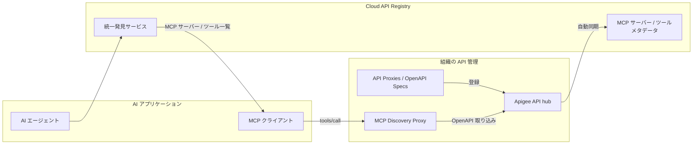

# Apigee API hub: Agent Registry 連携による MCP メタデータサポート (Preview)

**リリース日**: 2026-04-06

**サービス**: Apigee API hub

**機能**: Agent Registry integration support for MCP metadata

**ステータス**: Preview

[このアップデートのインフォグラフィックを見る](https://takech9203.github.io/google-cloud-news-summary/20260406-apigee-api-hub-agent-registry-mcp.html)

## 概要

Apigee API hub に Cloud API Registry(Agent Registry)とのマネージド連携機能が追加されました。この機能により、API hub に登録されている API の Model Context Protocol(MCP)サーバーおよびツールのメタデータが自動的に同期されるようになります。AI エージェントは手動設定なしで API hub 内の API を発見し、利用できるようになります。

この機能は、急速に拡大するエージェンティック AI の開発において、API の発見と利用を大幅に簡素化するものです。従来は開発者が手動で API のエンドポイントや仕様を確認し、AI エージェントに設定する必要がありましたが、MCP メタデータの自動同期により、このプロセスが自動化されます。

本機能は現在 Public Preview として提供されており、「Pre-GA Offerings Terms」が適用されます。

**アップデート前の課題**

- AI エージェントが API hub 内の API を利用するには、開発者が手動で各 API のエンドポイント情報や仕様を確認し、エージェントに設定する必要があった
- MCP サーバーとツールのメタデータが API hub と Agent Registry の間で分散しており、一元的な管理が困難だった
- 組織内で利用可能な MCP ツールの全体像を把握するために、複数のシステムを横断的に確認する必要があった

**アップデート後の改善**

- API hub と Agent Registry 間で MCP メタデータが自動同期されるようになり、手動設定が不要になった
- AI エージェントが Cloud API Registry を通じて、API hub に登録された MCP サーバーとツールを自動的に発見・利用できるようになった
- Google 提供の MCP サーバーと組織独自の MCP サーバーの両方を統一的に管理・発見できるようになった

## アーキテクチャ図



API hub に登録された API メタデータが Cloud API Registry に自動同期され、AI エージェントが統一的なインターフェースを通じて MCP ツールを発見・利用するフローを示しています。

## サービスアップデートの詳細

### 主要機能

1. **MCP メタデータの自動同期**
   - API hub に登録された API の情報が Cloud API Registry に自動的に同期される
   - MCP Discovery Proxy がデプロイされると、API hub が OpenAPI 仕様を自動取り込みし、MCP API スタイルを割り当て、API オペレーションを個別の MCP ツールにマッピングする

2. **統一的な MCP ツール発見**
   - Cloud API Registry を通じて、Google 提供および組織独自の MCP サーバーとツールを一元的に発見可能
   - `gcloud beta api-registry mcp servers list` コマンドや REST API でプログラマティックにアクセス可能
   - API hub のセマンティック検索により、自然言語クエリで関連ツールを検索可能

3. **集中型ガバナンス**
   - MCP サーバーとツールへのアクセスを組織全体で一元管理
   - Service Usage を通じて、プロジェクト・フォルダ・組織レベルで MCP エンドポイントの有効化・無効化を制御
   - IAM ロールによるきめ細かなアクセス制御

## 技術仕様

### Cloud API Registry API

| 項目 | 詳細 |
|------|------|
| API バージョン | v1beta |
| サービスエンドポイント | `https://cloudapiregistry.googleapis.com` |
| MCP サーバー操作 | `list`, `get` |
| MCP ツール操作 | `list`, `get` |
| 認証 | OAuth 2.1 / OIDC |

### 必要な IAM ロール

| ロール | 用途 |
|--------|------|
| `roles/cloudapiregistry.admin` | MCP サーバーの有効化・無効化、ツールの発見・一覧 |
| `roles/apihub.viewer` | API hub の MCP サーバーとツールの一覧表示 |
| `roles/apigee.admin` | API hub インスタンスの管理、MCP Discovery Proxy のデプロイ |

### REST API リソース構造

```
projects/
  └── locations/
       └── mcpServers/          # MCP サーバーの一覧・詳細取得
            └── mcpTools/       # MCP ツールの一覧・詳細取得
```

## 設定方法

### 前提条件

1. Apigee 組織がプロビジョニング済みであること（Subscription、Pay-as-you-go、Evaluation のいずれか）
2. Google Cloud プロジェクトに Apigee API hub インスタンスがプロビジョニング済みであること
3. Apigee インスタンスが API hub サービスにアタッチ済みであること

### 手順

#### ステップ 1: 環境変数の設定

```bash
export PROJECT_ID=YOUR_PROJECT_ID
export REGION=YOUR_REGION
export RUNTIME_HOSTNAME=YOUR_RUNTIME_HOSTNAME
```

#### ステップ 2: プロジェクトの設定

```bash
gcloud auth login
gcloud config set project $PROJECT_ID
```

#### ステップ 3: MCP サーバーの一覧確認

```bash
gcloud beta api-registry mcp servers list
```

#### ステップ 4: MCP ツールの発見

```bash
gcloud beta api-registry mcp servers describe SERVER_NAME
```

REST API を使用する場合:

```bash
curl -H "Authorization: Bearer $(gcloud auth print-access-token)" \
  "https://cloudapiregistry.googleapis.com/v1beta/projects/${PROJECT_ID}/locations/global/mcpServers"
```

## メリット

### ビジネス面

- **エージェンティック AI 開発の加速**: AI エージェントが利用可能な API を自動的に発見できるため、開発サイクルが短縮される
- **API ガバナンスの強化**: 組織全体で利用される MCP ツールを一元的に可視化・管理できるため、セキュリティとコンプライアンスの確保が容易になる

### 技術面

- **手動設定の排除**: MCP メタデータの自動同期により、API 登録から AI エージェントでの利用までのワークフローが自動化される
- **標準プロトコルへの準拠**: Model Context Protocol (MCP) というオープンな標準プロトコルに基づいており、ベンダーロックインのリスクが低い
- **プログラマティックアクセス**: gcloud CLI および REST API の両方からアクセス可能で、CI/CD パイプラインへの組み込みが容易

## デメリット・制約事項

### 制限事項

- 本機能は Public Preview であり、「Pre-GA Offerings Terms」が適用される。サポートが限定的となる場合がある
- Apigee 組織内の MCP ツール数は 1,000 に制限される
- Apigee hybrid 組織では MCP 機能が利用できない
- MCP in Apigee がサポートする OpenAPI バージョンは 3.0.0、3.0.1、3.0.2、3.0.3 のみ
- VPC-SC が有効な Apigee 組織では、API hub の API insights が MCP API とツールに対して利用できない

### 考慮すべき点

- Preview 段階のため、GA に向けて仕様が変更される可能性がある
- 一部リージョンではインフラストラクチャのキャパシティ制限により、MCP インフラストラクチャのデプロイが制限される場合がある（asia-east2、asia-northeast3、asia-southeast2 など）
- Cloud API Registry の利用には `roles/cloudapiregistry.admin` と `roles/apihub.viewer` の両方の IAM ロールが必要

## ユースケース

### ユースケース 1: エージェンティック AI アプリケーションのツール発見

**シナリオ**: AI エージェントを構築する開発者が、組織内で利用可能な API ツールを検索し、エージェントに必要な MCP サーバーとツールを特定する。

**実装例**:
```bash
# 利用可能な MCP サーバーの一覧を取得
gcloud beta api-registry mcp servers list

# 特定の MCP サーバーのツール一覧を取得
gcloud beta api-registry mcp servers list-tools SERVER_NAME
```

**効果**: 手動で API ドキュメントを確認する必要がなくなり、AI エージェントが自律的に利用可能なツールを発見・選択できるようになる。

### ユースケース 2: マルチチーム環境での API ガバナンス

**シナリオ**: プラットフォーム管理者が、複数のチームが開発する API を API hub に一元管理し、AI エージェントからの利用を統制する。

**効果**: 各チームが個別に API を公開しても、Agent Registry との自動同期により組織全体の MCP ツールカタログが常に最新の状態に保たれ、セキュリティポリシーの適用漏れを防止できる。

## 関連サービス・機能

- **Cloud API Registry**: MCP サーバーとツールの発見・ガバナンス・モニタリングを提供するサービス。API hub と連携してメタデータを同期する
- **Apigee MCP Discovery Proxy**: API を MCP ツールとして公開するためのプロキシ。デプロイ時に API hub への OpenAPI 仕様の自動取り込みがトリガーされる
- **Google Cloud MCP Servers**: Google が提供する各種 MCP サーバー群。Cloud API Registry を通じて発見・利用が可能
- **Apigee Analytics**: MCP ツールの利用状況（tools/list と tools/call のリクエスト量など）をモニタリングするためのサービス

## 参考リンク

- [インフォグラフィック](https://takech9203.github.io/google-cloud-news-summary/20260406-apigee-api-hub-agent-registry-mcp.html)
- [公式リリースノート](https://docs.cloud.google.com/release-notes#April_06_2026)
- [Cloud API Registry 概要](https://docs.cloud.google.com/api-registry/docs/overview)
- [MCP ツールの発見と一覧](https://docs.cloud.google.com/api-registry/docs/discover-list-tools)
- [Apigee MCP 概要](https://docs.cloud.google.com/apigee/docs/api-platform/apigee-mcp/apigee-mcp-overview)
- [Apigee MCP クイックスタート](https://docs.cloud.google.com/apigee/docs/api-platform/apigee-mcp/apigee-mcp-quickstart)
- [Cloud API Registry REST API リファレンス](https://docs.cloud.google.com/api-registry/docs/reference/rest)

## まとめ

Apigee API hub と Cloud API Registry(Agent Registry)のマネージド連携により、AI エージェントが組織内の API を MCP ツールとして自動的に発見・利用できるようになりました。エージェンティック AI 開発において API のディスカバリとガバナンスを一元化する重要な機能です。現在 Public Preview の段階であるため、本番環境への導入は GA リリースを待つことが推奨されますが、開発・検証環境での評価を開始することを推奨します。

---

**タグ**: #Apigee #APIHub #AgentRegistry #CloudAPIRegistry #MCP #ModelContextProtocol #AI #エージェンティックAI #Preview
