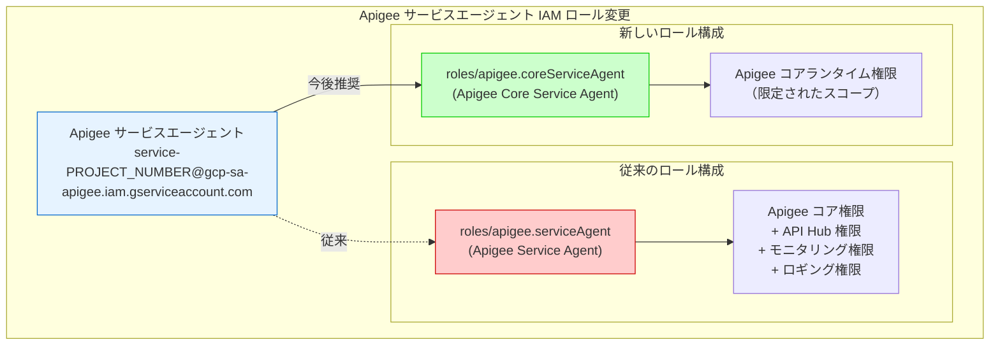

# Apigee X: 新しい apigee.coreServiceAgent IAM ロールの導入

**リリース日**: 2026-04-06

**サービス**: Apigee X

**機能**: 新しい apigee.coreServiceAgent IAM ロールの導入

**ステータス**: Change

[このアップデートのインフォグラフィックを見る](https://takech9203.github.io/google-cloud-news-summary/20260406-apigee-x-core-service-agent-role.html)

## 概要

2026 年 4 月 6 日、Google Cloud は Apigee の新しい IAM ロール `apigee.coreServiceAgent`（Apigee Core Service Agent）を導入しました。この変更により、Apigee のサービスエージェントに付与するロールが従来の `apigee.serviceAgent` から `apigee.coreServiceAgent` に変更されます。

このアップデートは、Apigee の内部サービスエージェントが使用する IAM ロールをより細分化し、最小権限の原則に沿ったアクセス制御を実現するためのものです。`apigee.coreServiceAgent` ロールは、Apigee のコアランタイム機能に必要な権限のみに限定されており、従来の `apigee.serviceAgent` ロールが保持していた API Hub 関連の広範な権限を分離しています。

対象ユーザーは、Apigee X を利用しているすべての Google Cloud プロジェクト管理者およびプラットフォームエンジニアです。即時有効となるため、新規セットアップでは `apigee.coreServiceAgent` ロールを使用する必要があります。

**アップデート前の課題**

- `apigee.serviceAgent` ロールは Apigee コア機能と API Hub 関連の権限を含む広範なロールであり、最小権限の原則に完全には沿っていなかった
- サービスエージェントに付与される権限の範囲が広く、API Hub、モニタリング、ロギングなど多岐にわたる権限が単一ロールに集約されていた
- Apigee のコアランタイム操作に必要な権限と、補助的なサービス連携用の権限が分離されていなかった

**アップデート後の改善**

- `apigee.coreServiceAgent` ロールにより、Apigee コアランタイムに必要な権限のみを付与できるようになった
- サービスエージェントの権限がより細分化され、最小権限の原則に沿った IAM 管理が可能になった
- セキュリティ監査やコンプライアンス対応において、サービスエージェントの権限範囲がより明確になった

## アーキテクチャ図



この図は、従来の `apigee.serviceAgent` ロールから新しい `apigee.coreServiceAgent` ロールへの移行を示しています。新しいロールはコアランタイム機能に必要な権限のみに限定されています。

## サービスアップデートの詳細

### 主要機能

1. **新しい apigee.coreServiceAgent ロール**
   - ロール ID: `roles/apigee.coreServiceAgent`
   - Apigee のコアサービスエージェント専用の IAM ロール
   - サービスエージェント（`service-PROJECT_NUMBER@gcp-sa-apigee.iam.gserviceaccount.com`）にのみ付与可能

2. **権限の細分化**
   - コアランタイム操作に必要な権限（Canary Evaluations、Ingress Configs、Operations、API Products など）を含む
   - 従来の `apigee.serviceAgent` が持っていた広範な API Hub 関連権限を分離
   - Apigee のプロキシ管理、環境管理、インスタンス管理に関連するコア権限に焦点を当てたロール

3. **即時有効の変更**
   - 今回のリリースから即座に適用される変更
   - 新規の Apigee セットアップでは `apigee.coreServiceAgent` の使用が推奨される

## 技術仕様

### ロール比較

| 項目 | apigee.serviceAgent（従来） | apigee.coreServiceAgent（新規） |
|------|---------------------------|-------------------------------|
| ロール ID | `roles/apigee.serviceAgent` | `roles/apigee.coreServiceAgent` |
| 対象 | サービスエージェントのみ | サービスエージェントのみ |
| Apigee コア権限 | 含む | 含む |
| API Hub 広範権限 | 含む | 限定的 |
| 推奨度 | 今後は非推奨 | 推奨 |

### apigee.coreServiceAgent に含まれる主な権限カテゴリ

| 権限カテゴリ | 具体例 |
|-------------|--------|
| Canary Evaluations | `apigee.canaryevaluations.create`, `apigee.canaryevaluations.get` |
| Ingress Configs | `apigee.ingressconfigs.get` |
| Operations | `apigee.operations.get`, `apigee.operations.list` |
| API Products | `apigee.apiproducts.get`, `apigee.apiproducts.list` |
| Proxy Revisions | `apigee.proxyrevisions.get` |
| Organizations | `apigee.organizations.get` |
| Environments | `apigee.environments.get`, `apigee.environments.manageRuntime` |
| Instances | `apigee.instances.reportStatus` |

## 設定方法

### 前提条件

1. Google Cloud プロジェクトで Apigee API が有効化されていること
2. Apigee サービスエージェントが作成済みであること
3. プロジェクトに対する IAM 管理権限を持つアカウントでアクセスしていること

### 手順

#### ステップ 1: 現在のサービスエージェントのロール確認

```bash
# プロジェクトの IAM ポリシーを確認し、Apigee サービスエージェントのロールを表示
gcloud projects get-iam-policy $PROJECT_ID \
  --flatten="bindings[].members" \
  --filter="bindings.members:gcp-sa-apigee.iam.gserviceaccount.com" \
  --format="table(bindings.role)"
```

現在のサービスエージェントに `roles/apigee.serviceAgent` が付与されているか確認します。

#### ステップ 2: 新しい coreServiceAgent ロールの付与

```bash
# サービスエージェントに新しい coreServiceAgent ロールを付与
gcloud projects add-iam-policy-binding $PROJECT_ID \
  --member="serviceAccount:service-${PROJECT_NUMBER}@gcp-sa-apigee.iam.gserviceaccount.com" \
  --role="roles/apigee.coreServiceAgent"
```

新しいロールを付与した後、Apigee の動作が正常であることを確認してください。

#### ステップ 3: 従来のロールの削除（検証後）

```bash
# 動作確認後、従来の serviceAgent ロールを削除
gcloud projects remove-iam-policy-binding $PROJECT_ID \
  --member="serviceAccount:service-${PROJECT_NUMBER}@gcp-sa-apigee.iam.gserviceaccount.com" \
  --role="roles/apigee.serviceAgent"
```

従来のロールを削除する前に、十分な動作検証を行ってください。

## メリット

### ビジネス面

- **コンプライアンス強化**: 最小権限の原則に沿った IAM 構成により、セキュリティ監査やコンプライアンス要件への対応が容易になる
- **リスク低減**: サービスエージェントの権限範囲が限定されることで、万が一の権限悪用リスクが低減される

### 技術面

- **権限の明確化**: コアランタイムに必要な権限が明確に定義されているため、IAM ポリシーの管理が容易になる
- **細粒度のアクセス制御**: サービスエージェントの権限を機能単位で管理できるようになり、より精密なアクセス制御が可能になる

## デメリット・制約事項

### 制限事項

- サービスエージェントロールは、サービスエージェント以外のプリンシパル（ユーザーアカウント、サービスアカウントなど）には付与してはならない
- 既存の `apigee.serviceAgent` ロールから移行する場合、API Hub 関連の機能に影響が出る可能性があるため、事前の検証が必要

### 考慮すべき点

- 既存の Apigee 環境で従来の `apigee.serviceAgent` を使用している場合、即座にロールを切り替えるのではなく、段階的に移行することを推奨
- Terraform や Deployment Manager で IAM ポリシーを管理している場合、IaC コードの更新も必要

## ユースケース

### ユースケース 1: 新規 Apigee X 環境のセットアップ

**シナリオ**: 新しい Google Cloud プロジェクトに Apigee X を初めてプロビジョニングする場合

**実装例**:
```bash
# Apigee サービスアイデンティティの作成
gcloud beta services identity create --service=apigee.googleapis.com \
  --project=$PROJECT_ID

# 新しい coreServiceAgent ロールの付与
gcloud projects add-iam-policy-binding $PROJECT_ID \
  --member="serviceAccount:service-${PROJECT_NUMBER}@gcp-sa-apigee.iam.gserviceaccount.com" \
  --role="roles/apigee.coreServiceAgent"
```

**効果**: 初期セットアップから最小権限の原則に沿った IAM 構成が実現でき、セキュリティベストプラクティスに準拠した環境を構築できる

### ユースケース 2: 既存環境のセキュリティ強化

**シナリオ**: セキュリティ監査の指摘を受けて、既存の Apigee 環境でサービスエージェントの権限を見直す場合

**効果**: 不要な権限を削除し、コアランタイムに必要な最小限の権限のみに限定することで、監査要件を満たしつつ運用の安全性が向上する

## 関連サービス・機能

- **IAM (Identity and Access Management)**: サービスエージェントロールの管理基盤として、IAM ポリシーの設定と監査に使用
- **API Hub**: 従来の `apigee.serviceAgent` に含まれていた API Hub 関連権限が分離されたため、API Hub を利用する場合は別途権限設定が必要になる可能性がある
- **Cloud Logging / Cloud Monitoring**: サービスエージェントの権限変更に伴い、ログ書き込みやメトリクス送信の権限構成を確認する必要がある

## 参考リンク

- [このアップデートのインフォグラフィック](https://takech9203.github.io/google-cloud-news-summary/20260406-apigee-x-core-service-agent-role.html)
- [公式リリースノート](https://docs.cloud.google.com/release-notes#April_06_2026)
- [Apigee IAM ロールと権限](https://cloud.google.com/iam/docs/roles-permissions/apigee)
- [Apigee サービスエージェント](https://cloud.google.com/iam/docs/service-agents)
- [Apigee X プロビジョニングガイド](https://cloud.google.com/apigee/docs/api-platform/get-started/install-cli)

## まとめ

今回の `apigee.coreServiceAgent` ロールの導入は、Apigee のサービスエージェント権限を最小権限の原則に沿って細分化する重要なセキュリティ改善です。既存の Apigee X ユーザーは、環境への影響を検証した上で段階的に新しいロールへ移行することを推奨します。新規環境のセットアップでは、初めから `apigee.coreServiceAgent` ロールを使用してください。

---

**タグ**: #Apigee #IAM #セキュリティ #サービスエージェント #最小権限 #アクセス制御
