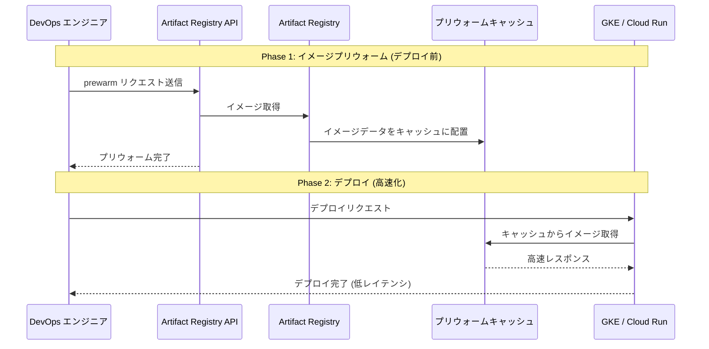

# Artifact Registry: Image Prewarm (手動イメージプリウォーム)

**リリース日**: 2026-04-06

**サービス**: Artifact Registry

**機能**: Image Prewarm (手動イメージプリウォーム)

**ステータス**: API only

📊 [このアップデートのインフォグラフィックを見る](https://takech9203.github.io/google-cloud-news-summary/20260406-artifact-registry-prewarm-images.html)

## 概要

Google Cloud は Artifact Registry に手動イメージプリウォーム機能を追加しました。この機能により、コンテナイメージを事前にウォームアップ（プリウォーム）することで、デプロイ時のコールドスタートレイテンシを大幅に削減できます。現時点では API 経由でのみ利用可能です。

コンテナベースのワークロードでは、イメージのプルに要する時間がデプロイの初期化速度に直接影響します。特に大規模なイメージや、スケールアウト時に多数のノードで同時にイメージをプルする場合、レイテンシが顕著になります。Image Prewarm は、デプロイ前にイメージデータを事前にキャッシュすることで、この問題を解決します。

この機能は GKE や Cloud Run などのコンピュートサービスにコンテナをデプロイする際のパフォーマンスを重視する DevOps エンジニアやプラットフォームチームに特に有益です。

**アップデート前の課題**

- コンテナのデプロイ時に毎回イメージの完全なプルが必要で、特に大規模イメージでは 20 秒以上かかることがあった
- スケールアウト時に複数ノードで同時にイメージプルが発生し、デプロイのレイテンシが増大していた
- Image streaming は自動的なキャッシュに依存しており、初回プル時には恩恵を受けにくかった
- イメージのキャッシュ状態を事前に制御する手段がなかった

**アップデート後の改善**

- API を使用してイメージを事前にプリウォームし、デプロイ前にキャッシュを準備できるようになった
- コールドスタートレイテンシの大幅な削減が可能になった
- デプロイのタイミングに合わせて、計画的にイメージの準備ができるようになった

## アーキテクチャ図



この図は、プリウォーム API を事前に呼び出してキャッシュを準備し、その後のデプロイでキャッシュ済みイメージを高速に取得する流れを示しています。

## サービスアップデートの詳細

### 主要機能

1. **手動イメージプリウォーム**
   - API を通じて特定のコンテナイメージを事前にウォームアップ
   - デプロイ前にイメージデータをキャッシュに配置し、プル時間を短縮

2. **コールドスタートレイテンシの削減**
   - 通常のイメージプルでは大規模イメージで 20 秒以上かかるケースが、プリウォーム後は大幅に短縮
   - 既存の Image streaming 機能と組み合わせることで、さらなる高速化が期待できる

3. **API ベースの制御**
   - プログラマティックなイメージプリウォームが可能
   - CI/CD パイプラインへの組み込みに適した設計

## 技術仕様

### 利用条件

| 項目 | 詳細 |
|------|------|
| 利用方法 | API のみ (gcloud CLI / Console 未対応) |
| 対象リポジトリ | Artifact Registry Docker リポジトリ |
| 認証 | Artifact Registry への適切な IAM 権限が必要 |

### 関連する既存機能との比較

| 機能 | 特徴 | 制御方法 |
|------|------|----------|
| Image Prewarm (今回の新機能) | 手動で事前にキャッシュを準備 | API |
| Image streaming | リクエスト時にデータをストリーミング | 自動 (Container File System API 有効化) |
| Secondary boot disk | ノードのセカンダリディスクにイメージをプリロード | ノードプール設定 |

## 設定方法

### 前提条件

1. Artifact Registry API が有効化されていること
2. 対象の Docker リポジトリが Artifact Registry に存在すること
3. 適切な IAM 権限が付与されていること

### 手順

#### ステップ 1: API の有効化

```bash
gcloud services enable artifactregistry.googleapis.com
```

Artifact Registry API がプロジェクトで有効になっていることを確認します。

#### ステップ 2: API を使用したイメージのプリウォーム

```bash
curl -X POST \
  -H "Authorization: Bearer $(gcloud auth print-access-token)" \
  -H "Content-Type: application/json" \
  "https://artifactregistry.googleapis.com/v1/projects/PROJECT_ID/locations/LOCATION/repositories/REPOSITORY/dockerImages/IMAGE:TAG:prewarm"
```

`PROJECT_ID`、`LOCATION`、`REPOSITORY`、`IMAGE`、`TAG` を実際の値に置き換えてください。具体的な API エンドポイントとリクエストボディの詳細は、公式ドキュメントを参照してください。

## メリット

### ビジネス面

- **デプロイ速度の向上**: コールドスタートレイテンシの削減により、リリースサイクルが高速化
- **ユーザー体験の改善**: スケールアウト時の応答遅延が減少し、エンドユーザーへの影響を最小化
- **計画的なデプロイ管理**: デプロイ前にイメージを準備することで、本番環境へのリリースをより予測可能に

### 技術面

- **CI/CD パイプライン統合**: API ベースのためパイプラインに組み込みやすく、自動化が容易
- **既存機能との補完関係**: Image streaming やセカンダリブートディスクと組み合わせてさらなる最適化が可能
- **プログラマティック制御**: キャッシュの準備タイミングをアプリケーション側から制御可能

## デメリット・制約事項

### 制限事項

- 現時点では API のみで利用可能（gcloud CLI や Cloud Console からは操作不可）
- GUI によるプリウォーム状態の確認手段が提供されていない

### 考慮すべき点

- プリウォームしたキャッシュの有効期間やキャッシュの保持ポリシーについては公式ドキュメントで確認が必要
- プリウォームの対象リージョンやイメージフォーマットの制約がある可能性があるため、利用前にドキュメントを確認すること
- 大量のイメージをプリウォームする場合のクォータや API レートリミットに注意が必要

## ユースケース

### ユースケース 1: 大規模スケールアウトの事前準備

**シナリオ**: EC サイトのセール開始前に、アプリケーションコンテナを大量にスケールアウトする必要がある。通常のイメージプルでは、数十ノードで同時にプルが発生し、デプロイ完了まで数分を要していた。

**実装例**:
```bash
# セール開始の30分前にプリウォームを実行
curl -X POST \
  -H "Authorization: Bearer $(gcloud auth print-access-token)" \
  -H "Content-Type: application/json" \
  "https://artifactregistry.googleapis.com/v1/projects/my-project/locations/asia-northeast1/repositories/my-repo/dockerImages/my-app:v2.1.0:prewarm"
```

**効果**: イメージが事前にキャッシュされることで、スケールアウト時のイメージプル時間が大幅に短縮され、セール開始時のレスポンス遅延を防止。

### ユースケース 2: CI/CD パイプラインでのデプロイ高速化

**シナリオ**: マイクロサービスアーキテクチャで複数のサービスを同時にデプロイする際、各サービスのイメージプルが並列で発生し、デプロイ全体の完了時間が長くなっていた。

**効果**: デプロイステップの前にプリウォームステップを追加することで、実際のデプロイ時にはキャッシュ済みイメージを使用でき、デプロイ時間の大幅な短縮が期待できる。

### ユースケース 3: 災害復旧 (DR) シナリオ

**シナリオ**: DR リージョンへのフェイルオーバー時、新しいリージョンでのイメージプルがボトルネックとなり、復旧時間 (RTO) が長くなっていた。

**効果**: DR リージョンで定期的にプリウォームを実行しておくことで、フェイルオーバー時のイメージプル時間を削減し、RTO を短縮。

## 関連サービス・機能

- **[GKE Image streaming](https://cloud.google.com/kubernetes-engine/docs/how-to/image-streaming)**: コンテナイメージをストリーミング方式でプルし、初期化時間を短縮する機能。プリウォームと組み合わせることでさらなる効果が期待できる
- **[GKE Secondary boot disk](https://cloud.google.com/kubernetes-engine/docs/how-to/data-container-image-preloading)**: ノードのセカンダリブートディスクにイメージをプリロードする機能。ノードレベルのキャッシュとして機能する
- **[Cloud Run](https://cloud.google.com/run)**: Artifact Registry からコンテナイメージをプルしてサーバーレスで実行するサービス。プリウォームによりコールドスタートの改善が期待できる
- **[Cloud Build](https://cloud.google.com/build)**: CI/CD パイプラインでイメージをビルドした後、プリウォーム API を呼び出す連携が可能

## 参考リンク

- 📊 [インフォグラフィック](https://takech9203.github.io/google-cloud-news-summary/20260406-artifact-registry-prewarm-images.html)
- [公式リリースノート](https://docs.cloud.google.com/release-notes#April_06_2026)
- [ドキュメント](https://docs.cloud.google.com/artifact-registry/docs/manage/prewarm-images)
- [Artifact Registry 料金ページ](https://cloud.google.com/artifact-registry/pricing)
- [Image streaming ドキュメント](https://cloud.google.com/kubernetes-engine/docs/how-to/image-streaming)

## まとめ

Artifact Registry の Image Prewarm 機能は、コンテナデプロイ時のコールドスタートレイテンシという長年の課題に対する直接的な解決策です。API を通じてイメージを事前にキャッシュすることで、特に大規模なスケールアウトや計画的なデプロイにおいて大きな効果が期待できます。現時点では API のみの提供ですが、CI/CD パイプラインへの組み込みには十分であり、Image streaming やセカンダリブートディスクと併用することで、コンテナデプロイの最適化をさらに推進できます。まずは公式ドキュメントで API の詳細を確認し、開発環境での検証から始めることを推奨します。

---

**タグ**: #ArtifactRegistry #ContainerRegistry #ImagePrewarm #ColdStart #GKE #CloudRun #コンテナ #デプロイ最適化 #レイテンシ削減
