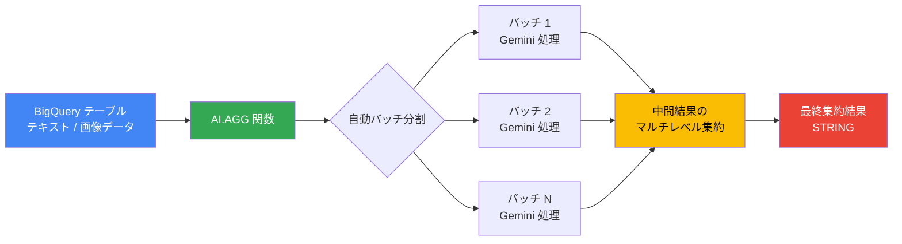

# BigQuery: AI.AGG 関数によるセマンティック集約 (Preview)

**リリース日**: 2026-04-06

**サービス**: BigQuery

**機能**: AI.AGG 関数によるセマンティック集約

**ステータス**: Preview

[このアップデートのインフォグラフィックを見る](https://takech9203.github.io/google-cloud-news-summary/20260406-bigquery-ai-agg-function.html)

## 概要

BigQuery に新しいマネージド AI 関数「AI.AGG」が Preview として追加されました。AI.AGG 関数は、Vertex AI の Gemini モデルを活用し、自然言語の指示に基づいて非構造化データをセマンティックに集約する機能を提供します。テキストデータだけでなく画像データも処理でき、集約結果を単一の文字列として返します。

この関数は、従来の SQL 集約関数（SUM、COUNT、AVG など）では対応できなかった、自然言語による意味的な集約を SQL クエリ内で直接実行できるようにするものです。例えば、数千件のユーザーレビューの全体的な感情分析や、大量の画像データのカテゴリ要約などを、1 つの SQL 関数呼び出しで実現できます。

対象ユーザーは、BigQuery を利用してデータ分析を行うデータアナリスト、データサイエンティスト、および非構造化データの大規模な集約・要約を必要とするビジネスユーザーです。

**アップデート前の課題**

- 非構造化データ（テキスト、画像）の意味的な集約には、AI.GENERATE や AI.GENERATE_TEXT を使用して手動でマルチレベルのバッチング処理ロジックを記述する必要があった
- Gemini のコンテキストウィンドウを超えるデータ量の集約を行う場合、データの分割・中間結果の統合を手動で実装する必要があった
- AI.GENERATE は入力行ごとに 1 つの結果を返すため、グループ単位での集約結果を得るには追加の処理が必要だった

**アップデート後の改善**

- AI.AGG 関数により、自然言語の指示だけで非構造化データのセマンティック集約が可能になった
- 自動マルチレベル集約により、Gemini のコンテキストウィンドウを超える大規模データも処理可能になった
- GROUP BY と組み合わせることで、入力グループごとに 1 つの文字列結果を簡潔に取得できるようになった

## アーキテクチャ図



AI.AGG 関数は入力データを自動的にバッチに分割し、各バッチを Vertex AI Gemini モデルで処理した後、中間結果をマルチレベルで集約して最終的な単一の文字列結果を返します。

## サービスアップデートの詳細

### 主要機能

1. **自然言語ベースのセマンティック集約**
   - SQL クエリ内で自然言語の指示を使って、非構造化データの集約方法を指定可能
   - テキストデータおよび画像データの両方に対応
   - GROUP BY 句と組み合わせてグループ単位の集約が可能

2. **自動マルチレベル集約**
   - データを自動的にバッチに分割し、各バッチの結果をさらに集約する多段階処理を実行
   - Gemini のコンテキストウィンドウを超える大規模データセットも処理可能
   - 手動でのバッチングロジック実装が不要

3. **マルチモーダルデータ対応**
   - テキストデータの集約（レビュー分析、ログ分析など）
   - 画像データの集約（オブジェクトテーブル経由）
   - STRUCT を使用した画像データの入力サポート

## 技術仕様

### AI.AGG 関数の基本情報

| 項目 | 詳細 |
|------|------|
| 関数名 | `AI.AGG` |
| カテゴリ | マネージド AI 関数 |
| 入力データ型 | テキスト (STRING)、画像 (ObjectRefRuntime / オブジェクトテーブル) |
| 出力データ型 | STRING |
| 使用モデル | Vertex AI Gemini モデル |
| ステータス | Preview |
| サポート連絡先 | bqml-feedback@google.com |

### 関連する AI 関数との比較

| 関数 | 用途 | 入力/出力 | 大規模データ対応 |
|------|------|-----------|-----------------|
| AI.AGG | セマンティック集約 | 複数行 → 1 文字列 | 自動マルチレベル集約 |
| AI.GENERATE | 汎用生成 AI | 1 行 → 1 結果 | 手動バッチング必要 |
| AI.GENERATE_TEXT | テーブル値生成 AI | 1 行 → テーブル行 | 手動バッチング必要 |
| AI.IF | フィルタリング | 1 行 → BOOL | - |
| AI.SCORE | スコアリング | 1 行 → FLOAT64 | - |
| AI.CLASSIFY | 分類 | 1 行 → STRING | - |

## 設定方法

### 前提条件

1. BigQuery API が有効化されたプロジェクト
2. Cloud リソース接続の作成（接続のサービスアカウントに Vertex AI User ロールが必要）
3. 適切な IAM ロール（BigQuery Data Editor、BigQuery Connection Admin、BigQuery Job User）

### 手順

#### ステップ 1: テキストデータに対するセマンティック集約

```sql
-- ユーザーレビューの感情分析の例
SELECT
  title,
  AI.AGG(
    review,
    'ユーザーのレビューに基づいて、この映画に対する全体的な感情をまとめてください。'
  ) AS sentiment
FROM `my_project.my_dataset.reviews`
GROUP BY title;
```

AI.AGG 関数の第 1 引数に集約対象のカラム、第 2 引数に自然言語の集約指示を指定します。GROUP BY と組み合わせることで、グループ単位の集約結果を取得できます。

#### ステップ 2: 画像データに対するセマンティック集約

```sql
-- オブジェクトテーブルの画像を集約する例
SELECT
  AI.AGG(
    STRUCT(OBJ.GET_ACCESS_URL(ref, 'r')),
    'これらの画像の主要なカテゴリは何ですか？'
  ) AS category_description
FROM `my_project.my_dataset.product_images`;
```

画像データを集約する場合は、STRUCT と OBJ.GET_ACCESS_URL を使用してオブジェクトテーブルから画像にアクセスします。

#### ステップ 3: 大規模データセットでの使用

```sql
-- 大規模なニュース記事データセットから頻出企業を抽出する例
SELECT
  AI.AGG(
    TO_JSON_STRING(t),
    'これらのテクノロジーニュース記事で最も多く言及されている企業トップ 3 と、その企業が有名な理由を教えてください。'
  ) AS tech_news_companies
FROM (
  SELECT * FROM `bigquery-public-data.bbc_news.fulltext`
  LIMIT 30000
) AS t
WHERE t.category = 'tech';
```

TO_JSON_STRING を使用して行全体を JSON 文字列に変換し、AI.AGG に渡すことで、複数カラムの情報を含む集約が可能です。

## メリット

### ビジネス面

- **分析の民主化**: SQL の知識だけで、大規模な非構造化データの意味的分析が可能になり、データサイエンティスト以外のビジネスユーザーも高度な分析を実行できる
- **迅速なインサイト獲得**: 数万件のレビューやログデータの傾向分析を、1 つの SQL クエリで即座に実行可能
- **マルチモーダル分析**: テキストと画像を組み合わせた分析により、製品カタログの自動分類やコンテンツ監査などの業務を効率化

### 技術面

- **自動スケーリング**: マルチレベル集約により、コンテキストウィンドウの制約を超えた大規模データ処理が自動化される
- **シンプルな構文**: 複雑なバッチング処理やプロンプトエンジニアリングなしで、直感的な SQL 関数として利用可能
- **既存ワークフローとの統合**: BigQuery の標準 SQL クエリ内でそのまま使用でき、既存のデータパイプラインに容易に組み込める

## デメリット・制約事項

### 制限事項

- Preview 段階のため、本番環境での使用には注意が必要（Pre-GA Offerings Terms が適用される）
- サポートは限定的であり、問い合わせは bqml-feedback@google.com 経由
- 特定の BigQuery エディションで作成されたリザベーションでは利用できない場合がある

### 考慮すべき点

- AI.AGG は Vertex AI Gemini モデルへのリクエストを送信するため、BigQuery の計算コストに加えて Vertex AI の利用料金が発生する
- 大規模データに対するマルチレベル集約では、バッチ数に応じて Vertex AI への API 呼び出し回数が増加し、コストに影響する可能性がある
- 生成 AI の出力は確率的であるため、同じ入力に対して異なる結果が返される可能性がある

## ユースケース

### ユースケース 1: ユーザーレビューの感情分析

**シナリオ**: EC サイトの運営チームが、数万件の商品レビューから商品ごとの全体的な感情傾向を把握したい。

**実装例**:
```sql
SELECT
  product_name,
  AI.AGG(
    review_text,
    'レビュー全体の感情を分析し、ポジティブ・ネガティブな点をまとめてください。'
  ) AS sentiment_summary
FROM `ecommerce.product_reviews`
GROUP BY product_name;
```

**効果**: 商品ごとのユーザー感情を即座に把握し、改善すべき商品や好評な商品を迅速に特定できる。

### ユースケース 2: アプリケーションログの傾向分析

**シナリオ**: SRE チームが大量のアプリケーションログから、エラーパターンやユーザー行動の傾向を自然言語で要約したい。

**実装例**:
```sql
SELECT
  AI.AGG(
    log_message,
    'これらのログメッセージから、最も頻繁に発生しているエラーパターンとその原因を分析してください。'
  ) AS error_analysis
FROM `monitoring.application_logs`
WHERE severity = 'ERROR'
  AND timestamp >= TIMESTAMP_SUB(CURRENT_TIMESTAMP(), INTERVAL 24 HOUR);
```

**効果**: 手動でのログ解析作業を大幅に削減し、障害対応の初動を迅速化できる。

### ユースケース 3: 画像コンテンツの自動分類

**シナリオ**: マーケティングチームが、ユーザーがアップロードした大量の商品画像を自動的にカテゴリ分けしたい。

**実装例**:
```sql
SELECT
  AI.AGG(
    STRUCT(OBJ.GET_ACCESS_URL(ref, 'r')),
    'これらの画像に含まれる商品の主要カテゴリと、各カテゴリの割合を分析してください。'
  ) AS image_categories
FROM `marketing.user_uploaded_images`;
```

**効果**: 画像の手動分類作業を自動化し、コンテンツ管理の効率を大幅に向上させる。

## 料金

AI.AGG 関数の利用料金は、以下の 2 つの要素で構成されます。

- **BigQuery 計算コスト**: クエリ処理に使用されるコンピューティングリソース（オンデマンドまたはキャパシティベース）
- **Vertex AI 利用料金**: Gemini モデルへのリクエストに対する Vertex AI の課金

Vertex AI の料金は、使用するモデルや処理するトークン数に依存します。詳細な料金体系については、以下のリンクを参照してください。

- [BigQuery 料金](https://cloud.google.com/bigquery/pricing)
- [BigQuery ML 料金](https://cloud.google.com/bigquery/pricing#bigquery-ml-pricing)
- [Vertex AI 生成 AI 料金](https://cloud.google.com/vertex-ai/generative-ai/pricing)

## 関連サービス・機能

- **[AI.GENERATE](https://cloud.google.com/bigquery/docs/reference/standard-sql/bigqueryml-syntax-ai-generate)**: 汎用的な生成 AI 関数。行単位の推論に使用
- **[AI.IF / AI.SCORE / AI.CLASSIFY](https://cloud.google.com/bigquery/docs/generative-ai-overview#managed_ai_functions)**: 他のマネージド AI 関数。フィルタリング、スコアリング、分類に使用
- **[Vertex AI Gemini モデル](https://cloud.google.com/vertex-ai/generative-ai/docs/learn/models)**: AI.AGG が内部で使用する基盤モデル
- **[BigQuery オブジェクトテーブル](https://cloud.google.com/bigquery/docs/object-table-introduction)**: 画像データの集約時に使用する外部テーブル

## 参考リンク

- [インフォグラフィック](https://takech9203.github.io/google-cloud-news-summary/20260406-bigquery-ai-agg-function.html)
- [公式リリースノート](https://docs.cloud.google.com/release-notes#April_06_2026)
- [AI.AGG 関数リファレンス](https://cloud.google.com/bigquery/docs/reference/standard-sql/bigqueryml-syntax-ai-agg)
- [BigQuery 生成 AI 概要](https://cloud.google.com/bigquery/docs/generative-ai-overview)
- [BigQuery AI 入門](https://cloud.google.com/bigquery/docs/ai-introduction)
- [BigQuery ML 料金](https://cloud.google.com/bigquery/pricing#bigquery-ml-pricing)

## まとめ

BigQuery の AI.AGG 関数は、自然言語の指示だけで非構造化データのセマンティック集約を実現する新しいマネージド AI 関数です。自動マルチレベル集約により大規模データも処理可能であり、従来の AI.GENERATE を使用した手動実装と比較して、コードの簡素化と開発効率の大幅な向上が期待できます。現在 Preview 段階のため、まずは開発・検証環境で機能を試し、本番導入に向けた評価を開始することを推奨します。

---

**タグ**: BigQuery, AI Functions, AI.AGG, Gemini, Vertex AI, セマンティック集約, マネージド AI, 生成 AI, Preview, 非構造化データ分析
