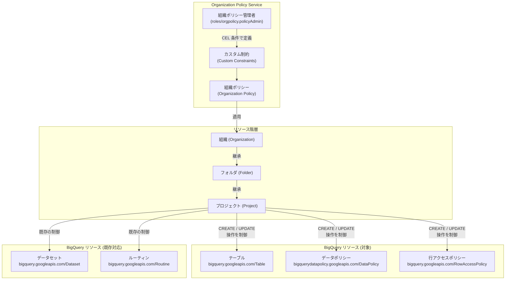

# BigQuery: テーブル、データポリシー、行アクセスポリシーに対するカスタム組織ポリシーのサポート

**リリース日**: 2026-04-06
**サービス**: BigQuery
**機能**: テーブル、データポリシー、行アクセスポリシーに対するカスタム組織ポリシーによる操作制御
**ステータス**: Preview

[このアップデートのインフォグラフィックを見る](https://takech9203.github.io/google-cloud-news-summary/20260406-bigquery-custom-organization-policy.html)

## 概要

BigQuery のカスタム組織ポリシー (Custom Organization Policy) の対象リソースが拡張され、新たにテーブル (Tables)、データポリシー (Data Policies)、行アクセスポリシー (Row Access Policies) に対して、特定の操作を許可または拒否するカスタム制約 (Custom Constraints) を定義できるようになった。この機能はプレビュー段階で提供されている。

従来、BigQuery のカスタム組織ポリシーはデータセットとルーティンのみを対象としていたが、今回のアップデートにより、組織のセキュリティおよびコンプライアンス要件に基づいて、テーブルの作成・更新操作やデータマスキングポリシー、行レベルセキュリティポリシーの操作をきめ細かく制御できるようになった。

このアップデートは、大規模な組織で BigQuery のガバナンスを担当するセキュリティ管理者、データガバナンスチーム、およびプラットフォームエンジニアを主な対象としている。組織全体で一貫したデータ保護ルールを強制することが可能になり、コンプライアンスの維持と運用管理の効率化が期待される。

**アップデート前の課題**

- カスタム組織ポリシーの対象はデータセット (`bigquery.googleapis.com/Dataset`) とルーティン (`bigquery.googleapis.com/Routine`) に限定されており、テーブルレベルの制御ができなかった
- データマスキングポリシーの作成・変更を組織ポリシーで一元的に制限する手段がなく、個別の IAM 設定に依存していた
- 行アクセスポリシーの操作を組織横断で統制する仕組みがなく、プロジェクトごとに異なる運用ルールが適用されるリスクがあった

**アップデート後の改善**

- `bigquery.googleapis.com/Table` リソースに対するカスタム制約を定義でき、テーブルの命名規則や暗号化設定などを組織レベルで強制できるようになった
- `bigquerydatapolicy.googleapis.com/DataPolicy` リソースに対する制約により、データマスキングポリシーの作成・変更を組織ポリシーで制御できるようになった
- `bigquery.googleapis.com/RowAccessPolicy` リソースに対する制約により、行アクセスポリシーの操作を組織全体で統制できるようになった

## アーキテクチャ図



この図は、組織ポリシー管理者がカスタム制約を CEL (Common Expression Language) 条件で定義し、組織・フォルダ・プロジェクトの階層を通じて BigQuery の各リソースへの操作を制御する流れを示している。今回のアップデートで新たにテーブル、データポリシー、行アクセスポリシーが制御対象に追加された。

## サービスアップデートの詳細

### 主要機能

1. **テーブルに対するカスタム制約**
   - `bigquery.googleapis.com/Table` リソースタイプに対してカスタム制約を定義可能
   - テーブルの作成・更新時に、テーブル名の命名規則、暗号化設定、有効期限などの条件を強制できる
   - CEL (Common Expression Language) を使用して柔軟な条件式を記述可能

2. **データポリシーに対するカスタム制約**
   - `bigquerydatapolicy.googleapis.com/DataPolicy` リソースタイプに対してカスタム制約を定義可能
   - データマスキングポリシーの作成・更新を組織レベルで制御し、特定のマスキングルールの使用を強制または制限できる
   - 列レベルセキュリティ (Column-Level Security) のガバナンスを強化

3. **行アクセスポリシーに対するカスタム制約**
   - `bigquery.googleapis.com/RowAccessPolicy` リソースタイプに対してカスタム制約を定義可能
   - 行レベルセキュリティポリシーの作成・変更を組織全体で統制できる
   - 行アクセスポリシーのフィルタ条件やグランティリストに関する制約を設定可能

## 技術仕様

### 対象リソースタイプ

| リソースタイプ | 説明 | 対応メソッド |
|------|------|------|
| `bigquery.googleapis.com/Table` | BigQuery テーブル | CREATE, UPDATE |
| `bigquerydatapolicy.googleapis.com/DataPolicy` | データマスキングポリシー | CREATE, UPDATE |
| `bigquery.googleapis.com/RowAccessPolicy` | 行アクセスポリシー | CREATE, UPDATE |
| `bigquery.googleapis.com/Dataset` (既存) | データセット | CREATE, UPDATE |
| `bigquery.googleapis.com/Routine` (既存) | ルーティン | CREATE |

### 必要な IAM ロール

| ロール | 用途 |
|------|------|
| `roles/orgpolicy.policyAdmin` | カスタム制約および組織ポリシーの作成・管理 |
| `roles/bigquery.admin` | BigQuery リソースの作成・管理 |

## 設定方法

### 前提条件

1. Google Cloud 組織 ID を把握していること
2. Organization Policy Administrator (`roles/orgpolicy.policyAdmin`) ロールが付与されていること
3. 対象のプロジェクトまたはフォルダに対する適切な権限があること

### 手順

#### ステップ 1: カスタム制約の YAML ファイルを作成

```yaml
name: organizations/ORGANIZATION_ID/customConstraints/custom.enforceTableEncryption
resourceTypes:
  - bigquery.googleapis.com/Table
methodTypes:
  - CREATE
  - UPDATE
condition: "has(resource.encryptionConfiguration.kmsKeyName)"
actionType: ALLOW
displayName: Enforce CMEK encryption on BigQuery tables
description: All BigQuery tables must use Customer-Managed Encryption Keys (CMEK).
```

`ORGANIZATION_ID` は実際の組織 ID に置き換える。この例では、すべての BigQuery テーブルに CMEK 暗号化を強制するカスタム制約を定義している。

#### ステップ 2: カスタム制約を適用

```bash
gcloud org-policies set-custom-constraint ~/constraint-enforce-table-encryption.yaml
```

#### ステップ 3: 組織ポリシーを作成して適用

```yaml
name: projects/PROJECT_ID/policies/custom.enforceTableEncryption
spec:
  rules:
    - enforce: true
```

```bash
gcloud org-policies set-policy ~/policy-enforce-table-encryption.yaml
```

ポリシー適用後、Google Cloud がポリシーを強制するまで最大 2 分かかる場合がある。

#### ステップ 4: ポリシーの動作を確認

```bash
gcloud org-policies list --project=PROJECT_ID
```

ポリシーが適用された状態で、CMEK を設定せずにテーブルを作成しようとすると、以下のようなエラーが返される。

```
Operation denied by custom org policies: ["customConstraints/custom.enforceTableEncryption": "All BigQuery tables must use Customer-Managed Encryption Keys (CMEK)."]
```

## メリット

### ビジネス面

- **コンプライアンスの一元管理**: 組織全体で統一されたデータ保護ポリシーを強制でき、規制要件 (GDPR、HIPAA など) への準拠を確保しやすくなる
- **ガバナンスの強化**: 個別プロジェクトに依存せず、組織レベルでテーブル、データマスキング、行アクセス制御のルールを統制できる

### 技術面

- **きめ細かい制御**: CEL 条件式により、リソースの特定フィールドに基づく柔軟な制約を定義できる
- **階層的なポリシー継承**: 組織・フォルダ・プロジェクトの階層を活用して、効率的にポリシーを展開できる
- **予防的なセキュリティ**: IAM による事後的なアクセス制御に加え、リソース作成時点でのポリシー違反を防止できる

## デメリット・制約事項

### 制限事項

- 本機能はプレビュー段階であり、「Pre-GA Offerings Terms」が適用される。限定的なサポートとなる可能性がある
- データセット以外のリソースに対するカスタム制約でアクセスが拒否された場合、PolicyViolationInfo が BigQuery 監査ログに記録されない (エラーメッセージに constraintId は含まれる)
- ポリシー適用後、強制が有効になるまで最大 2 分のラグがある

### 考慮すべき点

- カスタム制約の条件式 (CEL) の設計を誤ると、正当な操作がブロックされる可能性があるため、テスト環境での十分な検証が推奨される
- 既存のリソースには遡及的に適用されない。既存リソースの更新操作時にのみ制約が評価される
- 各リソースタイプでサポートされるフィールドは限定されている。制約に使用できるフィールドの詳細は公式ドキュメントを参照すること

## ユースケース

### ユースケース 1: テーブルの暗号化ポリシーの強制

**シナリオ**: 金融機関において、すべての BigQuery テーブルに Customer-Managed Encryption Keys (CMEK) の使用を義務付ける必要がある。

**実装例**:
```yaml
name: organizations/123456789/customConstraints/custom.enforceTableCMEK
resourceTypes:
  - bigquery.googleapis.com/Table
methodTypes:
  - CREATE
  - UPDATE
condition: "has(resource.encryptionConfiguration.kmsKeyName)"
actionType: ALLOW
displayName: Enforce CMEK on all tables
description: All BigQuery tables must be encrypted with CMEK.
```

**効果**: 組織内のすべてのプロジェクトで CMEK なしのテーブル作成・更新が自動的にブロックされ、暗号化ポリシーの遵守が保証される。

### ユースケース 2: データマスキングポリシーの標準化

**シナリオ**: 医療機関で、個人情報を含む列に対してデータマスキングポリシーの作成を許可する際、SHA-256 ハッシュまたは特定のカスタムマスキングルーティンのみを使用するよう統制したい。

**効果**: 不適切なマスキングルールの適用を組織レベルで防止し、患者データの保護に関する HIPAA 要件を満たすためのガバナンスが強化される。

### ユースケース 3: 行アクセスポリシーの統制

**シナリオ**: マルチテナント SaaS プロバイダーにおいて、各テナントのデータ分離を行アクセスポリシーで実現しているが、行アクセスポリシーの作成・変更を特定の条件下でのみ許可したい。

**効果**: テナント間のデータ漏洩リスクを低減し、行レベルセキュリティの一貫性を組織全体で確保できる。

## 関連サービス・機能

- **Organization Policy Service**: Google Cloud リソースに対する制約を一元管理するサービス。カスタム制約とマネージド制約の両方をサポート
- **BigQuery 列レベルセキュリティ (Column-Level Security)**: ポリシータグとデータポリシーを使用して、列単位でのアクセス制御やデータマスキングを実現する機能
- **BigQuery 行レベルセキュリティ (Row-Level Security)**: 行アクセスポリシーにより、テーブル内の特定の行へのアクセスを制御する機能
- **Cloud IAM**: BigQuery リソースへのアクセス権限を管理する基盤。カスタム組織ポリシーは IAM と補完的に機能する

## 参考リンク

- [インフォグラフィック](https://takech9203.github.io/google-cloud-news-summary/20260406-bigquery-custom-organization-policy.html)
- [公式リリースノート](https://docs.cloud.google.com/release-notes#April_06_2026)
- [BigQuery カスタム組織ポリシーのドキュメント](https://docs.cloud.google.com/bigquery/docs/custom-constraints)
- [Organization Policy Service の概要](https://docs.cloud.google.com/organization-policy/overview)
- [BigQuery 列レベルセキュリティ](https://docs.cloud.google.com/bigquery/docs/column-level-security)
- [BigQuery 行レベルセキュリティ](https://docs.cloud.google.com/bigquery/docs/row-level-security-intro)

## まとめ

BigQuery のカスタム組織ポリシーがテーブル、データポリシー、行アクセスポリシーに拡張されたことで、組織全体でのデータガバナンスが大幅に強化された。特に規制の厳しい業界において、暗号化、データマスキング、行レベルアクセス制御のルールを組織レベルで一元的に強制できるようになった点は大きな進歩である。プレビュー段階のため本番環境への適用前にテスト環境での検証を推奨するが、GA に向けて早期に評価を開始することが望ましい。

---

**タグ**: #BigQuery #OrganizationPolicy #Security #Governance #CustomConstraints #RowLevelSecurity #ColumnLevelSecurity #DataMasking #Preview
