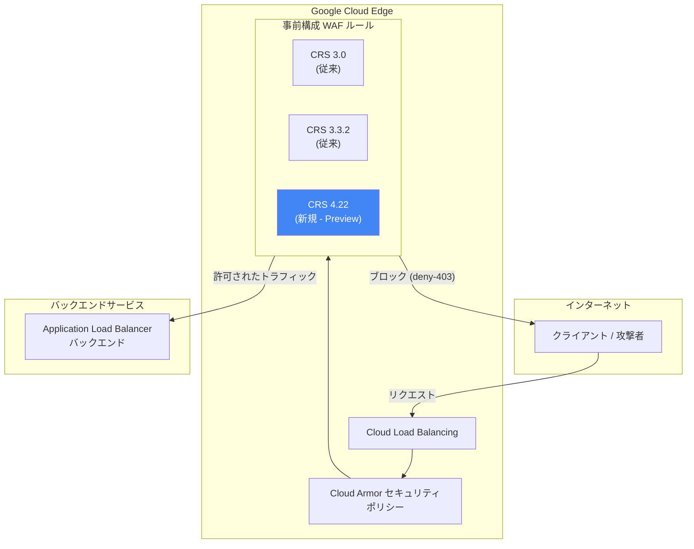

# Google Cloud Armor: 事前構成 WAF ルールが ModSecurity Core Rule Set (CRS) 4.22 に対応

**リリース日**: 2026-04-06

**サービス**: Google Cloud Armor

**機能**: 事前構成ルールが ModSecurity Core Rule Set (CRS) 4.22 をルールソースとしてサポート

**ステータス**: Preview

:bar_chart: [このアップデートのインフォグラフィックを見る](https://takech9203.github.io/google-cloud-news-summary/20260406-cloud-armor-modsecurity-crs-4-22.html)

## 概要

Google Cloud Armor の事前構成 WAF (Web Application Firewall) ルールが、ModSecurity Core Rule Set (CRS) 4.22 をルールソースとして新たにサポートしました。これまで Cloud Armor の事前構成ルールは OWASP CRS 3.3.2 および CRS 3.0 をベースとしていましたが、今回のアップデートにより最新の CRS 4.22 も選択可能になります。

CRS 4.x 系は CRS 3.x 系からの大幅なアーキテクチャ刷新を含んでおり、誤検知の低減、検出精度の向上、プラグインアーキテクチャの導入など多くの改善が盛り込まれています。Cloud Armor ユーザーは、より最新かつ精度の高い WAF ルールセットを利用して Web アプリケーションを保護できるようになります。

この機能は現在 Preview 段階であり、WAF によるアプリケーション保護を行っているセキュリティエンジニア、クラウドインフラ管理者、コンプライアンス担当者が主な対象ユーザーです。詳細は [Tuning Google Cloud Armor WAF rules](https://cloud.google.com/armor/docs/rule-tuning) を参照してください。

**アップデート前の課題**

- Cloud Armor の事前構成 WAF ルールは CRS 3.3.2 (および 3.0) のみをサポートしており、最新の攻撃パターンへの対応が限定的だった
- CRS 3.x 系では誤検知 (false positive) が発生しやすく、本番環境での WAF ルールのチューニングに多くの工数が必要だった
- CRS 3.x 系のモノリシックなルール構成では、必要なルールだけを選択的に適用する柔軟性が限られていた

**アップデート後の改善**

- CRS 4.22 の採用により、最新の攻撃ベクターや脆弱性パターンに対する検出カバレッジが向上した
- CRS 4.x 系の改善された検出ロジックにより、誤検知の低減が期待でき、チューニング工数が削減される
- より細かい粒度でのルール制御が可能になり、アプリケーション特性に応じた柔軟な WAF 設定が実現できる

## アーキテクチャ図



Cloud Armor のセキュリティポリシーがリクエストを評価する際、CRS 3.0、CRS 3.3.2 に加えて新たに CRS 4.22 ベースの事前構成ルールを選択できるようになりました。

## サービスアップデートの詳細

### 主要機能

1. **CRS 4.22 ベースの事前構成 WAF ルール**
   - ModSecurity Core Rule Set 4.22 をルールソースとした新しい事前構成ルールセットが利用可能
   - SQL インジェクション、XSS、RCE、LFI、RFI など主要な攻撃カテゴリをカバー
   - CRS 3.x 系と同様に stable / canary の 2 つのチャネルで提供される見込み

2. **CRS 4.x 系の改善点**
   - 誤検知の低減を重視した検出ロジックの再設計
   - プラグインアーキテクチャにより、ルールセットの拡張性が向上
   - 感度レベル (sensitivity) に基づくより精緻な制御が可能

3. **既存 CRS バージョンとの共存**
   - CRS 3.0 および CRS 3.3.2 ベースのルールは引き続きサポート
   - 段階的な移行が可能で、テスト環境で CRS 4.22 を評価しながら本番環境は CRS 3.3 を維持するといった運用が可能

## 技術仕様

### サポートされる CRS バージョン比較

| 項目 | CRS 3.0 | CRS 3.3.2 | CRS 4.22 (Preview) |
|------|---------|-----------|---------------------|
| ステータス | サポート継続 | 推奨 (従来) | Preview |
| 攻撃カテゴリ | OWASP Top 10 | OWASP Top 10 (拡張) | OWASP Top 10 (最新) |
| 感度レベル | 1-4 (ルールにより異なる) | 1-4 (ルールにより異なる) | 1-4 (ルールにより異なる) |
| ルールチャネル | stable / canary | stable / canary | stable / canary |

### 事前構成ルールの指定方法

```bash
# CRS 4.22 ベースのルールを使用する例 (推定)
gcloud compute security-policies rules create 1000 \
  --security-policy my-policy \
  --expression "evaluatePreconfiguredWaf('sqli-v422-stable', {'sensitivity': 1})" \
  --action deny-403
```

## 設定方法

### 前提条件

1. Google Cloud プロジェクトが有効であること
2. Cloud Armor セキュリティポリシーが作成済みであること
3. 外部アプリケーションロードバランサーまたは対応するロードバランサーが構成済みであること

### 手順

#### ステップ 1: セキュリティポリシーの作成 (未作成の場合)

```bash
gcloud compute security-policies create my-waf-policy \
  --description "WAF policy with CRS 4.22 rules"
```

セキュリティポリシーを新規作成します。既存のポリシーがある場合はこのステップをスキップしてください。

#### ステップ 2: CRS 4.22 ベースの WAF ルールを追加

```bash
# SQL インジェクション対策ルールの例
gcloud compute security-policies rules create 1000 \
  --security-policy my-waf-policy \
  --expression "evaluatePreconfiguredWaf('sqli-v422-stable', {'sensitivity': 1})" \
  --action deny-403

# XSS 対策ルールの例
gcloud compute security-policies rules create 2000 \
  --security-policy my-waf-policy \
  --expression "evaluatePreconfiguredWaf('xss-v422-stable', {'sensitivity': 1})" \
  --action deny-403
```

CRS 4.22 ベースのルールを感度レベル 1 で追加します。本番適用前にプレビューモードでテストすることを推奨します。

#### ステップ 3: セキュリティポリシーをバックエンドサービスにアタッチ

```bash
gcloud compute backend-services update my-backend-service \
  --security-policy my-waf-policy \
  --global
```

作成したセキュリティポリシーをバックエンドサービスに関連付けます。

## メリット

### ビジネス面

- **セキュリティ態勢の強化**: 最新の CRS 4.22 により、新しい攻撃パターンに対する防御が強化され、Web アプリケーションのセキュリティリスクが低減される
- **運用コストの削減**: 誤検知の低減により、WAF ルールのチューニングやアラート対応に費やす工数が削減される
- **コンプライアンス対応**: 最新のルールセットを採用することで、PCI DSS などのセキュリティ基準への準拠を維持しやすくなる

### 技術面

- **検出精度の向上**: CRS 4.x 系の改善されたパターンマッチングにより、攻撃検出の精度が向上する
- **柔軟な構成**: 感度レベルや個別シグネチャの opt-in/opt-out により、アプリケーション特性に合わせた細かい制御が可能
- **段階的移行**: CRS 3.x 系との共存が可能で、canary ルールを活用したリスクの低い移行戦略を採用できる

## デメリット・制約事項

### 制限事項

- 現在 Preview 段階であり、本番環境での利用には SLA が適用されない可能性がある
- CRS 4.22 固有のルール名やシグネチャ ID は CRS 3.x 系と異なるため、既存のチューニング設定 (除外設定など) の移行作業が必要になる
- XML ボディのパースは Cloud Armor の事前構成 WAF ルールではサポートされていない (CRS バージョンに関係なく)

### 考慮すべき点

- CRS 3.x 系から 4.x 系への移行時に、検出挙動が変わる可能性があるため、まずプレビューモードでの評価が推奨される
- Preview 機能であるため、GA までにルール名や設定方法が変更される可能性がある
- リクエストボディの検査には設定された検査上限が適用されるため、大きなリクエストボディを持つアプリケーションでは追加の対策を検討する必要がある

## ユースケース

### ユースケース 1: E コマースサイトの WAF ルール最新化

**シナリオ**: 大規模な E コマースサイトで Cloud Armor を使用して WAF 保護を行っている。CRS 3.3.2 ベースのルールで多くの誤検知が発生しており、チューニング工数が課題となっている。

**実装例**:
```bash
# テスト環境で CRS 4.22 ルールをプレビューモードで適用
gcloud compute security-policies rules create 1000 \
  --security-policy test-policy \
  --expression "evaluatePreconfiguredWaf('sqli-v422-stable', {'sensitivity': 2})" \
  --action deny-403 \
  --preview
```

**効果**: CRS 4.22 の改善された検出ロジックにより誤検知が低減され、正規ユーザーのトランザクションがブロックされるリスクが減少する。チューニングに費やす運用工数も削減される。

### ユースケース 2: 金融サービスのコンプライアンス要件対応

**シナリオ**: 金融サービスを提供する企業で、PCI DSS 準拠のために最新の WAF ルールセットの採用が求められている。

**効果**: CRS 4.22 は最新の攻撃パターンに対応しており、監査時に最新のセキュリティ標準に基づいた WAF 保護を実施していることを示すことができる。

## 料金

Cloud Armor の料金は、利用するティアにより異なります。

| ティア | 料金体系 |
|--------|----------|
| Cloud Armor Standard | ポリシーごと、ルールごと、リクエストごとの従量課金 |
| Cloud Armor Enterprise Paygo | 月額 $200/プロジェクト + $200/保護リソース (最初の 2 リソース以降) |
| Cloud Armor Enterprise Annual | 月額 $3,000/請求アカウント + $30/保護リソース (最初の 100 リソース以降) |

CRS 4.22 ベースの事前構成ルールの利用による追加料金は、公式ドキュメントでは明記されていません。既存の Cloud Armor WAF ルールと同様の料金体系が適用されると想定されます。詳細は [Cloud Armor 料金ページ](https://cloud.google.com/armor/pricing) を確認してください。

## 関連サービス・機能

- **Cloud Load Balancing**: Cloud Armor セキュリティポリシーのアタッチ先となるロードバランサー。外部アプリケーションロードバランサー、外部プロキシネットワークロードバランサーなどで利用可能
- **Cloud Logging**: verbose logging を有効にすることで、WAF ルールがトリガーされた際の詳細なリクエスト情報を Cloud Logging に記録可能
- **Adaptive Protection**: Cloud Armor Enterprise で利用可能な機能で、機械学習ベースの異常検知により Layer 7 攻撃を検出。CRS 4.22 と組み合わせてより包括的な保護を実現
- **Google Threat Intelligence**: Cloud Armor Enterprise で利用可能な脅威インテリジェンスフィード。事前構成 WAF ルールと併用してより高度な脅威防御が可能

## 参考リンク

- :bar_chart: [インフォグラフィック](https://takech9203.github.io/google-cloud-news-summary/20260406-cloud-armor-modsecurity-crs-4-22.html)
- [公式リリースノート](https://docs.cloud.google.com/release-notes#April_06_2026)
- [Cloud Armor WAF ルール一覧](https://cloud.google.com/armor/docs/waf-rules)
- [Cloud Armor WAF ルールのチューニング](https://cloud.google.com/armor/docs/rule-tuning)
- [Cloud Armor セキュリティポリシーの概要](https://cloud.google.com/armor/docs/security-policy-overview)
- [Cloud Armor ベストプラクティス](https://cloud.google.com/armor/docs/best-practices)
- [料金ページ](https://cloud.google.com/armor/pricing)

## まとめ

Google Cloud Armor の事前構成 WAF ルールが ModSecurity CRS 4.22 をサポートしたことで、ユーザーは最新かつより精度の高い WAF ルールセットを利用して Web アプリケーションを保護できるようになりました。現在 Preview 段階のため、まずはテスト環境やプレビューモードで CRS 4.22 ベースのルールを評価し、既存の CRS 3.x 系ルールからの移行計画を策定することを推奨します。特に誤検知の低減効果を確認し、アプリケーション特性に合わせたチューニングを行うことで、GA 後のスムーズな本番適用が可能になります。

---

**タグ**: #GoogleCloudArmor #WAF #ModSecurity #CRS #WebSecurity #OWASP #Preview #CloudSecurity
