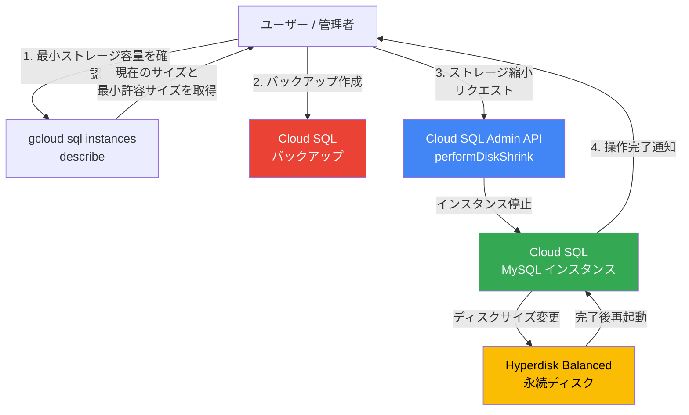

# Cloud SQL for MySQL: Storage Shrink (ストレージ縮小)

**リリース日**: 2026-04-06

**サービス**: Cloud SQL for MySQL

**機能**: Storage Shrink (ストレージ縮小)

**ステータス**: Feature

[このアップデートのインフォグラフィックを見る](https://takech9203.github.io/google-cloud-news-summary/20260406-cloud-sql-mysql-storage-shrink.html)

## 概要

Cloud SQL for MySQL において、インスタンスのストレージ容量を手動で縮小 (shrink) できる機能が利用可能になりました。アプリケーションの要件に対してプロビジョニングされたストレージ容量が過剰な場合、より小さいサイズへストレージを削減することで、不要なストレージコストを削減できます。

この機能はプライマリインスタンスおよびリードレプリカの両方で利用可能であり、すべての Cloud SQL エディション (Enterprise / Enterprise Plus) でサポートされています。ストレージ縮小操作にはインスタンスのダウンタイムが伴うため、ダウンタイムを最小限に抑えたい場合は Database Migration Service を使用して新しい小さいインスタンスへデータを移行する方法が推奨されます。

**アップデート前の課題**

- Cloud SQL インスタンスのストレージ容量は増加のみ可能で、一度拡張すると縮小できなかった
- 過剰にプロビジョニングされたストレージに対して不要なコストが継続的に発生していた
- ストレージを削減するには新しいインスタンスを作成してデータを移行する必要があり、手間と時間がかかっていた

**アップデート後の改善**

- gcloud CLI や REST API を使用してインスタンスのストレージ容量を直接縮小できるようになった
- 不要なストレージコストを削減し、リソースの最適化が可能になった
- プライマリインスタンスとリードレプリカの両方でストレージ縮小がサポートされている

## アーキテクチャ図



ストレージ縮小操作の全体フローを示しています。ユーザーは最小許容サイズを確認した上でバックアップを作成し、縮小リクエストを実行します。操作中はインスタンスが停止し、ディスクサイズが変更された後に再起動されます。

## サービスアップデートの詳細

### 主要機能

1. **ストレージ容量の手動縮小**
   - プロビジョニングされたストレージ容量を指定したターゲットサイズまで縮小可能
   - ターゲットサイズはインスタンスに対して安全と判断される最小許容容量より大きい必要がある
   - パフォーマンスの一貫性のため、現在の使用量の 20% または 100 GB のいずれか大きい方をバッファとして確保することを推奨

2. **プライマリおよびリードレプリカのサポート**
   - プライマリインスタンスとリードレプリカの両方でストレージ縮小が可能
   - リードレプリカを縮小する場合は、先にプライマリインスタンスの縮小を完了する必要がある
   - リードレプリカはプライマリインスタンスより小さいストレージ容量を持つことはできない

3. **操作のキャンセル機能**
   - プライマリインスタンスまたはスタンドアロンインスタンスでは縮小操作のキャンセルが可能
   - `gcloud sql operations cancel` コマンドまたは REST API でキャンセルを実行

## 技術仕様

### 要件と制限事項

| 項目 | 詳細 |
|------|------|
| 対応エディション | Cloud SQL Enterprise / Enterprise Plus |
| 対応インスタンスタイプ | プライマリ、リードレプリカ (共有コアインスタンスは非対応) |
| gcloud CLI バージョン | 563.0.0 以降 |
| 操作タイムアウト | 10 日間 (超過した場合は CPU アップグレードで対処) |
| ダウンタイム | あり (リードレプリカの復元と同程度) |
| Terraform サポート | 非対応 |

### 必要な IAM 権限

| 権限 | 説明 |
|------|------|
| `cloudsql.instances.getDiskShrinkConfig` | ストレージ縮小の設定情報を取得 |
| `cloudsql.instances.performDiskShrink` | ストレージ縮小操作を実行 |

これらの権限は以下のロールに含まれています:

- `roles/cloudsql.admin` (Cloud SQL Admin)
- `roles/cloudsql.editor` (Cloud SQL Editor)

## 設定方法

### 前提条件

1. gcloud CLI バージョン 563.0.0 以降がインストールされていること
2. 対象インスタンスが `RUNNABLE` 状態であること
3. 必要な IAM 権限が付与されていること
4. 外部接続を使用する拡張機能やフィーチャーが無効化されていること

### 手順

#### ステップ 1: インスタンスの状態を確認

```bash
gcloud sql instances describe INSTANCE_NAME
```

インスタンスのステータスが `RUNNABLE` であることを確認します。

#### ステップ 2: バックアップを作成

```bash
gcloud sql backups create --instance=INSTANCE_NAME
```

問題発生時にリストアできるよう、操作前に必ずオンデマンドバックアップを作成します。

#### ステップ 3: 最小許容ストレージ容量を確認

```bash
gcloud sql instances describe INSTANCE_NAME --format="value(diskShrinkContext)"
```

縮小可能な最小サイズを確認し、ターゲットサイズを決定します。

#### ステップ 4: ストレージ縮小を実行

```bash
gcloud sql instances perform-storage-shrink INSTANCE_NAME \
  --storage-size=TARGET_STORAGE_SIZE \
  --async
```

`TARGET_STORAGE_SIZE` にはターゲットのストレージ容量 (GB) を指定します。`--async` フラグを使用して非同期で実行することを推奨します。

#### ステップ 5 (REST API の場合): API で実行

```bash
curl -X POST \
  -H "Authorization: Bearer $(gcloud auth print-access-token)" \
  -H "Content-Type: application/json; charset=utf-8" \
  -d '{"targetSizeGb": TARGET_STORAGE_SIZE}' \
  "https://sqladmin.googleapis.com/v1/projects/PROJECT_ID/instances/INSTANCE_ID/performDiskShrink"
```

## メリット

### ビジネス面

- **ストレージコストの最適化**: 過剰にプロビジョニングされたストレージを削減することで、月額のストレージ費用を直接削減できる
- **リソース管理の柔軟性向上**: ビジネス要件の変化に応じてストレージ容量を増減できるようになり、インフラストラクチャの柔軟な管理が可能になった

### 技術面

- **シンプルな操作**: gcloud CLI や REST API を使用した直感的なコマンドでストレージ縮小を実行可能
- **安全性の確保**: 最小許容容量のチェック機能により、データ損失のリスクを最小化
- **操作のキャンセル対応**: プライマリインスタンスでは実行中の縮小操作をキャンセル可能

## デメリット・制約事項

### 制限事項

- 共有コアインスタンスではストレージ縮小操作は非サポート
- MySQL のレガシー高可用性構成では利用不可
- 外部サーバーからのレプリケーション構成では非サポート
- カスケードレプリカへのストレージ縮小操作は適用不可
- リードプールへのストレージ縮小操作は適用不可
- Terraform でのサポートなし

### 考慮すべき点

- ストレージ縮小操作中はインスタンスにダウンタイムが発生する (ディスクサイズに依存して相当な時間になる可能性がある)
- 操作中は他のすべての操作 (バックアップ、インポートなど) が利用不可になる
- 操作が 10 日を超えるとタイムアウトする場合がある (CPU アップグレードで所要時間を短縮可能)
- リードレプリカの最小ストレージ容量を直接確認する手段がなく、プライマリインスタンスの容量に合わせる必要がある
- ダウンタイムを許容できない場合は Database Migration Service による移行を検討する必要がある

## ユースケース

### ユースケース 1: 開発/テスト環境のコスト最適化

**シナリオ**: 本番環境と同じ構成で作成された開発環境のインスタンスが 500 GB のストレージを持つが、実際のデータ使用量は 50 GB 程度である。

**実装例**:
```bash
# 最小許容サイズを確認
gcloud sql instances describe dev-mysql-instance

# ストレージを 100 GB に縮小 (50 GB の使用量 + バッファ)
gcloud sql instances perform-storage-shrink dev-mysql-instance \
  --storage-size=100 \
  --async
```

**効果**: 月額ストレージコストを最大 80% 削減しつつ、十分なバッファを確保できる。

### ユースケース 2: データクリーンアップ後のストレージ最適化

**シナリオ**: 大量の履歴データを削除またはアーカイブした後、実際のデータ使用量に対してプロビジョニングされたストレージが大幅に過剰になっている。

**効果**: データクリーンアップの効果をストレージコストの削減として直接反映でき、継続的なコスト最適化が実現する。

## 料金

Cloud SQL のストレージ料金はプロビジョニングされた容量 (GiB/月) に基づいて課金されます。ストレージ縮小操作自体に追加料金は発生しませんが、縮小後は新しい (小さい) ストレージ容量に基づいた料金が適用されます。

詳細な料金は [Cloud SQL 料金ページ](https://cloud.google.com/sql/pricing) を参照してください。ストレージ料金はリージョンやエディションにより異なります。

## 利用可能リージョン

すべての Cloud SQL エディション (Enterprise / Enterprise Plus) で利用可能です。Cloud SQL が利用可能なすべてのリージョンでサポートされています。

## 関連サービス・機能

- **[Database Migration Service](https://cloud.google.com/database-migration/docs)**: ダウンタイムを最小限に抑えたい場合の代替手段として、新しい小さいインスタンスへのデータ移行に利用
- **[Cloud SQL ストレージオプション](https://cloud.google.com/sql/docs/mysql/storage-options-overview)**: Hyperdisk Balanced によるストレージ性能の詳細
- **[Cloud SQL 自動ストレージ増加](https://cloud.google.com/sql/docs/mysql/instance-settings#automatic-storage-increase-2ndgen)**: ストレージの自動増加設定 (縮小とは逆の機能)
- **[Cloud SQL バックアップとリストア](https://cloud.google.com/sql/docs/mysql/backup-recovery/backing-up)**: 縮小操作前の必須バックアップ作成

## 参考リンク

- [インフォグラフィック](https://takech9203.github.io/google-cloud-news-summary/20260406-cloud-sql-mysql-storage-shrink.html)
- [公式リリースノート](https://docs.cloud.google.com/release-notes#April_06_2026)
- [About storage shrink (ドキュメント)](https://docs.cloud.google.com/sql/docs/mysql/about-storage-shrink)
- [Shrink instance storage capacity (手順)](https://docs.cloud.google.com/sql/docs/mysql/shrink-instance-storage-capacity)
- [料金ページ](https://cloud.google.com/sql/pricing)

## まとめ

Cloud SQL for MySQL のストレージ縮小機能は、過剰にプロビジョニングされたストレージ容量を削減し、コスト最適化を実現する重要なアップデートです。特に開発・テスト環境やデータクリーンアップ後のインスタンスにおいて大きな効果が期待できます。ダウンタイムが発生する点に留意し、メンテナンスウィンドウでの実行を計画するか、ダウンタイムを許容できない場合は Database Migration Service の利用を検討してください。

---

**タグ**: #CloudSQL #MySQL #StorageShrink #ストレージ縮小 #コスト最適化 #データベース
