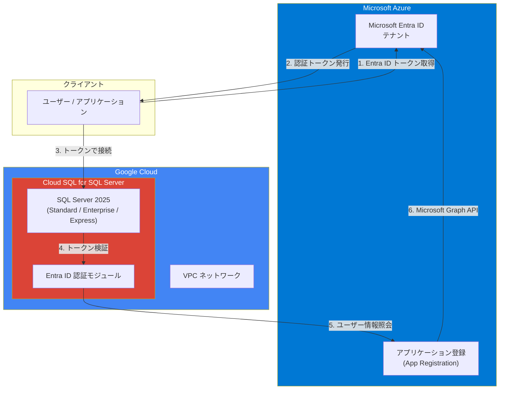

# Cloud SQL for SQL Server: SQL Server 2025 サポート開始と Microsoft Entra ID 統合の一般提供

**リリース日**: 2026-04-06

**サービス**: Cloud SQL for SQL Server

**機能**: SQL Server 2025 データベースバージョンのサポートと Microsoft Entra ID 統合の一般提供 (GA)

**ステータス**: GA

📊 [このアップデートのインフォグラフィックを見る](https://takech9203.github.io/google-cloud-news-summary/20260406-cloud-sql-sql-server-2025-entra-id.html)

## 概要

Cloud SQL for SQL Server に 2 つの重要なアップデートが一般提供 (GA) として発表されました。1 つ目は SQL Server 2025 のサポート開始で、Standard、Enterprise、Express の 3 つのエディションが利用可能になりました。2 つ目は Microsoft Entra ID との統合機能の GA で、既存の Microsoft Entra ID テナントを使用したデータベースへの一元的な ID およびアクセス管理が可能になります。

SQL Server 2025 は Microsoft が提供する最新のデータベースエンジンバージョンであり、Cloud SQL でのサポート開始により、最新のデータベース機能とセキュリティパッチをマネージド環境で利用できるようになります。また、Microsoft Entra ID 統合により、企業が既に利用している ID 基盤をそのままデータベース認証に活用でき、セキュリティとユーザー管理の両面で大きな改善をもたらします。

これらのアップデートは、エンタープライズ環境で SQL Server ワークロードを Google Cloud 上で運用するすべての組織にとって特に重要です。

**アップデート前の課題**

- Cloud SQL for SQL Server で利用可能な最新バージョンは SQL Server 2022 までであり、SQL Server 2025 の新機能を活用できなかった
- Microsoft Entra ID 統合はプレビュー段階であり、本番環境での利用には SLA の保証がなかった
- SQL Server 固有のログインとパスワードを個別に管理する必要があり、既存の ID 基盤との統合が限定的だった

**アップデート後の改善**

- SQL Server 2025 (Standard / Enterprise / Express) が GA としてサポートされ、最新のデータベース機能を本番環境で利用可能になった
- Microsoft Entra ID 統合が GA となり、SLA の保証を受けながら一元的な認証・認可を実現できるようになった
- 多要素認証 (MFA) や条件付きアクセス (CA) などの既存の Entra ID セキュリティポリシーをデータベースレベルで適用可能になった

## アーキテクチャ図



この図は、Microsoft Entra ID を使用した Cloud SQL for SQL Server 2025 への認証フローを示しています。ユーザーは Entra ID からトークンを取得し、そのトークンを使用して Cloud SQL インスタンスに接続します。Cloud SQL はアプリケーション登録を通じて Entra ID テナントと通信し、トークンの検証とユーザー情報の照会を行います。

## サービスアップデートの詳細

### 主要機能

1. **SQL Server 2025 データベースバージョンのサポート**
   - SQL Server 2025 Standard: 標準的なワークロード向けのエディション
   - SQL Server 2025 Enterprise: 高可用性やパフォーマンスを重視するエンタープライズワークロード向け
   - SQL Server 2025 Express: 開発・テスト用途や小規模ワークロード向けの軽量エディション
   - Cloud SQL Enterprise Plus edition および Cloud SQL Enterprise edition の両方で利用可能

2. **Microsoft Entra ID 統合 (GA)**
   - 一元的な認証: 既存の Microsoft Entra ID の ID 情報を使用して Cloud SQL for SQL Server インスタンスにサインイン可能
   - セキュリティ強化: 多要素認証 (MFA) や条件付きアクセス (CA) ルールをデータベースレベルで適用
   - ユーザー管理の簡素化: Entra ID アカウントの無効化や削除時にデータベースアクセスが自動的に取り消される

3. **T-SQL による Entra ID ログイン管理**
   - `CREATE LOGIN [...] FROM EXTERNAL PROVIDER` 構文で Entra ID ユーザーのログインを作成可能
   - SQL Server Management Studio (SSMS) などの既存ツールとの互換性を確保
   - `ALTER ANY LOGIN` 権限を付与することで、管理者が他の Entra ID ログインを管理可能

## 技術仕様

### サポートされるデータベースバージョン

| エディション | Cloud SQL Enterprise Plus | Cloud SQL Enterprise |
|------|------|------|
| SQL Server 2025 Standard | - | 対応 |
| SQL Server 2025 Enterprise | 対応 | 対応 |
| SQL Server 2025 Express | - | 対応 |

### Microsoft Entra ID 統合の前提条件

| 項目 | 詳細 |
|------|------|
| 対応 SQL Server バージョン | SQL Server 2022 以降 (SQL Server 2025 含む) |
| gcloud バージョン | v549.0.0 以降 |
| 必要な Azure 権限 | Microsoft Graph API: Directory.Read.All または Application.Read.All + Group.Read.All + User.Read.All |
| テナント管理者の同意 | 必須 |

## 設定方法

### 前提条件

1. Google Cloud プロジェクトの作成と Cloud SQL Admin API の有効化
2. Microsoft Azure ポータルで Entra ID テナント ID の確認
3. Azure ポータルでアプリケーション登録の作成と API 権限の付与

### 手順

#### ステップ 1: SQL Server 2025 インスタンスの作成

```bash
gcloud sql instances create my-sql2025-instance \
  --database-version=SQLSERVER_2025_STANDARD \
  --tier=db-custom-2-3840 \
  --region=us-central1 \
  --assign-ip \
  --root-password=YOUR_SECURE_PASSWORD
```

SQL Server 2025 Standard エディションのインスタンスを作成します。`--database-version` には `SQLSERVER_2025_STANDARD`、`SQLSERVER_2025_ENTERPRISE`、`SQLSERVER_2025_EXPRESS` のいずれかを指定します。

#### ステップ 2: Microsoft Entra ID 認証の有効化

```bash
gcloud sql instances patch my-sql2025-instance \
  --entra-id-tenant-id=YOUR_TENANT_ID \
  --entra-id-application-id=YOUR_APPLICATION_ID
```

既存のインスタンスに対して Entra ID 認証を有効化します。この操作によりインスタンスが再起動されます。

#### ステップ 3: Entra ID ログインの作成

```sql
-- 初回ログインの作成 (sqlcmd または SSMS で実行)
CREATE LOGIN [entra_user@yourdomain.com] FROM EXTERNAL PROVIDER

-- 追加ログインを管理するための権限付与
GRANT ALTER ANY LOGIN TO [entra_user@yourdomain.com] AS CustomerDbRootRole
```

Entra ID ユーザーのログインを T-SQL コマンドで作成します。

## メリット

### ビジネス面

- **最新プラットフォームの活用**: SQL Server 2025 の新機能により、データ分析やアプリケーション開発の生産性が向上
- **コンプライアンス対応の強化**: Entra ID 統合により、既存の企業セキュリティポリシーをデータベースレベルまで一貫して適用可能
- **運用コストの削減**: ID 管理の一元化により、ユーザーのオンボーディング・オフボーディングにかかる管理工数を削減

### 技術面

- **セキュリティの向上**: パスワードレス認証、MFA、条件付きアクセスをデータベース層で活用可能
- **マネージドサービスの利点**: パッチ適用やマイナーバージョンアップが自動で実施され、運用負荷を軽減
- **柔軟なマシン構成**: Enterprise Plus および Enterprise の両エディションで利用でき、ワークロードに応じた最適な構成を選択可能

## デメリット・制約事項

### 制限事項

- Microsoft Entra ID 認証は SQL Server 2022 以降のバージョンでのみ利用可能 (SQL Server 2017 および 2019 は非対応)
- Entra ID 設定の変更 (有効化・変更・無効化) 時にインスタンスの再起動が発生する
- プライベート IP のみのインスタンスでは、Entra ID エンドポイント (login.microsoftonline.com、graph.microsoft.com) への外部接続が必要であり、Cloud NAT などのネットワーク構成が必要

### 考慮すべき点

- インスタンスごとに固有の Microsoft Entra ID アプリケーション登録を作成することが推奨される (セキュリティ分離のため)
- SQL Server 2025 の各エディションでのマシンタイプの制限や利用可能なリージョンは公式ドキュメントで確認が必要
- 既存の SQL Server 2022 インスタンスから SQL Server 2025 へのメジャーバージョンアップグレードの手順は別途確認が必要

## ユースケース

### ユースケース 1: エンタープライズ環境でのハイブリッド ID 管理

**シナリオ**: 大規模企業が既に Microsoft Entra ID を全社的な ID 基盤として利用しており、Google Cloud 上の SQL Server データベースにも同じ ID 基盤でアクセスを管理したい。

**実装例**:
```bash
# Entra ID 対応の SQL Server 2025 Enterprise インスタンスを作成
gcloud sql instances create production-db \
  --database-version=SQLSERVER_2025_ENTERPRISE \
  --tier=db-custom-8-32768 \
  --region=us-central1 \
  --network=projects/my-project/global/networks/my-vpc \
  --root-password=SECURE_PASSWORD \
  --entra-id-tenant-id=7e281aab-e994-4c83-88ed-d1674477a39c \
  --entra-id-application-id=4c5ed2da-0478-4aaa-ab65-6dfd33ba8bfd
```

**効果**: 社員の入退社や異動時に Entra ID 側の変更がデータベースアクセスに自動的に反映され、管理工数の削減とセキュリティリスクの低減を実現。

### ユースケース 2: 最新 SQL Server 機能を活用した開発環境

**シナリオ**: 開発チームが SQL Server 2025 の新機能を検証するためのマネージド開発環境を迅速に構築したい。

**効果**: Cloud SQL のマネージドサービスを活用することで、インフラ構築の手間なく SQL Server 2025 の新機能を即座に評価・検証可能。Express エディションを使用することでコストを抑えた開発環境を構築できる。

## 料金

Cloud SQL for SQL Server の料金は、選択するマシンタイプ (vCPU 数、メモリ量)、ストレージ容量、リージョン、ネットワークトラフィックなどに基づいて計算されます。SQL Server 2025 の料金体系は、既存の SQL Server バージョンと同様の構造に従います。

詳細な料金は [Cloud SQL 料金ページ](https://cloud.google.com/sql/pricing) または [料金計算ツール](https://cloud.google.com/products/calculator) で確認してください。

## 関連サービス・機能

- **Cloud SQL Auth Proxy**: Cloud SQL インスタンスへのセキュアな接続を提供するプロキシツール
- **Private Service Connect**: VPC ネットワーク経由でのプライベート接続を実現
- **Cloud SQL Enterprise Plus edition**: 高可用性 (99.99% SLA)、データキャッシュ、AI 支援トラブルシューティングなどの追加機能を提供
- **Microsoft Entra ID**: マルチクラウド環境での統一的な ID・アクセス管理を実現する Microsoft のクラウド ID サービス

## 参考リンク

- 📊 [インフォグラフィック](https://takech9203.github.io/google-cloud-news-summary/20260406-cloud-sql-sql-server-2025-entra-id.html)
- [公式リリースノート](https://docs.cloud.google.com/release-notes#April_06_2026)
- [Cloud SQL for SQL Server ドキュメント: データベースバージョン](https://cloud.google.com/sql/docs/sqlserver/db-versions)
- [Cloud SQL for SQL Server ドキュメント: マシンシリーズの選択](https://cloud.google.com/sql/docs/sqlserver/create-instance)
- [Cloud SQL for SQL Server ドキュメント: Microsoft Entra ID 統合](https://cloud.google.com/sql/docs/sqlserver/integration-with-microsoft-entra-id)
- [Cloud SQL 料金ページ](https://cloud.google.com/sql/pricing)

## まとめ

今回のアップデートにより、Cloud SQL for SQL Server は最新の SQL Server 2025 エンジンをサポートし、Microsoft Entra ID との統合も GA となりました。これにより、エンタープライズ環境における最新のデータベース機能の活用と、既存の ID 基盤を活用したセキュアなアクセス管理が Google Cloud 上で実現できます。SQL Server ワークロードを Google Cloud で運用している組織は、新規インスタンスでの SQL Server 2025 の採用と、既存インスタンスでの Entra ID 認証の有効化を検討することを推奨します。

---

**タグ**: #CloudSQL #SQLServer #SQLServer2025 #MicrosoftEntraID #IAM #データベース #セキュリティ #GA
