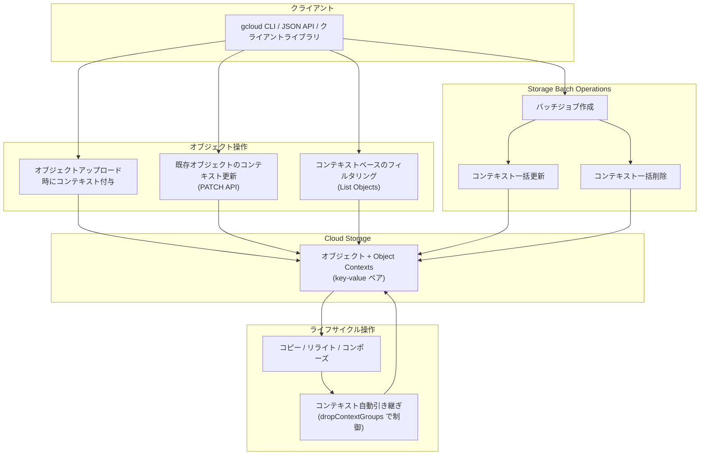

# Cloud Storage: Object Contexts が一般提供 (GA) に

**リリース日**: 2026-04-06

**サービス**: Cloud Storage

**機能**: Object Contexts の一般提供、Storage Batch Operations によるコンテキスト一括更新

**ステータス**: GA (一般提供)

:bar_chart: [このアップデートのインフォグラフィックを見る](https://takech9203.github.io/google-cloud-news-summary/20260406-cloud-storage-object-contexts-ga.html)

## 概要

Google Cloud Storage の Object Contexts 機能が一般提供 (GA) となりました。Object Contexts は、Cloud Storage オブジェクトにカスタムのキーバリューペアを付与し、データの分類、追跡、検索を効率化する機能です。これまでプレビュー版として提供されていましたが、今回のアップデートにより本番環境での利用が正式にサポートされます。

さらに、Storage Batch Operations を使用して複数オブジェクトのコンテキストを一括で更新できるようになりました。既存のコンテキストの全削除、特定キーの削除、新しいキーバリューペアの追加・更新を単一のバッチジョブで実行できます。

この機能は、大量のオブジェクトを管理するデータエンジニア、コンプライアンス担当者、ML エンジニアなど、Cloud Storage 上のデータに対してメタデータベースの管理・検索を必要とするユーザーに特に有用です。

**アップデート前の課題**

- オブジェクトに付与できるメタデータはカスタムメタデータに限られ、構造化されたコンテキスト情報の管理が困難だった
- オブジェクトのリスト表示時にメタデータベースのフィルタリングが容易ではなく、データ検索に時間がかかっていた
- 複数オブジェクトのメタデータを一括で更新するには独自のスクリプトやワークフローを構築する必要があった
- コピー・リライト・コンポーズ操作時にカスタムメタデータの引き継ぎを手動で管理する必要があった

**アップデート後の改善**

- Object Contexts により、構造化されたキーバリューペアをオブジェクトに付与でき、IAM によるアクセス制御も可能になった
- コンテキストベースのフィルタリングにより、オブジェクトリスト取得時に特定のコンテキストを持つオブジェクトのみを効率的に取得できるようになった
- Storage Batch Operations との統合により、数百万件のオブジェクトに対するコンテキストの一括更新がサーバーレスで実行可能になった
- コピー、リライト、コンポーズ、移動、リストア操作時にコンテキストがデフォルトで自動的に引き継がれるようになった

## アーキテクチャ図



このフローチャートは、Object Contexts の主要な操作フローを示しています。クライアントからの個別操作とバッチ操作の両方のパスがあり、ライフサイクル操作時にはコンテキストが自動的に引き継がれます。

## サービスアップデートの詳細

### 主要機能

1. **Object Contexts (一般提供)**
   - オブジェクトにカスタムのキーバリューペアを付与し、データの分類・追跡・検索を実現
   - コンテキストはオブジェクトの作成時に付与、または既存オブジェクトに後から追加が可能
   - コピー、リライト、コンポーズ、移動、リストア操作時にコンテキストがデフォルトで保持される
   - `dropContextGroups` JSON API パラメータを使用してコンテキストの引き継ぎ動作を制御可能

2. **コンテキストベースのオブジェクトフィルタリング**
   - オブジェクトリスト取得時に、特定のコンテキストキーや値でフィルタリングが可能
   - `contexts."KEY":*` 構文で特定キーを持つオブジェクトを検索
   - `contexts."KEY"="VALUE"` 構文で特定のキーと値の組み合わせで検索
   - `NOT` 演算子を使用した否定フィルタリングにも対応

3. **Storage Batch Operations によるコンテキスト一括更新**
   - 単一のバッチジョブで複数オブジェクトのコンテキストを更新
   - 全コンテキストのクリア (`--clear-all-object-custom-contexts`)
   - 特定キーのコンテキスト削除 (`--clear-object-custom-contexts`)
   - 新しいコンテキストの挿入・更新 (`--update-object-custom-contexts`)
   - マニフェストファイルまたはプレフィックス指定による対象オブジェクト選択
   - ドライラン機能による事前確認が可能

## 技術仕様

### IAM パーミッション

Object Contexts の操作には以下の IAM パーミッションが必要です。

| パーミッション | 説明 | 含まれるロール |
|------|------|------|
| `storage.objects.createContext` | オブジェクトにコンテキストを付与 | Storage Object Admin, Storage Object User, Storage Object Creator, Storage Legacy Bucket Writer |
| `storage.objects.updateContext` | オブジェクトのコンテキストを更新 | Storage Object Admin, Storage Object User, Storage Legacy Object Owner |
| `storage.objects.deleteContext` | オブジェクトのコンテキストを削除 | Storage Object Admin, Storage Object User, Storage Legacy Object Owner |

### コンテキストデータ構造

```json
{
  "contexts": {
    "custom": {
      "customer_id": {
        "value": "cust-78901"
      },
      "payment_status": {
        "value": "unpaid"
      }
    }
  }
}
```

コンテキストの値は現在、文字列形式のみをサポートしています。

### フィルタリング構文

| 構文 | 説明 |
|------|------|
| `contexts."KEY":*` | 指定キーを持つオブジェクトに一致 |
| `contexts."KEY"="VALUE"` | 指定キーと値の組み合わせに一致 |
| `NOT contexts."KEY":*` | 指定キーを持たないオブジェクトに一致 |
| `NOT contexts."KEY"="VALUE"` | 指定キーと値の組み合わせを持たないオブジェクトに一致 |

## 設定方法

### 前提条件

1. Google Cloud プロジェクトが作成済みであること
2. Cloud Storage API が有効化されていること
3. 適切な IAM ロール (Storage Object Admin 等) が付与されていること
4. gcloud CLI がインストール・初期化済みであること

### 手順

#### ステップ 1: オブジェクトアップロード時にコンテキストを付与

```bash
gcloud storage cp ./invoice.pdf gs://my-bucket/ \
  --custom-contexts=customer_id=cust-78901,payment_status=unpaid
```

アップロード時に `--custom-contexts` フラグを使用して、キーバリューペアをカンマ区切りで指定します。

#### ステップ 2: 既存オブジェクトのコンテキストを更新 (JSON API)

```bash
# コンテキスト情報を含む JSON ファイルを作成
cat > context.json << 'EOF'
{
  "contexts": {
    "custom": {
      "payment_status": {
        "value": "paid"
      }
    }
  }
}
EOF

# PATCH リクエストでコンテキストを更新
curl -X PATCH --data-binary @context.json \
  -H "Authorization: Bearer $(gcloud auth print-access-token)" \
  -H "Content-Type: application/json" \
  "https://storage.googleapis.com/storage/v1/b/my-bucket/o/invoice.pdf"
```

JSON API の PATCH リクエストを使用して、既存オブジェクトのコンテキストを部分的に更新します。

#### ステップ 3: コンテキストでオブジェクトをフィルタリング

```bash
gcloud storage objects list gs://my-bucket/ \
  --metadata-filter='contexts."payment_status"="unpaid"'
```

`--metadata-filter` フラグを使用して、特定のコンテキストを持つオブジェクトのみを一覧表示します。

#### ステップ 4: Batch Operations でコンテキストを一括更新

```bash
gcloud storage batch-operations jobs create my-context-update-job \
  --bucket=my-bucket \
  --included-object-prefixes=invoices/ \
  --clear-object-custom-contexts=old_status \
  --update-object-custom-contexts=review_status=completed,reviewed_by=team-a
```

Storage Batch Operations を使用して、プレフィックス `invoices/` に一致する全オブジェクトの `old_status` コンテキストを削除し、新しいコンテキストを追加します。

## メリット

### ビジネス面

- **データガバナンスの強化**: IAM で制御されたコンテキスト操作により、データ分類やコンプライアンスラベルの信頼性の高い管理が可能になる
- **運用コスト削減**: Batch Operations による一括更新により、大量オブジェクトのメタデータ管理にかかる開発・運用工数を大幅に削減
- **データ検索の効率化**: コンテキストベースのフィルタリングにより、必要なデータの特定が迅速になり、業務生産性が向上

### 技術面

- **データの永続性**: コピー・リライト・コンポーズ操作時にコンテキストが自動的に保持されるため、データパイプライン全体でメタデータの一貫性が維持される
- **クラウド間の相互運用性**: 文字列ベースのキーバリュー形式により、他のクラウドプロバイダーのオブジェクトタグとの互換性が確保され、マルチクラウド移行が容易になる
- **きめ細かなアクセス制御**: コンテキストの作成・更新・削除に対して個別の IAM パーミッションが定義されており、最小権限の原則に従った運用が可能

## デメリット・制約事項

### 制限事項

- コンテキストの値は文字列形式のみサポートされており、数値やブーリアン型は直接扱えない
- GA 移行後はオブジェクトコンテキストに対して追加のストレージ料金が発生する可能性がある (詳細は料金ページを参照)

### 考慮すべき点

- 大量のコンテキストを付与する場合、ストレージコストへの影響を事前に見積もる必要がある
- 既存のカスタムメタデータを使用したワークフローがある場合、Object Contexts への移行計画を検討する必要がある
- Batch Operations による一括更新は非同期処理のため、即座にはコンテキストが反映されない場合がある

## ユースケース

### ユースケース 1: コンプライアンスデータの分類管理

**シナリオ**: 医療機関が患者データを Cloud Storage に保存しており、HIPAA 準拠のためにデータの機密レベルを管理する必要がある。

**実装例**:
```bash
# アップロード時に機密レベルを付与
gcloud storage cp ./patient-record.pdf gs://medical-data/ \
  --custom-contexts=data_classification=PHI,retention_policy=7years

# PHI データのみをリスト
gcloud storage objects list gs://medical-data/ \
  --metadata-filter='contexts."data_classification"="PHI"'
```

**効果**: データの機密レベルがオブジェクトに直接紐づくため、監査時の対象データ特定が迅速になり、コンプライアンス対応の工数を削減できる。

### ユースケース 2: ML パイプラインのデータ管理

**シナリオ**: ML チームが大量のトレーニングデータを Cloud Storage で管理しており、バッチごとの追跡と処理状態の管理が必要。

**実装例**:
```bash
# バッチジョブで一括コンテキスト付与
gcloud storage batch-operations jobs create label-training-data \
  --bucket=ml-training-data \
  --included-object-prefixes=images/2026-q1/ \
  --update-object-custom-contexts=batch_id=2026_Q1_Run,processing_status=pending

# 処理済みデータの確認
gcloud storage objects list gs://ml-training-data/ \
  --metadata-filter='contexts."processing_status"="completed"'
```

**効果**: トレーニングデータの処理状態をオブジェクトレベルで追跡でき、パイプラインの再処理防止やデータリネージの確保が容易になる。

### ユースケース 3: マルチクラウド移行時のデータタグ統一

**シナリオ**: 他のクラウドプロバイダーから Google Cloud へのデータ移行において、既存のオブジェクトタグ体系を維持したい。

**効果**: Object Contexts は文字列ベースのキーバリュー形式を採用しているため、AWS S3 のオブジェクトタグなどとの互換性が高く、移行時のメタデータ変換コストを最小限に抑えられる。

## 関連サービス・機能

- **[Storage Batch Operations](https://cloud.google.com/storage/docs/batch-operations/create-manage-batch-operation-jobs)**: 複数オブジェクトに対するコンテキスト一括更新を実行するサーバーレスバッチ処理サービス
- **[Storage Insights](https://cloud.google.com/storage/docs/insights/manage-datasets)**: BigQuery と連携したデータセット分析により、Batch Operations のマニフェストを動的に生成可能
- **[Object Lifecycle Management](https://cloud.google.com/storage/docs/lifecycle)**: オブジェクトのライフサイクル管理と Object Contexts を組み合わせた高度なデータ管理
- **[IAM](https://cloud.google.com/storage/docs/access-control/iam)**: Object Contexts の操作に対するきめ細かなアクセス制御

## 参考リンク

- :bar_chart: [インフォグラフィック](https://takech9203.github.io/google-cloud-news-summary/20260406-cloud-storage-object-contexts-ga.html)
- [公式リリースノート](https://docs.cloud.google.com/release-notes#April_06_2026)
- [Object Contexts ドキュメント](https://cloud.google.com/storage/docs/object-contexts)
- [Object Contexts の使用方法](https://cloud.google.com/storage/docs/use-object-contexts)
- [Storage Batch Operations ドキュメント](https://cloud.google.com/storage/docs/batch-operations/create-manage-batch-operation-jobs)
- [gcloud storage batch-operations jobs create リファレンス](https://cloud.google.com/sdk/gcloud/reference/storage/batch-operations/jobs/create)
- [Cloud Storage 料金ページ](https://cloud.google.com/storage/pricing)

## まとめ

Cloud Storage の Object Contexts が GA となったことで、オブジェクトレベルでの構造化メタデータ管理が本番環境で正式にサポートされました。Storage Batch Operations との統合により、大規模なデータセットに対するコンテキストの一括操作も効率的に行えます。既存のデータ管理ワークフローにおいてカスタムメタデータや外部データベースでオブジェクト情報を管理している場合は、Object Contexts への移行を検討することで、運用の簡素化とデータガバナンスの強化が期待できます。

---

**タグ**: #CloudStorage #ObjectContexts #BatchOperations #GA #データ管理 #メタデータ #GCP
