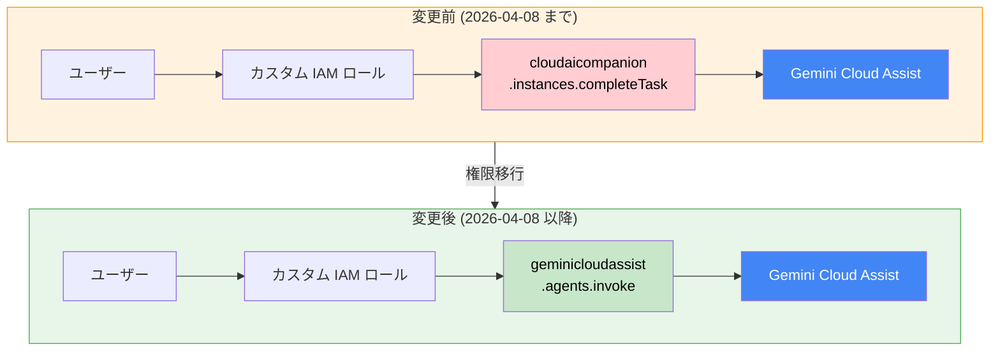

# Gemini Cloud Assist: カスタム IAM ロールの権限移行

**リリース日**: 2026-04-06

**サービス**: Gemini Cloud Assist

**機能**: カスタム IAM ロールの権限移行 (cloudaicompanion.instances.completeTask から geminicloudassist.agents.invoke へ)

**ステータス**: Deprecated (権限移行)

[このアップデートのインフォグラフィックを見る](https://takech9203.github.io/google-cloud-news-summary/20260406-gemini-cloud-assist-iam-permission-update.html)

## 概要

2026 年 4 月 8 日より、Gemini Cloud Assist の IAM 権限体系が変更されます。従来の `cloudaicompanion.instances.completeTask` 権限が廃止され、新しい `geminicloudassist.agents.invoke` 権限に置き換えられます。これは、Gemini Cloud Assist の権限体系を `cloudaicompanion` 名前空間から `geminicloudassist` 名前空間へ段階的に移行する取り組みの一環です。

標準の事前定義済み IAM ロール (roles/geminicloudassist.user など) を使用している場合は、Google が自動的にロールを更新するため、ユーザー側での対応は不要です。ただし、カスタム IAM ロールを使用して Gemini Cloud Assist へのアクセスを制御している場合は、2026 年 4 月 8 日までにカスタムロールの権限を手動で更新する必要があります。

対応を行わない場合、期限後に Gemini Cloud Assist へのアクセスが失われる可能性があるため、カスタム IAM ロールを使用している組織は早急な対応が求められます。

**アップデート前の課題**

- Gemini Cloud Assist の IAM 権限が `cloudaicompanion` 名前空間に分散しており、サービス固有の権限管理が困難だった
- `cloudaicompanion.instances.completeTask` は汎用的な名前であり、Gemini Cloud Assist 固有の操作を明示的に表現していなかった
- 2026 年 2 月の `cloudaicompanion.companions.generateChat` / `generateCode` の廃止に続く、権限体系の移行が進行中だった

**アップデート後の改善**

- `geminicloudassist.agents.invoke` により、Gemini Cloud Assist のエージェント呼び出し権限が明確に定義される
- 権限名がサービス名 (`geminicloudassist`) と整合し、IAM ポリシーの可読性が向上する
- 事前定義済みロールは自動更新されるため、標準ロール利用者は対応不要

## アーキテクチャ図



カスタム IAM ロールに含まれる `cloudaicompanion.instances.completeTask` 権限を、新しい `geminicloudassist.agents.invoke` 権限に置き換える必要があります。事前定義済みロールは自動的に更新されます。

## サービスアップデートの詳細

### 主要機能

1. **IAM 権限の名前空間移行**
   - `cloudaicompanion.instances.completeTask` が廃止され、`geminicloudassist.agents.invoke` に置き換え
   - これは 2026 年 2 月に行われた `cloudaicompanion.companions.generateChat` / `generateCode` から `cloudaicompanion.instances.completeTask` / `generateText` への移行に続く、第 2 段階の権限移行
   - 最終的に全ての Gemini Cloud Assist 権限が `geminicloudassist` 名前空間に統合される方向

2. **事前定義済みロールの自動更新**
   - `roles/geminicloudassist.user` などの標準ロールは Google が自動的に更新
   - 標準ロールを使用している場合、ユーザー側での操作は不要
   - 更新は 2026 年 4 月 8 日に自動適用

3. **カスタムロールの手動更新が必要**
   - カスタム IAM ロールで `cloudaicompanion.instances.completeTask` を使用している場合、手動での更新が必須
   - 期限 (2026 年 4 月 8 日) を過ぎると旧権限が無効化され、アクセスが失われる可能性がある

## 技術仕様

### 権限の変更内容

| 項目 | 変更前 | 変更後 |
|------|--------|--------|
| 権限名 | `cloudaicompanion.instances.completeTask` | `geminicloudassist.agents.invoke` |
| 名前空間 | `cloudaicompanion` | `geminicloudassist` |
| 有効期限 | 2026-04-08 まで | 2026-04-08 以降 |
| 影響範囲 | カスタム IAM ロールのみ | 全ロール (標準ロールは自動更新) |

### 権限移行の履歴

| 移行時期 | 廃止された権限 | 新しい権限 |
|----------|---------------|-----------|
| 2026-02-01 | `cloudaicompanion.companions.generateChat` | `cloudaicompanion.instances.completeTask` / `generateText` |
| 2026-02-01 | `cloudaicompanion.companions.generateCode` | `cloudaicompanion.instances.completeCode` / `generateCode` |
| 2026-04-08 | `cloudaicompanion.instances.completeTask` | `geminicloudassist.agents.invoke` |

## 設定方法

### 前提条件

1. Gemini Cloud Assist へのアクセスにカスタム IAM ロールを使用していること
2. Google Cloud コンソールまたは gcloud CLI へのアクセス権限があること
3. カスタムロールの編集権限 (roles/iam.organizationRoleAdmin または roles/iam.roleAdmin) を持っていること

### 手順

#### ステップ 1: カスタムロールの確認

```bash
# プロジェクト内のカスタムロールを一覧表示
gcloud iam roles list --project=PROJECT_ID --format="table(name, title)"

# 特定のカスタムロールの権限を確認
gcloud iam roles describe ROLE_ID --project=PROJECT_ID
```

カスタムロールの一覧を確認し、`cloudaicompanion.instances.completeTask` 権限を含むロールを特定します。Google Cloud コンソールの [IAM と管理] > [ロール] ページからも確認できます。フィルタフィールドに `cloudaicompanion.instances.completeTask` と入力すると、該当するロールを検索できます。

#### ステップ 2: カスタムロールに新しい権限を追加

```bash
# カスタムロールに新しい権限を追加
gcloud iam roles update ROLE_ID \
  --project=PROJECT_ID \
  --add-permissions=geminicloudassist.agents.invoke
```

まず新しい権限 `geminicloudassist.agents.invoke` をカスタムロールに追加します。この時点では旧権限も残しておくことで、移行期間中のアクセスを確保します。

#### ステップ 3: 旧権限の削除 (2026-04-08 以降)

```bash
# 2026-04-08 以降、旧権限を削除
gcloud iam roles update ROLE_ID \
  --project=PROJECT_ID \
  --remove-permissions=cloudaicompanion.instances.completeTask
```

2026 年 4 月 8 日以降、旧権限 `cloudaicompanion.instances.completeTask` を安全に削除できます。

## メリット

### ビジネス面

- **権限管理の明確化**: サービス名と一致した権限名により、IAM ポリシーの監査やレビューが容易になる
- **ガバナンスの強化**: `geminicloudassist` 名前空間への統一により、Gemini Cloud Assist 関連の権限を一元的に管理可能

### 技術面

- **命名規則の一貫性**: `geminicloudassist.agents.invoke` という名前により、操作内容 (エージェントの呼び出し) が明確に表現される
- **将来の拡張性**: `geminicloudassist` 名前空間への統合により、今後の権限追加や細分化が体系的に行える

## デメリット・制約事項

### 制限事項

- カスタム IAM ロールを使用している場合、2026 年 4 月 8 日までに手動で権限を更新しないとアクセスが失われる
- 移行期限が約 2 日間と非常に短いため、迅速な対応が必要

### 考慮すべき点

- 組織内で複数のプロジェクトにまたがるカスタムロールがある場合、全てのプロジェクトで更新が必要
- Terraform や Deployment Manager などの IaC ツールでカスタムロールを管理している場合、コード側の更新も忘れずに行う必要がある
- 過去の権限移行 (2026 年 2 月) で `cloudaicompanion.instances.completeTask` を追加したばかりの場合、再度の更新作業が発生する

## ユースケース

### ユースケース 1: 最小権限の原則に基づくカスタムロール運用

**シナリオ**: セキュリティポリシーにより事前定義済みロールの使用を避け、必要最小限の権限のみを付与するカスタムロールで Gemini Cloud Assist を利用している組織。

**実装例**:
```bash
# カスタムロールの更新
gcloud iam roles update geminiCloudAssistMinimal \
  --project=my-project \
  --add-permissions=geminicloudassist.agents.invoke \
  --remove-permissions=cloudaicompanion.instances.completeTask
```

**効果**: 移行期限前にカスタムロールを更新することで、Gemini Cloud Assist へのアクセスを中断なく維持できる。

### ユースケース 2: IaC によるカスタムロール管理

**シナリオ**: Terraform で IAM カスタムロールを管理しており、権限変更をコードベースで追跡している組織。

**実装例**:
```hcl
resource "google_project_iam_custom_role" "gemini_assist_user" {
  role_id     = "geminiCloudAssistUser"
  title       = "Gemini Cloud Assist User"
  description = "Custom role for Gemini Cloud Assist access"
  permissions = [
    "geminicloudassist.agents.invoke",  # 新しい権限
    "serviceusage.services.use",
    # "cloudaicompanion.instances.completeTask",  # 削除
  ]
}
```

**効果**: IaC のコード変更として権限移行を管理でき、変更履歴の追跡とロールバックが容易になる。

## 関連サービス・機能

- **[Gemini Cloud Assist IAM 要件](https://cloud.google.com/cloud-assist/iam-requirements)**: Gemini Cloud Assist に必要な IAM ロールと権限の詳細
- **[IAM カスタムロール](https://cloud.google.com/iam/docs/creating-custom-roles)**: カスタムロールの作成・更新方法
- **[Gemini Cloud Assist セットアップ](https://cloud.google.com/cloud-assist/set-up-gemini)**: Gemini Cloud Assist の初期設定手順
- **[Gemini Cloud Assist 権限廃止履歴](https://cloud.google.com/gemini/docs/deprecations/permissions)**: 過去の権限移行に関する情報

## 参考リンク

- [インフォグラフィック](https://takech9203.github.io/google-cloud-news-summary/20260406-gemini-cloud-assist-iam-permission-update.html)
- [公式リリースノート](https://docs.cloud.google.com/release-notes#April_06_2026)
- [Gemini Cloud Assist IAM 要件](https://cloud.google.com/cloud-assist/iam-requirements)
- [IAM ロールと権限 - Gemini Cloud Assist](https://cloud.google.com/iam/docs/roles-permissions/geminicloudassist)
- [カスタムロールの作成と管理](https://cloud.google.com/iam/docs/creating-custom-roles)
- [Gemini Cloud Assist 権限廃止情報](https://cloud.google.com/gemini/docs/deprecations/permissions)

## まとめ

Gemini Cloud Assist の IAM 権限が `cloudaicompanion.instances.completeTask` から `geminicloudassist.agents.invoke` に移行されます。事前定義済みロールは自動更新されますが、カスタム IAM ロールを使用している場合は 2026 年 4 月 8 日までに手動で権限を更新する必要があります。対応期限が非常に短いため、カスタムロールを使用している組織は直ちに影響範囲を確認し、権限の更新作業を実施することを強く推奨します。

---

**タグ**: Gemini Cloud Assist, IAM, カスタムロール, 権限移行, Deprecated, cloudaicompanion, geminicloudassist, セキュリティ, アクセス管理
