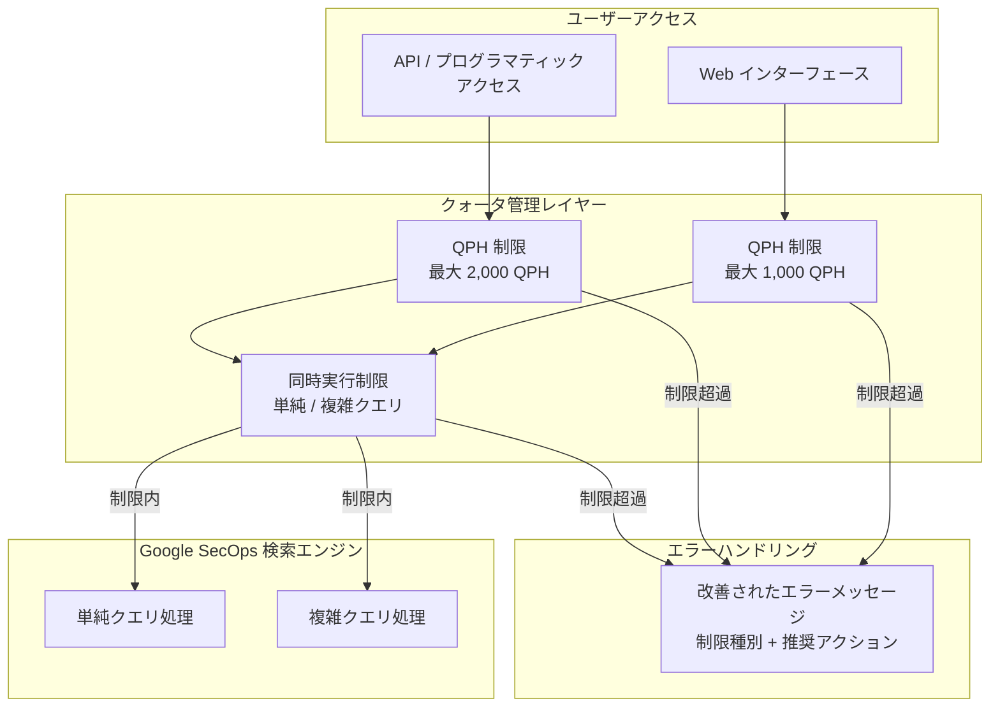

# Google SecOps: 検索クエリ制限の更新とエラーメッセージの改善

**リリース日**: 2026-04-06
**サービス**: Google SecOps
**機能**: 検索クエリ制限の更新とエラーメッセージの改善
**ステータス**: 変更

[このアップデートのインフォグラフィックを見る](https://takech9203.github.io/google-cloud-news-summary/20260406-google-secops-search-query-limits.html)

## 概要

Google SecOps (旧 Chronicle SIEM) において、検索クエリの制限値が大幅に引き上げられ、同時にクォータ超過時のエラーメッセージがより詳細になるアップデートが発表された。API 経由のプログラマティックアクセスでは 1 時間あたり最大 2,000 クエリ (QPH)、Web インターフェース経由では 1 時間あたり最大 1,000 クエリ (QPH) まで実行可能となる。

今回のアップデートでは、単純クエリと複雑クエリの両方に対して新たな同時実行制限 (コンカレンシーリミット) も導入される。これにより、システムリソースの公平な分配が担保され、大規模な検索ワークロードの安定性が向上する。

加えて、API および Web インターフェースの両方でクォータ超過時のエラーメッセージが改善され、ユーザーはどの制限に達したのか、どのように対処すべきかをより明確に把握できるようになる。本アップデートは 2026 年 4 月 6 日から 4 月 30 日にかけて段階的にロールアウトされる。対象はすべての Google SecOps ユーザーであり、SOC アナリスト、セキュリティエンジニア、および API を利用した自動化パイプラインの管理者に特に影響がある。

**アップデート前の課題**

- API 経由の検索クエリの QPH 制限が低く、大量のプログラマティック検索を実行するワークフローでクォータ超過が頻発していた
- Web インターフェースでの検索クエリ制限もセキュリティ調査の規模に対して不十分な場合があった
- クォータ超過時のエラーメッセージが汎用的で、どの制限に到達したのか、次に何をすべきかの判断が困難だった

**アップデート後の改善**

- API 経由の QPH 制限が最大 2,000 に引き上げられ、自動化ワークフローやプログラマティック検索の処理能力が大幅に向上した
- Web インターフェースの QPH 制限が最大 1,000 に引き上げられ、SOC アナリストのインタラクティブな調査作業がスムーズになった
- 単純クエリと複雑クエリに対する明確な同時実行制限が導入され、システムリソースの安定的な利用が保証された
- クォータ超過時のエラーメッセージが改善され、制限の種類や推奨アクションが明確に示されるようになった

## アーキテクチャ図

ユーザーの検索リクエストはクォータ管理レイヤーで QPH 制限と同時実行制限の両方で評価され、制限内であれば検索エンジンに転送、超過時は改善されたエラーメッセージが返される。

## サービスアップデートの詳細

### 主要機能

1. **QPH (Queries Per Hour) 制限の引き上げ**
   - API 経由のプログラマティックアクセスで最大 2,000 QPH まで引き上げ
   - Web インターフェース経由で最大 1,000 QPH まで引き上げ
   - 従来の制限と比較して、大幅な検索能力の拡張を実現

2. **同時実行制限 (コンカレンシーリミット) の導入**
   - 単純クエリ (Simple Query) に対する同時実行制限の新設
   - 複雑クエリ (Complex Query) に対する同時実行制限の新設
   - クエリの種類に応じたリソース配分の最適化

3. **エラーメッセージの改善**
   - API でのクォータ超過時に、具体的な制限種別と残りクォータ情報を含むエラーレスポンスを返却
   - Web インターフェースでのクォータ超過時に、ユーザーに対してわかりやすい説明と推奨アクションを表示
   - どの制限 (QPH、同時実行) に到達したかを明示するエラーメッセージ

## 技術仕様

### 検索クエリ制限の比較

| 項目 | アクセス方法 | 新しい制限値 |
|------|-------------|-------------|
| QPH 制限 | API (プログラマティック) | 最大 2,000 QPH |
| QPH 制限 | Web インターフェース | 最大 1,000 QPH |
| 同時実行制限 | 単純クエリ | 新設 (段階的ロールアウト) |
| 同時実行制限 | 複雑クエリ | 新設 (段階的ロールアウト) |

### 既存の検索関連制限 (変更なし)

| 項目 | 制限値 |
|------|--------|
| 最大検索結果数 | 1,000,000 イベント |
| デフォルト表示件数 | 30,000 イベント |
| コンソール表示上限 | 10,000 件 |
| 検索データ範囲 | 最大 1 年間 |

### ロールアウトスケジュール

| フェーズ | 期間 |
|---------|------|
| ロールアウト開始 | 2026 年 4 月 6 日 |
| ロールアウト完了 | 2026 年 4 月 30 日 |

## メリット

### ビジネス面

- **SOC 運用効率の向上**: QPH 制限の引き上げにより、インシデント対応時の検索ボトルネックが解消され、平均対応時間 (MTTR) の短縮が期待できる
- **自動化パイプラインの安定化**: API 経由の QPH 制限が最大 2,000 に拡張されたことで、SOAR プレイブックや自動化スクリプトのクォータ超過による失敗が大幅に減少する
- **運用コストの削減**: 明確なエラーメッセージにより、クォータ関連のトラブルシューティング時間が短縮される

### 技術面

- **API 統合の堅牢性向上**: 改善されたエラーレスポンスにより、プログラマティッククライアントで適切なリトライロジックやバックオフ戦略を実装しやすくなる
- **リソース管理の予測可能性**: 同時実行制限の明示化により、クエリの計画と最適化が容易になる
- **スケーラビリティの改善**: 複数アナリストが同時に調査を行う大規模 SOC 環境での検索パフォーマンスが安定する

## デメリット・制約事項

### 制限事項

- 本アップデートは段階的ロールアウト (2026 年 4 月 6 日 ~ 4 月 30 日) であり、すべてのテナントに即時適用されるわけではない
- 同時実行制限は新たに導入される制約であるため、従来同時に多数のクエリを実行していたワークフローに影響を与える可能性がある
- QPH 制限の「最大」値はティアやライセンスにより異なる可能性がある

### 考慮すべき点

- ロールアウト期間中は、テナントごとに適用される制限値が異なる場合がある
- 既存の自動化スクリプトやSOAR 連携において、新しいエラーメッセージフォーマットに対応するコード変更が必要になる場合がある
- 複雑クエリの同時実行制限が、大規模な脅威ハンティングセッション中のパフォーマンスに影響を与える可能性がある

## ユースケース

### ユースケース 1: SOAR プレイブックによる大量自動検索

**シナリオ**: SOC チームが SOAR プラットフォーム (Google SecOps SOAR など) を使用して、アラートトリアージの自動化プレイブックを運用している。インシデント発生時にプレイブックが関連 IOC に対して多数の検索クエリを自動実行する。

**効果**: API の QPH 制限が最大 2,000 に引き上げられたことで、1 時間あたりに実行可能な自動検索数が大幅に増加し、大規模インシデント時でもクォータ超過による処理中断が起きにくくなる。

### ユースケース 2: 複数アナリストによる同時脅威ハンティング

**シナリオ**: 大規模 SOC において、複数のセキュリティアナリストが同時に脅威ハンティングを実施している。各アナリストが Web インターフェースから複雑な UDM 検索クエリを並行して実行する。

**効果**: Web インターフェースの QPH 制限が最大 1,000 に引き上げられ、同時実行制限も明確化されたことで、チーム全体の調査作業がよりスムーズに進行し、クォータ関連のエラーによる作業中断が減少する。

### ユースケース 3: クォータ管理の効率化

**シナリオ**: プラットフォームエンジニアが Google SecOps API を利用したカスタム検索ツールを運用しており、クォータ超過エラーの原因調査に多くの時間を費やしていた。

**効果**: 改善されたエラーメッセージにより、どの制限 (QPH / 同時実行) に到達したかが即座に判別でき、適切なリトライ戦略の実装やクエリスケジューリングの最適化が容易になる。

## 関連サービス・機能

- **Google SecOps SIEM**: 本アップデートの対象となるコア検索機能を提供するプラットフォーム
- **Google SecOps SOAR**: API 経由の検索を利用した自動化プレイブックに直接影響がある
- **Chronicle API (Backstory API)**: 検索関連 API の QPH クォータが変更される対象
- **UDM Search**: Web インターフェースでの検索機能に新しい QPH 制限が適用される

## 参考リンク

- [インフォグラフィック](https://takech9203.github.io/google-cloud-news-summary/20260406-google-secops-search-query-limits.html)
- [公式リリースノート](https://docs.cloud.google.com/release-notes#April_06_2026)
- [Google SecOps サービス制限](https://cloud.google.com/chronicle/docs/reference/service-limits)
- [UDM Search の使用方法](https://cloud.google.com/chronicle/docs/investigation/udm-search-time-range)
- [Chronicle Search API](https://cloud.google.com/chronicle/docs/reference/search-api)

## まとめ

今回のアップデートは、Google SecOps の検索クエリ制限を大幅に引き上げ、同時実行制限を明確化し、エラーメッセージを改善する重要な変更である。特に API 経由で最大 2,000 QPH、Web インターフェースで最大 1,000 QPH への引き上げは、SOC 運用の効率化と自動化パイプラインの安定性向上に直結する。段階的ロールアウト期間 (4 月 6 日 ~ 4 月 30 日) 中は、既存の自動化スクリプトのエラーハンドリングを確認し、新しいエラーメッセージフォーマットへの対応を推奨する。

---

**タグ**: #GoogleSecOps #Chronicle #SIEM #SearchQuery #QuotaLimits #SecurityOperations #QPH #API #GoogleCloud
