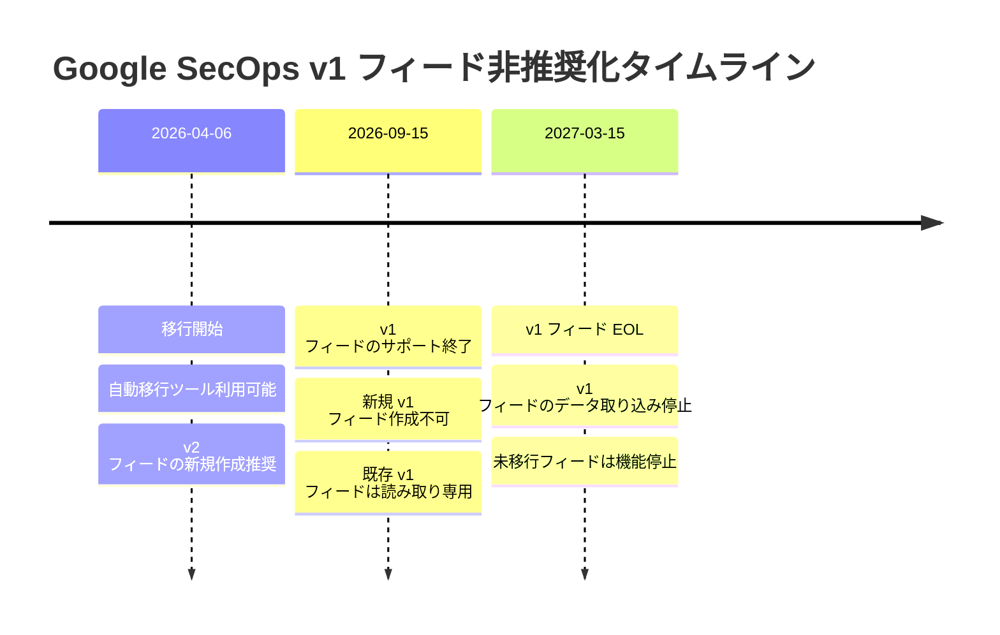
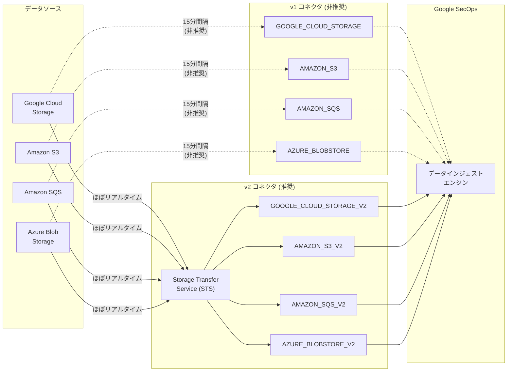

# Google SecOps: v1 Cloud Storage フィードタイプの非推奨化

**リリース日**: 2026-04-06

**サービス**: Google SecOps

**機能**: v1 Cloud Storage Feed Types (GCS, S3, SQS, Azure) の非推奨化

**ステータス**: Deprecated

[このアップデートのインフォグラフィックを見る](https://takech9203.github.io/google-cloud-news-summary/20260406-google-secops-v1-feed-types-deprecation.html)

## 概要

Google SecOps (旧 Chronicle SIEM) において、v1 コネクタフレームワークによるクラウドストレージフィードタイプが非推奨となりました。対象となるのは GOOGLE_CLOUD_STORAGE、AMAZON_S3、AMAZON_SQS、AZURE_BLOBSTORE の 4 つの v1 フィードタイプです。これらは 2027 年 3 月 15 日に End of Life (EOL) を迎え、以降はデータの取り込みが停止されます。

新しい v2 フィードタイプは Google Cloud Storage Transfer Service (STS) を基盤として構築されており、パフォーマンス、スケーラビリティ、信頼性が大幅に向上しています。v1 フィードでは 15 分間隔のポーリングベースのデータ取り込みでしたが、v2 フィードではほぼリアルタイムのデータインジェストが可能になります。

この変更は、Google SecOps を使用してマルチクラウド環境からログを取り込んでいるセキュリティ運用チーム、SOC アナリスト、SIEM 管理者に直接影響します。移行期間は約 1 年間設けられていますが、早期の移行計画が推奨されます。

**アップデート前の課題**

- v1 フィードは 15 分間隔のポーリングベースであり、リアルタイム性に限界があった
- 大量の小さなファイルを含むバケットではデータ転送に時間がかかっていた
- クラウドストレージプロバイダごとに異なる接続フレームワークが使用されており、統一的な管理が困難だった

**アップデート後の改善**

- v2 フィードは Storage Transfer Service (STS) を活用し、ほぼリアルタイムのデータインジェストが可能になった
- STS の統一フレームワークにより、GCS、S3、SQS、Azure Blob Storage のフィード管理が一元化された
- イベントドリブン型のデータ取り込み (Cloud Storage Event Driven) もサポートされ、より柔軟なアーキテクチャが構築可能になった

## アーキテクチャ図



v1 フィードから v2 フィードへの移行は段階的に進められ、約 1 年間の移行期間が設けられています。



v1 コネクタは各データソースから直接 15 分間隔でポーリングしていましたが、v2 コネクタは Storage Transfer Service (STS) を経由することで、統一されたフレームワークによるほぼリアルタイムのデータ取り込みを実現します。

## サービスアップデートの詳細

### 主要機能

1. **v1 フィードタイプの非推奨化**
   - 対象: GOOGLE_CLOUD_STORAGE、AMAZON_S3、AMAZON_SQS、AZURE_BLOBSTORE の 4 つの v1 コネクタ
   - Google SecOps の UI 上でこれらは「(Deprecated)」と表示される
   - 2027 年 3 月 15 日以降、v1 フィードはデータの返却を停止する

2. **v2 フィードタイプへの移行**
   - v2 コネクタ (GOOGLE_CLOUD_STORAGE_V2、AMAZON_S3_V2、AMAZON_SQS_V2、AZURE_BLOBSTORE_V2) への移行が必要
   - v2 コネクタは Google Cloud Storage Transfer Service (STS) を基盤として使用
   - 自動移行ツールが 2026 年 4 月 6 日から利用可能

3. **Storage Transfer Service (STS) による改善**
   - ほぼリアルタイムのデータインジェストを実現
   - AWS Security Token Service との統合によるセキュアな認証情報管理
   - VPC Service Controls 環境での動作をサポート (Ingress/Egress ルールの設定が必要)

## 技術仕様

### v1 / v2 コネクタ対応表

| v1 コネクタ (非推奨) | v2 コネクタ (推奨) | データソース |
|---|---|---|
| GOOGLE_CLOUD_STORAGE | GOOGLE_CLOUD_STORAGE_V2 | Google Cloud Storage バケット |
| AMAZON_S3 | AMAZON_S3_V2 | Amazon S3 バケット |
| AMAZON_SQS | AMAZON_SQS_V2 | Amazon SQS キュー |
| AZURE_BLOBSTORE | AZURE_BLOBSTORE_V2 | Azure Blob Storage |

### 非推奨化スケジュール

| 日付 | マイルストーン | 影響 |
|------|------|------|
| 2026 年 4 月 6 日 | 移行開始 | 自動移行ツール利用可能、v2 フィードの新規作成を推奨 |
| 2026 年 9 月 15 日 | v1 サポート終了 | v1 フィードのサポートが終了、問題発生時の対応なし |
| 2027 年 3 月 15 日 | v1 EOL | v1 フィードがデータの返却を完全に停止 |

### VPC Service Controls 設定 (v2 フィード使用時)

v2 フィードを VPC Service Controls 環境で使用する場合、以下の Egress ルールが必要です。

```json
{
  "egressPolicies": [
    {
      "egressFrom": {
        "identities": [
          "serviceAccount:service-{PROJECT_ID}@gs-project-accounts.iam.gserviceaccount.com"
        ]
      },
      "egressTo": {
        "operations": [
          {
            "serviceName": "pubsub.googleapis.com",
            "methodSelectors": [{"method": "*"}]
          }
        ],
        "resources": ["*"]
      },
      "title": "GCS pubsub access"
    },
    {
      "egressFrom": {
        "identities": [
          "serviceAccount:project-{PROJECT_ID}@storage-transfer-service.iam.gserviceaccount.com"
        ]
      },
      "egressTo": {
        "operations": [
          {
            "serviceName": "pubsub.googleapis.com",
            "methodSelectors": [{"method": "*"}]
          }
        ],
        "resources": ["*"]
      },
      "title": "STS pubsub"
    }
  ]
}
```

## 設定方法

### 前提条件

1. Google SecOps インスタンスへの管理者アクセス権限
2. 既存の v1 フィードの設定情報の記録 (ソースタイプ、ログタイプ、認証情報、バケット URI など)
3. v2 フィードで使用する Google SecOps サービスアカウントの取得

### 手順

#### ステップ 1: 既存 v1 フィードの設定情報を記録する

移行前に、現在使用している v1 フィードの設定をすべて記録します。Google SecOps の SIEM Settings > Feeds から各フィードの設定を確認してください。

#### ステップ 2: v2 フィードを新規作成する

```
1. Google SecOps メニューから SIEM Settings > Feeds を選択
2. Add New Feed をクリック
3. Configure a single feed をクリック
4. Source type で v2 バージョンを選択:
   - Cloud Storage (V2)
   - Amazon S3 (V2)
   - Amazon SQS (V2)
   - Azure Blob Storage (V2)
5. Log type を選択
6. Get service account をクリックしてサービスアカウントを取得
7. 入力パラメータ (バケット URI、認証情報など) を設定
8. Submit をクリック
```

#### ステップ 3: サービスアカウントに権限を付与する

v2 フィード用のサービスアカウントに対して、データソースへのアクセス権限を付与します。Cloud Storage の場合は、対象バケットに対するオブジェクトの読み取り権限を付与してください。

#### ステップ 4: v1 フィードを無効化する

v2 フィードでデータが正常に取り込まれていることを確認した後、v1 フィードを無効化または削除します。

## メリット

### ビジネス面

- **セキュリティ監視のリアルタイム性向上**: v2 フィードのほぼリアルタイムなインジェストにより、セキュリティインシデントの検出までの時間 (MTTD) が短縮される
- **マルチクラウド運用の統一**: STS を基盤とした統一フレームワークにより、GCS、AWS、Azure からのログ取り込み管理が簡素化される

### 技術面

- **パフォーマンス向上**: Storage Transfer Service による最適化されたデータ転送により、大量のログデータの処理効率が改善される
- **スケーラビリティ**: STS のスケーラブルなアーキテクチャにより、データ量の増加に柔軟に対応可能
- **イベントドリブン対応**: Cloud Storage Event Driven フィードタイプにより、Pub/Sub 連携でのリアルタイムなデータ取り込みも選択可能

## デメリット・制約事項

### 制限事項

- v2 フィードへの移行は手動での再作成が必要であり、完全な自動移行ではない場合がある
- VPC Service Controls 環境では、v2 フィード用に追加の Egress ルール設定が必要
- Google Cloud プロジェクトの変更 (BYOP 移行) 時には、v2 フィードが停止し手動での再作成が必要

### 考慮すべき点

- 移行時に Max File Age の設定によっては、一時的に重複データが取り込まれる可能性がある
- Amazon SQS (V2) を使用する場合、STS ワーカーが使用する IP レンジをファイアウォールの許可リストに追加する必要がある
- v1 フィードと v2 フィードを並行稼働させる場合、同一データの重複インジェストに注意が必要

## ユースケース

### ユースケース 1: マルチクラウド SIEM 環境の移行

**シナリオ**: AWS S3 と Azure Blob Storage からセキュリティログを取り込んでいるエンタープライズ組織が、v1 フィードから v2 フィードに移行する。

**効果**: STS を基盤とした v2 コネクタにより、AWS と Azure の両方からのログ取り込みがほぼリアルタイムになり、クラウド横断のセキュリティ監視が強化される。移行期間中は v1 と v2 を並行稼働させることで、データ取り込みの中断を回避できる。

### ユースケース 2: Google Cloud Storage からの大規模ログインジェスト

**シナリオ**: GKE や Cloud Run のログを GCS バケットに集約し、Google SecOps に取り込んでいるプラットフォームチームが、v2 フィードに移行する。

**効果**: Cloud Storage (V2) または Cloud Storage Event Driven フィードタイプにより、Pub/Sub 連携でのイベントドリブンな取り込みが可能になり、15 分間隔のポーリングによるレイテンシが解消される。

## 関連サービス・機能

- **Google Cloud Storage Transfer Service (STS)**: v2 フィードの基盤となるデータ転送サービス。クラウド間のデータ移動を管理する
- **Google Cloud Pub/Sub**: Cloud Storage Event Driven フィードタイプで使用される、リアルタイムメッセージングサービス
- **VPC Service Controls**: v2 フィードの使用時に追加の Egress ルール設定が必要となるセキュリティ境界サービス
- **Google SecOps Feed Management API**: フィードの作成・管理をプログラマティックに行うための API

## 参考リンク

- [インフォグラフィック](https://takech9203.github.io/google-cloud-news-summary/20260406-google-secops-v1-feed-types-deprecation.html)
- [公式リリースノート](https://docs.cloud.google.com/release-notes#April_06_2026)
- [Google SecOps フィード管理ドキュメント](https://docs.cloud.google.com/chronicle/docs/administration/feed-management)
- [Feed Management API リファレンス](https://docs.cloud.google.com/chronicle/docs/reference/feed-management-api)
- [Feature Deprecations](https://docs.cloud.google.com/chronicle/docs/deprecations)

## まとめ

Google SecOps の v1 Cloud Storage フィードタイプ (GCS、S3、SQS、Azure) は非推奨となり、2027 年 3 月 15 日に完全に停止します。v2 フィードタイプへの移行により、Storage Transfer Service を活用したほぼリアルタイムのデータインジェストが可能になります。影響を受けるフィードを使用している組織は、2026 年 9 月 15 日の v1 サポート終了までに v2 フィードへの移行を完了することを強く推奨します。

---

**タグ**: #GoogleSecOps #Chronicle #SIEM #Deprecated #FeedManagement #StorageTransferService #CloudStorage #AmazonS3 #AmazonSQS #AzureBlobStorage #Migration #SecurityOperations
