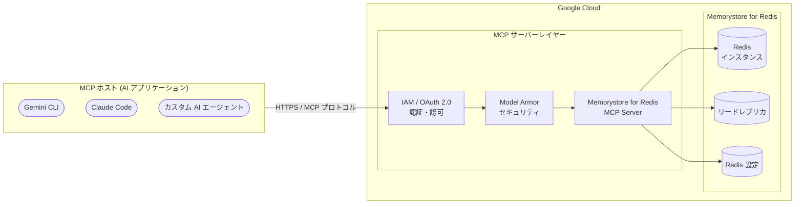

# Memorystore for Redis: Remote MCP Server (Preview)

**リリース日**: 2026-04-06

**サービス**: Memorystore for Redis

**機能**: Remote MCP Server

**ステータス**: Preview

[このアップデートのインフォグラフィックを見る](https://takech9203.github.io/google-cloud-news-summary/20260406-memorystore-redis-remote-mcp-server.html)

## 概要

Google Cloud は 2026 年 4 月 6 日に、Memorystore for Redis のリモート MCP (Model Context Protocol) サーバーを Preview としてリリースした。この MCP サーバーにより、LLM (大規模言語モデル)、AI アプリケーション、および AI 対応の開発プラットフォームから Memorystore for Redis インスタンスに接続し、Redis の管理操作を MCP プロトコルを通じて実行できるようになる。

MCP は Anthropic が開発したオープンソースプロトコルで、AI アプリケーションが外部データソースやサービスに接続する方法を標準化するものである。Google Cloud は既に BigQuery、Cloud SQL、Firestore、Bigtable、Compute Engine、GKE、Cloud Run など多数のサービスでリモート MCP サーバーを提供しており、今回の Memorystore for Redis 対応によって、インメモリデータストア領域への MCP エコシステムの拡大が実現した。

対象となるのは、Memorystore for Redis を運用しているインフラストラクチャエンジニア、AI エージェントを活用したキャッシュ管理やセッション管理の自動化を検討しているプラットフォームエンジニア、および Gemini CLI、Claude Code、Gemini Code Assist などの AI ツールから Redis インスタンスを管理したい開発者である。

**アップデート前の課題**

このアップデート以前に存在していた課題を以下に示す。

- Memorystore for Redis インスタンスの管理には、Google Cloud Console、gcloud CLI、または REST/RPC API のクライアントライブラリを直接使用する必要があった
- AI エージェントから Memorystore for Redis の管理操作を実行するには、Redis API に対するカスタム統合コードの開発が必要であり、MCP のような標準化されたプロトコルは利用できなかった
- LLM や AI アプリケーションから Redis インスタンスの状態確認やスケーリングなどの操作を自然言語で実行する手段が提供されていなかった

**アップデート後の改善**

今回のアップデートにより可能になったことを以下に示す。

- AI エージェントが MCP プロトコルを通じて Memorystore for Redis インスタンスに接続し、管理操作を実行できるようになった
- Gemini CLI、Claude Code、Gemini Code Assist のエージェントモードなど、MCP 対応の AI アプリケーションから標準化されたインターフェースで Redis インスタンスを管理できるようになった
- Google Cloud のリモート MCP サーバー共通の機能である IAM によるきめ細かい認可制御、OAuth 2.0 認証、Model Armor によるセキュリティ保護、監査ログが Memorystore for Redis 管理においても利用可能になった

## アーキテクチャ図



AI アプリケーション (MCP ホスト) からのリクエストは、IAM / OAuth 2.0 による認証・認可を経て、オプションの Model Armor セキュリティスキャンを通過した後、Memorystore for Redis MCP サーバーに到達する。MCP サーバーは受信したリクエストを Memorystore for Redis API の操作に変換し、Redis インスタンス、リードレプリカ、設定に対する管理操作を実行する。

## サービスアップデートの詳細

### 主要機能

1. **Memorystore for Redis のリモート MCP サーバー**
   - Memorystore for Redis の管理機能を MCP プロトコルで公開
   - Google Cloud インフラストラクチャ上で動作するリモート MCP サーバーとして提供され、HTTPS エンドポイント経由でアクセス可能
   - AI アプリケーションは `tools/list` メソッドでサーバーが提供するツールを自動検出できる

2. **Redis インスタンス管理のエージェント操作**
   - Memorystore for Redis API (`redis.googleapis.com`) が提供するインスタンス管理操作を AI エージェントから実行可能
   - インスタンスの作成、取得、一覧表示、更新、削除、フェイルオーバーなどの管理操作が想定される
   - リードレプリカの管理やスケーリング操作も対象となる

3. **LLM および AI アプリケーションとの接続**
   - Gemini CLI、Claude Code、Gemini Code Assist、ChatGPT などの MCP 対応 AI アプリケーションから直接接続が可能
   - カスタムの AI エージェントやエージェントプラットフォームからも MCP クライアントを通じて利用可能
   - 自然言語によるインスタンス管理の指示が実現される

4. **エンタープライズ向けセキュリティ・ガバナンス**
   - IAM による細粒度のアクセス制御 (MCP Tool User ロール `roles/mcp.toolUser` による MCP ツール呼び出し権限の管理)
   - OAuth 2.0 認証による安全なアクセス
   - Model Armor によるプロンプトとレスポンスのセキュリティスキャン (オプション)
   - Cloud Audit Logs による一元的な監査ログ記録

## 技術仕様

### MCP サーバーエンドポイント

| 項目 | 詳細 |
|------|------|
| サービス名 | `redis.googleapis.com` |
| MCP エンドポイント (推定) | `https://redis.googleapis.com/mcp` |
| トランスポート | HTTPS (リモート MCP サーバー) |
| 認証方式 | OAuth 2.0 + IAM |
| ステータス | Preview |

### 必要な IAM ロール

```json
{
  "required_roles": [
    {
      "role": "roles/serviceusage.serviceUsageAdmin",
      "purpose": "MCP サーバーの有効化"
    },
    {
      "role": "roles/mcp.toolUser",
      "purpose": "MCP ツール呼び出しの実行"
    },
    {
      "role": "roles/redis.admin",
      "purpose": "Memorystore for Redis リソースへの管理アクセス"
    }
  ],
  "required_permissions": [
    "serviceusage.mcppolicy.get",
    "serviceusage.mcppolicy.update",
    "mcp.tools.call",
    "resourcemanager.projects.get",
    "resourcemanager.projects.list"
  ]
}
```

## 設定方法

### 前提条件

1. Google Cloud プロジェクトが作成済みであること
2. Memorystore for Redis API (`redis.googleapis.com`) が有効化されていること
3. 必要な IAM ロール (Service Usage Admin, MCP Tool User, Redis Admin) が付与されていること

### 手順

#### ステップ 1: Memorystore for Redis MCP サーバーの有効化

```bash
# gcloud CLI beta コンポーネントのインストール
gcloud components install beta

# Memorystore for Redis の MCP サーバーを有効化
gcloud beta services mcp enable redis.googleapis.com \
  --project=PROJECT_ID
```

Memorystore for Redis API がまだ有効化されていない場合は、先にサービスを有効化する。

```bash
# Memorystore for Redis API の有効化
gcloud services enable redis.googleapis.com \
  --project=PROJECT_ID
```

#### ステップ 2: IAM ロールの付与

```bash
# MCP Tool User ロールの付与
gcloud projects add-iam-policy-binding PROJECT_ID \
  --member="user:USER_EMAIL" \
  --role="roles/mcp.toolUser"

# Memorystore for Redis 管理者ロールの付与
gcloud projects add-iam-policy-binding PROJECT_ID \
  --member="user:USER_EMAIL" \
  --role="roles/redis.admin"
```

#### ステップ 3: MCP クライアントの設定 (Claude Code の例)

```json
{
  "mcpServers": {
    "memorystore-redis": {
      "url": "https://redis.googleapis.com/mcp",
      "transport": "http",
      "auth": {
        "type": "google_credentials",
        "scopes": ["https://www.googleapis.com/auth/cloud-platform"]
      }
    }
  }
}
```

#### ステップ 4: MCP クライアントの設定 (Gemini CLI の例)

```json
{
  "name": "memorystore-redis",
  "version": "1.0.0",
  "mcpServers": {
    "memorystore-redis": {
      "httpUrl": "https://redis.googleapis.com/mcp",
      "authProviderType": "google_credentials",
      "oauth": {
        "scopes": ["https://www.googleapis.com/auth/cloud-platform"]
      },
      "timeout": 30000,
      "headers": {
        "x-goog-user-project": "PROJECT_ID"
      }
    }
  }
}
```

## メリット

### ビジネス面

- **キャッシュインフラの運用効率向上**: AI エージェントが自然言語の指示に基づいて Redis インスタンスの管理操作を実行できるため、キャッシュ基盤の運用・管理が効率化される
- **スキルギャップの解消**: Memorystore for Redis の詳細な API 仕様や gcloud コマンドに精通していなくても、AI エージェントを通じてインスタンス管理を実行でき、運用チームの対応範囲が拡大する
- **インシデント対応の迅速化**: AI エージェントがリアルタイムでインスタンスの状態確認やフェイルオーバー操作を支援することで、キャッシュ関連の障害対応時間の短縮が期待できる

### 技術面

- **標準化されたインターフェース**: MCP プロトコルにより、複数の AI アプリケーションから統一されたインターフェースで Memorystore for Redis を管理できる
- **エンタープライズセキュリティ**: IAM、OAuth 2.0、Model Armor、監査ログによる包括的なセキュリティ・ガバナンス基盤が標準で提供される
- **MCP エコシステムとの統合**: BigQuery、Cloud SQL、Firestore、Bigtable、GKE など、他の Google Cloud MCP サーバーと組み合わせたマルチサービスのエージェントワークフローを構築できる

## デメリット・制約事項

### 制限事項

- Preview 機能であるため、本番環境での使用は推奨されない。Pre-GA Offerings Terms が適用され、サポートが限定的である可能性がある
- リモート MCP サーバーのツール、パラメータ、説明、出力は予告なく変更・追加・削除される可能性がある
- MCP ツールの出力は非決定的であり、同一の呼び出しでも内容やフォーマットが変わる可能性がある
- Memorystore for Redis のブロックされたコマンド (CONFIG、SHUTDOWN 等) に対応する操作は MCP サーバーからも制限される可能性がある

### 考慮すべき点

- MCP サーバーは管理操作 (コントロールプレーン) に焦点を当てており、Redis のデータ読み書き (GET/SET 等のデータプレーン操作) とは区別して理解する必要がある
- AI エージェントがインスタンスの削除やスケールダウンなど破壊的な操作を実行する可能性があるため、IAM による最小権限の原則の適用と Human-in-the-Middle (HitM) モードでの運用が重要である
- Memorystore for Redis は VPC ネットワーク内のプライベート IP で保護されているため、MCP サーバーからの管理操作とデータプレーンの接続要件は異なる点に注意が必要である

## ユースケース

### ユースケース 1: AI エージェントによる Redis インスタンスのスケーリング管理

**シナリオ**: アプリケーションのトラフィック増加に伴い、キャッシュ容量の拡張が必要になった場合に、AI エージェントが自然言語の指示に基づいてインスタンスのスケーリングを実行する。

**実装例**:
```
ユーザー: "本番環境の Redis インスタンス prod-cache の現在のサイズを確認して、
           10GB にスケールアップして"

AI エージェント:
  1. GetInstance で prod-cache のインスタンス情報を取得
  2. 現在のメモリサイズを確認 (例: 5 GB)
  3. UpdateInstance でメモリサイズを 10 GB に変更
  4. 変更結果を報告
```

**効果**: 運用担当者が gcloud コマンドの詳細なオプションを把握していなくても、自然言語でキャッシュインフラストラクチャのスケーリングを安全に実行できる。

### ユースケース 2: マルチサービス AI ワークフローによるアプリケーション基盤の構成管理

**シナリオ**: AI エージェントが Memorystore for Redis MCP サーバー、Cloud SQL MCP サーバー、Cloud Run MCP サーバーを組み合わせて、アプリケーションのキャッシュ層、データベース層、コンピュート層を横断的に構成確認・管理する。

**効果**: 複数の Google Cloud サービスにまたがるアプリケーションアーキテクチャの状態確認と管理を、AI エージェントが一括で実施することで、運用の可視性と効率が向上する。

### ユースケース 3: AI エージェントによるキャッシュインスタンスの健全性モニタリング

**シナリオ**: 運用チームが AI エージェントに「全リージョンの Redis インスタンスの一覧と状態を確認して」と指示し、複数インスタンスの健全性を一括で確認する。

**効果**: 複数のインスタンスを管理している環境において、AI エージェントが一括で状態確認を行うことで、日常的な運用確認作業の効率化が実現される。

## 料金

Memorystore for Redis MCP サーバー自体の追加料金についての公式情報は確認できていない。他の Google Cloud MCP サーバーと同様に、MCP サーバーの利用自体は追加料金なしで、基盤となる Memorystore for Redis の利用料金が適用されるものと考えられる。

Memorystore for Redis の主な料金体系は以下の通りである (オンデマンド料金)。

| 項目 | 料金 (概算、us-central1) |
|------|--------------------------|
| Basic Tier 容量 | $0.016/GB/時間 |
| Standard Tier 容量 | $0.024/GB/時間 |
| 1 年 CUD 割引 | 20% 割引 |
| 3 年 CUD 割引 | 40% 割引 |

CUD (Committed Use Discounts) は Memorystore for Redis、Memorystore for Redis Cluster、Memorystore for Memcached、Memorystore for Valkey の全サービス間で互換性がある。CUD は 5 GB 以上のインスタンスに対してのみ利用可能である。

詳細は [Memorystore for Redis 料金ページ](https://cloud.google.com/memorystore/docs/redis/pricing) を参照。

## 関連サービス・機能

- **Google Cloud MCP サーバーエコシステム**: BigQuery、Cloud SQL、Firestore、Bigtable、Compute Engine、GKE、Cloud Run、Cloud Logging、Cloud Monitoring など、Google Cloud の多数のサービスがリモート MCP サーバーを提供しており、Memorystore for Redis はこのエコシステムに新たに追加された
- **Memorystore for Redis API**: MCP サーバーの基盤となる管理 API。Redis インスタンスの作成、管理、スケーリング、フェイルオーバーなどの機能を提供する (`redis.googleapis.com`)
- **Memorystore for Redis Cluster**: 大規模なワークロード向けのクラスタ型 Redis サービス。Redis Cluster についても今後 MCP サーバー対応が拡大する可能性がある
- **LangChain 連携**: Memorystore for Redis は LangChain フレームワークとの統合 (Vector Store、Document Loader、Chat Message History) も提供しており、AI アプリケーションのデータ層として活用できる
- **Model Armor**: MCP ツール呼び出しとレスポンスに対するセキュリティスキャンを提供し、プロンプトインジェクションや機密データの漏洩を防止する
- **IAM / MCP Tool User ロール**: `roles/mcp.toolUser` ロールにより、MCP ツールの呼び出し権限 (`mcp.tools.call`) をきめ細かく制御できる

## 参考リンク

- [このアップデートのインフォグラフィック](https://takech9203.github.io/google-cloud-news-summary/20260406-memorystore-redis-remote-mcp-server.html)
- [公式リリースノート](https://cloud.google.com/release-notes#April_06_2026)
- [Memorystore for Redis ドキュメント](https://cloud.google.com/memorystore/docs/redis/memorystore-for-redis-overview)
- [Google Cloud MCP サーバー概要](https://cloud.google.com/mcp/overview)
- [Google Cloud MCP サポート対象プロダクト](https://cloud.google.com/mcp/supported-products)
- [MCP サーバーの管理](https://cloud.google.com/mcp/manage-mcp-servers)
- [MCP サーバーへの認証](https://cloud.google.com/mcp/authenticate-mcp)
- [Memorystore for Redis 料金ページ](https://cloud.google.com/memorystore/docs/redis/pricing)
- [Memorystore for Redis CUD](https://cloud.google.com/memorystore/docs/redis/cuds)

## まとめ

Memorystore for Redis リモート MCP サーバーの Preview リリースは、Google Cloud の MCP エコシステムにインメモリデータストア管理の領域を加える重要なアップデートである。AI エージェントが Memorystore for Redis インスタンスを標準化された MCP プロトコルを通じて管理できるようになることで、キャッシュ基盤の運用自動化と効率化が大幅に進展する。Preview 段階であるため、まずは非本番環境で AI エージェントを通じた Redis インスタンス管理を試験的に実施し、IAM による最小権限の設定と Model Armor の有効化を組み合わせた安全な運用パターンの確立を推奨する。

---

**タグ**: #MemorystoreForRedis #MCP #ModelContextProtocol #AIAgent #RemoteMCPServer #Preview #GoogleCloud #Redis #InMemoryDatabase #CacheManagement
