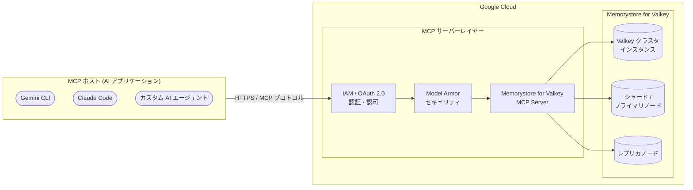

# Memorystore for Valkey: Remote MCP Server (Preview)

**リリース日**: 2026-04-06

**サービス**: Memorystore for Valkey

**機能**: Remote MCP Server

**ステータス**: Preview

[このアップデートのインフォグラフィックを見る](https://takech9203.github.io/google-cloud-news-summary/20260406-memorystore-valkey-remote-mcp-server.html)

## 概要

Google Cloud は 2026 年 4 月 6 日に、Memorystore for Valkey のリモート MCP (Model Context Protocol) サーバーを Preview としてリリースした。この MCP サーバーにより、LLM (大規模言語モデル)、AI アプリケーション、および AI 対応の開発プラットフォームから Memorystore for Valkey インスタンスに接続し、Valkey クラスタの管理操作を MCP プロトコルを通じて実行できるようになる。

同日にリリースされた Memorystore for Redis 向けの MCP サーバーと同様の機能を提供するが、Memorystore for Valkey はオープンソースの Valkey プロジェクト (Redis 互換) に基づく水平スケーラブルなクラスタサービスであり、シャーディングによるデータ分散、ベクトル検索機能、クロスリージョンレプリケーション、Cluster Mode Enabled / Disabled の選択など、Redis とは異なるアーキテクチャと機能セットを持つ。そのため、Valkey 固有のインスタンス管理操作 (シャード数の変更、ノードタイプの変更、クラスタモードの管理など) を AI エージェントから実行できる点が、Redis 版 MCP サーバーとの主な差別化ポイントとなる。

対象となるのは、Memorystore for Valkey を運用しているインフラストラクチャエンジニア、AI エージェントを活用したキャッシュ管理やベクトル検索基盤の自動化を検討しているプラットフォームエンジニア、および Gemini CLI、Claude Code、Gemini Code Assist などの AI ツールから Valkey インスタンスを管理したい開発者である。

**アップデート前の課題**

このアップデート以前に存在していた課題を以下に示す。

- Memorystore for Valkey インスタンスの管理には、Google Cloud Console、gcloud CLI (`gcloud memorystore` コマンド)、または REST/RPC API を直接使用する必要があった
- AI エージェントから Memorystore for Valkey の管理操作を実行するには、Memorystore API に対するカスタム統合コードの開発が必要であり、MCP のような標準化されたプロトコルは利用できなかった
- Valkey クラスタのシャード数変更やノードタイプ変更などの水平スケーリング操作を自然言語で AI エージェントに指示する手段が提供されていなかった

**アップデート後の改善**

今回のアップデートにより可能になったことを以下に示す。

- AI エージェントが MCP プロトコルを通じて Memorystore for Valkey インスタンスに接続し、クラスタの管理操作を実行できるようになった
- Gemini CLI、Claude Code、Gemini Code Assist のエージェントモードなど、MCP 対応の AI アプリケーションから標準化されたインターフェースで Valkey インスタンスを管理できるようになった
- Google Cloud のリモート MCP サーバー共通の機能である IAM によるきめ細かい認可制御、OAuth 2.0 認証、Model Armor によるセキュリティ保護、監査ログが Memorystore for Valkey 管理においても利用可能になった

## アーキテクチャ図



AI アプリケーション (MCP ホスト) からのリクエストは、IAM / OAuth 2.0 による認証・認可を経て、オプションの Model Armor セキュリティスキャンを通過した後、Memorystore for Valkey MCP サーバーに到達する。MCP サーバーは受信したリクエストを Memorystore for Valkey API の操作に変換し、Valkey クラスタインスタンス、シャード、レプリカノードに対する管理操作を実行する。

## サービスアップデートの詳細

### 主要機能

1. **Memorystore for Valkey のリモート MCP サーバー**
   - Memorystore for Valkey の管理機能を MCP プロトコルで公開
   - Google Cloud インフラストラクチャ上で動作するリモート MCP サーバーとして提供され、HTTPS エンドポイント経由でアクセス可能
   - AI アプリケーションは `tools/list` メソッドでサーバーが提供するツールを自動検出できる

2. **Valkey クラスタ管理のエージェント操作**
   - Memorystore API (`memorystore.googleapis.com`) が提供するインスタンス管理操作を AI エージェントから実行可能
   - インスタンスの作成、取得、一覧表示、更新、削除などの管理操作が想定される
   - シャード数の変更、ノードタイプの変更、レプリカ数の管理などの水平スケーリング操作も対象となる

3. **LLM および AI アプリケーションとの接続**
   - Gemini CLI、Claude Code、Gemini Code Assist、ChatGPT などの MCP 対応 AI アプリケーションから直接接続が可能
   - カスタムの AI エージェントやエージェントプラットフォームからも MCP クライアントを通じて利用可能
   - 自然言語によるインスタンス管理の指示が実現される

4. **エンタープライズ向けセキュリティ・ガバナンス**
   - IAM による細粒度のアクセス制御 (MCP Tool User ロール `roles/mcp.toolUser` による MCP ツール呼び出し権限の管理)
   - OAuth 2.0 認証による安全なアクセス
   - Model Armor によるプロンプトとレスポンスのセキュリティスキャン (オプション)
   - Cloud Audit Logs による一元的な監査ログ記録

### Memorystore for Redis MCP サーバーとの違い

Memorystore for Valkey と Memorystore for Redis は異なるサービスであり、MCP サーバーで管理できる操作に違いがある。

| 比較項目 | Memorystore for Valkey MCP | Memorystore for Redis MCP |
|----------|---------------------------|--------------------------|
| API エンドポイント | `memorystore.googleapis.com` | `redis.googleapis.com` |
| アーキテクチャ | 水平スケーラブル (シャーディング) | 垂直スケーラブル (Basic/Standard Tier) |
| クラスタモード | Cluster Mode Enabled / Disabled を選択可能 | クラスタモードなし (単一インスタンス) |
| スケーリング操作 | シャード数・ノードタイプの変更 | メモリサイズの変更 |
| ベクトル検索 | 対応 (HNSW / FLAT) | 対応 (Redis 7.2 以降) |
| サポートバージョン | Valkey 7.2, 8.0, 9.0 | Redis 5.0, 6.x, 7.0, 7.2 |
| ベースプロジェクト | Valkey (Redis 互換オープンソース) | Redis |

## 技術仕様

### MCP サーバーエンドポイント

| 項目 | 詳細 |
|------|------|
| サービス名 | `memorystore.googleapis.com` |
| MCP エンドポイント (推定) | `https://memorystore.googleapis.com/mcp` |
| トランスポート | HTTPS (リモート MCP サーバー) |
| 認証方式 | OAuth 2.0 + IAM |
| ステータス | Preview |

### 必要な IAM ロール

```json
{
  "required_roles": [
    {
      "role": "roles/serviceusage.serviceUsageAdmin",
      "purpose": "MCP サーバーの有効化"
    },
    {
      "role": "roles/mcp.toolUser",
      "purpose": "MCP ツール呼び出しの実行"
    },
    {
      "role": "roles/memorystore.admin",
      "purpose": "Memorystore for Valkey リソースへの管理アクセス"
    }
  ],
  "required_permissions": [
    "serviceusage.mcppolicy.get",
    "serviceusage.mcppolicy.update",
    "mcp.tools.call",
    "resourcemanager.projects.get",
    "resourcemanager.projects.list"
  ]
}
```

## 設定方法

### 前提条件

1. Google Cloud プロジェクトが作成済みであること
2. Memorystore API (`memorystore.googleapis.com`) が有効化されていること
3. 必要な IAM ロール (Service Usage Admin, MCP Tool User, Memorystore Admin) が付与されていること

### 手順

#### ステップ 1: Memorystore for Valkey MCP サーバーの有効化

```bash
# gcloud CLI beta コンポーネントのインストール
gcloud components install beta

# Memorystore for Valkey の MCP サーバーを有効化
gcloud beta services mcp enable memorystore.googleapis.com \
  --project=PROJECT_ID
```

Memorystore API がまだ有効化されていない場合は、先にサービスを有効化する。

```bash
# Memorystore API の有効化
gcloud services enable memorystore.googleapis.com \
  --project=PROJECT_ID
```

#### ステップ 2: IAM ロールの付与

```bash
# MCP Tool User ロールの付与
gcloud projects add-iam-policy-binding PROJECT_ID \
  --member="user:USER_EMAIL" \
  --role="roles/mcp.toolUser"

# Memorystore 管理者ロールの付与
gcloud projects add-iam-policy-binding PROJECT_ID \
  --member="user:USER_EMAIL" \
  --role="roles/memorystore.admin"
```

#### ステップ 3: MCP クライアントの設定 (Claude Code の例)

```json
{
  "mcpServers": {
    "memorystore-valkey": {
      "url": "https://memorystore.googleapis.com/mcp",
      "transport": "http",
      "auth": {
        "type": "google_credentials",
        "scopes": ["https://www.googleapis.com/auth/cloud-platform"]
      }
    }
  }
}
```

#### ステップ 4: MCP クライアントの設定 (Gemini CLI の例)

```json
{
  "name": "memorystore-valkey",
  "version": "1.0.0",
  "mcpServers": {
    "memorystore-valkey": {
      "httpUrl": "https://memorystore.googleapis.com/mcp",
      "authProviderType": "google_credentials",
      "oauth": {
        "scopes": ["https://www.googleapis.com/auth/cloud-platform"]
      },
      "timeout": 30000,
      "headers": {
        "x-goog-user-project": "PROJECT_ID"
      }
    }
  }
}
```

## メリット

### ビジネス面

- **水平スケーリングの運用効率向上**: AI エージェントが自然言語の指示に基づいて Valkey クラスタのシャード数やノードタイプの変更を実行できるため、複雑な水平スケーリング操作の運用が効率化される
- **スキルギャップの解消**: Memorystore for Valkey のクラスタアーキテクチャや `gcloud memorystore` コマンドに精通していなくても、AI エージェントを通じてインスタンス管理を実行でき、運用チームの対応範囲が拡大する
- **AI アプリケーション基盤の統合管理**: ベクトル検索機能を持つ Valkey インスタンスの管理を AI エージェントに統合することで、RAG パイプラインや LLM キャッシュの基盤管理が一元化される

### 技術面

- **標準化されたインターフェース**: MCP プロトコルにより、複数の AI アプリケーションから統一されたインターフェースで Memorystore for Valkey を管理できる
- **エンタープライズセキュリティ**: IAM、OAuth 2.0、Model Armor、監査ログによる包括的なセキュリティ・ガバナンス基盤が標準で提供される
- **MCP エコシステムとの統合**: BigQuery、Cloud SQL、Firestore、Bigtable、GKE、Memorystore for Redis など、他の Google Cloud MCP サーバーと組み合わせたマルチサービスのエージェントワークフローを構築できる

## デメリット・制約事項

### 制限事項

- Preview 機能であるため、本番環境での使用は推奨されない。Pre-GA Offerings Terms が適用され、サポートが限定的である可能性がある
- リモート MCP サーバーのツール、パラメータ、説明、出力は予告なく変更・追加・削除される可能性がある
- MCP ツールの出力は非決定的であり、同一の呼び出しでも内容やフォーマットが変わる可能性がある
- Memorystore for Valkey のブロックされたコマンド (CONFIG、SHUTDOWN 等) に対応する操作は MCP サーバーからも制限される可能性がある

### 考慮すべき点

- MCP サーバーは管理操作 (コントロールプレーン) に焦点を当てており、Valkey のデータ読み書き (GET/SET 等のデータプレーン操作) やベクトル検索クエリ (FT.SEARCH 等) とは区別して理解する必要がある
- AI エージェントがインスタンスの削除やシャード数の削減など破壊的な操作を実行する可能性があるため、IAM による最小権限の原則の適用と Human-in-the-Middle (HitM) モードでの運用が重要である
- Memorystore for Valkey は Private Service Connect を使用したネットワーク接続が必要であり、MCP サーバーからの管理操作とデータプレーンの接続要件は異なる点に注意が必要である

## ユースケース

### ユースケース 1: AI エージェントによる Valkey クラスタの水平スケーリング

**シナリオ**: アプリケーションのトラフィック増加に伴い、Valkey クラスタのキャパシティ拡張が必要になった場合に、AI エージェントが自然言語の指示に基づいてシャード数の変更やノードタイプの変更を実行する。

**実装例**:
```
ユーザー: "本番環境の Valkey インスタンス prod-cache の現在のシャード数と
           ノードタイプを確認して、シャード数を 10 から 20 に増やして"

AI エージェント:
  1. GetInstance で prod-cache のインスタンス情報を取得
  2. 現在のシャード数 (10) とノードタイプ (highmem-medium) を確認
  3. UpdateInstance でシャード数を 20 に変更
  4. 変更結果とリシャーディングの進行状況を報告
```

**効果**: Valkey クラスタの水平スケーリングは複数のシャードにまたがるデータ再分散を伴う複雑な操作であるが、AI エージェントを通じて自然言語で安全に実行できる。

### ユースケース 2: ベクトル検索基盤としての Valkey インスタンス管理

**シナリオ**: RAG パイプラインのベクトルストアとして Memorystore for Valkey を使用している環境で、AI エージェントがインスタンスの状態確認、レプリカ数の調整、バックアップの管理を行う。

**効果**: ベクトル検索のクエリスループットが低下した際に、AI エージェントがレプリカ数を増やすことで検索スループットを線形にスケールさせ、RAG アプリケーションのパフォーマンスを改善できる。

### ユースケース 3: マルチサービス AI ワークフローによるデータ基盤の統合管理

**シナリオ**: AI エージェントが Memorystore for Valkey MCP サーバー、Memorystore for Redis MCP サーバー、Cloud SQL MCP サーバー、BigQuery MCP サーバーを組み合わせて、キャッシュ層、データベース層、分析層を横断的に構成確認・管理する。

**効果**: 複数の Google Cloud サービスにまたがるデータ基盤の状態確認と管理を、AI エージェントが一括で実施することで、運用の可視性と効率が向上する。Valkey (キャッシュ/ベクトル検索) と Redis (セッション管理/キャッシュ) の両方を統一的に管理できる。

## 料金

Memorystore for Valkey MCP サーバー自体の追加料金についての公式情報は確認できていない。他の Google Cloud MCP サーバーと同様に、MCP サーバーの利用自体は追加料金なしで、基盤となる Memorystore for Valkey の利用料金が適用されるものと考えられる。

Memorystore for Valkey の主な料金体系は以下の通りである (ノード単位のオンデマンド料金)。

| 項目 | 料金 (概算、us-central1) |
|------|--------------------------|
| highmem-medium ノード | 約 $0.154/ノード/時間 |
| 1 年 CUD 割引 | 20% 割引 |
| 3 年 CUD 割引 | 40% 割引 |

CUD (Committed Use Discounts) は Memorystore for Valkey、Memorystore for Redis Cluster、Memorystore for Redis、Memorystore for Memcached の全サービス間で互換性がある。

詳細は [Memorystore for Valkey 料金ページ](https://cloud.google.com/memorystore/valkey/pricing) を参照。

## 関連サービス・機能

- **Memorystore for Redis MCP サーバー**: 同日に Preview リリースされた Redis 向けの MCP サーバー。Valkey 版と並行して利用でき、Redis インスタンスの管理操作を MCP プロトコルで実行可能
- **Google Cloud MCP サーバーエコシステム**: BigQuery、Cloud SQL、Firestore、Bigtable、Compute Engine、GKE、Cloud Run、Pub/Sub、Cloud Logging、Spanner など、Google Cloud の多数のサービスがリモート MCP サーバーを提供しており、Memorystore for Valkey はこのエコシステムに新たに追加された
- **Memorystore for Valkey ベクトル検索**: HNSW および FLAT アルゴリズムによるベクトル検索機能を提供し、LangChain との統合により RAG、LLM キャッシュ、セマンティック検索などの生成 AI ユースケースを実現する
- **Memorystore for Valkey クロスリージョンレプリケーション**: GA として提供されるクロスリージョンレプリケーション機能により、災害復旧シナリオでの Valkey データの保護が可能
- **Model Armor**: MCP ツール呼び出しとレスポンスに対するセキュリティスキャンを提供し、プロンプトインジェクションや機密データの漏洩を防止する
- **IAM / MCP Tool User ロール**: `roles/mcp.toolUser` ロールにより、MCP ツールの呼び出し権限 (`mcp.tools.call`) をきめ細かく制御できる

## 参考リンク

- [このアップデートのインフォグラフィック](https://takech9203.github.io/google-cloud-news-summary/20260406-memorystore-valkey-remote-mcp-server.html)
- [公式リリースノート](https://docs.cloud.google.com/release-notes#April_06_2026)
- [Memorystore for Valkey ドキュメント](https://cloud.google.com/memorystore/docs/valkey/product-overview)
- [Memorystore for Valkey リリースノート](https://cloud.google.com/memorystore/docs/valkey/release-notes)
- [Google Cloud MCP サーバー概要](https://cloud.google.com/mcp/overview)
- [Google Cloud MCP サポート対象プロダクト](https://cloud.google.com/mcp/supported-products)
- [MCP サーバーへの認証](https://cloud.google.com/mcp/authenticate-mcp)
- [Memorystore for Valkey 料金ページ](https://cloud.google.com/memorystore/valkey/pricing)
- [Memorystore for Valkey CUD](https://cloud.google.com/memorystore/docs/valkey/cuds)

## まとめ

Memorystore for Valkey リモート MCP サーバーの Preview リリースは、同日にリリースされた Memorystore for Redis 版と合わせて、Google Cloud の MCP エコシステムにインメモリデータストア管理の領域を本格的に加える重要なアップデートである。特に Memorystore for Valkey は水平スケーラブルなクラスタアーキテクチャ、ベクトル検索機能、クロスリージョンレプリケーションなどの先進的な機能を持つため、AI エージェントによる管理の恩恵が大きい。Preview 段階であるため、まずは非本番環境で AI エージェントを通じた Valkey クラスタ管理を試験的に実施し、IAM による最小権限の設定と Model Armor の有効化を組み合わせた安全な運用パターンの確立を推奨する。

---

**タグ**: #MemorystoreForValkey #MCP #ModelContextProtocol #AIAgent #RemoteMCPServer #Preview #GoogleCloud #Valkey #InMemoryDatabase #VectorSearch #ClusterManagement
