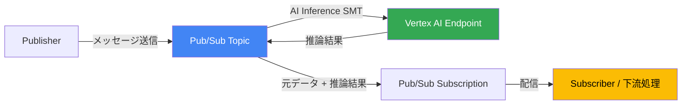

# Pub/Sub: AI Inference Single Method Transform (SMT) が GA

**リリース日**: 2026-04-06

**サービス**: Pub/Sub

**機能**: AI Inference Single Method Transform (SMT) - GA

**ステータス**: GA (一般提供)

[このアップデートのインフォグラフィックを見る](https://takech9203.github.io/google-cloud-news-summary/20260406-pubsub-ai-inference-smt-ga.html)

## 概要

Google Cloud Pub/Sub に AI Inference Single Message Transform (SMT) が一般提供 (GA) として追加されました。この新機能により、Pub/Sub メッセージに対して Vertex AI モデルによる推論をインラインで実行し、その結果を元のメッセージデータとともに下流の処理に渡すことが可能になります。

AI Inference SMT は、Pub/Sub の既存の Single Message Transform (SMT) フレームワークの新しいトランスフォームタイプとして提供されます。従来の JavaScript UDF に加え、`aiInference` タイプを指定することで、Vertex AI エンドポイントへの推論リクエストを Pub/Sub パイプライン内で直接実行できます。これにより、ストリーミングデータに対する AI 推論をシンプルかつ効率的に組み込むことが可能です。

本機能の展開は段階的に行われ、今週中にすべてのユーザーに順次提供されます。

**アップデート前の課題**

- ストリーミングデータに AI 推論を適用するには、Dataflow や Cloud Run functions などの別サービスを介した中間処理パイプラインの構築が必要だった
- メッセージごとに Vertex AI API を呼び出すカスタムコードの実装・運用・スケーリングが必要だった
- リアルタイムの AI エンリッチメントのためにアーキテクチャが複雑化し、レイテンシの増加やコスト増につながっていた

**アップデート後の改善**

- Pub/Sub のトピックまたはサブスクリプションの設定だけで、メッセージに対する Vertex AI 推論を直接実行可能になった
- 中間処理サービスの構築・運用が不要になり、アーキテクチャが大幅に簡素化された
- 推論結果が元のメッセージとともにサブスクライバーに配信されるため、下流の処理で即座に活用可能になった

## アーキテクチャ図



Publisher から送信されたメッセージは、Pub/Sub 内で AI Inference SMT により Vertex AI エンドポイントに送信され、推論結果が付与された状態でサブスクライバーに配信されます。

## サービスアップデートの詳細

### 主要機能

1. **AI Inference SMT タイプ**
   - `MessageTransform` の新しい union タイプとして `aiInference` が追加
   - Vertex AI エンドポイントを指定して推論リクエストを自動送信
   - トピックレベルおよびサブスクリプションレベルの両方で設定可能

2. **Vertex AI エンドポイント連携**
   - `projects/{project}/locations/{location}/endpoints/{endpoint}` 形式のカスタムエンドポイントをサポート
   - `projects/{project}/locations/{location}/publishers/{publisher}/models/{model}` 形式の Model Garden モデルもサポート
   - カスタムサービスアカウントによる認証をサポート

3. **Unstructured Inference モード**
   - リクエストとレスポンスを任意の JSON オブジェクトとして処理可能
   - `parameters` オブジェクトを指定して推論リクエストにパラメータを追加可能
   - メッセージの `data` フィールドと `parameters` が結合されて推論リクエストを構成

## 技術仕様

### AIInference 設定

| 項目 | 詳細 |
|------|------|
| `endpoint` | (必須) Vertex AI エンドポイントのリソース名 |
| `serviceAccountEmail` | (任意) 推論リクエストに使用するサービスアカウント。未指定時は Pub/Sub サービスエージェントを使用 |
| `unstructuredInference` | (任意) 非構造化推論モードの設定 |

### SMT 共通仕様

| 項目 | 詳細 |
|------|------|
| トピックまたはサブスクリプションあたりの最大 SMT 数 | 5 |
| 対象 | 個々の Pub/Sub メッセージ (集約不可) |
| 無効化 | `disabled: true` で一時的に無効化可能 |
| フィルターとの相互作用 | サブスクリプションフィルターが先に適用される |

### API 設定例

```json
{
  "messageTransforms": [
    {
      "aiInference": {
        "endpoint": "projects/my-project/locations/us-central1/publishers/google/models/gemini-2.0-flash",
        "serviceAccountEmail": "my-sa@my-project.iam.gserviceaccount.com",
        "unstructuredInference": {
          "parameters": {
            "temperature": 0.2,
            "maxOutputTokens": 256
          }
        }
      }
    }
  ]
}
```

## 設定方法

### 前提条件

1. Google Cloud プロジェクトで Pub/Sub API と Vertex AI API が有効化されていること
2. Pub/Sub サービスエージェント (`service-{PROJECT_NUMBER}@gcp-sa-pubsub.iam.gserviceaccount.com`) または指定するカスタムサービスアカウントに、Vertex AI エンドポイントへのアクセス権限があること
3. 使用する Vertex AI モデルエンドポイントがデプロイ済みであること

### 手順

#### ステップ 1: Vertex AI エンドポイントの確認

```bash
# デプロイ済みのエンドポイントを確認
gcloud ai endpoints list --region=us-central1 --project=my-project
```

使用するエンドポイントのリソース名を確認します。

#### ステップ 2: サービスアカウントの権限設定

```bash
# Pub/Sub サービスエージェントに Vertex AI ユーザーロールを付与
gcloud projects add-iam-policy-binding my-project \
  --member="serviceAccount:service-PROJECT_NUMBER@gcp-sa-pubsub.iam.gserviceaccount.com" \
  --role="roles/aiplatform.user"
```

Pub/Sub サービスエージェントが Vertex AI エンドポイントに推論リクエストを送信できるようにします。

#### ステップ 3: AI Inference SMT を設定したサブスクリプションの作成

Google Cloud コンソールまたは API を使用して、`aiInference` タイプの SMT を含むサブスクリプション (またはトピック) を作成します。

## メリット

### ビジネス面

- **開発コストの削減**: 中間処理パイプラインの構築が不要になり、AI 推論を組み込んだストリーミングアーキテクチャの構築コストが大幅に削減される
- **Time to Market の短縮**: Pub/Sub の設定変更だけでリアルタイム AI 推論を追加でき、新機能の市場投入が加速する

### 技術面

- **アーキテクチャの簡素化**: Dataflow や Cloud Run functions を介さずに Pub/Sub 内で直接 AI 推論を実行でき、運用負荷が軽減される
- **リアルタイム処理**: メッセージの流れの中でインラインに推論が実行されるため、追加のホップによるレイテンシが削減される
- **既存 SMT フレームワークとの統合**: JavaScript UDF と組み合わせて最大 5 つの SMT をチェーンでき、柔軟な処理パイプラインを構築可能

## デメリット・制約事項

### 制限事項

- トピックまたはサブスクリプションあたりの SMT 数は最大 5 つ
- SMT は個々のメッセージに対して動作し、複数メッセージの集約はできない
- 段階的なロールアウトのため、すべてのユーザーが即座に利用できるわけではない

### 考慮すべき点

- Vertex AI エンドポイントへの推論リクエストに伴うレイテンシがメッセージ配信に影響する可能性がある
- SMT でエラーが発生した場合、順序付き配信を使用しているサブスクリプションでは同じ ordering key の後続メッセージがブロックされるため、デッドレタートピックの設定が推奨される
- Dataflow パイプラインに接続するサブスクリプションでは、SMT によるメッセージのフィルタリングが Dataflow のオートスケーリングに影響する可能性がある

## ユースケース

### ユースケース 1: リアルタイムセンチメント分析

**シナリオ**: E コマースサイトのカスタマーレビューが Pub/Sub トピックに送信される。AI Inference SMT を使用して、各レビューのセンチメント (ポジティブ / ネガティブ / ニュートラル) をリアルタイムで判定し、結果を付与する。

**効果**: 別途 NLP パイプラインを構築することなく、レビューデータにセンチメント情報を即座に付加でき、ダッシュボードへのリアルタイム反映やアラート生成が可能になる。

### ユースケース 2: IoT データの異常検知

**シナリオ**: 製造ラインの IoT センサーデータが Pub/Sub に送信される。AI Inference SMT で Vertex AI にデプロイされた異常検知モデルを呼び出し、各センサーデータに対する異常スコアを付加する。

**効果**: リアルタイムで機器の異常を検出し、即座にアラートや自動対応をトリガーできる。Dataflow などの追加インフラなしで実現可能。

### ユースケース 3: コンテンツ分類とルーティング

**シナリオ**: ニュース記事やソーシャルメディア投稿が Pub/Sub トピックに流れ込む。AI Inference SMT で各コンテンツのカテゴリを自動分類し、サブスクリプションのフィルターと組み合わせて適切な下流システムにルーティングする。

**効果**: コンテンツ分類の自動化により、手動分類のコストと遅延を排除し、適切なチームやシステムへのリアルタイム配信が可能になる。

## 料金

AI Inference SMT の利用料金は、Pub/Sub の SMT 処理料金と、Vertex AI の推論料金の両方が発生します。詳細な料金体系については、Pub/Sub の料金ページおよび Vertex AI の料金ページを参照してください。

## 関連サービス・機能

- **Vertex AI**: AI Inference SMT のバックエンドとして推論を実行する ML プラットフォーム
- **Pub/Sub SMT (JavaScript UDF)**: AI Inference SMT と同じ SMT フレームワーク内で、カスタム JavaScript による変換処理を提供
- **Dataflow**: より複雑なストリーミング処理パイプラインに対応する、従来のデータ変換サービス
- **Cloud Run functions**: イベント駆動のカスタム処理を実行するサーバーレスサービス

## 参考リンク

- [インフォグラフィック](https://takech9203.github.io/google-cloud-news-summary/20260406-pubsub-ai-inference-smt-ga.html)
- [公式リリースノート](https://cloud.google.com/release-notes#April_06_2026)
- [Pub/Sub SMT 概要ドキュメント](https://cloud.google.com/pubsub/docs/smts/smts-overview)
- [Pub/Sub API リファレンス - MessageTransform](https://cloud.google.com/pubsub/docs/reference/rpc/google.pubsub.v1)
- [Pub/Sub 料金ページ](https://cloud.google.com/pubsub/pricing)
- [Vertex AI 料金ページ](https://cloud.google.com/vertex-ai/pricing)

## まとめ

Pub/Sub AI Inference SMT の GA リリースにより、ストリーミングデータパイプラインに AI 推論を組み込む作業が大幅に簡素化されます。中間処理サービスの構築が不要になるため、リアルタイム AI アプリケーションの開発を検討しているチームは、既存の Pub/Sub トピックやサブスクリプションに AI Inference SMT を追加する形での導入を推奨します。段階的ロールアウト中のため、利用可能になり次第検証環境での動作確認を開始してください。

---

**タグ**: #PubSub #VertexAI #AI #SMT #MachineLearning #Streaming #RealTime #GA
