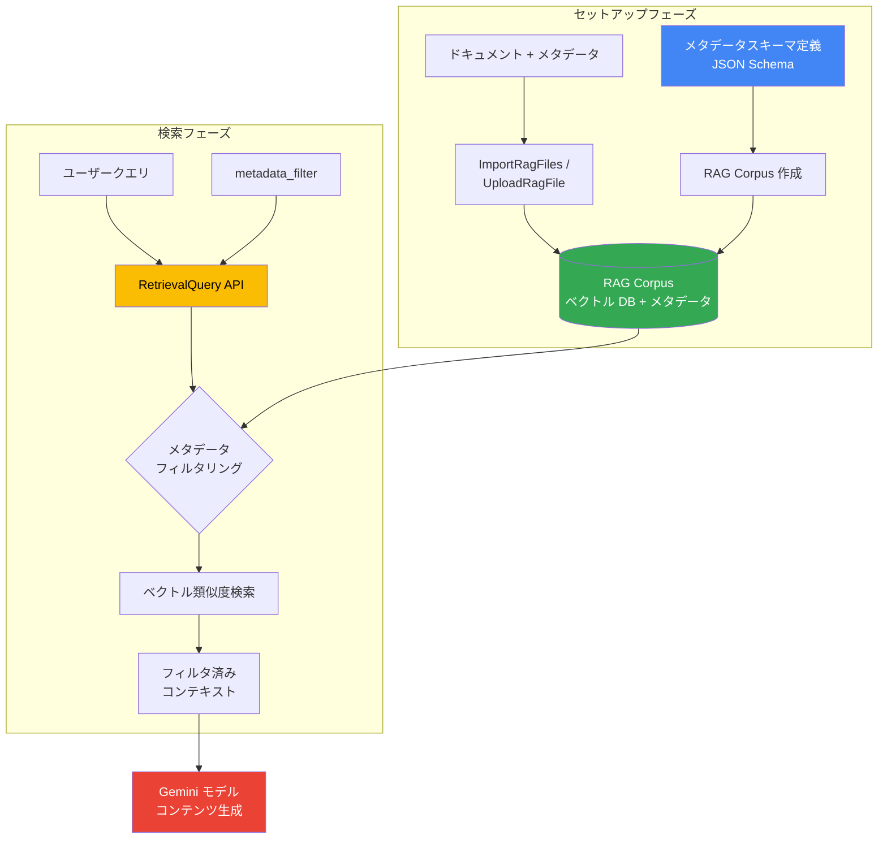

# Generative AI on Vertex AI: RAG Engine のメタデータ検索

**リリース日**: 2026-04-06

**サービス**: Generative AI on Vertex AI

**機能**: RAG Engine のメタデータ検索

**ステータス**: Feature

[このアップデートのインフォグラフィックを見る](https://takech9203.github.io/google-cloud-news-summary/20260406-vertex-ai-rag-engine-metadata-search.html)

## 概要

Vertex AI RAG Engine にスキーマベースのメタデータ検索機能が追加されました。この機能により、RAG コーパスにメタデータスキーマを定義し、コーパス内のファイルにメタデータを付与し、検索時にそのメタデータを使ってコンテキストをフィルタリングできるようになります。

RAG (Retrieval-Augmented Generation) アプリケーションでは、大量のドキュメントから関連情報を取得して LLM に提供しますが、ベクトル類似度だけでは十分な精度が得られない場合があります。メタデータ検索を使用することで、ドキュメントのカテゴリ、作成日、部署、言語などの構造化された属性情報に基づいてフィルタリングを行い、より的確なコンテキストを LLM に渡すことが可能になります。

対象ユーザーは、Vertex AI RAG Engine を使用して RAG アプリケーションを構築しているデベロッパー、データサイエンティスト、および企業のナレッジマネジメントシステムを運用しているチームです。

**アップデート前の課題**

- RAG Engine での検索はベクトル類似度とベクトル距離の閾値によるフィルタリングに限定されており、構造化されたメタデータでの絞り込みができなかった
- 特定のカテゴリやドキュメント種別に基づく検索を行うには、別途コーパスを分割するか、アプリケーション側で後処理が必要だった
- ファイルに対する属性情報を体系的に管理する仕組みがなく、大規模なナレッジベースの運用が困難だった

**アップデート後の改善**

- コーパスレベルでメタデータスキーマを定義し、ファイルごとにメタデータを付与できるようになった
- 検索クエリ時に `metadata_filter` パラメータを使用して、メタデータに基づくコンテキストのフィルタリングが可能になった
- スキーマベースの管理により、メタデータの一貫性と構造化が保証されるようになった

## アーキテクチャ図



メタデータスキーマを定義したコーパスにドキュメントとメタデータをインポートし、検索時に `metadata_filter` を適用することで、ベクトル類似度検索の前にメタデータベースのフィルタリングが実行され、より精度の高いコンテキスト取得が実現されます。

## サービスアップデートの詳細

### 主要機能

1. **メタデータスキーマの定義**
   - RAG コーパスレベルでメタデータスキーマを JSON 形式で定義可能
   - スキーマソースは Cloud Storage (GCS)、Google Drive、インライン JSON の 3 つの方法で指定可能
   - スキーマにより、メタデータフィールドの名前・型・構造を統一的に管理

2. **ファイルへのメタデータ付与**
   - `RagFileMetadataConfig` を使用して、ファイルインポート時にメタデータを付与
   - メタデータソースも GCS、Google Drive、インライン JSON から選択可能
   - ディレクトリ単位でのメタデータ一括適用にも対応（`metadata.json` ファイルを使用）

3. **メタデータフィルタリングによる検索**
   - `RagRetrievalConfig.Filter` の `metadata_filter` フィールドを使用してフィルタリング条件を指定
   - ベクトル距離/類似度閾値との組み合わせが可能
   - Retrieval Query API および GenerateContent API の両方で利用可能

## 技術仕様

### RagFileMetadataConfig

| 項目 | 詳細 |
|------|------|
| メタデータスキーマソース | `gcs_metadata_schema_source`、`google_drive_metadata_schema_source`、`inline_metadata_schema_source` |
| メタデータソース | `gcs_metadata_source`、`google_drive_metadata_source`、`inline_metadata_source` |
| スキーマ形式 | JSON 形式 |
| GCS ファイル命名規則 | スキーマ: `metadata_schema.json`、メタデータ: `metadata.json` |

### RagRetrievalConfig.Filter

| 項目 | 詳細 |
|------|------|
| `metadata_filter` | メタデータフィルタリング用の文字列 (Optional) |
| `vector_distance_threshold` | ベクトル距離閾値によるフィルタ (Optional) |
| `vector_similarity_threshold` | ベクトル類似度閾値によるフィルタ (Optional) |

### メタデータスキーマの定義例

```json
{
  "properties": {
    "category": {
      "type": "string",
      "description": "ドキュメントのカテゴリ"
    },
    "department": {
      "type": "string",
      "description": "所属部署"
    },
    "language": {
      "type": "string",
      "description": "ドキュメントの言語"
    },
    "created_date": {
      "type": "string",
      "description": "作成日"
    }
  }
}
```

## 設定方法

### 前提条件

1. Google Cloud プロジェクトで Vertex AI API が有効化されていること
2. RAG Engine を利用可能なリージョン（us-central1 など）を使用すること
3. 適切な IAM 権限（Vertex AI ユーザーロール以上）が付与されていること

### 手順

#### ステップ 1: メタデータスキーマ付きの RAG コーパスを作成

```python
from vertexai import rag
import vertexai

PROJECT_ID = "your-project-id"
LOCATION = "us-central1"

vertexai.init(project=PROJECT_ID, location=LOCATION)

# インラインでメタデータスキーマを指定してコーパスを作成
rag_corpus = rag.create_corpus(
    display_name="my-corpus-with-metadata",
    backend_config=rag.RagVectorDbConfig(
        vector_db=rag.RagManagedVertexVectorSearch()
    )
)
```

コーパスの作成時に、メタデータスキーマを定義します。スキーマは GCS、Google Drive、またはインライン JSON で指定できます。

#### ステップ 2: メタデータ付きでファイルをインポート

```python
# メタデータ設定を含めてファイルをインポート
response = rag.import_files(
    corpus_name=rag_corpus.name,
    paths=["gs://my-bucket/documents/"],
    rag_file_metadata_config=rag.RagFileMetadataConfig(
        inline_metadata_schema_source='{"properties": {"category": {"type": "string"}}}',
        gcs_metadata_source=rag.GcsSource(
            uris=["gs://my-bucket/metadata/"]
        )
    )
)
```

ファイルインポート時に `RagFileMetadataConfig` を指定して、メタデータスキーマとメタデータの値をそれぞれ設定します。

#### ステップ 3: メタデータフィルタを使用して検索

```python
response = rag.retrieval_query(
    rag_resources=[
        rag.RagResource(
            rag_corpus=rag_corpus.name,
        )
    ],
    text="プロジェクト管理のベストプラクティスについて教えてください",
    rag_retrieval_config=rag.RagRetrievalConfig(
        top_k=10,
        filter=rag.utils.resources.Filter(
            metadata_filter='category = "project_management"',
            vector_distance_threshold=0.5,
        ),
    ),
)
print(response)
```

`metadata_filter` パラメータでメタデータ条件を指定することで、指定条件に合致するドキュメントのみを対象に検索が実行されます。

## メリット

### ビジネス面

- **検索精度の向上**: メタデータによる事前フィルタリングにより、ビジネスコンテキストに合致した関連性の高い回答が得られる
- **マルチテナント対応の容易化**: 部署やプロジェクト単位のメタデータを付与することで、単一コーパスでの権限制御やスコープ分離が可能になる
- **運用コストの削減**: コーパスを分割せずにメタデータで論理的にデータを整理できるため、管理対象のリソース数を削減できる

### 技術面

- **検索パフォーマンスの最適化**: メタデータフィルタによりベクトル検索の対象を絞り込むことで、不要なドキュメントの検索を回避できる
- **柔軟なスキーマ設計**: JSON Schema ベースのメタデータ定義により、ユースケースに応じた柔軟な属性設計が可能
- **既存機能との併用**: ベクトル距離/類似度閾値やリランキング機能と組み合わせて、多層的なフィルタリングを構築可能

## デメリット・制約事項

### 制限事項

- メタデータスキーマはコーパスレベルで定義されるため、コーパス内の全ファイルが同一スキーマに従う必要がある
- v1beta1 API で提供されている機能であり、GA (Generally Available) への昇格時に仕様が変更される可能性がある

### 考慮すべき点

- メタデータの品質と一貫性がフィルタリング精度に直接影響するため、データ投入時の品質管理プロセスが重要
- メタデータフィルタの条件式の構文を正確に把握し、適切なフィルタ式を設計する必要がある
- 大規模なコーパスでのメタデータ更新には、ファイルの再インポートが必要となる場合がある

## ユースケース

### ユースケース 1: 企業内ナレッジベースの部署別検索

**シナリオ**: 全社横断のナレッジベースを構築し、各部署のドキュメントにメタデータ（部署名、ドキュメント種別、機密レベルなど）を付与する。ユーザーは自分の部署に関連するドキュメントのみを対象に質問を行う。

**実装例**:
```python
# 人事部のドキュメントのみを対象に検索
response = rag.retrieval_query(
    rag_resources=[rag.RagResource(rag_corpus=corpus_name)],
    text="育児休業の取得手続きについて",
    rag_retrieval_config=rag.RagRetrievalConfig(
        top_k=5,
        filter=rag.utils.resources.Filter(
            metadata_filter='department = "hr"',
        ),
    ),
)
```

**効果**: 無関係な部署のドキュメントがコンテキストに混入することを防ぎ、回答精度と応答速度が向上する

### ユースケース 2: 多言語ドキュメントの言語別フィルタリング

**シナリオ**: 多言語で作成された技術ドキュメントをコーパスに格納し、ユーザーの使用言語に応じて対象ドキュメントを絞り込む。

**実装例**:
```python
# 日本語ドキュメントのみを対象に検索
response = rag.retrieval_query(
    rag_resources=[rag.RagResource(rag_corpus=corpus_name)],
    text="Kubernetes クラスタのスケーリング方法",
    rag_retrieval_config=rag.RagRetrievalConfig(
        top_k=10,
        filter=rag.utils.resources.Filter(
            metadata_filter='language = "ja"',
            vector_distance_threshold=0.5,
        ),
    ),
)
```

**効果**: 言語の不一致によるノイズを排除し、ユーザーの言語に最適化されたコンテキストを提供できる

## 関連サービス・機能

- **Vertex AI RAG Engine**: メタデータ検索機能が追加された RAG の基盤サービス。ベクトル検索、チャンキング、パーシングなどの機能を統合的に提供
- **Vertex AI Vector Search**: RAG Engine のバックエンドとして使用可能なベクトルデータベース。メタデータフィルタと併用可能
- **Vertex AI Search**: RAG Engine の代替バックエンドとして使用可能な検索サービス。より高度なメタデータフィルタリングが可能
- **Gemini モデル**: RAG Engine で取得したコンテキストを使用してコンテンツ生成を行う LLM

## 参考リンク

- [インフォグラフィック](https://takech9203.github.io/google-cloud-news-summary/20260406-vertex-ai-rag-engine-metadata-search.html)
- [公式リリースノート](https://docs.cloud.google.com/release-notes#April_06_2026)
- [Vertex AI RAG Engine ドキュメント](https://cloud.google.com/vertex-ai/generative-ai/docs/rag-overview)
- [RAG API リファレンス](https://cloud.google.com/vertex-ai/generative-ai/docs/model-reference/rag-api)
- [RAG API v1beta1 リファレンス (RagFileMetadataConfig)](https://cloud.google.com/vertex-ai/generative-ai/docs/reference/rpc/google.cloud.aiplatform.v1beta1)

## まとめ

Vertex AI RAG Engine のメタデータ検索機能は、RAG アプリケーションの検索精度を大幅に向上させる重要なアップデートです。スキーマベースのメタデータ管理と検索時のフィルタリングにより、大規模なナレッジベースでも的確なコンテキスト取得が可能になります。RAG アプリケーションを運用中の場合は、既存のコーパスにメタデータスキーマを追加し、フィルタリング機能を活用することを推奨します。

---

**タグ**: #VertexAI #RAGEngine #メタデータ検索 #GenerativeAI #検索フィルタリング #RAG #ナレッジベース
