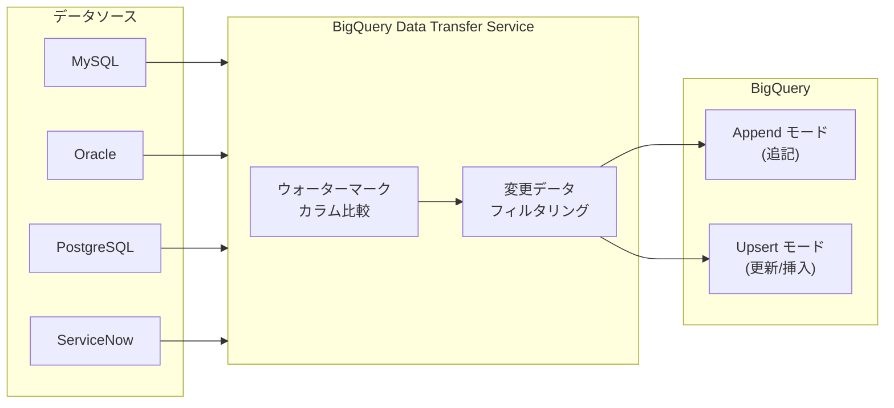

# BigQuery: Data Transfer Service 増分データ転送 (Incremental Data Transfers)

**リリース日**: 2026-04-07

**サービス**: BigQuery

**機能**: Data Transfer Service Incremental Data Transfers (増分データ転送)

**ステータス**: Preview

[このアップデートのインフォグラフィックを見る](https://takech9203.github.io/google-cloud-news-summary/20260407-bigquery-data-transfer-incremental.html)

## 概要

BigQuery Data Transfer Service において、データベースコネクタの増分データ転送 (Incremental Data Transfers) が新たにサポートされました。対象となるデータソースコネクタは MySQL、Oracle、PostgreSQL、ServiceNow の 4 つで、いずれも Preview として提供されています。

増分データ転送は、前回の転送以降に変更されたデータのみを BigQuery に転送する機能です。従来のフルデータ転送ではソーステーブル全体を毎回転送する必要がありましたが、増分転送によりウォーターマークカラムを基準として新規・更新データのみを効率的に転送できるようになりました。

この機能は、大規模なデータベースを BigQuery に同期しているユーザー、特にリアルタイムに近い分析を必要とするデータエンジニアやアナリストにとって大きなメリットとなります。

**アップデート前の課題**

- MySQL、Oracle、PostgreSQL、ServiceNow からの転送はフルデータ転送のみで、毎回ソーステーブル全体を転送する必要があった
- 大規模データセットでは転送時間が長く、ネットワーク帯域やコンピューティングリソースの消費が大きかった
- 転送頻度を上げると不要なデータの再転送が増え、コスト効率が悪かった

**アップデート後の改善**

- ウォーターマークカラムを利用して、前回の転送以降に変更されたデータのみを転送可能になった
- Append モード (追記) と Upsert モード (更新・挿入) の 2 つの書き込みモードを選択可能になった
- 転送時間の短縮とリソース消費の削減により、より高頻度なデータ同期が実現可能になった

## アーキテクチャ図



BigQuery Data Transfer Service が各データソースからウォーターマークカラムの値を比較し、変更データのみをフィルタリングして BigQuery に転送します。書き込みモードとして Append (追記のみ) または Upsert (主キーによる更新・挿入) を選択できます。

## サービスアップデートの詳細

### 主要機能

1. **増分転送 (Incremental Transfer)**
   - 前回の転送成功時刻以降に変更されたデータのみを転送
   - ウォーターマークカラム (TIMESTAMP 型) を基準に変更を検出
   - 初回転送時はソーステーブル全体を転送し、2 回目以降から増分転送を実施

2. **Append 書き込みモード**
   - 新しいレコードを宛先テーブルに追記
   - ウォーターマークカラムの指定が必須
   - 既存レコードの重複チェックは行わないため、ソースで更新されたレコードが重複する可能性がある

3. **Upsert 書き込みモード**
   - 主キーに基づいてレコードの更新または新規挿入を実施
   - ウォーターマークカラムと主キーの両方の指定が必須
   - 既存レコードは更新され、新規レコードは挿入されるため、宛先テーブルとソーステーブルの整合性を保持可能

4. **対応データソース**
   - MySQL: オンプレミス、Cloud SQL、AWS、Azure でホストされたインスタンス
   - Oracle: オンプレミス、クラウドでホストされたインスタンス
   - PostgreSQL: オンプレミス、Cloud SQL、AWS、Azure でホストされたインスタンス
   - ServiceNow: ServiceNow インスタンス

## 技術仕様

### 増分転送の設定パラメータ

| パラメータ | 説明 | 必須/任意 |
|------|------|------|
| `ingestionType` | `FULL` または `INCREMENTAL` を指定 | 必須 |
| `writeMode` | `WRITE_MODE_APPEND` または `WRITE_MODE_UPSERT` を指定 | 増分転送時は必須 |
| `watermarkColumns` | 変更追跡に使用するカラム (TIMESTAMP 型) | 増分転送時は必須 |
| `primaryKeys` | 主キーとなるカラム (Upsert モード時) | Upsert モード時は必須 |
| `assets` | 転送対象のテーブルリスト | 必須 |

### 書き込みモードの比較

| 項目 | Append モード | Upsert モード |
|------|------|------|
| 動作 | 新規行を追記 | 主キーで更新/挿入 |
| ウォーターマークカラム | 必須 | 必須 |
| 主キー | 不要 | 必須 |
| 重複の可能性 | あり | なし |
| ソースの削除同期 | 非対応 | 非対応 |
| 推奨ウォーターマーク | `CREATED_AT` 等の作成日時カラム | `UPDATED_AT` 等の更新日時カラム |

## 設定方法

### 前提条件

1. BigQuery Data Transfer Service が有効化されていること
2. `roles/bigquery.admin` IAM ロールが付与されていること
3. 転送先の BigQuery データセットが作成済みであること
4. ソースデータベースへの接続に必要なネットワークアタッチメントが構成済みであること

### 手順

#### ステップ 1: Google Cloud Console から転送を作成

Google Cloud Console の [データ転送] ページから新しい転送を作成します。ソースタイプとして MySQL、Oracle、PostgreSQL、または ServiceNow を選択し、接続情報を入力します。[Ingestion type] で [Incremental] を選択します。

#### ステップ 2: bq コマンドラインで PostgreSQL 増分転送を作成する例

```bash
bq mk --transfer_config \
  --target_dataset=mydataset \
  --data_source=postgresql \
  --display_name='My Incremental Transfer' \
  --params='{
    "assets": ["DB1/PUBLIC/DEPARTMENT", "DB1/PUBLIC/EMPLOYEES"],
    "connector.authentication.username": "User1",
    "connector.authentication.password": "ABC12345",
    "connector.database": "DB1",
    "connector.endpoint.host": "192.168.0.1",
    "connector.endpoint.port": 5432,
    "ingestionType": "incremental",
    "writeMode": "WRITE_MODE_APPEND",
    "watermarkColumns": ["createdAt", "createdAt"],
    "primaryKeys": [["dep_id"], ["report_by", "report_title"]],
    "connector.tls.mode": "ENCRYPT_VERIFY_CA_AND_HOST",
    "connector.tls.trustedServerCertificate": "PEM-encoded certificate"
  }'
```

複数のアセットを指定する場合、`watermarkColumns` と `primaryKeys` の値は `assets` フィールドの位置に対応します。

#### ステップ 3: MySQL 増分転送を作成する例

```bash
bq mk --transfer_config \
  --target_dataset=mydataset \
  --data_source=mysql \
  --display_name='My MySQL Incremental Transfer' \
  --params='{
    "assets": ["mydb/mytable"],
    "connector.authentication.username": "user1",
    "connector.authentication.password": "password123",
    "connector.database": "mydb",
    "connector.endpoint.host": "10.0.0.1",
    "connector.endpoint.port": 3306,
    "connector.legacyMapping": false,
    "ingestionType": "incremental",
    "writeMode": "WRITE_MODE_UPSERT",
    "watermarkColumns": ["updated_at"],
    "primaryKeys": [["id"]]
  }'
```

増分転送を使用する場合、レガシーデータ型マッピングは無効 (`connector.legacyMapping: false`) にする必要があります。

## メリット

### ビジネス面

- **コスト削減**: フルデータ転送と比較して、転送データ量が大幅に削減されるため、データ転送コストとストレージコストを抑制可能
- **データ鮮度の向上**: 転送時間が短縮されるため、より高頻度のスケジュール設定が可能になり、BigQuery 上のデータ鮮度が向上
- **運用効率の改善**: データベースコネクタに増分転送が組み込まれたことで、カスタム ETL パイプラインの構築・保守が不要に

### 技術面

- **ネットワーク負荷の軽減**: 変更データのみの転送により、ソースデータベースやネットワークへの負荷が軽減
- **Upsert による整合性確保**: 主キーベースの Upsert モードにより、ソースとの整合性を維持した増分同期が可能
- **フェイルセーフ設計**: 転送失敗時もデータの重複や欠損が発生しない設計 (次回の成功転送で未転送データを自動的にカバー)

## デメリット・制約事項

### 制限事項

- ウォーターマークカラムは TIMESTAMP 型のみサポート (MySQL の場合)
- ウォーターマークカラムの値は単調増加である必要がある
- ソーステーブルでの DELETE 操作は増分転送では同期されない
- 1 つの転送構成で増分転送とフル転送を混在させることはできない
- 初回の増分転送実行後にアセットリスト、書き込みモード、ウォーターマークカラム、主キーの変更はできない
- 宛先の BigQuery テーブルは指定された主キーでクラスタリングされるため、クラスタリングテーブルの制限事項が適用される

### 考慮すべき点

- 現在 Preview 段階であるため、SLA の適用対象外
- ウォーターマークカラムの「最終更新時刻」プロパティを手動で変更すると、ファイルのスキップや重複ロードが発生する可能性がある
- ウォーターマークカラムにインデックスを作成することを推奨 (パフォーマンス向上のため)
- フィードバックやサポートは dts-preview-support@google.com に連絡

## ユースケース

### ユースケース 1: EC サイトの注文データのリアルタイム分析

**シナリオ**: EC サイトのバックエンドに MySQL を使用しており、注文データを BigQuery で分析したい。注文テーブルは数百万行あり、毎回フルデータ転送すると数時間かかっていた。

**実装例**:
```json
{
  "assets": ["ecommerce/orders"],
  "ingestionType": "incremental",
  "writeMode": "WRITE_MODE_UPSERT",
  "watermarkColumns": ["updated_at"],
  "primaryKeys": [["order_id"]]
}
```

**効果**: 増分転送により転送時間が数分に短縮。注文ステータスの更新も Upsert モードで反映されるため、BigQuery 上のデータが常にソースと一致した状態を維持。

### ユースケース 2: ServiceNow のインシデント管理データの定期同期

**シナリオ**: IT 運用チームが ServiceNow のインシデントデータを BigQuery に同期し、傾向分析やダッシュボードに活用したい。日次のフル転送ではデータの鮮度が不足していた。

**効果**: 増分転送により転送頻度を上げることで、ダッシュボードのデータ鮮度が向上。チケットのステータス変更もタイムリーに反映される。

### ユースケース 3: Oracle データウェアハウスから BigQuery への段階的移行

**シナリオ**: オンプレミスの Oracle データウェアハウスから BigQuery への移行を計画しているが、一括移行はリスクが高い。まず増分転送でデータを同期し、並行稼働しながら段階的に移行したい。

**効果**: 初回転送でフルスナップショットを取得後、増分転送で差分を継続的に同期。BigQuery 側でクエリのパフォーマンスを検証しながら、安全に移行を進められる。

## 料金

BigQuery Data Transfer Service の増分データ転送は現在 Preview 段階です。料金の詳細は [Data Transfer Service の料金ページ](https://cloud.google.com/bigquery/pricing#data-transfer-service-pricing)を参照してください。BigQuery にデータが転送された後は、標準の BigQuery [ストレージ料金](https://cloud.google.com/bigquery/pricing#storage)および[クエリ料金](https://cloud.google.com/bigquery/pricing#queries)が適用されます。

## 利用可能リージョン

BigQuery Data Transfer Service はマルチリージョンリソースとして提供されています。転送構成は宛先データセットと同じロケーションに設定されます。BigQuery がサポートする全てのリージョンで利用可能です。詳細は[データセットのロケーションと転送](https://cloud.google.com/bigquery/docs/dts-locations)を参照してください。

## 関連サービス・機能

- **[BigQuery Data Transfer Service](https://cloud.google.com/bigquery/docs/dts-introduction)**: 本機能の基盤となるマネージドデータ転送サービス
- **[Cloud Storage Transfer (増分転送)](https://cloud.google.com/bigquery/docs/cloud-storage-transfer-overview)**: Cloud Storage からの既存の増分転送機能。同様の APPEND/MIRROR 書き込みモードをサポート
- **[Cloud SQL](https://cloud.google.com/sql)**: MySQL/PostgreSQL のマネージドデータベースサービス。Cloud SQL 上のインスタンスからも増分転送が可能
- **[Datastream](https://cloud.google.com/datastream)**: CDC (Change Data Capture) ベースのリアルタイムデータレプリケーションサービス。より低レイテンシの要件がある場合の代替手段

## 参考リンク

- [インフォグラフィック](https://takech9203.github.io/google-cloud-news-summary/20260407-bigquery-data-transfer-incremental.html)
- [公式リリースノート](https://docs.cloud.google.com/release-notes#April_07_2026)
- [BigQuery Data Transfer Service の概要](https://cloud.google.com/bigquery/docs/dts-introduction)
- [MySQL 転送の設定](https://cloud.google.com/bigquery/docs/mysql-transfer)
- [Oracle 転送の設定](https://cloud.google.com/bigquery/docs/oracle-transfer)
- [PostgreSQL 転送の設定](https://cloud.google.com/bigquery/docs/postgresql-transfer)
- [ServiceNow 転送の設定](https://cloud.google.com/bigquery/docs/servicenow-transfer)
- [料金ページ](https://cloud.google.com/bigquery/pricing#data-transfer-service-pricing)

## まとめ

BigQuery Data Transfer Service の増分データ転送サポートにより、MySQL、Oracle、PostgreSQL、ServiceNow からのデータ同期が大幅に効率化されます。フルデータ転送と比較して転送時間とコストを削減しつつ、Upsert モードによるデータ整合性の維持も可能です。現在 Preview 段階のため本番環境での利用には注意が必要ですが、大規模データベースの BigQuery 同期を検討しているチームは早期に検証を開始することを推奨します。

---

**タグ**: #BigQuery #DataTransferService #IncrementalTransfer #MySQL #Oracle #PostgreSQL #ServiceNow #Preview #データ統合 #ETL
