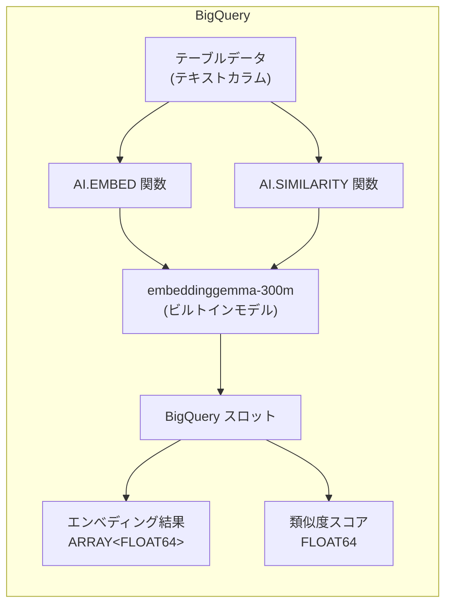

# BigQuery: AI.EMBED / AI.SIMILARITY で EmbeddingGemma-300M モデルが利用可能に

**リリース日**: 2026-04-07

**サービス**: BigQuery

**機能**: AI.EMBED および AI.SIMILARITY 関数でビルトインテキスト埋め込みモデル EmbeddingGemma-300M が利用可能に

**ステータス**: Preview

[このアップデートのインフォグラフィックを見る](https://takech9203.github.io/google-cloud-news-summary/20260407-bigquery-embeddinggemma-300m.html)

## 概要

BigQuery の AI.EMBED 関数および AI.SIMILARITY 関数で、ビルトインテキスト埋め込みモデル「embeddinggemma-300m」が利用可能になりました。EmbeddingGemma は Google DeepMind が開発した 3 億パラメータの軽量テキスト埋め込みモデルで、Gemma 3 をベースに構築されています。100 以上の言語に対応し、検索・分類・クラスタリング・セマンティック類似度検索などのタスクに最適化されています。

このモデルの最大の特徴は、外部の Vertex AI API を呼び出すのではなく、BigQuery のスロットを使用してエンべディングを生成する点です。これにより、Vertex AI へのネットワークコールが不要となり、BigQuery の既存のコンピューティングリソースを活用して大規模なエンべディング生成を実行できます。

データアナリスト、データエンジニア、ML エンジニアなど、BigQuery 上でテキストデータのセマンティック分析を行いたいユーザーが主な対象となります。

**アップデート前の課題**

- AI.EMBED や AI.SIMILARITY でテキスト埋め込みを生成する際、Vertex AI のリモートモデル (text-embedding-005 など) を使用する必要があり、外部 API 呼び出しのレイテンシとコストが発生していた
- Vertex AI へのコネクション設定、サービスアカウントへの Vertex AI User ロール付与などの事前設定が必要だった
- 大規模データに対するエンべディング生成では、Vertex AI API のクォータやスループットが制約となる場合があった

**アップデート後の改善**

- BigQuery スロットを使用してエンべディングを生成するため、外部 API 呼び出しが不要になり、レイテンシが低減された
- Vertex AI へのコネクション設定が不要で、よりシンプルに利用を開始できる
- BigQuery の既存のスロット容量を活用するため、大規模データへのスケーリングが容易になった
- 3 億パラメータの軽量モデルにより、効率的なリソース利用が可能になった

## アーキテクチャ図



BigQuery 内部でビルトインモデル embeddinggemma-300m が実行され、外部サービスへの通信なしにエンべディング生成と類似度計算が完結します。

## サービスアップデートの詳細

### 主要機能

1. **AI.EMBED 関数での embeddinggemma-300m サポート**
   - テキスト入力に対してベクトル表現 (エンべディング) を生成
   - 出力は `STRUCT` 型で、`result` フィールドに `ARRAY<FLOAT64>` のエンべディングベクトルを含む
   - デフォルトの出力次元数は 768、Matryoshka Representation Learning (MRL) により 512、256、128 次元への縮小も対応

2. **AI.SIMILARITY 関数での embeddinggemma-300m サポート**
   - 2 つのテキスト入力間のコサイン類似度をスカラー値 (FLOAT64) で返す
   - セマンティック検索、レコメンデーション、分類のユースケースに最適
   - 値が 1 に近いほど類似度が高く、0 に近いほど類似度が低いことを示す

3. **BigQuery スロットによるローカル実行**
   - Vertex AI API への外部呼び出しが不要
   - BigQuery の予約済みスロットまたはオンデマンドスロットを使用して推論を実行
   - 大規模データセットに対するエンべディング生成のスケーラビリティが向上

## 技術仕様

### EmbeddingGemma-300M モデル仕様

| 項目 | 詳細 |
|------|------|
| モデル名 | embeddinggemma-300m |
| パラメータ数 | 約 3 億 (300M) |
| ベースモデル | Gemma 3 (T5Gemma 初期化) |
| 最大入力コンテキスト長 | 2,048 トークン |
| デフォルト出力次元数 | 768 |
| 対応出力次元数 | 768, 512, 256, 128 (MRL による) |
| 対応言語数 | 100 以上 |
| ステータス | Preview |

### AI.EMBED 関数の構文

```sql
AI.EMBED(
  [content =>] 'テキスト内容',
  endpoint => 'embeddinggemma-300m'
  [, task_type => 'タスクタイプ']
  [, title => 'タイトル']
  [, model_params => model_params]
)
```

### AI.SIMILARITY 関数の構文

```sql
AI.SIMILARITY(
  content1 => 'テキスト1',
  content2 => 'テキスト2',
  endpoint => 'embeddinggemma-300m'
)
```

## 設定方法

### 前提条件

1. BigQuery が有効なGoogle Cloud プロジェクト
2. BigQuery Job User (`roles/bigquery.jobUser`) ロール
3. BigQuery Data Editor (`roles/bigquery.dataEditor`) ロール (テーブルデータにアクセスする場合)

### 手順

#### ステップ 1: AI.EMBED でエンべディングを生成する

```sql
-- 単一テキストのエンべディング生成
SELECT AI.EMBED(
  content => 'Google Cloud のサーバーレスデータ分析',
  endpoint => 'embeddinggemma-300m'
);
```

#### ステップ 2: テーブルデータに対してエンべディングを生成する

```sql
-- テーブル内のテキストカラムに対するエンべディング生成
SELECT
  id,
  text_column,
  AI.EMBED(
    content => text_column,
    endpoint => 'embeddinggemma-300m'
  ) AS embedding
FROM `project.dataset.my_table`;
```

#### ステップ 3: AI.SIMILARITY でテキスト間の類似度を計算する

```sql
-- 2 つのテキスト間のセマンティック類似度を計算
SELECT AI.SIMILARITY(
  content1 => '機械学習モデルのトレーニング',
  content2 => 'ML モデルの学習プロセス',
  endpoint => 'embeddinggemma-300m'
) AS similarity_score;
```

## メリット

### ビジネス面

- **コスト効率の向上**: Vertex AI API の呼び出しコストが不要になり、BigQuery の既存スロットを活用できるため、大規模なエンべディング生成のコストを抑制できる
- **運用の簡素化**: 外部サービスへのコネクション設定やサービスアカウント管理が不要になり、運用負荷が軽減される

### 技術面

- **低レイテンシ**: BigQuery 内部での処理により、外部 API 呼び出しに伴うネットワークレイテンシが排除される
- **スケーラビリティ**: BigQuery のスロットベースのアーキテクチャにより、大規模データセットへの並列処理が容易
- **多言語対応**: 100 以上の言語に対応しており、グローバルなテキストデータの処理が可能
- **柔軟な次元数**: MRL 技術により、ユースケースに応じて出力次元数 (768/512/256/128) を選択可能

## デメリット・制約事項

### 制限事項

- 本機能は Preview ステータスのため、本番環境での使用には注意が必要。SLA の対象外となる可能性がある
- 入力コンテキスト長は最大 2,048 トークンに制限される
- テキスト埋め込みのみ対応しており、画像やマルチモーダルデータには対応していない

### 考慮すべき点

- ビルトインモデルは BigQuery スロットを消費するため、他のクエリワークロードとのリソース競合が発生する可能性がある
- 既存の Vertex AI ベースのエンべディングモデル (text-embedding-005 など) とは異なるモデルアーキテクチャのため、生成されるエンべディングの互換性はない
- 3 億パラメータモデルはサイズの小ささが利点である一方、より大規模なモデルと比較して精度が劣る場面もありうる

## ユースケース

### ユースケース 1: BigQuery 内でのセマンティック検索

**シナリオ**: 大量の製品レビューデータを BigQuery に格納しており、特定のトピックに関連するレビューをセマンティック検索したい場合。

**実装例**:
```sql
-- 製品レビューの中から「配送の遅延」に関連するレビューを検索
SELECT
  review_id,
  review_text,
  AI.SIMILARITY(
    content1 => review_text,
    content2 => '配送が遅れた、届くのが遅い',
    endpoint => 'embeddinggemma-300m'
  ) AS relevance_score
FROM `project.dataset.product_reviews`
ORDER BY relevance_score DESC
LIMIT 20;
```

**効果**: キーワードの完全一致に依存せず、意味的に関連するレビューを効率的に抽出できる。BigQuery のスロットで処理されるため、大量データでもスケーラブルに実行可能。

### ユースケース 2: テキスト分類のためのエンべディング生成

**シナリオ**: サポートチケットのテキストデータをエンべディングに変換し、BigQuery ML や外部の分類モデルの入力特徴量として活用したい場合。

**実装例**:
```sql
-- サポートチケットのエンべディングを生成してテーブルに保存
CREATE OR REPLACE TABLE `project.dataset.ticket_embeddings` AS
SELECT
  ticket_id,
  subject,
  (AI.EMBED(
    content => subject,
    endpoint => 'embeddinggemma-300m'
  )).result AS embedding_vector
FROM `project.dataset.support_tickets`;
```

**効果**: 外部 API を使わずに BigQuery 内で完結するため、データの移動が不要。生成したエンべディングを VECTOR_SEARCH 関数と組み合わせることで、高速な近似最近傍検索も実現可能。

## 料金

embeddinggemma-300m はビルトインモデルとして BigQuery スロットを使用して推論を実行します。そのため、Vertex AI API の呼び出し料金は発生せず、使用した BigQuery スロットの消費量に基づいて課金されます。

- **オンデマンド料金**: クエリで処理されたスロット時間に応じた従量課金
- **容量ベース料金 (Editions)**: 予約済みスロットまたはオートスケーリングスロットの利用料金

具体的な料金は BigQuery の料金体系に従います。Preview 期間中の料金については公式ドキュメントを確認してください。

## 関連サービス・機能

- **[AI.GENERATE_EMBEDDING 関数](https://docs.cloud.google.com/bigquery/docs/reference/standard-sql/bigqueryml-syntax-ai-generate-embedding)**: BigQuery ML のリモートモデルを使用したエンべディング生成関数。CREATE MODEL によるモデル作成が必要
- **[VECTOR_SEARCH 関数](https://docs.cloud.google.com/bigquery/docs/reference/standard-sql/search_functions#vector_search)**: 事前計算されたエンべディングに対する高速なベクトル検索。大規模データセットでのパフォーマンスが重要な場合に最適
- **[Vertex AI テキストエンべディングモデル](https://docs.cloud.google.com/vertex-ai/generative-ai/docs/embeddings/get-text-embeddings)**: text-embedding-005 や gemini-embedding-001 などのリモートエンべディングモデル
- **[EmbeddingGemma (オープンモデル)](https://ai.google.dev/gemma/docs/embeddinggemma)**: Kaggle や Hugging Face で公開されているオープンソース版の EmbeddingGemma モデル

## 参考リンク

- [インフォグラフィック](https://takech9203.github.io/google-cloud-news-summary/20260407-bigquery-embeddinggemma-300m.html)
- [公式リリースノート](https://docs.cloud.google.com/release-notes#April_07_2026)
- [AI.EMBED 関数ドキュメント](https://docs.cloud.google.com/bigquery/docs/reference/standard-sql/bigqueryml-syntax-ai-embed)
- [AI.SIMILARITY 関数ドキュメント](https://docs.cloud.google.com/bigquery/docs/reference/standard-sql/bigqueryml-syntax-ai-similarity)
- [EmbeddingGemma モデルカード](https://ai.google.dev/gemma/docs/embeddinggemma/model_card)

## まとめ

BigQuery の AI.EMBED / AI.SIMILARITY 関数で EmbeddingGemma-300M がビルトインモデルとして利用可能になったことで、外部 API 呼び出しなしに BigQuery スロットだけでテキスト埋め込みと類似度計算を実行できるようになりました。100 以上の言語に対応する軽量モデルにより、大規模テキストデータのセマンティック分析がより手軽かつ効率的に行えます。現在は Preview ステータスのため、本番ワークロードへの適用は公式ドキュメントで最新の制約事項を確認した上で検討してください。

---

**タグ**: #BigQuery #AI.EMBED #AI.SIMILARITY #EmbeddingGemma #テキスト埋め込み #セマンティック検索 #Preview #BigQueryML
