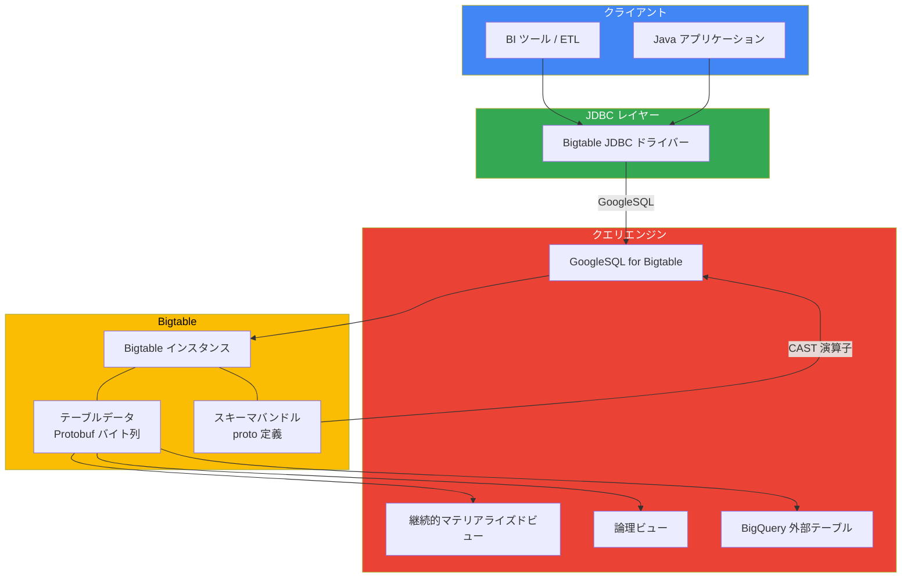

# Bigtable: JDBC ドライバーと Protobuf スキーマクエリが GA

**リリース日**: 2026-04-07

**サービス**: Bigtable

**機能**: JDBC ドライバー GA / Protobuf スキーマクエリ GA

**ステータス**: GA (一般提供)

[このアップデートのインフォグラフィックを見る](https://takech9203.github.io/google-cloud-news-summary/20260407-bigtable-jdbc-driver-protobuf-ga.html)

## 概要

Bigtable において、2 つの重要な機能が一般提供 (GA) となりました。1 つ目は JDBC ドライバーで、Java アプリケーションや汎用 JDBC アダプターをサポートするレポーティングツールから Bigtable に直接接続できるようになります。2 つ目は Protobuf スキーマサポートで、Bigtable にバイトとして格納された protobuf メッセージ内の個別フィールドに対して、GoogleSQL for Bigtable、継続的マテリアライズドビュー、論理ビュー、または BigQuery 外部テーブルを使用してクエリを実行できるようになります。

これらの機能は Preview から GA に昇格したもので、本番環境での利用が正式にサポートされるようになりました。JDBC ドライバーは既存の Java エコシステムとの統合を大幅に簡素化し、Protobuf スキーマは構造化バイナリデータへの柔軟なクエリアクセスを提供します。

対象ユーザーは、Bigtable を利用する Java 開発者、BI ツールユーザー、ETL パイプライン構築者、および protobuf 形式でデータを格納しているデータエンジニアです。

**アップデート前の課題**

- Java アプリケーションから Bigtable にアクセスするには、Bigtable クライアントライブラリを直接使用する必要があり、JDBC 標準インターフェースを前提としたツールやフレームワークとの統合が困難だった
- BI ツールや ETL フレームワークから Bigtable に接続するには、カスタムコネクタの開発が必要だった
- Protobuf 形式で格納されたバイトデータの個別フィールドにクエリを実行するには、アプリケーション側でデシリアライズ処理を実装する必要があった
- Protobuf スキーマ機能は Preview であり、本番環境での利用にはサポート面での制約があった

**アップデート後の改善**

- JDBC 標準インターフェースを通じて、Java アプリケーションや BI ツールから直接 Bigtable にクエリを実行できるようになった
- Protobuf メッセージ内のネストされたフィールドに対して、SQL の CAST 演算子やドット記法で直接アクセスできるようになった
- 両機能が GA となり、Cloud Customer Care による本番環境レベルのサポートが提供されるようになった
- Protobuf データを GoogleSQL、継続的マテリアライズドビュー、論理ビュー、BigQuery 外部テーブルの 4 つの方法でクエリ可能になった

## アーキテクチャ図



JDBC ドライバーは Bigtable クライアントライブラリのラッパーとして動作し、GoogleSQL を使用してクエリを実行します。Protobuf スキーマバンドルにより、バイトデータを構造化フィールドとして直接クエリできます。

## サービスアップデートの詳細

### 主要機能

1. **JDBC ドライバー (GA)**
   - JDBC API の標準インターフェース (Connection, Statement, PreparedStatement, ResultSet) をサポート
   - 接続文字列形式: `jdbc:bigtable:/projects/{PROJECT}/instances/{INSTANCE}?app_profile_id={PROFILE}`
   - パラメータ付きクエリに PreparedStatement を使用し、効率的なクエリ再利用が可能
   - Java JDK 8 以降と Apache Maven が必要
   - BI ツールや ETL フレームワークからの汎用 JDBC 接続にも対応

2. **Protobuf スキーマクエリ (GA)**
   - スキーマバンドル (テーブルレベルのリソース) に protobuf スキーマをアップロードして使用
   - CAST 演算子でバイト列を protobuf メッセージとして解釈: `CAST(column AS bundle.package.Message)`
   - ネストされたフィールドへのドット記法アクセスをサポート
   - WHERE 句でのフィルタリング、集約関数 (SUM, AVG, COUNT)、ORDER BY での並べ替えが可能
   - GoogleSQL、継続的マテリアライズドビュー、論理ビュー、BigQuery 外部テーブルの 4 つのクエリ方法をサポート

## 技術仕様

### JDBC ドライバー

| 項目 | 詳細 |
|------|------|
| ドライバークラス | `com.google.cloud.bigtable.jdbc.BigtableDriver` |
| 接続文字列形式 | `jdbc:bigtable:/projects/{PROJECT}/instances/{INSTANCE}` |
| 必要な IAM ロール | Bigtable Reader (`roles/bigtable.reader`) |
| Java バージョン | JDK 8 以降 |
| 接続プーリング | 非サポート (単一接続の再利用を推奨) |
| クエリ言語 | GoogleSQL for Bigtable |

### Protobuf スキーマ

| 項目 | 詳細 |
|------|------|
| リソース単位 | テーブルレベル (スキーマバンドル) |
| 入力形式 | protobuf ファイルディスクリプタセット |
| 必要な IAM ロール | Bigtable Admin (`roles/bigtable.admin`) |
| スキーマ更新 | 後方互換性チェック付き (強制更新オプションあり) |
| クエリ構文 | `CAST(column AS SCHEMA_BUNDLE_ID.PACKAGE.MESSAGE)` |

## 設定方法

### JDBC ドライバーの設定

#### 前提条件

1. Java JDK 8 以降がインストールされていること
2. Apache Maven がインストールされていること
3. Bigtable Reader (`roles/bigtable.reader`) 以上の IAM ロールが付与されていること

#### ステップ 1: Maven 依存関係の追加

```xml
<!-- pom.xml -->
<dependency>
  <groupId>com.google.cloud</groupId>
  <artifactId>bigtable-jdbc</artifactId>
  <version>1.0</version>
</dependency>
```

#### ステップ 2: ドライバーのロードと接続

```java
// ドライバークラスのロード
Class.forName("com.google.cloud.bigtable.jdbc.BigtableDriver");

// 接続文字列の構築
String connStr = String.format(
    "jdbc:bigtable:/projects/%s/instances/%s?app_profile_id=%s",
    projectId, instanceId, appProfileId);

// 接続の確立とクエリ実行
try (Connection connection = DriverManager.getConnection(connStr)) {
    try (Statement statement = connection.createStatement()) {
        try (ResultSet rs = statement.executeQuery(
            "SELECT _key, cf['qualifier'] FROM myTable WHERE _key = 'row1'")) {
            while (rs.next()) {
                System.out.println(rs.getString(0));
            }
        }
    }
}
```

### Protobuf スキーマの設定

#### ステップ 1: ディスクリプタセットの生成

```bash
# proto ファイルからディスクリプタセットを生成
protoc --descriptor_set_out=schema.pb \
  --include_imports \
  artist.proto album.proto
```

#### ステップ 2: スキーマバンドルの作成

```bash
# gcloud CLI でスキーマバンドルを作成
gcloud bigtable schema-bundles create my-bundle \
  --instance=INSTANCE_ID \
  --table=TABLE_ID \
  --proto-descriptors-file=schema.pb
```

#### ステップ 3: Protobuf データへのクエリ実行

```sql
-- CAST 演算子で protobuf フィールドにアクセス
SELECT
  CAST(album_details['album'] AS my-bundle.package_name.Album).title,
  CAST(album_details['album'] AS my-bundle.package_name.Album).artist.name
FROM Music
WHERE CAST(album_details['album'] AS my-bundle.package_name.Album).release_year = 2024;
```

## メリット

### ビジネス面

- **既存ツール資産の活用**: JDBC 対応の BI ツールや ETL フレームワークから Bigtable に直接接続でき、新たなツール導入コストが不要
- **データ活用の迅速化**: Protobuf データを SQL で直接クエリでき、アプリケーション開発なしにデータ分析が可能
- **本番環境での安心運用**: GA リリースにより Cloud Customer Care の正式サポートが受けられる

### 技術面

- **標準インターフェース**: JDBC API 準拠により、既存の Java コードやフレームワークとの統合が容易
- **型安全なクエリ**: Protobuf スキーマにより、バイト列データに対して型付きのフィールドアクセスが可能
- **柔軟なクエリパス**: Protobuf データに対して GoogleSQL、マテリアライズドビュー、論理ビュー、BigQuery 外部テーブルの 4 つのアクセス方法を選択可能
- **後方互換性管理**: スキーマバンドルの更新時に自動的に後方互換性チェックが行われ、破壊的変更を防止

## デメリット・制約事項

### 制限事項

- JDBC ドライバーは接続プーリングをサポートしていないため、単一接続の再利用が必要
- JDBC ドライバーのクエリには GoogleSQL for Bigtable の制約が適用される
- パラメータ付きクエリで型を変更するとエラーが発生する
- Protobuf スキーマバンドルの更新は後方互換性が必要 (非互換な変更には `--ignore-warnings` フラグが必要)

### 考慮すべき点

- JDBC ドライバー経由のクエリはクラスターのノードで処理されるため、CPU 使用率のモニタリングが重要
- Protobuf スキーマの管理には Bigtable Admin ロールが必要であり、適切な IAM 設計が必要
- デフォルトではクエリ結果はバイト型またはマップ型で返されるため、SQL 文内での CAST または論理ビューの設定が必要

## ユースケース

### ユースケース 1: BI ツールからのリアルタイムレポート

**シナリオ**: マーケティングチームが Bigtable に格納されたユーザー行動データに対して、既存の BI ツール (Tableau, Looker Studio など) から直接クエリを実行してダッシュボードを構築する。

**実装例**:
```
# BI ツールの JDBC 接続設定
接続 URL: jdbc:bigtable:/projects/my-project/instances/analytics-instance
ドライバー JAR: bigtable-jdbc-1.0.jar
```

**効果**: カスタムコネクタの開発が不要となり、BI ダッシュボードの構築時間を大幅に短縮できる。

### ユースケース 2: Protobuf データの分析パイプライン

**シナリオ**: IoT デバイスから送信された protobuf 形式のセンサーデータが Bigtable に格納されている環境で、BigQuery 外部テーブルを通じて分析クエリを実行する。

**実装例**:
```json
{
  "sourceFormat": "BIGTABLE",
  "sourceUris": [
    "https://googleapis.com/bigtable/projects/iot-project/instances/sensor-data/tables/Telemetry"
  ],
  "bigtableOptions": {
    "columnFamilies": [{
      "familyId": "readings",
      "columns": [{
        "qualifierString": "data",
        "type": "JSON",
        "encoding": "PROTO_BINARY",
        "protoConfig": {
          "schemaBundleId": "sensor-bundle",
          "protoMessageName": "iot.SensorReading"
        }
      }]
    }]
  }
}
```

**効果**: アプリケーション側でのデシリアライズ処理が不要となり、SQL だけで protobuf データの分析が可能になる。BigQuery の分析機能とも連携できる。

### ユースケース 3: ETL パイプラインでの Bigtable 統合

**シナリオ**: 既存の Java ベースの ETL フレームワーク (Apache Beam, Spring Batch など) から JDBC ドライバーを使用して Bigtable のデータを読み取り、他のシステムにロードする。

**効果**: JDBC 標準インターフェースにより、ETL フレームワークの既存の JDBC コネクタ機能をそのまま活用でき、カスタムコードの開発量を削減できる。

## 料金

JDBC ドライバー自体のダウンロードおよび使用は無料です。ただし、クエリが使用する Bigtable リソースに対して課金が発生します。

| 課金対象 | 説明 |
|----------|------|
| ノード (コンピュート) | クラスターのノードがクエリを処理。ノード数に基づいて課金 |
| ストレージ | テーブルに格納されたデータ量に基づいて課金 |
| ネットワーク | JDBC ドライバーを通じて転送されるデータ量に基づいて課金 |

### 確約利用割引 (CUD)

| 契約期間 | 割引率 |
|----------|--------|
| 1 年間 | 20% |
| 3 年間 | 40% |

CUD はノード (コンピュート) の料金に適用されます。ストレージ、バックアップストレージ、ネットワークデータ転送には適用されません。

## 関連サービス・機能

- **GoogleSQL for Bigtable**: JDBC ドライバーおよび Protobuf クエリの基盤となるクエリ言語
- **BigQuery 外部テーブル**: Protobuf データを BigQuery から直接クエリするための連携機能
- **継続的マテリアライズドビュー**: Protobuf データのクエリ結果を自動的に最新状態に保つビュー
- **論理ビュー**: バイトデータを型付きフィールドとして定義し、クエリを簡素化するビュー
- **Cloud Bigtable クライアントライブラリ**: JDBC ドライバーの内部で使用されるコアライブラリ

## 参考リンク

- [インフォグラフィック](https://takech9203.github.io/google-cloud-news-summary/20260407-bigtable-jdbc-driver-protobuf-ga.html)
- [公式リリースノート](https://docs.cloud.google.com/release-notes#April_07_2026)
- [JDBC ドライバー ドキュメント](https://docs.cloud.google.com/bigtable/docs/reference/jdbc)
- [Protobuf スキーマの作成と管理](https://docs.cloud.google.com/bigtable/docs/create-manage-protobuf-schemas)
- [Protobuf データのクエリ](https://docs.cloud.google.com/bigtable/docs/query-protobuf-data)
- [Bigtable 料金ページ](https://cloud.google.com/bigtable/pricing)

## まとめ

Bigtable の JDBC ドライバーと Protobuf スキーマクエリの GA リリースは、Bigtable のアクセシビリティとデータ活用の幅を大きく広げるアップデートです。JDBC ドライバーにより Java エコシステムおよび BI ツールとの統合が標準化され、Protobuf スキーマにより構造化バイナリデータへの SQL アクセスが実現しました。既に Bigtable を利用しているチームは、これらの GA 機能を本番環境に導入し、データ分析ワークフローの効率化を検討することを推奨します。

---

**タグ**: #Bigtable #JDBC #Protobuf #GoogleSQL #GA #データベース #NoSQL
