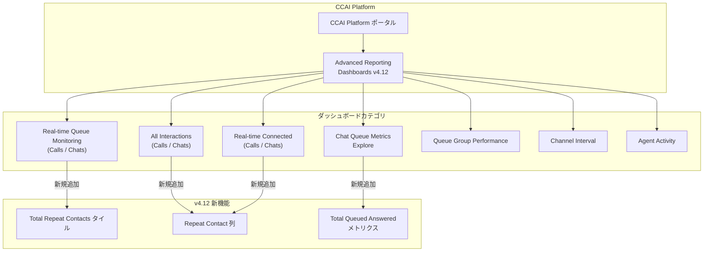

# Google Cloud Contact Center as a Service (CCaaS): Advanced Reporting Dashboards v4.12 アップデート

**リリース日**: 2026-04-07

**サービス**: Google Cloud Contact Center as a Service (CCaaS) / CCAI Platform

**機能**: Advanced Reporting Dashboards 4.12 (ダッシュボード v4.12 アップデート)

**ステータス**: Feature / Fixed

[このアップデートのインフォグラフィックを見る](https://takech9203.github.io/google-cloud-news-summary/20260407-ccaas-dashboard-4-12-updates.html)

## 概要

Google Cloud Contact Center as a Service (CCaaS) の Advanced Reporting Dashboards がバージョン 4.12 にアップデートされた。本リリースでは、リピートコンタクトデータの可視化、チャットキューメトリクスの新指標追加、および多数のバグ修正が含まれている。

今回のアップデートの中心となるのは、リピートコンタクト (再コンタクト) データのダッシュボード統合である。リアルタイムキューモニタリング、全インタラクション、リアルタイム接続状況の各ダッシュボードにリピートコンタクト情報が追加され、顧客が同じキューに再度問い合わせてくる頻度をリアルタイムで把握できるようになった。また、Chat Queue Metrics Explore に Total Queued Answered メトリクスが新設され、キューから応答されたチャットの正確なカウントが可能になった。

本アップデートの対象ユーザーは、CCAI Platform を利用するコンタクトセンターの管理者、スーパーバイザー、およびレポーティング担当者である。

**アップデート前の課題**

- リピートコンタクト (再コンタクト) データがリアルタイムキューモニタリングや全インタラクションダッシュボードに表示されず、顧客の再問い合わせ状況を即座に把握できなかった
- チャットキューメトリクスにおいて、キューから応答されたチャットの正確なカウントを取得する手段がなく、SLA 計算や応答率の算出に不正確さがあった
- ダッシュボード名やお気に入りボタンが表示されない不具合があり、ダッシュボードの管理が困難だった
- 時間帯別・30分間隔の表示や Teams Filter のフィルタリングに不正確なデータが表示されていた
- Agent Activity ダッシュボードで管理者によるステータス変更がエージェント自身の操作として誤帰属されていた

**アップデート後の改善**

- リアルタイムキューモニタリング (通話/チャット) に「Total Repeat Contacts」タイルが追加され、再コンタクト数をリアルタイムで確認可能になった
- All Interactions および Real-time Connected ダッシュボードに「Repeat Contact」列が追加された
- Chat Queue Metrics Explore に Total Queued Answered メトリクスが追加され、正確な SLA および応答率の計算が可能になった
- ダッシュボード名・お気に入り機能、時間帯表示、フィルタリング、タイムスタンプなど多数の不具合が修正された

## アーキテクチャ図

CCAI Platform の Advanced Reporting ダッシュボード v4.12 における新機能の配置を示す。リピートコンタクトデータは 3 種類のダッシュボードに、Total Queued Answered メトリクスは Chat Queue Metrics Explore にそれぞれ追加された。

## サービスアップデートの詳細

### 主要機能

1. **リピートコンタクトデータのダッシュボード統合**
   - Real-time Queue Monitoring (Calls / Chats) に「Total Repeat Contacts」タイルが新規追加され、現在のキューにおける再コンタクト数をリアルタイムで表示
   - All Interactions (Calls / Chats) の Call Metric Detail / Chat Metric Detail テーブルに「Repeat Contact」列が追加
   - Real-time Connected (Calls / Chats) の Connected Calls / Connected Chats テーブルに「Repeat Contact」列が追加
   - これにより、顧客が同じキューに繰り返し問い合わせている状況を複数の視点から把握可能

2. **Total Queued Answered メトリクス (Chat Queue Metrics Explore)**
   - キューから応答されたチャットの正確なカウントを提供する新メトリクス
   - 標準の「handled」メトリクスでは対応できないケース (例: チャットが応答後すぐに切断された場合) に対して、正確な SLA および応答率の計算を実現
   - チャットベースのコンタクトセンターにおけるパフォーマンス測定の精度向上に貢献

3. **バグ修正 (9 件)**
   - ダッシュボード名およびお気に入りボタンが表示されない問題を修正
   - 時間帯別・30分間隔フィールドにおいて、長期間のデータ範囲で詳細データが表示されない問題を修正
   - Teams Filter フィルタにおいて不正確なデータが表示される問題を修正
   - 特定の時間に開始された通話が対応するタイムウィンドウに表示されない問題を修正
   - Agent Activity ダッシュボードの「Created By」列で管理者によるステータス変更がエージェントに誤帰属される問題を修正
   - 履歴データの通話・チャットメトリクスで不正確なタイムスタンプが表示される問題を修正
   - Real-time Queue Monitoring の Historical Data テーブルにおいて「Avg CSAT」列名を「CSAT」に変更
   - Channel Interval (Calls / Chats) ダッシュボードのトレンドタイルにおけるドリルダウンビューが不正確な情報を表示または空になる問題を修正
   - Queue Group Performance - All ダッシュボードでデータが入力されたフィールドに青色のハイライトが適用されない問題を修正

## 技術仕様

### 対象ダッシュボードと追加要素

| ダッシュボード | 追加タイプ | 追加要素 |
|------|------|------|
| Real-time Queue Monitoring - Calls | タイル | Total Repeat Contacts |
| Real-time Queue Monitoring - Chats | タイル | Total Repeat Contacts |
| All Interactions - Calls | テーブル列 | Repeat Contact (Call Metric Detail) |
| All Interactions - Chats | テーブル列 | Repeat Contact (Chat Metric Detail) |
| Real-time Calls - Calls Connected | テーブル列 | Repeat Contact (Connected Calls) |
| Real-time Chats - Chats Connected | テーブル列 | Repeat Contact (Connected Chats) |
| Chat Queue Metrics Explore | メトリクス | Total Queued Answered |

### バグ修正対象ダッシュボード一覧

| 修正内容 | 対象ダッシュボード |
|------|------|
| ダッシュボード名・お気に入りボタンの欠落 | 全ダッシュボード共通 |
| 時間帯別・30分間隔表示 | Call Queue Metrics |
| Teams Filter 不正データ | フィルター使用ダッシュボード全般 |
| タイムウィンドウ表示 | 通話関連ダッシュボード |
| Created By 誤帰属 | Agent Activity |
| タイムスタンプ不正確 | 履歴メトリクス全般 |
| Avg CSAT を CSAT に改名 | Real-time Queue Monitoring (Calls / Chats) |
| ドリルダウンビュー不具合 | Channel Interval (Calls / Chats) |
| 青色ハイライト未適用 | Queue Group Performance - All |

## 設定方法

### 前提条件

1. CCAI Platform へのアクセス権限があること
2. Advanced Reporting ダッシュボードへの閲覧権限が付与されていること

### 手順

#### ステップ 1: ダッシュボードへのアクセス

CCAI Platform ポータルにログインし、**Dashboard > Advanced Reporting** を選択する。ダッシュボードメニューが表示されない場合は、ブラウザウィンドウを横方向に広げる。

#### ステップ 2: リピートコンタクトデータの確認 (Real-time Queue Monitoring)

1. Advanced Reporting ランディングページから **Real-time Queue Monitoring / Calls** または **Real-time Queue Monitoring / Chats** を選択
2. タイルセクションに新しく追加された「**Total Repeat Contacts**」タイルでリピートコンタクト数を確認
3. Queue Name、Queue Group、Teams Filter、Direction の各フィルタで絞り込み可能

#### ステップ 3: Total Queued Answered メトリクスの確認

1. **Chat Queue Metrics Explore** を開く
2. メトリクス一覧から「**Total Queued Answered**」を選択
3. SLA 計算や応答率の分析に活用する

## メリット

### ビジネス面

- **顧客体験の可視化向上**: リピートコンタクトデータにより、顧客が問題解決のために再度問い合わせている状況を定量的に把握でき、初回解決率 (FCR) の改善施策を立てやすくなる
- **正確な SLA 管理**: Total Queued Answered メトリクスにより、チャットチャネルの SLA 達成状況をより正確に測定でき、サービス品質の報告精度が向上する
- **運用効率の改善**: 多数のバグ修正により、ダッシュボードの信頼性が向上し、データに基づいた迅速な意思決定が可能になる

### 技術面

- **データの正確性向上**: タイムスタンプ、フィルタリング、ドリルダウン表示の不具合修正により、レポーティングデータの信頼性が向上
- **メトリクスの精緻化**: 「handled」メトリクスでは捕捉できないケースに対応する Total Queued Answered メトリクスにより、キューパフォーマンスの分析精度が向上
- **UI/UX の改善**: ダッシュボード名やお気に入り機能の復旧、列名の統一 (Avg CSAT から CSAT) により、操作性が改善

## デメリット・制約事項

### 制限事項

- リピートコンタクトデータは「同じキューへの再問い合わせ」をカウントするため、異なるキューへの問い合わせは対象外
- Queue Group Performance ダッシュボードはキューグループに属するキューのみが対象となるため、グループ未設定のキューはレポートに含まれない

### 考慮すべき点

- ダッシュボード v4.12 へのアップデートに伴い、既存のカスタマイズされたダッシュボード設定の互換性を確認する必要がある
- Total Queued Answered メトリクスは Chat Queue Metrics Explore のみで利用可能であり、通話キューには現時点で適用されない

## ユースケース

### ユースケース 1: コンタクトセンターの初回解決率 (FCR) 改善

**シナリオ**: 大規模コンタクトセンターのスーパーバイザーが、顧客の再問い合わせが多いキューを特定し、エージェントのトレーニングやナレッジベースの改善に活用する。

**効果**: Real-time Queue Monitoring の Total Repeat Contacts タイルにより、リアルタイムでリピートコンタクトの多いキューを特定し、即座にリソース配分を調整できる。All Interactions ダッシュボードの Repeat Contact 列で個別のインタラクションレベルでの分析も可能となり、根本原因の特定に役立つ。

### ユースケース 2: チャットチャネルの SLA 精密管理

**シナリオ**: チャットベースのカスタマーサポートを運営する企業が、チャットの SLA 達成率をより正確に測定したい。従来の「handled」メトリクスでは、応答後すぐに切断されたチャットもカウントされ、実際の応答率と乖離があった。

**効果**: Total Queued Answered メトリクスにより、キューから実際に応答されたチャットのみを正確にカウントでき、SLA レポートの信頼性が向上する。クライアントやステークホルダーへの報告精度が改善される。

## 関連サービス・機能

- **CCAI Platform Advanced Reporting**: 本アップデートの対象となるレポーティング基盤。リアルタイムおよび履歴データを可視化する包括的なダッシュボード群を提供
- **CCAI Platform Queue Groups**: キューをグループ化して管理する機能。Queue Group Performance ダッシュボードのハイライト修正が含まれる
- **CCAI Platform Agent Adapter**: エージェントのログイン/ログアウト、ステータス管理を行うコンポーネント。Agent Activity ダッシュボードの Created By 修正に関連

## 参考リンク

- [インフォグラフィック](https://takech9203.github.io/google-cloud-news-summary/20260407-ccaas-dashboard-4-12-updates.html)
- [公式リリースノート](https://docs.cloud.google.com/contact-center/ccai-platform/docs/release-notes)
- [ダッシュボード概要ドキュメント](https://docs.cloud.google.com/contact-center/ccai-platform/docs/dashboards-overview)
- [Real-time Queue Monitoring ドキュメント](https://docs.cloud.google.com/contact-center/ccai-platform/docs/dashboards-real-time-queue-monitor)
- [All Interactions ドキュメント](https://docs.cloud.google.com/contact-center/ccai-platform/docs/dashboards-all-interactions)
- [Queue Group Performance ドキュメント](https://docs.cloud.google.com/contact-center/ccai-platform/docs/dashboards-queue-group-perf)

## まとめ

CCAI Platform の Advanced Reporting Dashboards v4.12 は、リピートコンタクトデータの可視化と Total Queued Answered メトリクスの追加により、コンタクトセンターの運用分析能力を大幅に強化するアップデートである。9 件のバグ修正によりダッシュボード全体の信頼性も向上しており、CCAI Platform を利用している全てのコンタクトセンター運用チームに対して速やかなアップデートの確認を推奨する。

---

**タグ**: #CCaaS #CCAI-Platform #Advanced-Reporting #Dashboard #Real-time-Monitoring #Repeat-Contacts #Queue-Metrics #SLA #Bug-Fix #Contact-Center
