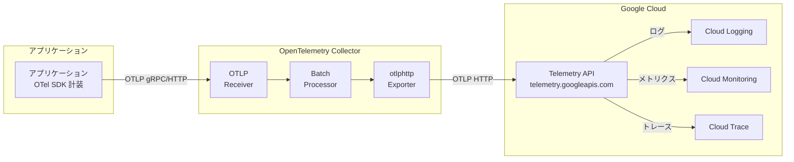

# Cloud Logging: OTLP ログ取り込み (Telemetry API 経由)

**リリース日**: 2026-04-07

**サービス**: Cloud Logging

**機能**: OTLP Log Ingestion via Telemetry API (OTLP ログ取り込み)

**ステータス**: Preview

[このアップデートのインフォグラフィックを見る](https://takech9203.github.io/google-cloud-news-summary/20260407-cloud-logging-otlp-log-ingestion.html)

## 概要

Google Cloud は、Telemetry API を通じた OTLP (OpenTelemetry Protocol) 形式のログの Cloud Logging への取り込みを Preview として公開しました。OpenTelemetry Collector と OTLP エクスポーターを使用して、OTLP 形式のログを直接 Cloud Logging に送信できるようになります。

これまで Telemetry API (`telemetry.googleapis.com`) はメトリクスとトレースの取り込みのみをサポートしていましたが、今回のアップデートによりログの取り込みにも対応しました。これにより、OpenTelemetry を活用したオブザーバビリティの統一パイプラインの構築が大きく前進します。

このアップデートは、OpenTelemetry ベースの計装を採用している組織や、マルチクラウド環境でベンダーニュートラルなテレメトリパイプラインを構築したい開発チームに特に有益です。

**アップデート前の課題**

- OpenTelemetry SDK/Collector からログを Cloud Logging に送信するには、Google Cloud 固有のエクスポーター (`googlecloud` exporter) を使用し、OTLP 形式から Cloud Logging API の独自フォーマットへの変換が必要だった
- データ変換時に OTLP のフィールドが Cloud Logging API のフォーマットに正確にマッピングされず、一部のデータが失われる可能性があった
- Ops Agent の OTLP レシーバーはメトリクスとトレースのみをサポートし、ログの直接収集には対応していなかった
- ログ、メトリクス、トレースでそれぞれ異なる取り込みパスを使用する必要があり、パイプライン構成が複雑だった

**アップデート後の改善**

- OTLP 形式のログを Telemetry API 経由で直接 Cloud Logging に取り込めるようになった
- OTLP ネイティブな取り込みにより、データ変換による情報損失のリスクが軽減された
- メトリクス、トレース、ログの全テレメトリシグナルを Telemetry API で統一的に取り込めるパスが整った
- OpenTelemetry Collector の `otlphttp` エクスポーターを使用した標準的な構成でログ送信が可能になった

## アーキテクチャ図



OpenTelemetry SDK で計装されたアプリケーションが OTLP プロトコルでログデータを OpenTelemetry Collector に送信し、Collector の `otlphttp` エクスポーターが Telemetry API にデータを転送します。Telemetry API はログを Cloud Logging に、メトリクスを Cloud Monitoring に、トレースを Cloud Trace にルーティングします。

## サービスアップデートの詳細

### 主要機能

1. **OTLP ネイティブログ取り込み**
   - OTLP 形式のログデータを変換なしで Cloud Logging に取り込み可能
   - OpenTelemetry のログデータモデルをネイティブにサポート
   - OTLP のセマンティック規約に準拠したログ属性の保持

2. **Telemetry API による統一エンドポイント**
   - サービス名: `telemetry.googleapis.com`
   - メトリクス、トレースに加えてログの取り込みに対応
   - VPC Service Controls のサポートにより、セキュアな取り込みが可能

3. **OpenTelemetry Collector との統合**
   - `otlphttp` エクスポーターを使用した標準的な構成で動作
   - OTLP プロトコル (`http/protobuf`、`http/json`、`grpc`) をサポート
   - バッチ処理やリトライなどの Collector の機能をそのまま活用可能

## 技術仕様

### サポートされるプロトコルとフォーマット

| 項目 | 詳細 |
|------|------|
| API エンドポイント | `telemetry.googleapis.com` |
| サポートプロトコル | `http/protobuf`、`http/json`、`grpc` |
| データフォーマット | OTLP (OpenTelemetry Protocol) |
| ステータス | Preview |
| VPC Service Controls | サポート対象 |

### OpenTelemetry Collector 構成例

```yaml
receivers:
  otlp:
    protocols:
      grpc:
        endpoint: localhost:4317
      http:
        endpoint: localhost:4318

processors:
  batch:
    send_batch_max_size: 200
    send_batch_size: 200
    timeout: 5s
  memory_limiter:
    check_interval: 1s
    limit_percentage: 65
    spike_limit_percentage: 20
  resourcedetection:
    detectors: [gcp]
    timeout: 10s

exporters:
  otlphttp:
    endpoint: https://telemetry.googleapis.com
    # Google Cloud 認証は自動的に処理される

service:
  pipelines:
    logs:
      receivers: [otlp]
      processors: [memory_limiter, resourcedetection, batch]
      exporters: [otlphttp]
```

## 設定方法

### 前提条件

1. Google Cloud プロジェクトが作成済みであること
2. Telemetry API (`telemetry.googleapis.com`) が有効化されていること
3. OpenTelemetry Collector がデプロイ済みであること
4. 適切な IAM 権限が設定されていること

### 手順

#### ステップ 1: Telemetry API の有効化

```bash
gcloud services enable telemetry.googleapis.com --project=PROJECT_ID
```

プロジェクトで Telemetry API を有効化します。

#### ステップ 2: OpenTelemetry Collector の構成

Collector の設定ファイルにログパイプラインを追加します。`otlphttp` エクスポーターで `telemetry.googleapis.com` をエンドポイントとして指定します。

```yaml
exporters:
  otlphttp:
    endpoint: https://telemetry.googleapis.com

service:
  pipelines:
    logs:
      receivers: [otlp]
      processors: [batch, resourcedetection]
      exporters: [otlphttp]
```

#### ステップ 3: アプリケーションの計装

OpenTelemetry SDK を使用してアプリケーションにログ計装を追加し、OTLP エクスポーターで Collector にログを送信するよう構成します。

```python
# Python の例
from opentelemetry import _logs as logs
from opentelemetry.sdk._logs import LoggerProvider
from opentelemetry.sdk._logs.export import BatchLogRecordProcessor
from opentelemetry.exporter.otlp.proto.grpc._log_exporter import OTLPLogExporter

logger_provider = LoggerProvider()
logger_provider.add_log_record_processor(
    BatchLogRecordProcessor(OTLPLogExporter(endpoint="localhost:4317"))
)
logs.set_logger_provider(logger_provider)
```

#### ステップ 4: Cloud Logging でのログ確認

```bash
gcloud logging read "logName:opentelemetry" --project=PROJECT_ID --limit=10
```

Cloud Logging のログエクスプローラーまたは CLI でログが取り込まれていることを確認します。

## メリット

### ビジネス面

- **ベンダーロックインの軽減**: OpenTelemetry 標準に基づくため、将来的なバックエンドの変更が容易になる
- **運用コストの削減**: ログ、メトリクス、トレースの取り込みパイプラインを Telemetry API に統一することで管理コストが低減する
- **マルチクラウド対応**: OpenTelemetry ベースのため、マルチクラウド環境でも統一的なオブザーバビリティ基盤を構築できる

### 技術面

- **データ忠実性の向上**: OTLP ネイティブ取り込みにより、フォーマット変換時のデータ損失が回避される
- **統一パイプライン**: 全テレメトリシグナル (ログ、メトリクス、トレース) を単一の API エンドポイントで取り込み可能
- **VPC Service Controls 対応**: セキュリティ要件の厳しい環境でも安全にログを取り込める
- **標準プロトコルサポート**: `http/protobuf`、`http/json`、`grpc` の全 OTLP プロトコルに対応

## デメリット・制約事項

### 制限事項

- 現在 Preview ステータスのため、本番環境での使用には注意が必要。Pre-GA の利用規約が適用される
- Preview 機能はサポートが限定的である可能性がある
- 既存の Cloud Logging API 経由の取り込みとの動作の違いがある可能性がある

### 考慮すべき点

- OpenTelemetry Collector のデプロイと運用管理が追加で必要になる
- 既存の `googlecloud` エクスポーターからの移行には構成変更が伴う
- Preview 段階のため、GA までに仕様変更が発生する可能性がある

## ユースケース

### ユースケース 1: マイクロサービスの統一オブザーバビリティ

**シナリオ**: Kubernetes 上で複数のマイクロサービスを運用しており、各サービスは OpenTelemetry SDK で計装されている。ログ、メトリクス、トレースを統一的に Google Cloud に送信したい。

**実装例**:
```yaml
# OpenTelemetry Collector の構成
service:
  pipelines:
    logs:
      receivers: [otlp]
      processors: [batch, resourcedetection]
      exporters: [otlphttp]
    metrics:
      receivers: [otlp]
      processors: [batch, resourcedetection]
      exporters: [otlphttp]
    traces:
      receivers: [otlp]
      processors: [batch, resourcedetection]
      exporters: [otlphttp]
```

**効果**: 全テレメトリシグナルを Telemetry API に統一することで、Collector の構成がシンプルになり、ログとトレースの相関分析も容易になる。

### ユースケース 2: マルチクラウド環境のログ集約

**シナリオ**: AWS と Google Cloud の両方でワークロードを実行しており、全環境のログを Google Cloud の Cloud Logging に集約したい。

**効果**: OpenTelemetry 標準の OTLP プロトコルを使用するため、クラウドプロバイダーに依存しない統一的なログパイプラインを構築できる。AWS 側も同じ OpenTelemetry Collector 構成でログを送信可能。

## 料金

Cloud Logging の標準的な料金体系が適用されます。Telemetry API 経由の取り込みに追加料金は発生しません。

| 項目 | 料金 |
|------|------|
| ログ取り込み (最初の 50 GiB/プロジェクト/月) | 無料 |
| ログ取り込み (50 GiB 超過分) | $0.50/GiB |
| ログ保存 (デフォルト保持期間内) | 無料 |
| ログ保存 (デフォルト保持期間超過) | $0.01/GiB |

詳細は [Google Cloud Observability の料金ページ](https://cloud.google.com/stackdriver/pricing) を参照してください。

## 関連サービス・機能

- **Cloud Monitoring**: Telemetry API 経由で OTLP メトリクスを取り込み可能。ログとメトリクスの統合分析が可能
- **Cloud Trace**: Telemetry API 経由で OTLP トレースを取り込み可能。ログとトレースの相関分析が可能
- **OpenTelemetry Collector**: OTLP データの受信、処理、エクスポートを行うコンポーネント。Google-Built OpenTelemetry Collector も利用可能
- **Google Cloud Managed Service for Prometheus**: OTLP メトリクスの取り込みにも利用される Prometheus 互換のマネージドサービス
- **Ops Agent**: Compute Engine VM 上でのテレメトリ収集エージェント。OTLP レシーバーはメトリクスとトレースをサポート

## 参考リンク

- [インフォグラフィック](https://takech9203.github.io/google-cloud-news-summary/20260407-cloud-logging-otlp-log-ingestion.html)
- [公式リリースノート](https://docs.cloud.google.com/release-notes#April_07_2026)
- [OTLP ログ取り込みの概要](https://cloud.google.com/stackdriver/docs/otlp-logs/overview)
- [Telemetry (OTLP) API の概要](https://cloud.google.com/stackdriver/docs/reference/telemetry/overview)
- [OTLP メトリクス取り込みの概要](https://cloud.google.com/stackdriver/docs/otlp-metrics/overview)
- [Cloud Logging の料金](https://cloud.google.com/stackdriver/pricing)

## まとめ

今回の Cloud Logging における OTLP ログ取り込みの Preview リリースにより、Telemetry API がログ、メトリクス、トレースの全テレメトリシグナルをカバーする統一的な取り込みエンドポイントとなりました。OpenTelemetry を採用している組織は、既存の Collector 構成に最小限の変更を加えるだけで Cloud Logging へのログ取り込みを開始できます。Preview 段階ではあるものの、本機能の GA に向けた検証を早期に開始することを推奨します。

---

**タグ**: #CloudLogging #OpenTelemetry #OTLP #TelemetryAPI #Observability #Logging #Preview
