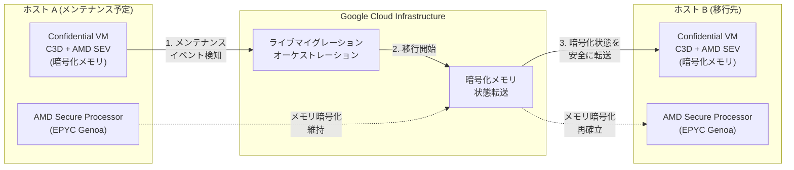

# Confidential VM: C3D マシンタイプでのライブマイグレーションが GA

**リリース日**: 2026-04-07

**サービス**: Confidential VM

**機能**: C3D マシンタイプにおけるライブマイグレーションサポート

**ステータス**: 一般提供 (GA)

[このアップデートのインフォグラフィックを見る](https://takech9203.github.io/google-cloud-news-summary/20260407-confidential-vm-live-migration-ga.html)

## 概要

Google Cloud は、Confidential VM インスタンスにおけるライブマイグレーション機能を C3D マシンタイプに拡張し、一般提供 (GA) を開始した。これにより、C3D マシンタイプ、AMD SEV Confidential Computing テクノロジー、およびライブマイグレーション対応の OS イメージという構成条件を満たす Confidential VM インスタンスで、ホストメンテナンスイベント時にダウンタイムなしでの VM 移行が可能となった。

従来、Confidential VM のライブマイグレーションは N2D マシンタイプ (AMD EPYC Milan CPU プラットフォーム) 上の AMD SEV 構成でのみサポートされていた。今回のアップデートにより、AMD EPYC Genoa プロセッサを搭載した C3D マシンタイプでもライブマイグレーションが利用可能となり、より高性能なハードウェア上で機密コンピューティングワークロードの可用性が大幅に向上する。

対象ユーザーは、Confidential VM を利用して機密データの処理を行っており、同時にホストメンテナンスイベント時のダウンタイムを最小化したい組織である。特に、金融機関、医療機関、政府機関など、厳格なセキュリティ要件と高い可用性の両方を必要とするワークロードを運用する組織にとって重要なアップデートとなる。

**アップデート前の課題**

- Confidential VM のライブマイグレーションは N2D マシンタイプ (AMD EPYC Milan) 上の AMD SEV 構成のみでサポートされていた
- C3D マシンタイプの Confidential VM インスタンスは、ホストメンテナンスイベント時に `onHostMaintenance` ポリシーを `TERMINATE` に設定する必要があり、VM が停止・再起動されていた
- メンテナンスイベント時の VM 停止により、ワークロードの中断やサービスへの影響が発生していた
- C3D の高性能な AMD EPYC Genoa プロセッサの利点を活かしつつ、機密コンピューティングとライブマイグレーションを両立させることができなかった

**アップデート後の改善**

- C3D マシンタイプ + AMD SEV 構成の Confidential VM でライブマイグレーションが利用可能になった
- ホストメンテナンスイベント時に VM を停止せずにシームレスに別ホストへ移行できるようになった
- `onHostMaintenance` ポリシーを `MIGRATE` に設定することで、ダウンタイムなしでメンテナンスを処理できるようになった
- AMD EPYC Genoa プロセッサの高性能と機密コンピューティングの高い可用性を同時に実現できるようになった

## アーキテクチャ図



この図は、ホストメンテナンスイベント時にライブマイグレーションがどのように実行されるかを示している。AMD SEV による暗号化メモリの状態がホスト A からホスト B へ安全に転送され、VM は停止せずに稼働を継続する。

## サービスアップデートの詳細

### 主要機能

1. **C3D マシンタイプでのライブマイグレーション**
   - AMD EPYC Genoa プロセッサ搭載の C3D マシンタイプで Confidential VM のライブマイグレーションがサポートされた
   - ホストメンテナンスイベント中も VM のダウンタイムが発生しない
   - メモリ暗号化を維持したまま、安全にホスト間の移行が実行される

2. **AMD SEV テクノロジーとの統合**
   - AMD Secure Encrypted Virtualization (SEV) によるハードウェアベースのメモリ暗号化が維持される
   - AMD Secure Processor による暗号鍵の生成・管理はハードウェア内に閉じられ、ハイパーバイザーからアクセスできない
   - Google の vTPM によるブートタイムアテステーションも引き続き利用可能

3. **対応 OS イメージ**
   - ライブマイグレーション対応の OS イメージが必要
   - `SEV_LIVE_MIGRATABLE_V2` タグが付いた OS イメージが対象
   - `gcloud compute images list --filter="guestOsFeatures[].type:(SEV_LIVE_MIGRATABLE_V2)"` コマンドで対応イメージを確認可能

## 技術仕様

### 対応構成要件

| 項目 | 要件 |
|------|------|
| マシンタイプ | C3D シリーズ |
| CPU プラットフォーム | AMD EPYC Genoa |
| Confidential Computing テクノロジー | AMD SEV |
| OS イメージ | `SEV_LIVE_MIGRATABLE_V2` 対応イメージ |
| onHostMaintenance ポリシー | `MIGRATE` |
| NIC タイプ | gVNIC (必須) |
| ディスクインターフェース | NVMe (必須) |

### ライブマイグレーション対応マシンタイプ比較

| マシンタイプ | CPU | ライブマイグレーション | 備考 |
|-------------|-----|----------------------|------|
| N2D | AMD EPYC Milan | 対応 (既存) | AMD SEV のみ |
| C3D | AMD EPYC Genoa | 対応 (今回 GA) | AMD SEV のみ |
| C2D | AMD EPYC Milan | 非対応 | TERMINATE のみ |
| C4D | AMD EPYC Turin | 非対応 | TERMINATE のみ |
| c3-standard-* | Intel Sapphire Rapids | 非対応 | Intel TDX |

## 設定方法

### 前提条件

1. Google Cloud プロジェクトが作成されていること
2. Compute Engine API が有効化されていること
3. C3D マシンタイプが利用可能なゾーンであること

### 手順

#### ステップ 1: 対応 OS イメージの確認

```bash
# ライブマイグレーション対応の OS イメージを一覧表示
gcloud compute images list \
  --filter="guestOsFeatures[].type:(SEV_LIVE_MIGRATABLE_V2)"
```

`SEV_LIVE_MIGRATABLE_V2` に対応したイメージを確認し、使用するイメージを選択する。

#### ステップ 2: Confidential VM インスタンスの作成

```bash
# C3D マシンタイプでライブマイグレーション対応の Confidential VM を作成
gcloud compute instances create INSTANCE_NAME \
  --zone=ZONE \
  --machine-type=c3d-standard-4 \
  --confidential-compute-type=SEV \
  --min-cpu-platform="AMD Genoa" \
  --maintenance-policy=MIGRATE \
  --image-family=IMAGE_FAMILY \
  --image-project=IMAGE_PROJECT \
  --network-interface=nic-type=GVNIC
```

`--maintenance-policy=MIGRATE` を指定することで、ライブマイグレーションが有効化される。

#### ステップ 3: 設定の確認

```bash
# インスタンスの設定を確認
gcloud compute instances describe INSTANCE_NAME \
  --zone=ZONE \
  --format="yaml(confidentialInstanceConfig,scheduling)"
```

`scheduling.onHostMaintenance` が `MIGRATE` に設定されていることを確認する。

## メリット

### ビジネス面

- **可用性の向上**: ホストメンテナンスによるダウンタイムが排除され、SLA の向上に貢献する
- **運用コストの削減**: メンテナンスウィンドウの計画や、ワークロード再開の手動対応が不要になる
- **コンプライアンス対応の容易化**: 機密データを扱うワークロードの可用性を維持しつつ、セキュリティ要件を満たすことができる

### 技術面

- **シームレスなメンテナンス**: VM の停止・再起動を伴わないため、アプリケーション状態やネットワーク接続が維持される
- **高性能ハードウェアの活用**: C3D マシンタイプ (AMD EPYC Genoa) の高性能を機密コンピューティングで活用できる
- **暗号化の継続性**: ライブマイグレーション中も AMD SEV によるメモリ暗号化が維持される

## デメリット・制約事項

### 制限事項

- C3D マシンタイプの AMD SEV 構成のみが対象であり、AMD SEV-SNP や Intel TDX ではライブマイグレーションは利用できない
- ライブマイグレーション対応の OS イメージ (`SEV_LIVE_MIGRATABLE_V2`) が必要であり、すべての OS イメージが対応しているわけではない
- C3D マシンタイプでは 255 vCPU を超える VM およびベアメタルインスタンスはサポートされない
- C3D マシンタイプの Confidential VM では Hyperdisk Balanced および Hyperdisk Throughput がサポートされない
- C3D マシンタイプの Confidential VM は、同等の非 Confidential VM と比較してネットワーク帯域幅が低下する場合がある (Tier_1 ネットワーキング有効時でも同様)
- 既存の Confidential VM インスタンスをライブマイグレーション対応に変換することはできず、新規作成が必要

### 考慮すべき点

- ライブマイグレーション中は一時的にパフォーマンスが低下する可能性がある
- `rhel-8-4-sap-ha` イメージは C3D マシンタイプの 8 vCPU 以上の構成では AMD SEV と互換性がない

## ユースケース

### ユースケース 1: 金融機関の取引処理システム

**シナリオ**: 金融機関が、顧客の取引データを処理するワークロードを Confidential VM 上で稼働させている。24/7 の可用性が求められ、ホストメンテナンスによるサービス中断は許容できない。

**効果**: C3D マシンタイプでのライブマイグレーションにより、メンテナンスイベント時もトランザクション処理が中断されず、AMD SEV による暗号化でデータの機密性も維持される。

### ユースケース 2: 医療データ分析プラットフォーム

**シナリオ**: 医療機関が、患者の個人健康情報 (PHI) を分析するプラットフォームを Confidential VM で運用している。HIPAA 準拠が必要で、データの機密性と処理の継続性の両方が要求される。

**効果**: ライブマイグレーションによりメンテナンス時のダウンタイムが排除され、AMD EPYC Genoa の高い処理性能と AMD SEV によるハードウェアレベルの暗号化により、コンプライアンス要件を満たしながら高パフォーマンスなデータ分析が可能になる。

### ユースケース 3: マルチテナント SaaS プラットフォーム

**シナリオ**: SaaS プロバイダーが、複数のテナントのデータを機密に保ちながら処理するプラットフォームを構築している。テナント間の分離と高い可用性が要件である。

**効果**: Confidential VM による各テナントデータのハードウェアレベルでの隔離と、ライブマイグレーションによるメンテナンス時の無停止運用を両立できる。

## 料金

Confidential VM の料金は、使用するマシンタイプと Confidential Computing テクノロジーに基づく。詳細な料金情報は公式料金ページを参照のこと。

- [Confidential VM 料金ページ](https://cloud.google.com/confidential-computing/confidential-vm/pricing)
- [C3D マシンタイプ料金](https://cloud.google.com/compute/vm-instance-pricing#general-purpose_machine_type_family)

## 利用可能リージョン

C3D マシンタイプで AMD SEV を利用できるゾーンは、Google Cloud のリージョンとゾーンのページで確認可能。

```bash
# C3D マシンタイプが利用可能なゾーンを確認
gcloud compute zones list --format="value(NAME)"

# 特定のゾーンで AMD Genoa CPU が利用可能か確認
gcloud compute zones describe ZONE_NAME \
  --format="value(availableCpuPlatforms)"
```

詳細は [Available regions and zones](https://cloud.google.com/compute/docs/regions-zones#available) を参照。

## 関連サービス・機能

- **[Confidential GKE Nodes](https://cloud.google.com/kubernetes-engine/docs/how-to/confidential-gke-nodes)**: GKE ノードで Confidential VM を使用し、コンテナワークロードの機密性を確保する
- **[Confidential Space](https://cloud.google.com/confidential-computing/confidential-space/docs/confidential-space-overview)**: 複数の当事者が機密データを安全に共有・処理するための環境を提供する
- **[Dataproc Confidential Compute](https://cloud.google.com/dataproc/docs/concepts/configuring-clusters/confidential-compute)**: Confidential VM を使用した Dataproc クラスターでデータ処理を行う
- **[Compute Engine ライブマイグレーション](https://cloud.google.com/compute/docs/instances/live-migration-process)**: 通常の Compute Engine VM におけるライブマイグレーションの仕組みと詳細

## 参考リンク

- [インフォグラフィック](https://takech9203.github.io/google-cloud-news-summary/20260407-confidential-vm-live-migration-ga.html)
- [公式リリースノート](https://cloud.google.com/release-notes#April_07_2026)
- [ライブマイグレーションのトラブルシューティング](https://docs.cloud.google.com/confidential-computing/confidential-vm/docs/troubleshoot-live-migration)
- [Confidential VM サポート構成](https://docs.cloud.google.com/confidential-computing/confidential-vm/docs/supported-configurations)
- [Confidential VM 概要](https://docs.cloud.google.com/confidential-computing/confidential-vm/docs/confidential-vm-overview)
- [Confidential VM インスタンスの作成](https://docs.cloud.google.com/confidential-computing/confidential-vm/docs/create-a-confidential-vm-instance)
- [料金ページ](https://cloud.google.com/confidential-computing/confidential-vm/pricing)

## まとめ

Confidential VM の C3D マシンタイプにおけるライブマイグレーション GA は、機密コンピューティングの可用性を大幅に向上させるアップデートである。従来 N2D マシンタイプのみに限定されていたライブマイグレーションが AMD EPYC Genoa 搭載の C3D に拡張されたことで、より高性能なハードウェア上でダウンタイムなしの機密ワークロード運用が可能になった。C3D マシンタイプで Confidential VM を利用中、または検討中のユーザーは、ライブマイグレーション対応の OS イメージを確認し、`onHostMaintenance` ポリシーを `MIGRATE` に設定することを推奨する。

---

**タグ**: #ConfidentialVM #ConfidentialComputing #LiveMigration #AMDSEV #C3D #ComputeEngine #Security #GA
