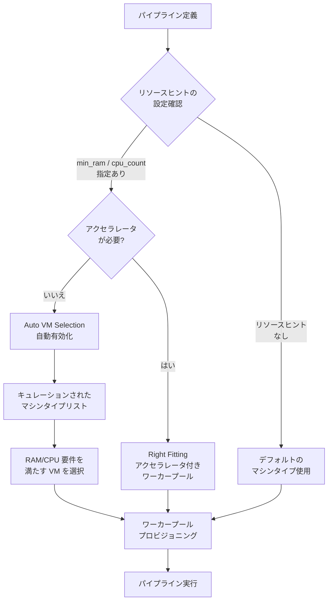

# Dataflow: Auto VM Selection (Instance Flexibility) とリソースヒントによる自動 VM 選択

**リリース日**: 2026-04-07

**サービス**: Dataflow

**機能**: Auto VM Selection (Instance Flexibility) with resource hints

**ステータス**: Feature

[このアップデートのインフォグラフィックを見る](https://takech9203.github.io/google-cloud-news-summary/20260407-dataflow-auto-vm-selection.html)

## 概要

Dataflow において、アクセラレータを必要としないパイプラインステップで `min_ram` または `cpu_count` リソースヒントを使用すると、Auto VM Selection (Instance Flexibility) が自動的に有効になる機能がリリースされました。Auto VM Selection が有効になると、ワーカーは指定された RAM および CPU 要件を満たすキュレーションされたマシンタイプのリストからプロビジョニングされます。

この機能は、Dataflow の Right Fitting 機能の一部として提供されます。Right Fitting は Apache Beam のリソースヒント機能を活用し、パイプライン全体または個別のステップに対してリソース要件を指定できる機能です。Auto VM Selection はこの仕組みを拡張し、特定のマシンタイプを指定する代わりに、要件に基づいて最適な VM を自動的に選択します。

主な対象ユーザーは、Dataflow でバッチまたはストリーミングパイプラインを実行しており、リソースプール枯渇エラーの回避やコスト最適化を求めるデータエンジニアおよび ML エンジニアです。

**アップデート前の課題**

- 特定のマシンタイプを指定する必要があり、そのマシンタイプが利用可能なゾーンでリソースプール枯渇 (`RESOURCE_POOL_EXHAUSTED`) エラーが発生する可能性があった
- パイプラインの各ステップに最適なマシンタイプを手動で調査・選定する必要があった
- マシンタイプの選定ミスにより、リソースの過剰プロビジョニングまたは不足が発生しやすかった

**アップデート後の改善**

- `min_ram` と `cpu_count` のリソースヒントを指定するだけで、Dataflow が最適な VM タイプを自動選択するようになった
- キュレーションされた複数のマシンタイプからプロビジョニングされるため、リソースプール枯渇エラーが軽減された
- リソース要件に基づいた自動選択により、コスト効率の高い VM が選択される可能性が向上した

## アーキテクチャ図



Dataflow がリソースヒントに基づいて Auto VM Selection を自動的に有効化し、要件を満たすマシンタイプを自動選択するフローを示しています。

## サービスアップデートの詳細

### 主要機能

1. **Auto VM Selection の自動有効化**
   - `min_ram` または `cpu_count` リソースヒントを使用し、アクセラレータを必要としないステップでは Auto VM Selection が自動的に有効になる
   - 有効化された場合、パイプラインオプションで指定されたマシンタイプは無視される

2. **キュレーションされたマシンタイプリストからの選択**
   - Dataflow が RAM と CPU の要件を満たすマシンタイプのリストを自動的にキュレーションする
   - 複数のマシンタイプ候補からプロビジョニングされるため、リソース可用性が向上する

3. **リソースヒントの柔軟な適用**
   - パイプライン全体にコマンドラインからリソースヒントを設定可能
   - 個別のパイプラインステップ (Transform) にプログラムからリソースヒントを設定可能
   - Right Fitting によりステップごとに異なるワーカープールを作成可能

## 技術仕様

### 利用可能なリソースヒント

| リソースヒント | 説明 | 設定例 |
|------|------|------|
| `min_ram` | ワーカーに必要な最小メモリ量 | `min_ram=15GB` |
| `cpu_count` | ワーカーに必要な CPU コア数 | `cpu_count=8` |
| `accelerator` | GPU アクセラレータの指定 (Auto VM Selection 対象外) | `type:nvidia-l4;count:1;install-nvidia-driver` |

### サポート状況

| 項目 | 詳細 |
|------|------|
| 対応 SDK | Apache Beam Java SDK, Python SDK (2.31.0 以降) |
| Go SDK | リソースヒント非対応 |
| バッチパイプライン | Right Fitting サポートあり |
| ストリーミングパイプライン | `--experiments=enable_streaming_rightfitting` オプションで有効化可能 |
| Dataflow Prime | サポートあり |
| FlexRS | 非サポート |

## 設定方法

### 前提条件

1. Apache Beam SDK 2.31.0 以降がインストールされていること
2. Dataflow API が有効化されていること
3. 適切な IAM 権限が付与されていること

### 手順

#### ステップ 1: パイプライン全体にリソースヒントを設定 (コマンドライン)

```bash
python my_pipeline.py \
  --runner=DataflowRunner \
  --resource_hints=min_ram=4GB \
  --resource_hints=cpu_count=8 \
  --project=my-project \
  --region=us-central1 \
  --temp_location=gs://my-bucket/temp
```

コマンドラインで `--resource_hints` オプションを使用して、パイプライン全体に対してリソースヒントを設定します。アクセラレータを指定しない場合、Auto VM Selection が自動的に有効になります。

#### ステップ 2: 個別ステップにリソースヒントを設定 (Python)

```python
import apache_beam as beam

# 特定のステップにリソースヒントを設定
pcoll | beam.ParDo(BigMemFn()).with_resource_hints(
    min_ram="30GB",
    cpu_count=16
)

# 別のステップには異なるリソースヒントを設定
pcoll | MyPTransform().with_resource_hints(
    min_ram="4GB",
    cpu_count=8
)
```

#### ステップ 3: 個別ステップにリソースヒントを設定 (Java)

```java
// Java SDK でのリソースヒント設定
pcoll.apply(ParDo.of(new BigMemFn())
    .setResourceHints(
        ResourceHints.create()
            .withMinRam("30GB")
            .withCpuCount(16)
    ));

pcoll.apply(MyCompositeTransform.of(...)
    .setResourceHints(
        ResourceHints.create()
            .withMinRam("15GB")
            .withCpuCount(8)
    ));
```

## メリット

### ビジネス面

- **コスト最適化**: 要件に合った適切なサイズの VM が自動選択されるため、過剰プロビジョニングによるコストを削減できる
- **運用負荷の軽減**: マシンタイプの手動選定が不要になり、パイプライン開発者はビジネスロジックに集中できる
- **可用性の向上**: 複数のマシンタイプ候補からプロビジョニングされるため、リソースプール枯渇エラーのリスクが低減する

### 技術面

- **自動最適化**: Dataflow がキュレーションされたリストから最適なマシンタイプを選択するため、手動チューニングの必要性が減少する
- **Right Fitting との統合**: パイプラインの各ステップに異なるリソース要件を設定し、ステップごとに最適なワーカープールを作成可能
- **Fusion 最適化との連携**: 異なるリソースヒントを持つ Transform がフュージョンされる際、リソースヒントの和集合 (union) が適用される

## デメリット・制約事項

### 制限事項

- Auto VM Selection が有効な場合、パイプラインオプションで指定したマシンタイプは無視される
- Go SDK ではリソースヒントがサポートされていない
- FlexRS (Flexible Resource Scheduling) との併用は非サポート
- Right Fitting 使用時は `worker_accelerator` サービスオプションを使用しないこと

### 考慮すべき点

- Auto VM Selection はアクセラレータを必要としないステップでのみ自動有効化される。GPU が必要なステップではアクセラレータリソースヒントを明示的に設定する必要がある
- ストリーミングパイプラインで Right Fitting を使用するには `--experiments=enable_streaming_rightfitting` オプションを明示的に設定する必要がある
- 異なるリソースヒントを持つ Transform がフュージョンされる場合があるため、リソースの分離が必要な場合は Fusion Break を明示的に挿入すること

## ユースケース

### ユースケース 1: 大規模バッチ ETL パイプラインのコスト最適化

**シナリオ**: 大量のデータを処理するバッチ ETL パイプラインで、データ読み込みステップ (低メモリ) とデータ変換ステップ (高メモリ) が混在している。

**実装例**:
```python
import apache_beam as beam

with beam.Pipeline(options=pipeline_options) as p:
    # データ読み込み (低リソース)
    raw_data = (
        p
        | "Read" >> beam.io.ReadFromBigQuery(query=query)
            .with_resource_hints(min_ram="4GB", cpu_count=2)
    )

    # データ変換 (高メモリ)
    transformed = (
        raw_data
        | "Transform" >> beam.ParDo(HeavyTransformFn())
            .with_resource_hints(min_ram="32GB", cpu_count=16)
    )
```

**効果**: 各ステップに最適な VM が自動選択され、低リソースステップでの過剰プロビジョニングを回避しつつ、高メモリステップでは十分なリソースが確保される。

### ユースケース 2: リソースプール枯渇エラーの回避

**シナリオ**: 特定のマシンタイプ (`n2-standard-16` など) を指定してパイプラインを実行していたが、ゾーンのリソース不足により `RESOURCE_POOL_EXHAUSTED` エラーが頻発する。

**実装例**:
```bash
# 変更前: 特定のマシンタイプを指定
python my_pipeline.py \
  --runner=DataflowRunner \
  --machine_type=n2-standard-16

# 変更後: リソースヒントで要件を指定 (Auto VM Selection が自動有効化)
python my_pipeline.py \
  --runner=DataflowRunner \
  --resource_hints=min_ram=64GB \
  --resource_hints=cpu_count=16
```

**効果**: 複数のマシンタイプ候補から利用可能な VM がプロビジョニングされるため、リソースプール枯渇エラーのリスクが大幅に低減される。

## 料金

Dataflow の料金は使用したリソース (vCPU、メモリ、ストレージ) に基づいて課金されます。Auto VM Selection 自体に追加料金はかかりませんが、選択されるマシンタイプによってリソース単価が異なる場合があります。

料金は vCPU 時間、メモリ GB 時間、ストレージ GB 時間の各コンポーネントで計算されます。詳細は [Dataflow 料金ページ](https://cloud.google.com/dataflow/pricing) を参照してください。

## 関連サービス・機能

- **Dataflow Prime**: Vertical Autoscaling、Right Fitting、Job Visualizer などの高度な機能を提供するオプション
- **Apache Beam リソースヒント**: Right Fitting の基盤となる Apache Beam の機能で、パイプラインステップごとにリソース要件を宣言的に指定可能
- **Horizontal Autoscaling**: ワーカー数を自動調整する機能。Right Fitting と組み合わせてストリーミングパイプラインで使用可能
- **Compute Engine Instance Flexibility**: MIG (マネージドインスタンスグループ) で複数のマシンタイプを指定し、可用性を向上させる機能。Auto VM Selection の基盤技術

## 参考リンク

- [インフォグラフィック](https://takech9203.github.io/google-cloud-news-summary/20260407-dataflow-auto-vm-selection.html)
- [公式リリースノート](https://docs.cloud.google.com/release-notes#April_07_2026)
- [Auto VM Selection ドキュメント](https://docs.cloud.google.com/dataflow/docs/guides/right-fitting#auto_vm_selection)
- [Right Fitting ドキュメント](https://docs.cloud.google.com/dataflow/docs/guides/right-fitting)
- [Dataflow Prime ドキュメント](https://docs.cloud.google.com/dataflow/docs/guides/enable-dataflow-prime)
- [料金ページ](https://cloud.google.com/dataflow/pricing)

## まとめ

Dataflow の Auto VM Selection は、リソースヒント (`min_ram`、`cpu_count`) を指定するだけで最適なマシンタイプを自動選択する機能であり、リソースプール枯渇エラーの回避とコスト最適化を同時に実現します。既存のパイプラインで特定のマシンタイプを指定している場合は、リソースヒントへの移行を検討することを推奨します。特にリソース枯渇エラーが頻発する環境では、即座に導入効果が期待できます。

---

**タグ**: #Dataflow #AutoVMSelection #InstanceFlexibility #ResourceHints #RightFitting #コスト最適化 #バッチ処理 #ストリーミング
