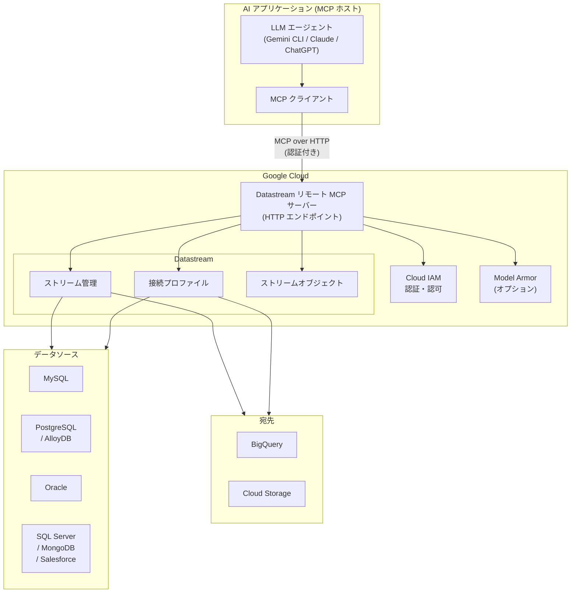

# Datastream: リモート MCP サーバーによる LLM エージェント連携

**リリース日**: 2026-04-07

**サービス**: Datastream

**機能**: Datastream リモート MCP サーバーを使用して LLM エージェントがデータ関連タスクを実行可能に

**ステータス**: Preview

[このアップデートのインフォグラフィックを見る](https://takech9203.github.io/google-cloud-news-summary/20260407-datastream-remote-mcp-server.html)

## 概要

Google Cloud Datastream にリモート Model Context Protocol (MCP) サーバーが追加されました。これにより、Gemini CLI、Claude、ChatGPT などの LLM エージェントやカスタム AI アプリケーションから、自然言語を通じて Datastream のリソースを管理・監視できるようになります。本機能は現在 Preview として提供されています。

Datastream はサーバーレスの変更データキャプチャ (CDC) およびレプリケーションサービスであり、AlloyDB for PostgreSQL、PostgreSQL、MySQL、SQL Server、Oracle、Salesforce、MongoDB などのソースから BigQuery へのリアルタイムデータレプリケーションを提供します。今回の MCP サーバー対応により、ストリーム、接続プロファイル、ストリームオブジェクトの管理・監視といったデータ関連タスクを、AI エージェントを通じて自然言語で実行できるようになりました。

この機能は、データエンジニアやプラットフォームエンジニアが AI アシスタントを活用してデータパイプラインの運用効率を向上させたい場合に特に有用です。Google Cloud が提供するリモート MCP サーバー群の一つとして、エンタープライズグレードのセキュリティ、認証、アクセス制御を備えています。

**アップデート前の課題**

- Datastream のストリームや接続プロファイルの管理には Google Cloud Console、gcloud CLI、または REST API の直接操作が必要だった
- データパイプラインの状態監視やトラブルシューティングには、個別のツールやダッシュボードを確認する必要があった
- AI エージェントから Datastream のリソースにアクセスする標準化された方法が存在しなかった

**アップデート後の改善**

- LLM エージェントが MCP プロトコルを通じて Datastream のリソースを自然言語で管理・監視可能に
- Gemini CLI、Claude、ChatGPT などの AI アプリケーションから直接ストリームの状態確認や接続プロファイルの操作が可能に
- Google Cloud の IAM による細粒度のアクセス制御と Model Armor によるセキュリティ保護を適用可能

## アーキテクチャ図



AI アプリケーション内の MCP クライアントが、HTTP 経由で Datastream リモート MCP サーバーに接続します。MCP サーバーは IAM による認証・認可を経て、ストリーム、接続プロファイル、ストリームオブジェクトの管理操作を実行し、データソースから宛先へのレプリケーションパイプラインを制御します。

## サービスアップデートの詳細

### 主要機能

1. **ストリーム管理**
   - LLM エージェントを通じたストリームの作成、一覧表示、状態確認、開始・停止の操作
   - ストリームのステータス監視やエラー情報の確認を自然言語で実行
   - バックフィル状態の確認やストリーム設定の参照

2. **接続プロファイル管理**
   - ソースおよび宛先の接続プロファイルの一覧表示と詳細確認
   - 接続テストの実行による接続性の検証
   - 接続プロファイルの設定情報の参照

3. **ストリームオブジェクト管理**
   - ストリームに含まれるオブジェクト (テーブル、スキーマ) の一覧表示と状態確認
   - オブジェクトレベルのバックフィル状態やエラー情報の監視
   - レプリケーション対象オブジェクトの把握

## 技術仕様

### MCP サーバー情報

| 項目 | 詳細 |
|------|------|
| プロトコル | Model Context Protocol (MCP) |
| トランスポート | HTTP (Streamable HTTP) |
| ステータス | Preview |
| 認証 | Google Cloud IAM / OAuth 2.0 |
| セキュリティ | Model Armor (オプション)、IAM による細粒度アクセス制御 |

### 必要な IAM ロール

| ロール | 説明 |
|--------|------|
| `roles/mcp.toolUser` | MCP ツールの呼び出し権限 |
| `roles/serviceusage.serviceUsageAdmin` | MCP サーバーの有効化権限 |
| `roles/datastream.viewer` | Datastream リソースの読み取り権限 |
| `roles/datastream.editor` | Datastream リソースの編集権限 |

## 設定方法

### 前提条件

1. Google Cloud プロジェクトで Datastream API が有効化されていること
2. 適切な IAM ロールが付与されていること
3. MCP 対応の AI アプリケーション (Gemini CLI、Claude、ChatGPT など) が利用可能であること

### 手順

#### ステップ 1: MCP サーバーの有効化確認

```bash
gcloud beta services mcp list --enabled
```

Datastream API が有効化されている場合、MCP エンドポイントが一覧に表示されます。

#### ステップ 2: Gemini CLI での設定例

```json
{
  "name": "datastream-mcp",
  "version": "1.0.0",
  "mcpServers": {
    "datastream": {
      "httpUrl": "https://datastream.googleapis.com/mcp",
      "authProviderType": "google_credentials",
      "oauth": {
        "scopes": ["https://www.googleapis.com/auth/cloud-platform"]
      },
      "timeout": 30000,
      "headers": {
        "x-goog-user-project": "YOUR_PROJECT_ID"
      }
    }
  }
}
```

このファイルを `~/.gemini/extensions/datastream-mcp/gemini-extension.json` に保存してください。

#### ステップ 3: Claude Code での設定例

MCP 設定ファイルに以下を追加します。

```json
{
  "mcpServers": {
    "datastream": {
      "type": "url",
      "url": "https://datastream.googleapis.com/mcp"
    }
  }
}
```

## メリット

### ビジネス面

- **運用効率の向上**: 自然言語でのデータパイプライン管理により、オペレーションの迅速化と学習コストの低減を実現
- **インシデント対応の迅速化**: AI エージェントを通じてストリームの状態確認やトラブルシューティングを即座に実行可能
- **統合的な管理体験**: 他の Google Cloud MCP サーバー (BigQuery、Cloud SQL、Spanner など) と組み合わせた統合的なデータ基盤管理が可能

### 技術面

- **標準化されたプロトコル**: MCP に準拠しているため、様々な AI アプリケーションから統一的なインターフェースで利用可能
- **エンタープライズセキュリティ**: IAM によるきめ細かなアクセス制御、Model Armor によるプロンプト・レスポンスのセキュリティスキャン
- **サーバーレス**: Google Cloud のインフラストラクチャ上で動作するリモート MCP サーバーであり、ユーザー側でのサーバー管理が不要

## デメリット・制約事項

### 制限事項

- 本機能は Preview ステータスであり、SLA の対象外。本番環境での利用には注意が必要
- Pre-GA 機能は「Pre-GA Offerings Terms」の対象であり、サポートが限定される場合がある
- MCP サーバーで提供されるツールは、Datastream API の全機能をカバーしていない可能性がある

### 考慮すべき点

- AI エージェントに付与する IAM 権限を最小限に保ち、意図しないリソース変更を防止することが推奨される
- 本番ワークロードでは、ユーザー個人の認証情報ではなく、サービスアカウントまたはエージェント ID を使用すること
- Model Armor の有効化により、プロンプトインジェクション等のセキュリティリスクを軽減可能

## ユースケース

### ユースケース 1: データパイプラインの日常監視

**シナリオ**: データエンジニアが毎朝、複数の Datastream ストリームの稼働状況を確認する必要がある。従来は Console にログインして各ストリームを個別に確認していた。

**実装例**:
```
User: 現在稼働中の Datastream ストリームの状態を全て教えてください。
       エラーが発生しているストリームがあれば詳細も表示してください。

Agent: プロジェクト内のストリームを確認します...
       [MCP ツールを使用してストリーム一覧と状態を取得]
```

**効果**: 複数のストリームの状態を一度に把握でき、問題のあるストリームを即座に特定可能。日常監視にかかる時間を大幅に短縮。

### ユースケース 2: AI エージェントによるインシデント対応支援

**シナリオ**: データレプリケーションの遅延アラートが発生した際に、AI エージェントが原因の初期調査を自動的に実施する。

**効果**: インシデント発生から調査開始までの時間を短縮し、接続プロファイルの状態やストリームオブジェクトのエラー情報を即座に取得して根本原因の特定を支援。

### ユースケース 3: 統合データ基盤管理

**シナリオ**: BigQuery MCP サーバーと Datastream MCP サーバーを組み合わせ、ソースデータベースから BigQuery への E2E データパイプライン全体を AI エージェントで管理・監視する。

**効果**: データの取り込み (Datastream) から分析 (BigQuery) までのパイプライン全体を統一的な AI インターフェースで管理でき、データ基盤の可観測性が向上。

## 関連サービス・機能

- **BigQuery MCP サーバー**: BigQuery のクエリ実行やデータセット管理を MCP 経由で実行。Datastream との E2E パイプライン管理に有用
- **Cloud SQL MCP サーバー**: Cloud SQL のデータベース管理を MCP 経由で実行。Datastream のソースデータベースとして利用される場合に関連
- **Spanner MCP サーバー**: Spanner のリソース管理を MCP 経由で実行。Datastream と連携したデータ同期シナリオで有用
- **Cloud Logging MCP サーバー**: Datastream のログ分析を MCP 経由で実行。パイプラインのトラブルシューティングに活用可能
- **Cloud Monitoring MCP サーバー**: Datastream のメトリクス監視を MCP 経由で実行。パイプラインの健全性監視に活用

## 参考リンク

- [インフォグラフィック](https://takech9203.github.io/google-cloud-news-summary/20260407-datastream-remote-mcp-server.html)
- [公式リリースノート](https://docs.google.com/release-notes#April_07_2026)
- [Datastream ドキュメント](https://cloud.google.com/datastream/docs)
- [Google Cloud MCP サーバー概要](https://cloud.google.com/mcp/overview)
- [MCP サーバー対応プロダクト一覧](https://cloud.google.com/mcp/supported-products)
- [MCP サーバーへの認証](https://cloud.google.com/mcp/authenticate-mcp)
- [MCP AI アプリケーション設定ガイド](https://cloud.google.com/mcp/configure-mcp-ai-application)

## まとめ

Datastream リモート MCP サーバーの追加により、LLM エージェントを活用したデータパイプラインの管理・監視が可能になりました。これは Google Cloud が推進する MCP エコシステムの拡充の一環であり、Datastream ユーザーはストリーム、接続プロファイル、ストリームオブジェクトの操作を AI アシスタントから自然言語で実行できるようになります。現在 Preview の段階ですが、AI を活用したデータ基盤運用の効率化に関心のあるチームは、開発・検証環境での試用を検討することを推奨します。

---

**タグ**: #Datastream #MCP #ModelContextProtocol #CDC #AI #LLM #Preview #DataReplication #BigQuery
