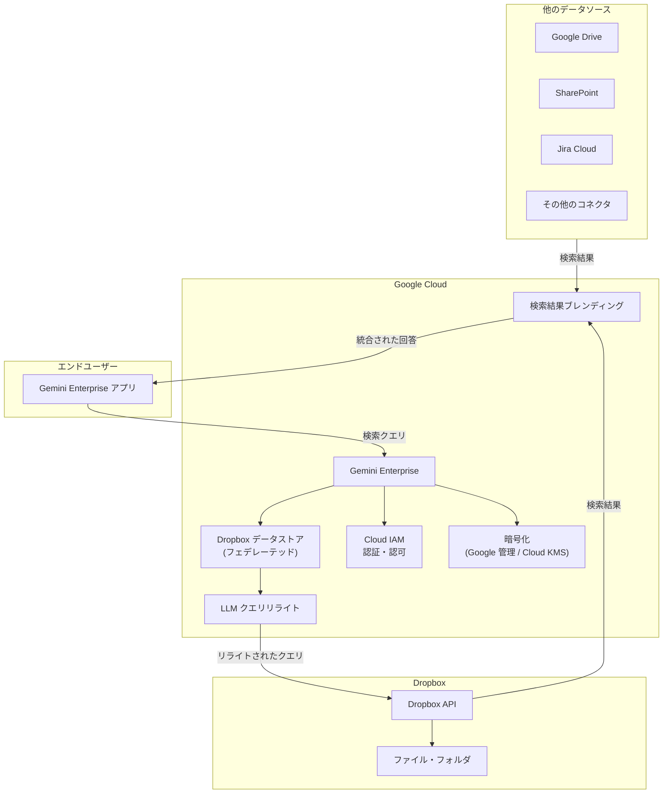

# Gemini Enterprise: Dropbox フェデレーテッドデータストアの一般提供 (GA)

**リリース日**: 2026-04-07

**サービス**: Gemini Enterprise

**機能**: Dropbox フェデレーテッドデータストアの一般提供 (GA)

**ステータス**: GA (一般提供)

[このアップデートのインフォグラフィックを見る](https://takech9203.github.io/google-cloud-news-summary/20260407-gemini-enterprise-dropbox-data-store.html)

## 概要

Gemini Enterprise の Dropbox フェデレーテッドデータストアが一般提供 (GA) となりました。この機能により、Gemini Enterprise のエンタープライズ検索プラットフォームから Dropbox に保存されたファイルやフォルダを直接検索し、検索結果を他のデータソースと統合して包括的な回答を提供できるようになります。

フェデレーテッドデータストアは、データを Gemini Enterprise 側にコピー (インデックス) せず、Dropbox API を通じてリアルタイムに情報を取得するアプローチです。これにより、データストレージの追加コストを抑えつつ、Dropbox 上の最新データに即座にアクセスできます。さらに、フォルダ作成、ファイル・フォルダのコピー、ファイルのアップロード・ダウンロードといったアクションも Gemini Enterprise のアシスタントから自然言語で実行可能です。

この機能は、Dropbox を業務で活用している企業において、分散した情報を Gemini Enterprise を通じて一元的に検索・操作したいユースケースに特に有用です。Google ドライブや SharePoint などの他のデータソースと組み合わせることで、組織全体のナレッジを横断的に活用できるようになります。

**アップデート前の課題**

- Dropbox フェデレーテッドデータストアはパブリックプレビューの段階であり、SLA の対象外で本番環境での利用に制約があった
- プレビュー機能は「Pre-GA Offerings Terms」の対象であり、サポートが限定されていた
- GA ステータスの保証がないため、エンタープライズ向けの本番ワークロードでの採用判断が難しかった

**アップデート後の改善**

- GA として正式にサポートされ、SLA の対象となったことで本番環境での利用が可能に
- エンタープライズグレードのサポートが提供され、安心して業務に導入可能に
- Dropbox 内のデータを Gemini Enterprise の統合検索基盤に組み込み、他のデータソースと横断的に検索可能に

## アーキテクチャ図

ユーザーが Gemini Enterprise アプリで検索クエリを送信すると、Dropbox データストアが Dropbox API にクエリを転送し、検索結果を他のデータソースの結果とブレンドして包括的な回答を返します。LLM によるクエリリライトが精度向上に活用されます。

## サービスアップデートの詳細

### 主要機能

1. **フェデレーテッド検索**
   - Dropbox に保存されたファイルやフォルダをリアルタイムに検索
   - データを Gemini Enterprise 側にコピーせず、Dropbox API を直接呼び出して結果を取得
   - 他の接続済みデータソースの結果と統合 (ブレンド) して包括的な検索結果を提供

2. **アクション実行**
   - Gemini Enterprise アシスタントから自然言語で Dropbox 操作を実行可能
   - フォルダ作成、ファイル・フォルダのコピー、ファイルのアップロード、ファイルのダウンロードに対応
   - 読み取り専用のアクションも利用可能

3. **LLM によるクエリリライト**
   - 検索精度向上のため、LLM がユーザーのクエリを Dropbox API に送信する前にリライト
   - セッション内のクエリ履歴を考慮したコンテキスト対応のリライトを実行

4. **セキュリティとアクセス制御**
   - パーミッションアウェア検索により、ユーザーがアクセス権を持つデータのみを結果に表示
   - Cloud KMS によるカスタマー管理暗号鍵 (CMEK) のサポート
   - VPC Service Controls によるネットワークセキュリティ (制約あり)

## 技術仕様

### データストア仕様

| 項目 | 詳細 |
|------|------|
| コネクタモード | フェデレーテッド検索 |
| ステータス | GA (一般提供) |
| データ取得方式 | Dropbox API 経由のリアルタイム取得 (データコピーなし) |
| 認証方式 | OAuth 2.0 (Dropbox App Console で設定) |
| 暗号化 | Google 管理暗号鍵 または Cloud KMS (CMEK) |
| サポートリージョン | global、us、eu |

### サポートされるアクション

| アクション | 説明 |
|-----------|------|
| フォルダ作成 | ユーザーの Dropbox にフォルダを作成 |
| ファイル・フォルダのコピー | ユーザーの Dropbox 内のファイルやフォルダをコピー |
| ファイルのアップロード | ユーザーの Dropbox にファイルをアップロード |
| ファイルのダウンロード | ユーザーの Dropbox からファイルをダウンロード |

### 必要な Dropbox OAuth スコープ

| スコープ | 説明 |
|---------|------|
| `account_info.read` | ユーザーリンクアプリの登録に必須 |
| `files.metadata.read` | ファイル・フォルダのメタデータ読み取り |
| `files.content.read` | ファイル内容の読み取りとダウンロード |
| `files.content.write` | ファイルのアップロード (アクション利用時) |

### 必要な IAM ロール

| ロール | 説明 |
|--------|------|
| `roles/discoveryengine.editor` | データストア作成に必要 |

## 設定方法

### 前提条件

1. Google Cloud プロジェクトが作成済みであること
2. Gemini Enterprise のサブスクリプションとライセンスが設定済みであること
3. アイデンティティプロバイダーが設定済みであること
4. Dropbox App Console でアプリが作成済みであること

### 手順

#### ステップ 1: Dropbox App Console でアプリを作成

1. [Dropbox App Console](https://www.dropbox.com/developers/apps) にアクセス
2. **Create app** をクリック
3. **Choose an API** で **Scoped access** を選択
4. **Choose the type of access you need** で **Full Dropbox** を選択
5. アプリ名を入力し、利用規約に同意して **Create app** をクリック

#### ステップ 2: Dropbox アプリの認証設定

1. アプリの **Settings** タブで **Enable additional users** をクリック
2. **App key** と **App secret** をコピー
3. **OAuth 2** の Redirect URIs に以下を追加:
   - `https://vertexaisearch.cloud.google.com/console/oauth/default_oauth.html`
   - `https://vertexaisearch.cloud.google.com/oauth-redirect`
4. **Permissions** タブで必要なスコープを選択し **Submit** をクリック

#### ステップ 3: Gemini Enterprise でデータストアを作成

1. Google Cloud Console で [Gemini Enterprise](https://console.cloud.google.com/gemini-enterprise/) ページに移動
2. **Data stores** > **Create data store** をクリック
3. データソース選択画面で **Dropbox** を検索して選択
4. コネクタモードで **Federated search** を選択
5. Dropbox アプリの **App key** と **App secret** を入力してログイン
6. 検索対象のエンティティタイプを選択
7. 必要に応じてアクションを設定
8. マルチリージョン (global / us / eu) とコネクタ名を設定
9. 暗号化設定 (Google 管理鍵 または Cloud KMS) を選択
10. 課金プランを選択してデータストアを作成

#### ステップ 4: アプリの作成と接続

1. Gemini Enterprise で[アプリを作成](https://cloud.google.com/gemini/enterprise/docs/create-app)
2. 作成したアプリに Dropbox データストアを[接続](https://cloud.google.com/gemini/enterprise/docs/connect-existing-data-store)
3. ユーザーに Dropbox への[認可](https://cloud.google.com/gemini/enterprise/docs/create-app#user-authorization)を設定

## メリット

### ビジネス面

- **分散データの統合検索**: Dropbox に保存された業務ファイルを、Google ドライブや SharePoint などの他のデータソースと一元的に検索可能に
- **業務効率の向上**: 自然言語でのファイル操作 (アップロード、ダウンロード、コピー、フォルダ作成) により、複数ツール間の切り替えを削減
- **本番運用の信頼性**: GA ステータスにより SLA とエンタープライズサポートが適用され、ミッションクリティカルな業務での利用が可能

### 技術面

- **データコピー不要**: フェデレーテッド方式によりデータの複製が不要で、ストレージコストを抑制しつつ最新データにアクセス可能
- **セキュリティ**: パーミッションアウェア検索、CMEK サポート、OAuth 2.0 ベースの認証によりエンタープライズグレードのセキュリティを実現
- **柔軟な暗号化**: Google 管理暗号鍵に加え、Cloud KMS によるカスタマー管理暗号鍵を選択可能

## デメリット・制約事項

### 制限事項

- Dropbox データストアは **global、us、eu の 3 リージョンのみ** でサポート
- 既存の Dropbox データストアに対する VPC Service Controls ペリメーターの適用は非サポート。VPC Service Controls を有効にするにはデータストアの再作成が必要
- アクション付きのデータストアでは、1 つのデータストアに 1 つのコネクタタイプのアクションのみを関連付けることが推奨される

### 考慮すべき点

- データフェデレーション方式のため、データがインデックスされず検索品質がインジェスト方式と比較して低くなる可能性がある
- クエリ文字列が Dropbox API に送信されるため、サードパーティのプライバシーポリシーが適用される
- LLM によるクエリリライトにより、セッション内のクエリ履歴の一部が Dropbox API に送信される可能性がある
- Dropbox 側でクエリがユーザーの ID と関連付けられる可能性がある

## ユースケース

### ユースケース 1: マルチプラットフォームのナレッジ統合検索

**シナリオ**: 大企業で、部門ごとに Google ドライブ、SharePoint、Dropbox を併用している。社員が業務に必要な情報を探す際に、各プラットフォームを個別に検索する必要がある。

**効果**: Gemini Enterprise に全てのデータソースを接続することで、1 つの検索インターフェースから組織全体のナレッジを横断検索可能に。情報検索にかかる時間を大幅に削減し、部門間の情報共有を促進。

### ユースケース 2: AI アシスタントによるファイル操作の自動化

**シナリオ**: 営業チームが Dropbox 上のプロジェクトフォルダに対して、自然言語で「今月の提案書を新しいフォルダにまとめて」といった指示を出す。

**効果**: Gemini Enterprise のアクション機能により、フォルダ作成やファイルコピーを自然言語で実行可能。Dropbox のインターフェースに切り替えることなく、AI アシスタントを通じてファイル管理を完結。

### ユースケース 3: コンプライアンス対応の情報探索

**シナリオ**: コンプライアンス部門が、複数のクラウドストレージに分散した規程文書や監査証跡を、パーミッションアウェアな検索で安全に参照する。

**効果**: 各ユーザーのアクセス権限に基づいた検索結果のみが返されるため、情報漏洩のリスクを最小化しつつ必要な文書に迅速にアクセス可能。CMEK による暗号化で追加のセキュリティ要件にも対応。

## 料金

Gemini Enterprise の料金はエディション別のサブスクリプション制です。具体的なエディションと料金の詳細は以下の公式ドキュメントを参照してください。

| エディション | ユーザー数 | ストレージ/月/ユーザー |
|-------------|-----------|----------------------|
| Business | 1-300 | 25 GiB (プール) |
| Standard | 1 以上 | 30 GiB (プール) |
| Plus | 1 以上 | 75 GiB (プール) |
| Frontline | 150 以上 (Standard/Plus と併用) | 2 GiB (プール) |

データストア作成時に **General pricing** または **Configurable pricing** を選択できます。詳細は [Gemini Enterprise ライセンス](https://cloud.google.com/gemini/enterprise/docs/licenses) を参照してください。

## 利用可能リージョン

Dropbox データストアは以下のリージョンでサポートされています。

| リージョン | 説明 |
|-----------|------|
| global | グローバルマルチリージョン (推奨) |
| us | 米国マルチリージョン |
| eu | 欧州マルチリージョン |

us または eu を選択した場合は暗号化設定 (Google 管理暗号鍵 または Cloud KMS) の構成が必要です。

## 関連サービス・機能

- **Gemini Enterprise コネクタエコシステム**: Jira Cloud、Confluence Cloud、SharePoint、OneDrive、ServiceNow など、多数のサードパーティデータソースとの連携をサポート
- **NotebookLM Enterprise**: Gemini Enterprise のライセンスに含まれるノートブックツール。接続されたデータソースのコンテンツを活用した AI ノートブックの作成・公開が可能
- **Vertex AI Search**: Gemini Enterprise の検索基盤として機能し、データストアの管理とエンタープライズ検索機能を提供
- **Cloud KMS**: Dropbox データストアのカスタマー管理暗号鍵 (CMEK) を提供し、データ暗号化の制御を可能に

## 参考リンク

- [インフォグラフィック](https://takech9203.github.io/google-cloud-news-summary/20260407-gemini-enterprise-dropbox-data-store.html)
- [公式リリースノート](https://cloud.google.com/release-notes#April_07_2026)
- [Dropbox データストアの設定ドキュメント](https://cloud.google.com/gemini/enterprise/docs/connectors/dropbox/data-store)
- [Dropbox コネクタ概要](https://cloud.google.com/gemini/enterprise/docs/connectors/dropbox)
- [Dropbox 認証設定](https://cloud.google.com/gemini/enterprise/docs/connectors/dropbox/config)
- [Gemini Enterprise エディション比較](https://cloud.google.com/gemini/enterprise/docs/editions)
- [Gemini Enterprise ライセンス](https://cloud.google.com/gemini/enterprise/docs/licenses)

## まとめ

Gemini Enterprise の Dropbox フェデレーテッドデータストアが GA となり、Dropbox を業務で利用する企業が本番環境で安心してこの連携を活用できるようになりました。フェデレーテッド方式によりデータコピー不要で最新の Dropbox データにアクセスでき、自然言語によるファイル操作アクションも利用可能です。Dropbox を含む複数のクラウドストレージを横断した統合検索基盤の構築を検討している組織は、公式ドキュメントを参照のうえ導入を検討することを推奨します。

---

**タグ**: #GeminiEnterprise #Dropbox #FederatedSearch #DataStore #GA #EnterpriseSearch #ThirdPartyConnector #CMEK
