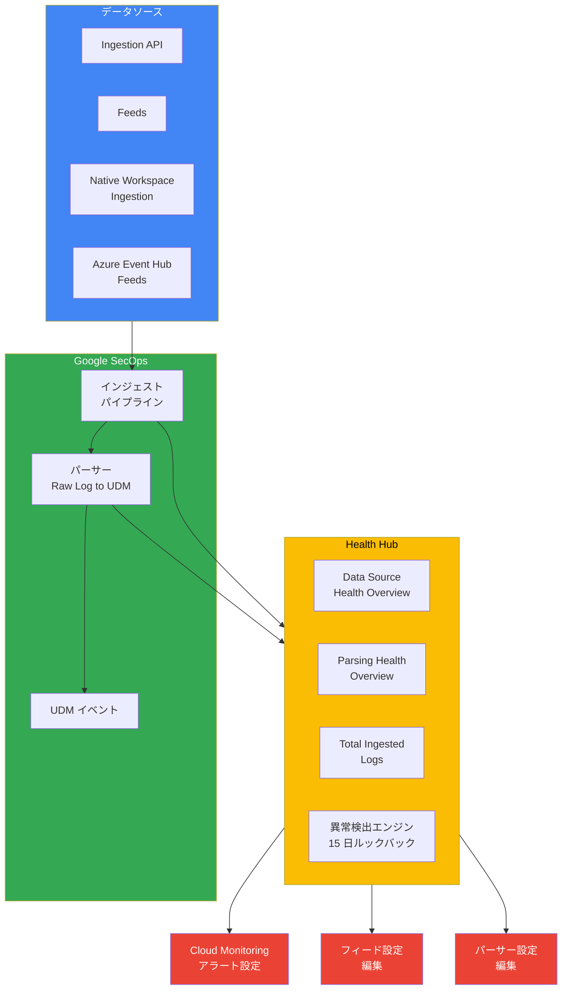

# Google SecOps: Health Hub によるデータソース一元監視 (Preview)

**リリース日**: 2026-04-07

**サービス**: Google SecOps (Google Security Operations)

**機能**: Health Hub - データソースの状態監視とトラブルシューティング

**ステータス**: Preview

[このアップデートのインフォグラフィックを見る](https://takech9203.github.io/google-cloud-news-summary/20260407-google-secops-health-hub.html)

## 概要

Google Security Operations (SecOps) に新しい Health Hub 機能が Preview として追加されました。Health Hub は、Google SecOps に設定されたすべてのデータソースの状態と健全性を一元的に監視するための中央ダッシュボードです。データソースとログタイプに関する重要な情報を提供し、データパイプラインの問題を診断・修復するために必要なコンテキストを集約します。

Health Hub は、15 日間のルックバック期間を使用した統計的手法により、顧客ごとにインジェストデータの異常を検出します。異常としてマークされた項目は、Google SecOps に取り込まれ処理されるデータの急増または急減を示し、パーサーの問題、ベンダースキーマの変更、データパイプラインの変更などを早期に発見できます。

対象ユーザーは、Google SecOps を利用してセキュリティデータの取り込みと解析を行うセキュリティ運用チーム (SOC)、セキュリティエンジニア、および SIEM 管理者です。

**アップデート前の課題**

- 複数のデータソースやフィードの健全性を個別に確認する必要があり、全体的なデータパイプラインの状態把握に時間がかかっていた
- インジェストやパースの異常検出が手動に依存しており、データ欠損や障害の発見が遅延していた
- フィード設定やパーサー設定の問題箇所を特定するために、複数の管理画面を行き来する必要があった

**アップデート後の改善**

- Health Hub により、すべてのデータソースの状態を単一のダッシュボードで一覧確認が可能になった
- 統計的手法による自動異常検出により、インジェスト量やパース量の急変を即座に把握できるようになった
- Health Hub から直接フィード設定やパーサー設定にアクセスし、問題の修正が可能になった
- Cloud Monitoring との連携により、カスタムアラートの設定が容易になった

## アーキテクチャ図

Health Hub は、インジェストパイプラインとパーサーの両方からメトリクスを収集し、統計的手法で異常を検出します。問題が検出された場合は、フィード設定やパーサー設定への直接リンクを通じて迅速な修復を可能にし、Cloud Monitoring と連携してアラートを設定できます。

## サービスアップデートの詳細

### 主要機能

1. **データソース健全性の一元監視**
   - すべてのフィード、データソース、ログタイプ、ソース (フィード ID) のコアヘルスステータスと関連メトリクスを一覧表示
   - ステータスは Healthy、Irregular、Failed の 3 段階で表示
   - 各データソースの最終インジェスト日時、最終正規化日時、設定最終更新日時を確認可能

2. **統計的異常検出エンジン**
   - 15 日間のルックバック期間を使用してインジェストデータを分析
   - 顧客ごとの基準値に基づいて異常を検出
   - インジェスト量やパース量の急増・急減を自動的に検出してマーク

3. **データソース健全性概要ウィジェット**
   - Healthy Sources / Failed Sources / Irregular Data Sources の数値ウィジェット
   - Healthy Parsers / Failed Parsers / Irregular Parsers の数値ウィジェット
   - Data Source Health Overview (時系列折れ線グラフ)
   - Parsing Health Overview (時系列折れ線グラフ)
   - Total Ingested Logs (時系列折れ線グラフ)
   - Failing Parser by Log Type (時系列折れ線グラフ)

4. **問題の診断と修復支援**
   - Latest Issue Details 列でアクション可能な問題とサポートが必要な問題を区別
   - フィード設定への直接リンク (Edit Data Source)
   - パーサー設定への直接リンク (Edit Parser)
   - Cloud Monitoring へのアラート設定リンク (Set Up Alerts)
   - 詳細ダッシュボードへのリンク (View Ingestion Details) で直近 200 件のフィード実行とパーサーエラーを確認可能

5. **インジェスト遅延の推定**
   - Last Event Time と Last Ingested のタイムスタンプの差分を表示
   - ログタイプごとの 95 パーセンタイル遅延を公開
   - Google SecOps パイプラインの遅延とソース側の遅延を区別可能

## 技術仕様

### Health Hub の主要メトリクス

| メトリクス | 説明 |
|------|------|
| Status | データソースの累積ステータス (Healthy / Irregular / Failed) |
| Source Type | 取り込みメカニズム (Ingestion API / Feeds / Native Workspace Ingestion / Azure Event Hub Feeds) |
| Log Type | ログタイプ (CS_EDR, UDM, GCP_CLOUDAUDIT, WINEVTLOG など) |
| Last Collected | 最終データ収集日時 |
| Last Ingested | 最終インジェスト成功日時 |
| Last Normalized | 最終 UDM 正規化成功日時 |
| Config Last Updated | 設定の最終更新日時 |
| Issue Duration | 異常・障害状態の継続日数 |

### エラーコードと対処法

| エラーコード | 説明 | 対処 |
|------|------|------|
| Forbidden 403 | 権限エラー。フィード設定のサービスアカウントに必要な権限が不足 | Health Hub の Edit Data Source からサービスアカウントの認証情報または権限を更新 |
| Internal_error | システム内部エラー | Google SecOps サポートケースを作成。Health Hub の詳細情報を提供 |
| Normalization Issue | パーサーのエラー率が上昇。正規化率の変化を含む | Health Hub の Edit Parser からパーサーコードを確認し、サンプルログでテスト後に修正 |

## 設定方法

### 前提条件

1. Google SecOps (SIEM) のインスタンスが有効化されていること
2. データソース (フィード) が 1 つ以上設定されていること
3. Health Hub は Pre-GA 機能であるため、利用可能なリージョンが限定される場合がある

### 手順

#### ステップ 1: Health Hub を開く

Google SecOps のサイドナビゲーションメニューから「Health Hub」をクリックします。Health Hub は読み取り専用のデフォルトダッシュボードとして表示されます。

#### ステップ 2: データソースの健全性を確認する

Health Hub 上部の数値ウィジェットで、Healthy / Failed / Irregular のデータソース数とパーサー数を確認します。時系列グラフで長期的なトレンドを把握できます。

#### ステップ 3: 問題のあるデータソースを特定・修復する

Health Status by Data Source テーブルで、Status が Failed または Irregular のデータソースを確認します。Latest Issue Details 列の内容に基づいて対処を行います。

- アクション可能なエラー (例: Forbidden 403): 「Edit Data Source」をクリックしてフィード設定を修正
- パーサーの問題 (例: Normalization Issue): 「Edit Parser」をクリックしてパーサー設定を修正
- システムエラー (例: Internal_error): Google SecOps サポートケースを作成

#### ステップ 4: アラートを設定する

テーブル内の「Set Up Alerts」リンクをクリックして Cloud Monitoring のインターフェースを開き、Status やログ量メトリクスに基づくカスタムアラートを設定します。

#### ステップ 5: カスタムダッシュボードを作成する (任意)

Health Hub はデフォルトダッシュボードのため直接変更できません。カスタマイズが必要な場合は、Health Hub のコピーを作成し、複製されたダッシュボードを用途に合わせて変更します。

## メリット

### ビジネス面

- **セキュリティデータの可用性向上**: データパイプラインの問題を早期に検出・修復することで、セキュリティ分析に必要なデータの欠損を最小化
- **運用効率の改善**: 複数のツールやダッシュボードを行き来する必要がなくなり、SOC チームの運用負荷を軽減
- **MTTR (平均修復時間) の短縮**: 問題の根本原因を迅速に特定し、直接リンクから修復を実行できるため、障害対応時間が短縮

### 技術面

- **統計的異常検出**: 15 日間のルックバック期間に基づく自動的な異常検出により、手動監視の必要性を削減
- **Cloud Monitoring 連携**: 既存の Google Cloud 監視基盤と統合し、カスタムアラートポリシーを設定可能
- **包括的なメトリクス**: インジェスト、パース、遅延の各段階のメトリクスを一元的に提供し、エンドツーエンドの可視性を実現

## デメリット・制約事項

### 制限事項

- Pre-GA 機能のため、サポートが限定的であり、今後の Pre-GA バージョンとの互換性が保証されない
- すべての顧客・リージョンで利用可能とは限らない
- Health Hub はデフォルトダッシュボードのため直接変更不可 (カスタマイズにはコピーが必要)

### 考慮すべき点

- データの更新間隔は約 15 分であり、リアルタイムの監視が必要な場合は追加の仕組みが必要
- フィールドにデータがない場合はダッシュ (-) が表示されるが、データがないことがインジェスト失敗を意味するとは限らない (空ファイルの取り込みなど)
- 削除されたフィードの履歴データは選択した時間範囲に応じて表示されるため、解釈に注意が必要

## ユースケース

### ユースケース 1: インジェスト障害の早期発見と復旧

**シナリオ**: SOC チームが朝のシフト開始時に Health Hub を確認したところ、CrowdStrike EDR のフィードが Failed ステータスになっていることを発見。Latest Issue Details に「Forbidden 403: Permission denied」と表示されている。

**効果**: Health Hub の「Edit Data Source」リンクから直接フィード設定画面に遷移し、認証情報を更新することで、SOC アナリストは数分以内にデータフローを復旧できる。従来は問題の特定に時間がかかっていたが、Health Hub により即座に原因と対処法が判明する。

### ユースケース 2: パース失敗率の監視とパーサーの修正

**シナリオ**: あるベンダーがログフォーマットを変更した結果、該当するログタイプのパーサーが Irregular ステータスになり、正規化率が低下。Health Hub の Failing Parser by Log Type グラフで異常が視覚化されている。

**効果**: Health Hub から「Edit Parser」リンクでパーサー設定に直接アクセスし、新しいログフォーマットに対応するようパーサーを修正。Config Last Updated と Last Ingested のタイムスタンプの相関により、設定変更が問題解決に寄与したことを確認できる。

### ユースケース 3: Cloud Monitoring と連携したプロアクティブアラート

**シナリオ**: セキュリティエンジニアが、重要なデータソース (GCP Cloud Audit Logs, Windows Event Logs) について、インジェスト量が閾値を下回った場合に即座に通知を受けたい。

**効果**: Health Hub の「Set Up Alerts」リンクから Cloud Monitoring に遷移し、ステータスおよびログ量メトリクスに基づくアラートポリシーを設定。データパイプラインの問題が発生した際に自動通知を受信でき、プロアクティブな対応が可能になる。

## 関連サービス・機能

- **Cloud Monitoring**: Health Hub のステータスおよびログ量メトリクスを Cloud Monitoring に連携し、カスタムアラートポリシーを設定可能
- **Google SecOps Feeds Management**: Health Hub からフィード設定への直接リンクにより、データソースの設定・修正をシームレスに実行
- **Google SecOps Parser Management**: Health Hub からパーサー設定への直接リンクにより、パースルールの確認・修正が可能
- **BigQuery Export**: インジェストメトリクスを BigQuery にエクスポートし、SQL ベースの詳細分析やカスタムレポートを作成可能
- **Unified Data Model (UDM)**: Health Hub はログから UDM イベントへの正規化ステータスを監視し、パース成功率を可視化

## 参考リンク

- [インフォグラフィック](https://takech9203.github.io/google-cloud-news-summary/20260407-google-secops-health-hub.html)
- [公式リリースノート](https://docs.cloud.google.com/release-notes#April_07_2026)
- [Health Hub ドキュメント](https://cloud.google.com/chronicle/docs/reports/data-health-monitoring-and-troubleshooting-dashboard)
- [インジェストメトリクスの理解](https://cloud.google.com/chronicle/docs/ingestion/understand-ingestion-metrics)
- [Cloud Monitoring によるインジェスト監視](https://cloud.google.com/chronicle/docs/ingestion/ingestion-notifications-for-health-metrics)

## まとめ

Google SecOps の Health Hub は、セキュリティデータパイプラインの健全性を一元的に監視・管理するための重要な機能です。統計的手法による自動異常検出、問題箇所への直接リンク、Cloud Monitoring との連携により、SOC チームはデータパイプラインの問題を迅速に特定・修復できるようになります。Preview 段階ではありますが、Google SecOps を運用するすべての組織において、Health Hub の有効化とアラート設定を推奨します。

---

**タグ**: #GoogleSecOps #SecurityOperations #SIEM #HealthHub #DataPipeline #Monitoring #Preview
