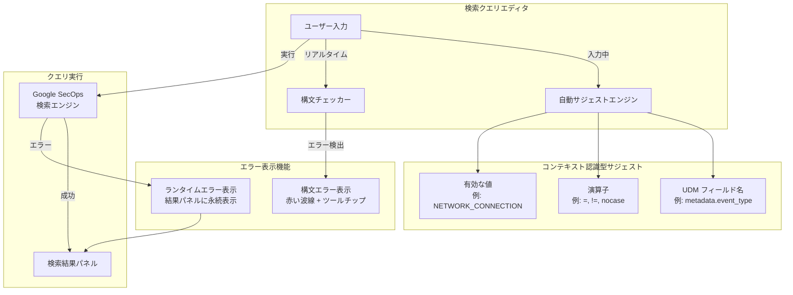

# Google SecOps: 検索クエリエディタの強化

**リリース日**: 2026-04-07
**サービス**: Google SecOps
**機能**: 検索クエリエディタの強化 (インテリジェント自動サジェストとエラーハンドリングの改善)
**ステータス**: 変更 (段階的ロールアウト: 2026年4月7日 ~ 4月10日)

[このアップデートのインフォグラフィックを見る](https://takech9203.github.io/google-cloud-news-summary/20260407-google-secops-search-query-editor.html)

## 概要

Google SecOps (旧 Chronicle SIEM) の検索クエリエディタが大幅に強化され、インテリジェントな自動サジェスト機能と改善されたエラーハンドリング機能が導入された。これにより、UDM (Unified Data Model) 検索クエリの作成がより直感的かつ効率的になり、セキュリティアナリストの調査作業の生産性が向上する。

自動サジェスト機能は、ユーザーの入力に応じてコンテキストを認識し、適切な UDM フィールド名、演算子、有効な値をリアルタイムで提案する。従来の単純なフィールド名補完から進化し、クエリの文脈に基づいたインテリジェントな候補表示を実現する。エラーハンドリングの改善では、構文エラーを赤い波線でハイライト表示し、ホバー時にエラーの詳細説明をツールチップで表示する機能が追加された。さらに、ランタイムエラーが結果パネルに永続的に表示されるようになり、トラブルシューティングが容易になった。

本アップデートは 2026 年 4 月 7 日から 4 月 10 日にかけて段階的にロールアウトされる。SOC アナリスト、脅威ハンター、およびセキュリティエンジニアを主な対象としている。

**アップデート前の課題**

- UDM フィールド名の補完機能は存在していたが、演算子や有効な値に対するコンテキスト認識型のサジェストがなく、ユーザーはドキュメントを参照しながらクエリを手動で記述する必要があった
- 構文エラーがクエリ実行時にのみ判明し、エラー箇所の特定に時間がかかっていた
- ランタイムエラーが一時的にしか表示されず、エラーメッセージを見逃したり、再確認のためにクエリを再実行する必要があった

**アップデート後の改善**

- コンテキスト認識型の自動サジェストにより、UDM フィールド、演算子、有効な値がリアルタイムで提案され、クエリ作成速度が向上した
- 構文エラーが赤い波線で即座にハイライト表示され、ホバー時に具体的なエラー説明がツールチップで確認できるようになった
- ランタイムエラーが結果パネルに永続的に表示されるようになり、トラブルシューティングが効率化された

## アーキテクチャ図



ユーザーの入力に対して、自動サジェストエンジンがコンテキストを解析してフィールド名・演算子・値を提案し、構文チェッカーがリアルタイムでエラーを検出・表示する。クエリ実行後のランタイムエラーは結果パネルに永続的に表示される。

## サービスアップデートの詳細

### 主要機能

1. **コンテキスト認識型自動サジェスト**
   - クエリエディタで入力中に、現在のカーソル位置のコンテキストに基づいて適切な候補を自動表示
   - UDM フィールド名 (例: `metadata.event_type`, `principal.ip`, `target.hostname`) の補完
   - 選択したフィールドに対して有効な演算子 (`=`, `!=`, `<`, `>`, `<=`, `>=`, `nocase`) を提案
   - フィールドに対する有効な値 (例: イベントタイプの列挙値 `NETWORK_CONNECTION`, `USER_LOGIN` など) を提案
   - 入力のたびにサジェストが動的に更新され、クエリの文脈に即した候補が常に表示される

2. **構文エラーのリアルタイムハイライト**
   - クエリ内の構文エラー箇所に赤い波線 (squiggly line) を表示し、エラーの位置を視覚的に特定可能
   - エラー箇所にマウスをホバーすると、具体的なエラー説明をツールチップで表示
   - クエリ実行前にエラーを発見・修正でき、試行錯誤のサイクルを短縮

3. **ランタイムエラーの永続表示**
   - クエリ実行後に発生するランタイムエラーが結果パネル (Results panel) に永続的に表示
   - エラーメッセージの見逃しを防止し、クエリの再実行なしでエラー内容を確認可能
   - トラブルシューティングに必要な情報へのアクセスが容易になる

## 技術仕様

### 自動サジェストの対象要素

| サジェスト対象 | 説明 | 例 |
|---------------|------|-----|
| UDM フィールド名 | Unified Data Model で定義されたフィールド | `principal.ip`, `target.hostname`, `metadata.log_type` |
| 演算子 | 選択したフィールドのデータ型に基づく有効な演算子 | `=`, `!=`, `nocase`, `<`, `>` |
| 有効な値 | フィールドに対して使用可能な値 (列挙型など) | `NETWORK_CONNECTION`, `USER_LOGIN`, `PCAP_DNS` |

### エラー表示の種類

| エラー種別 | 表示方法 | 表示タイミング |
|-----------|---------|--------------|
| 構文エラー | 赤い波線 + ホバーツールチップ | クエリ入力中 (リアルタイム) |
| ランタイムエラー | 結果パネルに永続表示 | クエリ実行後 |

### ロールアウトスケジュール

| フェーズ | 日付 |
|---------|------|
| ロールアウト開始 | 2026 年 4 月 7 日 |
| ロールアウト完了 | 2026 年 4 月 10 日 |

## 設定方法

### 前提条件

1. Google SecOps (Chronicle) へのアクセス権限を持つアカウント
2. 検索ページ (Investigation > SIEM Search) へのアクセス権限

### 手順

#### ステップ 1: 検索ページにアクセス

Google SecOps コンソールにサインインし、**Investigation > SIEM Search** に移動する。段階的ロールアウトにより、テナントに機能が適用されると、検索クエリエディタに新機能が自動的に有効化される。

#### ステップ 2: 自動サジェストを利用したクエリ作成

検索フィールドに UDM フィールド名を入力し始めると、コンテキスト認識型のサジェストが表示される。

```
// 例: ネットワーク接続イベントを検索
metadata.event_type = "NETWORK_CONNECTION"
AND target.hostname = "example.com"
```

入力中に表示されるサジェスト候補をクリックまたは Tab キーで選択してクエリを構築する。

#### ステップ 3: 構文エラーの確認と修正

クエリに構文エラーがある場合、該当箇所に赤い波線が表示される。波線にマウスをホバーしてエラーの詳細を確認し、修正する。

#### ステップ 4: ランタイムエラーの確認

クエリを実行後にランタイムエラーが発生した場合、結果パネルにエラーが永続的に表示される。エラー内容を確認してクエリを修正し、再実行する。

## メリット

### ビジネス面

- **調査時間の短縮**: コンテキスト認識型サジェストにより、SOC アナリストが正しいクエリを素早く作成でき、インシデント対応の平均調査時間 (MTTI) が短縮される
- **オンボーディングの効率化**: 新しいアナリストが UDM フィールド構造や有効な演算子を学習する負担が軽減され、チームへの早期貢献が可能になる
- **エラー起因のダウンタイム削減**: ランタイムエラーの永続表示により、エラーの見逃しが防止され、トラブルシューティングにかかる時間が削減される

### 技術面

- **クエリ品質の向上**: リアルタイム構文チェックにより、実行前にエラーを発見・修正でき、無効なクエリの実行回数が減少する
- **UDM スキーマの探索性向上**: 自動サジェストを通じて利用可能なフィールドや値を直接確認でき、ドキュメント参照の頻度が低下する
- **デバッグ効率の向上**: 構文エラーのピンポイント表示とランタイムエラーの永続表示により、クエリのデバッグサイクルが高速化する

## デメリット・制約事項

### 制限事項

- 段階的ロールアウト (2026 年 4 月 7 日 ~ 10 日) であり、すべてのテナントに即時適用されるわけではない
- 自動サジェストはコンテキスト認識型であるが、複雑なネスト構造やカスタムフィールドに対するサジェスト精度は環境によって異なる可能性がある

### 考慮すべき点

- 従来のクエリエディタの操作に慣れたアナリストは、新しいサジェスト UI に適応する時間が必要な場合がある
- 自動サジェストの候補が多数表示される場合、目的のフィールドや値を素早く見つけるために、ある程度の入力で候補を絞り込む必要がある

## ユースケース

### ユースケース 1: 新人アナリストによる脅威ハンティング

**シナリオ**: SOC に配属されたばかりのアナリストが、特定の IP アドレスに関連するネットワーク接続イベントを検索したいが、UDM フィールド構造に不慣れである。

**実装例**:
```
// 自動サジェストが以下のように支援
// 1. "pri" と入力 → "principal.ip" がサジェストされる
// 2. "principal.ip" を選択 → "=" 演算子がサジェストされる
// 3. 値を入力してクエリ完成
principal.ip = "198.51.100.50"
```

**効果**: UDM フィールドリストを参照せずとも、入力中のサジェストからフィールド名と演算子を選択するだけで正しいクエリを作成でき、学習コストが大幅に低減する。

### ユースケース 2: 複雑なクエリのデバッグ

**シナリオ**: セキュリティエンジニアが複数条件を組み合わせた複雑な UDM 検索クエリを作成しているが、構文エラーが含まれており、実行しても期待する結果が得られない。

**実装例**:
```
// 構文エラーのある例 (括弧の閉じ忘れ)
metadata.event_type = "USER_LOGIN"
AND (security_result.action = "BLOCK"
OR principal.user.userid = "admin"
// ← 赤い波線で括弧の閉じ忘れが即座にハイライトされる
```

**効果**: 赤い波線によるリアルタイムの構文エラー表示とツールチップの詳細説明により、クエリ実行前にエラーを特定・修正でき、デバッグサイクルが大幅に短縮される。

### ユースケース 3: ランタイムエラーのトラブルシューティング

**シナリオ**: SOC アナリストが大量のイベントを対象とした検索クエリを実行したが、一部の結果でランタイムエラーが発生した。従来はエラーメッセージが一時的にしか表示されず、確認が困難だった。

**効果**: ランタイムエラーが結果パネルに永続的に表示されるようになったことで、エラーの内容を落ち着いて確認し、適切な対処 (クエリの修正、時間範囲の調整など) を行える。

## 関連サービス・機能

- **Google SecOps SIEM (UDM Search)**: 本アップデートの対象となるコア検索機能。UDM フィールドを使用したイベント検索の基盤
- **Gemini in Google SecOps**: 自然言語プロンプトから UDM 検索クエリを自動生成する AI アシスタント機能。自動サジェストと補完的に利用可能
- **UDM Lookup**: UDM フィールド名や値を検索してクエリに追加する機能。自動サジェストと併用することでクエリ作成がさらに効率化される
- **Saved Searches / Search Manager**: 作成したクエリの保存・共有機能。自動サジェストで作成した高品質なクエリを保存して再利用可能

## 参考リンク

- [インフォグラフィック](https://takech9203.github.io/google-cloud-news-summary/20260407-google-secops-search-query-editor.html)
- [公式リリースノート](https://docs.cloud.google.com/release-notes#April_07_2026)
- [自動サジェストを使用したクエリ作成](https://docs.cloud.google.com/chronicle/docs/investigation/udm-search#search_autosuggestions)
- [UDM Search の使用方法](https://docs.cloud.google.com/chronicle/docs/investigation/udm-search)
- [UDM Search の時間範囲とクエリ管理](https://docs.cloud.google.com/chronicle/docs/investigation/udm-search-time-range)
- [Gemini による検索クエリ生成](https://docs.cloud.google.com/chronicle/docs/investigation/generate-udm-search-queries-gemini)

## まとめ

今回のアップデートは、Google SecOps の検索クエリエディタにコンテキスト認識型の自動サジェストとリアルタイム構文エラー表示、ランタイムエラーの永続表示を追加する重要な強化である。特に UDM フィールド・演算子・有効な値のインテリジェントなサジェスト機能は、クエリ作成の効率と正確性を大幅に向上させ、新人からベテランまですべてのアナリストの調査ワークフローを改善する。2026 年 4 月 7 日から 10 日の段階的ロールアウト完了後、すべてのテナントで自動的に利用可能となるため、特別な設定変更は不要である。

---

**タグ**: #GoogleSecOps #Chronicle #SIEM #UDMSearch #QueryEditor #AutoSuggestions #ErrorHandling #SecurityOperations #GoogleCloud
