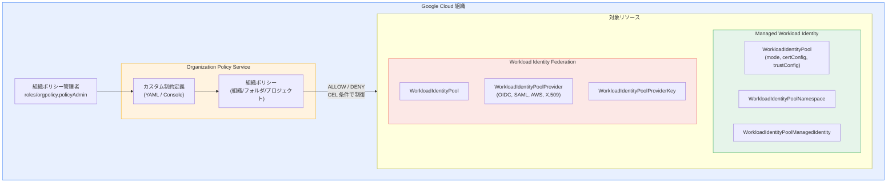

# Identity and Access Management: Organization Policy Service カスタム制約が Managed Workload Identity と Workload Identity Federation で利用可能に

**リリース日**: 2026-04-07

**サービス**: Identity and Access Management (IAM)

**機能**: Organization Policy Service カスタム制約 (Managed Workload Identity / Workload Identity Federation)

**ステータス**: Feature

📊 [このアップデートのインフォグラフィックを見る](https://takech9203.github.io/google-cloud-news-summary/20260407-iam-org-policy-workload-identity.html)

## 概要

Google Cloud Identity and Access Management (IAM) において、Organization Policy Service のカスタム制約が Managed Workload Identity と Workload Identity Federation の両方で利用可能になりました。この機能により、組織管理者はこれらのワークロード ID 機能の使用方法を、組織ポリシーのカスタム制約を通じてきめ細かく制御できるようになります。

Organization Policy Service は、Google Cloud リソースに対する制約を一元的かつプログラム的に管理するためのサービスです。従来のビルトインのマネージド制約に加え、今回のアップデートにより、カスタム制約を定義して Managed Workload Identity と Workload Identity Federation のリソースに適用できるようになりました。これにより、CEL (Common Expression Language) を使用した柔軟な条件定義が可能となり、組織のセキュリティポリシーに合わせた細かなガバナンスを実現できます。

対象となるリソースタイプは、Managed Workload Identity 側では `iam.googleapis.com/WorkloadIdentityPool`、`iam.googleapis.com/WorkloadIdentityPoolNamespace`、`iam.googleapis.com/WorkloadIdentityPoolManagedIdentity` の 3 つ、Workload Identity Federation 側では `iam.googleapis.com/WorkloadIdentityPool`、`iam.googleapis.com/WorkloadIdentityPoolProvider`、`iam.googleapis.com/WorkloadIdentityPoolProviderKey` の 3 つです。

**アップデート前の課題**

- Managed Workload Identity と Workload Identity Federation の使用方法を組織レベルで制御するには、ビルトインのマネージド制約（`constraints/iam.workloadIdentityPoolProviders` など）に限定されていた
- ワークロード ID プールの作成時に、モード（Trust Domain など）や暗号化アルゴリズムなど、個別のフィールドに対するきめ細かな制約を組織ポリシーで定義できなかった
- ID プロバイダーの種類（OIDC、SAML など）やプロバイダーキーの仕様を柔軟に制限する手段が不足していた

**アップデート後の改善**

- CEL 条件を使用してリソースの個別フィールドに対するカスタム制約を定義できるようになった
- 組織、フォルダ、プロジェクトの各レベルでカスタム制約を適用でき、ポリシーの階層継承も活用可能
- Managed Workload Identity では Trust Domain のモード、証明書発行設定、信頼構成などを制御可能
- Workload Identity Federation ではプロバイダーの種類、属性マッピング、OIDC 発行者 URI、SAML メタデータ、プロバイダーキーの仕様などを制御可能

## アーキテクチャ図



Organization Policy Service のカスタム制約が、Managed Workload Identity と Workload Identity Federation の両方のリソースに対して適用される全体像を示しています。組織ポリシー管理者がカスタム制約を定義し、組織ポリシーを通じて各リソースの作成・更新操作を CEL 条件で制御します。

## サービスアップデートの詳細

### 主要機能

1. **Managed Workload Identity 向けカスタム制約**
   - `iam.googleapis.com/WorkloadIdentityPool` に対する制約: モード（Trust Domain）、証明書発行設定（CA プール、キーアルゴリズム、有効期間、ローテーションウィンドウ）、信頼構成（追加の信頼バンドル）などのフィールドを制御可能
   - `iam.googleapis.com/WorkloadIdentityPoolNamespace` に対する制約: ネームスペースの作成・更新を制御
   - `iam.googleapis.com/WorkloadIdentityPoolManagedIdentity` に対する制約: マネージド ID の作成・更新を制御

2. **Workload Identity Federation 向けカスタム制約**
   - `iam.googleapis.com/WorkloadIdentityPool` に対する制約: プールの説明、無効化、表示名などを制御
   - `iam.googleapis.com/WorkloadIdentityPoolProvider` に対する制約: 属性条件、属性マッピング、AWS アカウント ID、OIDC 設定（許可するオーディエンス、発行者 URI、JWKS）、SAML メタデータ、X.509 証明書設定などを制御
   - `iam.googleapis.com/WorkloadIdentityPoolProviderKey` に対する制約: キーの仕様（RSA_4096 など）と用途を制御

3. **CEL 条件による柔軟な制約定義**
   - Common Expression Language (CEL) を使用して最大 1,000 文字の条件式を定義可能
   - ALLOW（条件を満たす操作のみ許可）と DENY（条件を満たす操作を拒否）の 2 つのアクションタイプをサポート
   - CREATE および UPDATE メソッドに対して制約を適用可能

## 技術仕様

### Managed Workload Identity で制御可能なリソースフィールド

| リソースタイプ | 制御可能なフィールド |
|------|------|
| `iam.googleapis.com/WorkloadIdentityPool` | `resource.description`, `resource.disabled`, `resource.displayName`, `resource.inlineCertificateIssuanceConfig.caPools`, `resource.inlineCertificateIssuanceConfig.keyAlgorithm`, `resource.inlineCertificateIssuanceConfig.lifetime`, `resource.inlineCertificateIssuanceConfig.rotationWindowPercentage`, `resource.inlineTrustConfig.additionalTrustBundles`, `resource.mode` |
| `iam.googleapis.com/WorkloadIdentityPoolNamespace` | ドキュメント参照 |
| `iam.googleapis.com/WorkloadIdentityPoolManagedIdentity` | ドキュメント参照 |

### Workload Identity Federation で制御可能なリソースフィールド

| リソースタイプ | 制御可能なフィールド |
|------|------|
| `iam.googleapis.com/WorkloadIdentityPool` | `resource.description`, `resource.disabled`, `resource.displayName` |
| `iam.googleapis.com/WorkloadIdentityPoolProvider` | `resource.attributeCondition`, `resource.attributeMapping`, `resource.aws.accountId`, `resource.aws.stsUri`, `resource.description`, `resource.disabled`, `resource.displayName`, `resource.oidc.allowedAudiences`, `resource.oidc.issuerUri`, `resource.oidc.jwksJson`, `resource.saml.idpMetadataXml`, `resource.x509.trustStore.intermediateCas.pemCertificate`, `resource.x509.trustStore.trustAnchors.pemCertificate` |
| `iam.googleapis.com/WorkloadIdentityPoolProviderKey` | `resource.keyData.keySpec`, `resource.use` |

### 必要な IAM ロール

| ロール | 用途 |
|------|------|
| `roles/orgpolicy.policyAdmin` | 組織ポリシーの管理（組織リソースに付与） |
| `roles/iam.workloadIdentityPoolAdmin` | Workload Identity Federation / Managed Workload Identity の構成作成・更新 |

## 設定方法

### 前提条件

1. Google Cloud 組織が設定されていること
2. 組織 ID を把握していること
3. `roles/orgpolicy.policyAdmin` ロールが付与されていること

### 手順

#### ステップ 1: カスタム制約の定義 (YAML ファイル作成)

**例: Trust Domain のみ許可する制約（Managed Workload Identity）**

```yaml
name: organizations/ORGANIZATION_ID/customConstraints/custom.enableOnlyTrustDomains
resourceTypes:
  - iam.googleapis.com/WorkloadIdentityPool
methodTypes:
  - CREATE
condition: "resource.mode == 'TRUST_DOMAIN'"
actionType: ALLOW
displayName: Only allow trust domains
description: All new workload identity pools must be trust domains.
```

**例: SAML プロバイダーのみ許可する制約（Workload Identity Federation）**

```yaml
name: organizations/ORGANIZATION_ID/customConstraints/custom.enableSamlWorkloadIdProviders
resourceTypes:
  - iam.googleapis.com/WorkloadIdentityPoolProvider
methodTypes:
  - CREATE
condition: "!has(resource.saml)"
actionType: DENY
displayName: Enable SAML workload identity pool providers
description: All new workload identity pool providers must be SAML providers.
```

#### ステップ 2: カスタム制約の適用

```bash
# カスタム制約を組織に設定
gcloud org-policies set-custom-constraint constraint-file.yaml

# 制約が存在することを確認
gcloud org-policies list-custom-constraints --organization=ORGANIZATION_ID
```

#### ステップ 3: 組織ポリシーの作成と適用

```yaml
# policy.yaml
name: projects/PROJECT_ID/policies/custom.enableOnlyTrustDomains
spec:
  rules:
    - enforce: true
```

```bash
# ポリシーを適用
gcloud org-policies set-policy policy.yaml

# ポリシーが存在することを確認
gcloud org-policies list --project=PROJECT_ID
```

ポリシー適用後、Google Cloud が制約の適用を開始するまで約 2 分かかります。

#### ステップ 4: ポリシーのテスト

```bash
# Managed Workload Identity の例: Trust Domain モード以外のプール作成を試行（拒否されることを確認）
gcloud iam workload-identity-pools create POOL_ID \
  --location=global \
  --project=PROJECT_ID
```

制約が適用されている場合、以下のようなエラーが返されます:

```
Operation denied by org policy on resource 'projects/PROJECT_ID/locations/global/workloadIdentityPools/POOL_ID':
["customConstraints/custom.enableOnlyTrustDomains": "All new workload identity pools must be trust domains."]
```

## メリット

### ビジネス面

- **ガバナンス強化**: 組織全体でワークロード ID の使用方法を統一的に制御でき、セキュリティガバナンスが強化される
- **コンプライアンス対応**: 許可する ID プロバイダーの種類や暗号化アルゴリズムを制約として定義することで、業界規制やコンプライアンス要件への対応が容易になる
- **運用の一元管理**: 組織、フォルダ、プロジェクトの各レベルでポリシーを適用でき、階層継承により管理負荷を軽減

### 技術面

- **きめ細かな制御**: CEL 条件により、リソースの個別フィールドレベルでの制約を定義可能
- **ドライランモード**: 本番適用前にポリシーの影響をテストできるドライランモードをサポート
- **階層継承**: 上位リソースに設定したポリシーが下位リソースに自動継承され、一貫性のある制約適用が可能

## デメリット・制約事項

### 制限事項

- 各リソースタイプあたり最大 20 個のカスタム制約を作成可能。それを超えると操作が失敗する
- CEL 条件は最大 1,000 文字まで
- 制約名は最大 70 文字（`custom.` プレフィックスを除く）
- 説明は最大 2,000 文字まで
- ポリシー適用後、Google Cloud が制約の適用を開始するまで約 2 分のラグがある

### 考慮すべき点

- UPDATE メソッドに制約を適用した場合、既存リソースが制約に違反している場合でも、違反を解消しない変更はブロックされる
- カスタム制約の ID やディスプレイ名にはエラーメッセージに表示される可能性があるため、PII や機密データを含めないこと
- 既存のビルトインマネージド制約（`constraints/iam.workloadIdentityPoolProviders` など）との併用時は、制約の優先順位と相互作用を十分に検証する必要がある

## ユースケース

### ユースケース 1: Trust Domain のみ許可する組織ポリシー

**シナリオ**: 大規模な組織で、Managed Workload Identity の利用を Trust Domain モードのプールに限定したい場合。開発者が誤って通常モードのプールを作成することを防止します。

**実装例**:
```yaml
name: organizations/123456789/customConstraints/custom.enableOnlyTrustDomains
resourceTypes:
  - iam.googleapis.com/WorkloadIdentityPool
methodTypes:
  - CREATE
condition: "resource.mode == 'TRUST_DOMAIN'"
actionType: ALLOW
displayName: Only allow trust domains
description: All new workload identity pools must be trust domains.
```

**効果**: 組織全体で一貫した Trust Domain ベースのワークロード ID 管理を強制でき、セキュリティポスチャが向上します。

### ユースケース 2: 特定の OIDC 発行者のみ許可

**シナリオ**: 組織で承認された ID プロバイダー（例: 特定の Azure テナント）からの Workload Identity Federation のみを許可したい場合。

**実装例**:
```yaml
name: organizations/123456789/customConstraints/custom.requireIssuerUri
resourceTypes:
  - iam.googleapis.com/WorkloadIdentityPoolProvider
methodTypes:
  - CREATE
  - UPDATE
condition: "resource.oidc.issuerUri == 'https://sts.windows.net/TENANT_ID'"
actionType: ALLOW
displayName: Require specific OIDC issuer
description: All new workload identity pool providers must use the approved OIDC issuer.
```

**効果**: 承認されていない外部 ID プロバイダーからのフェデレーションを組織レベルで防止できます。

### ユースケース 3: 暗号化アルゴリズムの強制

**シナリオ**: セキュリティポリシーにより、Trust Domain で 2048 ビット RSA キーの使用を禁止したい場合。

**実装例**:
```yaml
name: organizations/123456789/customConstraints/custom.disallowRsa2048Keys
resourceTypes:
  - iam.googleapis.com/WorkloadIdentityPool
methodTypes:
  - CREATE
  - UPDATE
condition: "resource.inlineCertificateIssuanceConfig.keyAlgorithm == 'RSA_2048'"
actionType: DENY
displayName: Disallow 2048-bit RSA keys
description: All new trust domains must not use 2048-bit RSA keys.
```

**効果**: 組織のセキュリティ基準を満たさない暗号化アルゴリズムの使用を自動的にブロックします。

## 料金

Organization Policy Service の利用自体には追加料金は発生しません。カスタム制約の作成と組織ポリシーの適用は無料です。ただし、Managed Workload Identity および Workload Identity Federation のリソース利用には、それぞれのサービスの料金が適用されます。

詳細は [IAM の料金ページ](https://cloud.google.com/iam/pricing) を参照してください。

## 関連サービス・機能

- **[Organization Policy Service](https://cloud.google.com/resource-manager/docs/organization-policy/overview)**: 組織全体のリソース制約を管理するサービス。今回のアップデートの基盤となる機能
- **[Managed Workload Identity](https://cloud.google.com/iam/docs/managed-workload-identity)**: Google Cloud 上のワークロードに対して X.509 証明書ベースの ID を自動的にプロビジョニングする機能
- **[Workload Identity Federation](https://cloud.google.com/iam/docs/workload-identity-federation)**: 外部 ID プロバイダー（AWS、Azure AD、OIDC、SAML）から Google Cloud リソースへのアクセスを可能にする機能
- **[Certificate Authority Service](https://cloud.google.com/certificate-authority-service/docs)**: Managed Workload Identity の証明書発行に使用される CA サービス
- **[Cloud Audit Logs](https://cloud.google.com/logging/docs/audit)**: 組織ポリシー違反の監査ログ記録

## 参考リンク

- 📊 [インフォグラフィック](https://takech9203.github.io/google-cloud-news-summary/20260407-iam-org-policy-workload-identity.html)
- [公式リリースノート](https://cloud.google.com/release-notes#April_07_2026)
- [Managed Workload Identity のカスタム制約ドキュメント](https://docs.cloud.google.com/iam/docs/managed-workload-identity-custom-constraints)
- [Workload Identity Federation のカスタム制約ドキュメント](https://docs.cloud.google.com/iam/docs/workload-identity-federation-custom-constraints)
- [Organization Policy Service 概要](https://cloud.google.com/resource-manager/docs/organization-policy/overview)
- [カスタム組織ポリシーの作成と管理](https://cloud.google.com/resource-manager/docs/organization-policy/creating-managing-custom-constraints)

## まとめ

今回のアップデートにより、Managed Workload Identity と Workload Identity Federation の両方で Organization Policy Service のカスタム制約が利用可能になり、組織全体のワークロード ID ガバナンスが大幅に強化されました。CEL 条件を活用したきめ細かな制約定義が可能となり、許可する ID プロバイダーの種類、暗号化アルゴリズム、Trust Domain の構成などを組織レベルで制御できます。セキュリティとコンプライアンス要件が厳格な組織では、早期に導入を検討することを推奨します。

---

**タグ**: #IAM #IdentityAndAccessManagement #OrganizationPolicy #WorkloadIdentity #WorkloadIdentityFederation #ManagedWorkloadIdentity #Security #Governance #CustomConstraints #CEL
