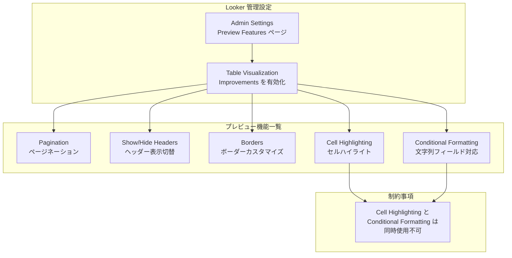

# Looker: テーブルビジュアライゼーション改善 (Table Visualization Improvements)

**リリース日**: 2026-04-07

**サービス**: Looker

**機能**: Table Visualization Improvements

**ステータス**: Preview (プレビュー) - デフォルトで無効

📊 [このアップデートのインフォグラフィックを見る](https://takech9203.github.io/google-cloud-news-summary/20260407-looker-table-visualization-improvements.html)

## 概要

Looker のテーブルビジュアライゼーションに複数の改善機能がプレビューとして追加されました。この「Table Visualization Improvements」プレビュー機能は、ページネーション、テーブルヘッダーの表示/非表示切り替え、テーブルボーダーのカスタマイズ、セルハイライト、および文字列フィールドに対する条件付き書式設定の 5 つの主要機能を含んでいます。

この機能はデフォルトで無効化されており、Looker 管理者が Admin settings の Preview Features ページから有効化する必要があります。プレビュー段階のため、「Pre-GA Offerings Terms」が適用され、サポートが限定的である可能性があります。Google はフィードバックを積極的に求めており、バグや問題の報告は looker-viz-preview-external@google.com 宛てに送信できます。

これらの改善により、Looker のテーブルビジュアライゼーションの表現力と操作性が大幅に向上し、大量データの閲覧やダッシュボード上でのデータ表示をより柔軟にカスタマイズできるようになります。

**アップデート前の課題**

- テーブルに大量の行がある場合、すべての行が一括表示されるためデータの閲覧が困難だった
- テーブルヘッダーの表示/非表示を制御できず、ダッシュボードのレイアウト調整に制限があった
- テーブルのボーダースタイルをカスタマイズする手段が限られていた
- セルにマウスオーバーした際のハイライト機能がなく、大きなテーブルでのデータ追跡が難しかった
- 条件付き書式設定は数値フィールドにのみ対応しており、文字列フィールドには適用できなかった

**アップデート後の改善**

- 50 行以上のテーブルでページネーションが利用可能になり、ページごとの行数を 50/100/250/500/1,000 から選択できるようになった
- テーブルヘッダーの表示/非表示をスイッチで切り替えられるようになった
- テーブルボーダーの表示/非表示、幅 (ピクセル)、色、スタイル (実線/点線/破線) をカスタマイズできるようになった
- セルハイライト機能により、セルにホバーした際に行と列がハイライト表示されるようになった
- 条件付き書式設定が数値フィールドに加え、文字列 (string) フィールドにも対応するようになった

## アーキテクチャ図

Looker 管理者がプレビュー機能を有効化すると、テーブルビジュアライゼーションの編集画面で 5 つの新機能が利用可能になります。ただし、セルハイライトと条件付き書式設定は同時に使用できない排他的な関係にあります。

## サービスアップデートの詳細

### 主要機能

1. **ページネーション (Pagination)**
   - 50 行以上を含むテーブルでページネーションを有効化できる
   - 「Paginate Rows」チェックボックスを選択して有効化
   - 「Rows Per Page」設定で 1 ページあたりの行数を指定可能: 50、100、250、500、1,000 行
   - ダッシュボード上のテーブルでページネーションの設定を変更するには、ダッシュボードの編集モードに入る必要がある

2. **テーブルヘッダーの表示/非表示 (Show/Hide Headers)**
   - 「Show Headers」スイッチでテーブルヘッダーの表示/非表示を切り替え可能
   - ダッシュボード内でテーブルをよりコンパクトに表示したい場合に有用

3. **テーブルボーダー (Borders)**
   - 「Borders」スイッチでテーブルボーダーの表示/非表示を切り替え可能
   - ボーダー幅をピクセル単位で指定可能
   - ボーダーの色をカスタマイズ可能
   - ボーダーのスタイルを実線 (solid)、点線 (dotted)、破線 (dashed) から選択可能

4. **セルハイライト (Cell Highlighting)**
   - 「Cell Highlighting」スイッチで有効化
   - テーブル内のセルにマウスオーバーした際に、該当する行と列がハイライト表示される
   - 「Highlight Color」カラーピッカーでハイライト色をカスタマイズ可能
   - **注意**: セルハイライトが有効な場合、条件付き書式設定は使用不可

5. **文字列フィールドの条件付き書式設定 (Conditional Formatting for String Fields)**
   - 従来の数値フィールドに加え、文字列 (string) フィールドにも条件付き書式設定を適用可能
   - ディメンションとメジャーの両方に対してルールを適用可能
   - 最大 3 つのルールを定義可能
   - スケールベース (グラデーション) または特定の値に基づく書式設定が可能
   - 背景色、フォント色、フォントスタイルをルールごとに指定可能

## 技術仕様

### 機能対応表

| 機能 | 設定場所 | デフォルト状態 |
|------|----------|----------------|
| ページネーション | Plot タブ | 無効 |
| ヘッダー表示切替 | Formatting タブ > Customizations | 表示 |
| ボーダー | Formatting タブ > Customizations | 非表示 |
| セルハイライト | Formatting タブ > Customizations | 無効 |
| 文字列の条件付き書式 | Formatting タブ > Enable Conditional Formatting | 無効 |

### ページネーション設定値

| 設定項目 | 選択可能な値 |
|----------|-------------|
| Rows Per Page | 50, 100, 250, 500, 1,000 |
| 最小行数 (有効化条件) | 50 行以上 |

### ボーダーカスタマイズ設定

| 設定項目 | 値 |
|----------|-----|
| ボーダー幅 | ピクセル単位で指定 |
| ボーダー色 | カラーピッカーで任意の色を指定 |
| ボーダースタイル | solid (実線), dotted (点線), dashed (破線) |

### 制約事項

| 条件 | 制約 |
|------|------|
| セルハイライト有効時 | 条件付き書式設定は使用不可 |
| 条件付き書式設定 | セルビジュアライゼーション (Cell Visualization) が無効の列にのみ適用可能 |
| 条件付き書式設定 | 小計 (subtotals) が存在する場合は適用不可 |
| 条件付き書式ルール | 最大 3 つまで |

## 設定方法

### 前提条件

1. Looker 管理者権限を持つアカウント
2. Looker インスタンスへのアクセス

### 手順

#### ステップ 1: プレビュー機能の有効化

Looker 管理者が Admin パネルからプレビュー機能を有効化します。

1. Looker の管理パネル (Admin) にアクセス
2. General セクション配下の **Preview Features** ページを開く
3. **Table Visualization Improvements** を有効化

#### ステップ 2: テーブルビジュアライゼーションの編集

Explore または Look でテーブルビジュアライゼーションを選択し、新機能を利用します。

1. Explore または Look でクエリを実行
2. ビジュアライゼーションバーの **Edit** メニューを開く
3. **Plot** タブでページネーションを設定
4. **Formatting** タブでヘッダー、ボーダー、セルハイライト、条件付き書式を設定

#### ステップ 3: ダッシュボードでの利用

ダッシュボードに配置したテーブルでページネーション設定を変更する場合は、ダッシュボードの編集モードに入る必要があります。

## メリット

### ビジネス面

- **データ閲覧性の向上**: ページネーションにより大量データの閲覧が容易になり、ビジネスユーザーの分析効率が向上する
- **ダッシュボードの表現力強化**: ボーダーやセルハイライトのカスタマイズにより、経営層向けダッシュボードの見栄えを改善できる
- **文字列データの視覚的識別**: 文字列フィールドへの条件付き書式により、ステータスやカテゴリなどの非数値データの視覚的な識別が可能になる

### 技術面

- **柔軟なテーブル設計**: ヘッダーの表示/非表示やボーダーのカスタマイズにより、用途に応じたテーブルデザインが可能になる
- **ユーザビリティの改善**: セルハイライトにより大きなテーブルでのデータ追跡が容易になる
- **追加の開発不要**: Looker のネイティブ機能として提供されるため、カスタム開発が不要

## デメリット・制約事項

### 制限事項

- プレビュー段階のため、「Pre-GA Offerings Terms」が適用され、サポートが限定的である可能性がある
- セルハイライトと条件付き書式設定は排他的であり、同時に使用できない
- 条件付き書式設定はセルビジュアライゼーション (Cell Visualization) が有効な列には適用できない
- 条件付き書式設定は小計 (subtotals) が存在するテーブルでは利用不可
- 条件付き書式のルールは最大 3 つまでに制限されている
- ページネーションは 50 行未満のテーブルでは利用できない

### 考慮すべき点

- プレビュー機能のため、GA (一般提供) 時に仕様が変更される可能性がある
- 機能はデフォルトで無効化されているため、管理者による明示的な有効化が必要
- 既存のダッシュボードやレポートへの影響を事前にテスト環境で確認することを推奨

## ユースケース

### ユースケース 1: 大量の取引データの閲覧

**シナリオ**: 数千件の取引データをテーブルで表示し、ビジネスアナリストがページごとにデータを確認したい場合

**効果**: ページネーション機能により、250 行ずつ表示するなど適切な単位でデータを閲覧でき、ブラウザのパフォーマンスも向上する

### ユースケース 2: ステータス別の色分け表示

**シナリオ**: 注文ステータス (「処理中」「出荷済み」「キャンセル」など) の文字列フィールドに対して色分けを行い、一目でステータスを把握したい場合

**効果**: 文字列フィールドへの条件付き書式設定により、ステータスごとに背景色やフォント色を変更でき、視覚的な識別が容易になる

### ユースケース 3: 経営ダッシュボードのデザイン最適化

**シナリオ**: 経営層向けダッシュボードでテーブルのデザインをブランドカラーに合わせてカスタマイズしたい場合

**効果**: ボーダーの色・スタイルのカスタマイズとヘッダーの表示制御により、統一感のあるダッシュボードデザインを実現できる

## 料金

この機能は Looker の既存ライセンスに含まれるテーブルビジュアライゼーションの改善であり、追加料金は発生しません。Looker (Google Cloud core) 全体の料金については、[Looker (Google Cloud core) の料金ページ](https://cloud.google.com/looker/pricing) を参照してください。

## 関連サービス・機能

- **Looker Explore**: テーブルビジュアライゼーションの改善機能を利用する主要なインターフェース
- **Looker ダッシュボード**: ページネーション設定はダッシュボードの編集モードで変更可能
- **Looker Admin Panel (Preview Features)**: プレビュー機能の有効化/無効化を管理する設定ページ
- **Looker Studio**: 別のビジュアライゼーションツールであり、異なる機能セットを持つ

## 参考リンク

- 📊 [インフォグラフィック](https://takech9203.github.io/google-cloud-news-summary/20260407-looker-table-visualization-improvements.html)
- [公式リリースノート](https://cloud.google.com/release-notes#April_07_2026)
- [テーブルオプション ドキュメント](https://docs.cloud.google.com/looker/docs/table-options)
- [ページネーション設定](https://docs.cloud.google.com/looker/docs/table-options#pagination)
- [行とヘッダーの書式設定](https://docs.cloud.google.com/looker/docs/table-options#row_and_header_formatting)
- [セルハイライト](https://docs.cloud.google.com/looker/docs/table-options#cell_highlighting)
- [Looker (Google Cloud core) 料金](https://cloud.google.com/looker/pricing)

## まとめ

Looker の Table Visualization Improvements プレビュー機能は、テーブルビジュアライゼーションの表現力と操作性を大幅に強化するアップデートです。ページネーション、ヘッダー制御、ボーダーカスタマイズ、セルハイライト、文字列フィールドの条件付き書式という 5 つの機能により、大量データの閲覧やダッシュボードのデザインが柔軟になります。プレビュー段階のため本番環境への適用には注意が必要ですが、管理者設定から有効化してテスト環境で評価することを推奨します。

---

**タグ**: #Looker #TableVisualization #Preview #Pagination #ConditionalFormatting #CellHighlighting #BI #DataVisualization #GoogleCloud
