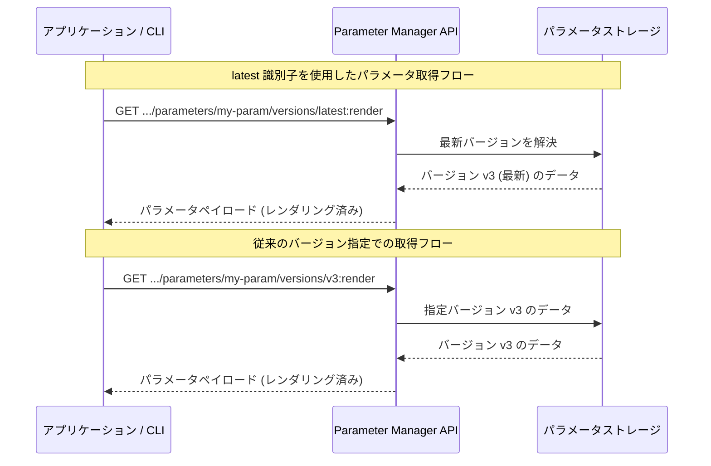

# Secret Manager (Parameter Manager): `latest` 識別子のサポート

**リリース日**: 2026-04-07

**サービス**: Secret Manager (Parameter Manager)

**機能**: Parameter Manager `latest` 識別子サポート

**ステータス**: Feature

[このアップデートのインフォグラフィックを見る](https://takech9203.github.io/google-cloud-news-summary/20260407-secret-manager-parameter-manager-latest.html)

## 概要

Parameter Manager において、パラメータバージョンを取得する際に `latest` 識別子がサポートされるようになりました。これにより、gcloud CLI または REST API を使用する際に、特定のバージョン ID を指定することなく、パラメータの最新バージョンを取得できるようになります。

この機能は、Secret Manager の `latest` エイリアス機能と同様の利便性を Parameter Manager にもたらすものです。アプリケーション設定の取得やデプロイメントスクリプトにおいて、常に最新の設定値を参照したいケースで特に有用です。対象ユーザーは、Parameter Manager を使用してアプリケーション構成を管理しているクラウドエンジニア、DevOps エンジニア、およびアプリケーション開発者です。

**アップデート前の課題**

- パラメータの最新バージョンを取得するには、事前にバージョン一覧を取得して最新のバージョン ID を確認する必要があった
- 自動化スクリプトやデプロイメントパイプラインで、バージョン ID をハードコードまたは動的に解決するロジックが必要だった
- Secret Manager では `latest` エイリアスが利用可能であったが、Parameter Manager には同等の機能がなく、操作の一貫性が欠けていた

**アップデート後の改善**

- `latest` 識別子を使用するだけで、パラメータの最新バージョンを直接取得できるようになった
- デプロイメントスクリプトや CI/CD パイプラインで、バージョン ID の動的解決ロジックが不要になった
- Secret Manager と Parameter Manager の間で、バージョン参照方法の一貫性が向上した

## アーキテクチャ図



`latest` 識別子を使用すると、Parameter Manager が自動的に最新バージョンを解決してデータを返します。従来のバージョン ID 指定と同じレスポンスが返されますが、クライアント側でバージョン番号を管理する必要がありません。

## サービスアップデートの詳細

### 主要機能

1. **`latest` 識別子によるバージョン取得**
   - パラメータバージョンの取得時に、バージョン ID の代わりに `latest` を指定可能
   - gcloud CLI および REST API の両方で利用可能
   - グローバルパラメータおよびリージョナルパラメータの両方に対応

2. **バージョンレンダリングとの統合**
   - `latest` 識別子は `render` メソッドでも使用可能
   - シークレット参照を含むパラメータでも、最新バージョンのレンダリング済みペイロードを直接取得可能

3. **既存の API との互換性**
   - 従来のバージョン ID 指定による取得方法も引き続き利用可能
   - `latest` は追加のオプションとして提供され、既存のワークフローに影響しない

## 技術仕様

### API エンドポイント

| 操作 | エンドポイント |
|------|---------------|
| バージョン取得 (グローバル) | `GET /v1/projects/{PROJECT_ID}/locations/global/parameters/{PARAMETER_ID}/versions/latest` |
| バージョンレンダリング (グローバル) | `GET /v1/projects/{PROJECT_ID}/locations/global/parameters/{PARAMETER_ID}/versions/latest:render` |
| バージョン取得 (リージョナル) | `GET /v1/projects/{PROJECT_ID}/locations/{LOCATION}/parameters/{PARAMETER_ID}/versions/latest` |
| バージョンレンダリング (リージョナル) | `GET /v1/projects/{PROJECT_ID}/locations/{LOCATION}/parameters/{PARAMETER_ID}/versions/latest:render` |

### 必要な IAM ロール

| ロール | 説明 |
|--------|------|
| `roles/parametermanager.viewer` | パラメータおよびバージョンの読み取り |
| `roles/parametermanager.admin` | パラメータおよびバージョンの管理 |
| `roles/secretmanager.secretAccessor` | シークレット参照のレンダリング時に必要 |

## 設定方法

### 前提条件

1. Google Cloud プロジェクトで Parameter Manager API が有効化されていること
2. 適切な IAM ロール (`roles/parametermanager.viewer` 以上) が付与されていること
3. gcloud CLI がインストールおよび認証済みであること

### 手順

#### ステップ 1: gcloud CLI でパラメータの最新バージョンを取得

```bash
# パラメータの最新バージョンの詳細を表示
gcloud parametermanager parameters versions describe latest \
  --parameter=PARAMETER_ID \
  --location=global
```

バージョン ID に `latest` を指定することで、最新のパラメータバージョンのメタデータとペイロードが返されます。

#### ステップ 2: REST API でパラメータの最新バージョンをレンダリング

```bash
# REST API で最新バージョンのレンダリング済みペイロードを取得
curl -X GET \
  -H "Authorization: Bearer $(gcloud auth print-access-token)" \
  -H "Content-Type: application/json; charset=utf-8" \
  "https://parametermanager.googleapis.com/v1/projects/PROJECT_ID/locations/global/parameters/PARAMETER_ID/versions/latest:render"
```

シークレット参照を含むパラメータの場合、`render` メソッドを使用することで、シークレットの実際の値が展開されたペイロードが返されます。

#### ステップ 3: レスポンスの確認

```json
{
  "name": "projects/my-project/locations/global/parameters/app-config/versions/v3",
  "createTime": "2026-04-01T10:00:00.000Z",
  "updateTime": "2026-04-01T10:00:00.500Z",
  "payload": {
    "data": "Base64 エンコードされた生データ"
  },
  "renderedPayload": "Base64 エンコードされたレンダリング済みデータ"
}
```

`latest` を指定した場合でも、レスポンスの `name` フィールドには実際のバージョン ID が含まれます。

## メリット

### ビジネス面

- **運用の簡素化**: バージョン管理の複雑さが軽減され、デプロイメントパイプラインのメンテナンスコストが低下する
- **ヒューマンエラーの削減**: バージョン ID のハードコードや手動更新が不要となり、誤ったバージョンを参照するリスクが低減する

### 技術面

- **自動化の容易さ**: CI/CD パイプラインやスクリプトで、バージョン一覧取得と最新バージョン特定のロジックが不要になる
- **Secret Manager との一貫性**: Secret Manager の `latest` エイリアスと同様の操作感で Parameter Manager を利用できる
- **コードのシンプル化**: バージョン解決ロジックの排除により、コードの可読性と保守性が向上する

## デメリット・制約事項

### 制限事項

- `latest` は常に最新バージョンを返すため、特定のバージョンに固定したい本番環境では明示的なバージョン ID 指定が推奨される
- パラメータバージョンの作成順序に基づいて「最新」が判定されるため、意図しないバージョンが返される可能性がある

### 考慮すべき点

- 本番環境のアプリケーションでは、再現性を確保するために明示的なバージョン ID の使用を検討する
- `latest` の使用は開発環境、テスト環境、またはデプロイメントスクリプトでの初期設定フェーズに限定することが望ましい
- シークレット参照を含むパラメータで `latest` を使用する場合、参照先のシークレットバージョンにも `latest` が使われている可能性があり、二重の動的解決が発生する点に注意する

## ユースケース

### ユースケース 1: CI/CD パイプラインでの設定取得

**シナリオ**: Cloud Build や GitHub Actions のデプロイメントパイプラインで、Parameter Manager からアプリケーション設定を取得し、Cloud Run サービスに環境変数として渡す。

**実装例**:
```bash
# デプロイメントスクリプトで最新の設定を取得
CONFIG=$(gcloud parametermanager parameters versions describe latest \
  --parameter=app-config \
  --location=global \
  --format="value(payload.data)" | base64 --decode)

# Cloud Run サービスにデプロイ
gcloud run deploy my-service \
  --image=gcr.io/my-project/my-app:latest \
  --set-env-vars="APP_CONFIG=${CONFIG}"
```

**効果**: デプロイ時に常に最新の設定が自動的に取得され、設定更新後の再デプロイが容易になる。

### ユースケース 2: 開発環境での動的設定参照

**シナリオ**: 開発者がローカル環境やステージング環境で、Parameter Manager に格納されたデータベース接続文字列やフィーチャーフラグの最新値を確認する。

**実装例**:
```bash
# 最新のフィーチャーフラグ設定をレンダリングして確認
gcloud parametermanager parameters versions describe latest \
  --parameter=feature-flags \
  --location=global \
  --format="value(payload.data)" | base64 --decode
```

**効果**: バージョン一覧を確認して最新バージョン ID を特定する手順が不要となり、開発者の作業効率が向上する。

## 料金

Parameter Manager の料金は Secret Manager の料金体系に含まれます。`latest` 識別子の使用による追加料金は発生しません。通常の API コール料金が適用されます。

| 項目 | 料金 |
|------|------|
| アクティブなパラメータバージョン | $0.06 / バージョン / 月 |
| アクセスオペレーション | $0.03 / 10,000 オペレーション |
| ローテーションオペレーション | $0.03 / 10,000 オペレーション |

## 利用可能リージョン

Parameter Manager はグローバルおよびリージョナルの両方のパラメータをサポートしています。リージョナルパラメータは以下の主要リージョンで利用可能です。

- **北米**: us-central1, us-east1, us-east4, us-west1, us-west2, us-west3, us-west4, northamerica-northeast1, northamerica-northeast2 など
- **ヨーロッパ**: europe-west1, europe-west2, europe-west3, europe-west4, europe-west6, europe-west8, europe-west9, europe-southwest1, europe-central2 など
- **アジア太平洋**: asia-northeast1 (東京), asia-northeast2 (大阪), asia-northeast3 (ソウル), asia-south1, asia-south2, asia-east1, asia-east2, australia-southeast1, australia-southeast2 など
- **南米**: southamerica-east1, southamerica-west1

グローバルパラメータは `global` ロケーションで管理されます。

## 関連サービス・機能

- **Secret Manager**: Parameter Manager の親サービス。シークレットの安全な保管・管理を提供し、`latest` エイリアスによるバージョン参照を先行サポートしていた
- **Parameter Manager シークレット参照**: パラメータ内で Secret Manager のシークレットを `__REF__()` 構文で参照する機能。`latest` 識別子と組み合わせて使用可能
- **GKE Secret Manager アドオン**: GKE ポッドから Parameter Manager のパラメータをローカルファイルとしてマウントする機能
- **Cloud Run / Cloud Functions**: 環境変数や Secret Manager 統合を通じて Parameter Manager の設定値を利用可能

## 参考リンク

- [インフォグラフィック](https://takech9203.github.io/google-cloud-news-summary/20260407-secret-manager-parameter-manager-latest.html)
- [公式リリースノート](https://docs.cloud.google.com/release-notes#April_07_2026)
- [パラメータバージョンのアクセスとレンダリング](https://docs.cloud.google.com/secret-manager/parameter-manager/docs/render-parameter-version)
- [Parameter Manager 概要](https://docs.cloud.google.com/secret-manager/parameter-manager/docs/overview)
- [パラメータバージョンの追加](https://docs.cloud.google.com/secret-manager/parameter-manager/docs/add-parameter-version)
- [Secret Manager 料金ページ](https://cloud.google.com/secret-manager/pricing)

## まとめ

Parameter Manager における `latest` 識別子のサポートは、パラメータバージョン管理の操作性を向上させるアップデートです。特に CI/CD パイプラインや開発環境での設定取得が簡素化され、Secret Manager との操作の一貫性も確保されます。本番環境では再現性を考慮して明示的なバージョン ID の使用を推奨しますが、開発・テスト環境やデプロイメントスクリプトでは `latest` 識別子の活用を検討してください。

---

**タグ**: #SecretManager #ParameterManager #構成管理 #DevOps #Feature
