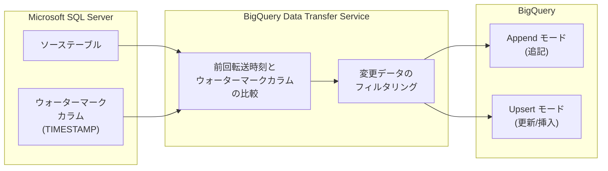

# BigQuery: Data Transfer Service SQL Server 増分転送 & @@session_id システム変数の拡張

**リリース日**: 2026-04-08

**サービス**: BigQuery

**機能**: Data Transfer Service SQL Server 増分データ転送 (Preview) / @@session_id システム変数の SQL UDF・テーブル関数・論理ビュー対応 (GA)

**ステータス**: Preview (SQL Server 増分転送) / GA (@@session_id 拡張)

[このアップデートのインフォグラフィックを見る](https://takech9203.github.io/google-cloud-news-summary/20260408-bigquery-dts-sql-server-session-id.html)

## 概要

BigQuery に関する 2 つのアップデートが発表されました。1 つ目は、BigQuery Data Transfer Service の Microsoft SQL Server コネクタにおける増分データ転送 (Incremental Data Transfers) のサポートです。これにより、SQL Server から BigQuery へのデータ転送時に、前回の転送以降に変更されたデータのみを効率的に転送できるようになりました。この機能は Preview として提供されています。

2 つ目は、@@session_id システム変数が SQL ユーザー定義関数 (UDF)、テーブル関数、および論理ビューで利用可能になったことです。これまで @@session_id はマルチステートメントクエリやセッション内でのみ使用可能でしたが、今回の GA リリースにより、UDF やビューの定義内からも現在のセッション ID を参照できるようになり、セッションコンテキストに基づくロジックの実装が容易になりました。

SQL Server の増分転送は、2026 年 4 月 7 日にリリースされた MySQL、Oracle、PostgreSQL、ServiceNow 向けの増分転送機能と同様の仕組みを SQL Server にも拡張するものです。SQL Server を利用する企業の BigQuery へのデータ統合がより効率的になります。

**アップデート前の課題**

- SQL Server から BigQuery への転送はフルデータ転送のみで、毎回ソーステーブル全体を転送する必要があった
- 大規模な SQL Server データベースでは転送時間が長く、ネットワーク帯域やコンピューティングリソースの消費が大きかった
- @@session_id は SQL UDF、テーブル関数、論理ビューの内部では参照できなかったため、セッションコンテキストに基づくロジックの実装に制約があった

**アップデート後の改善**

- SQL Server からの転送で増分転送が可能になり、変更データのみを効率的に BigQuery に転送できるようになった
- @@session_id が SQL UDF、テーブル関数、論理ビュー内で利用可能になり、セッションベースのロジックをより柔軟に実装可能になった
- SQL Server を含む主要な RDBMS (MySQL、Oracle、PostgreSQL) 全てで増分転送がサポートされ、Data Transfer Service の機能が統一された

## アーキテクチャ図



BigQuery Data Transfer Service が SQL Server のウォーターマークカラムの値と前回の転送成功時刻を比較し、変更データのみをフィルタリングして BigQuery に転送します。書き込みモードとして Append (追記のみ) または Upsert (主キーによる更新・挿入) を選択できます。

## サービスアップデートの詳細

### 主要機能

1. **SQL Server 増分転送 (Incremental Transfer)**
   - 前回の転送成功時刻以降に変更されたデータのみを SQL Server から BigQuery に転送
   - ウォーターマークカラム (TIMESTAMP 型) を基準に変更を検出
   - 初回転送時はソーステーブル全体を転送し、2 回目以降から増分転送を実施
   - オンプレミス、Cloud SQL、AWS、Azure でホストされた SQL Server インスタンスをサポート

2. **Append 書き込みモード**
   - 新しいレコードを宛先テーブルに追記
   - ウォーターマークカラムの指定が必須
   - 既存レコードの重複チェックは行わない

3. **Upsert 書き込みモード**
   - 主キーに基づいてレコードの更新または新規挿入を実施
   - ウォーターマークカラムと主キーの両方の指定が必須
   - 宛先テーブルとソーステーブルの整合性を保持可能

4. **@@session_id の SQL UDF・テーブル関数・論理ビュー対応**
   - SQL ユーザー定義関数 (UDF) 内で @@session_id を参照可能
   - テーブル関数内で @@session_id を参照可能
   - 論理ビュー内で @@session_id を参照可能
   - 現在のクエリが関連付けられているセッションの ID を STRING 型で返却

## 技術仕様

### SQL Server 増分転送の設定パラメータ

| パラメータ | 説明 | 必須/任意 |
|------|------|------|
| `ingestionType` | `FULL` または `INCREMENTAL` を指定 | 必須 |
| `writeMode` | `WRITE_MODE_APPEND` または `WRITE_MODE_UPSERT` を指定 | 増分転送時は必須 |
| `watermarkColumns` | 変更追跡に使用するカラム (TIMESTAMP 型) | 増分転送時は必須 |
| `primaryKeys` | 主キーとなるカラム (Upsert モード時) | Upsert モード時は必須 |
| `assets` | 転送対象のテーブルリスト | 必須 |

### SQL Server のデータ型マッピング (主要なもの)

| SQL Server データ型 | BigQuery データ型 |
|------|------|
| int / smallint / tinyint | INTEGER |
| bigint | BIGNUMERIC |
| decimal | BIGNUMERIC |
| float / real | FLOAT |
| varchar / nvarchar / char | STRING |
| datetime2 / datetimeoffset | TIMESTAMP |
| date | DATE |
| time | TIME |
| bit | BOOLEAN |
| binary / varbinary | BYTES |
| uniqueidentifier | STRING |

### TLS 構成オプション

SQL Server コネクタは転送データの暗号化のために以下の TLS 構成をサポートしています。

| モード | 説明 |
|------|------|
| Encrypt data, and verify CA and hostname | TLS 暗号化 + CA 検証 + ホスト名検証 (最も安全) |
| Encrypt data, and verify CA only | TLS 暗号化 + CA 検証のみ |
| Encryption only | TLS 暗号化のみ (証明書検証なし) |
| No encryption or verification | 暗号化なし (テスト目的のみ推奨) |

### @@session_id システム変数の仕様

| 項目 | 詳細 |
|------|------|
| 変数名 | `@@session_id` |
| 型 | STRING |
| 読み取り/書き込み | 読み取り専用 |
| 説明 | 現在のクエリが関連付けられているセッションの ID |
| 新規対応範囲 | SQL UDF、テーブル関数、論理ビュー |

## 設定方法

### 前提条件

1. BigQuery Data Transfer Service が有効化されていること
2. `roles/bigquery.admin` IAM ロールが付与されていること
3. 転送先の BigQuery データセットが作成済みであること
4. SQL Server インスタンスへの接続に必要なネットワーク構成 (ネットワークアタッチメント等) が完了していること

### 手順

#### ステップ 1: SQL Server 増分転送を bq コマンドで作成

```bash
bq mk --transfer_config \
  --target_dataset=mydataset \
  --data_source=sqlserver \
  --display_name='SQL Server Incremental Transfer' \
  --params='{
    "assets": ["mydb/dbo/orders"],
    "connector.authentication.username": "transfer_user",
    "connector.authentication.password": "your_password",
    "connector.database": "mydb",
    "connector.endpoint.host": "192.168.1.100",
    "connector.endpoint.port": 1433,
    "ingestionType": "incremental",
    "writeMode": "WRITE_MODE_UPSERT",
    "watermarkColumns": ["updated_at"],
    "primaryKeys": [["order_id"]],
    "connector.tls.mode": "ENCRYPT_VERIFY_CA_AND_HOST",
    "connector.tls.trustedServerCertificate": "PEM-encoded certificate"
  }'
```

ソースタイプとして `sqlserver` を指定し、`ingestionType` を `incremental` に設定します。Upsert モードを使用する場合は `writeMode` と `primaryKeys` の指定も必要です。

#### ステップ 2: @@session_id を SQL UDF 内で使用する例

```sql
-- セッション ID に基づくログ記録用の UDF
CREATE TEMP FUNCTION GetSessionContext()
RETURNS STRING
AS (
  @@session_id
);

-- テーブル関数内での使用例
SELECT GetSessionContext() AS current_session;
```

セッション内でこの UDF を呼び出すことで、現在のセッション ID を取得し、監査ログやデバッグに活用できます。

## メリット

### ビジネス面

- **SQL Server ユーザーのデータ統合コスト削減**: フルデータ転送と比較して転送データ量が大幅に削減され、特に大規模 SQL Server データベースでの転送コストを抑制
- **Microsoft エコシステムからの移行促進**: SQL Server は企業の基幹システムで広く利用されており、増分転送のサポートにより BigQuery へのデータ統合の障壁が低下
- **セッション管理の強化**: @@session_id の UDF 対応により、マルチテナント環境でのセッション管理やアクセス制御の実装が容易に

### 技術面

- **ネットワーク負荷の軽減**: 変更データのみの転送により、SQL Server インスタンスやネットワークへの負荷が軽減
- **データベースコネクタの統一**: MySQL、Oracle、PostgreSQL、ServiceNow に続き SQL Server でも増分転送がサポートされ、DTS の機能が統一
- **UDF の表現力向上**: @@session_id をビューや関数内で参照可能になったことで、セッションコンテキストに依存する複雑なビジネスロジックを SQL で表現可能に

## デメリット・制約事項

### 制限事項

- SQL Server 増分転送は Preview 段階であり、SLA の適用対象外
- SQL Server データベースへの同時接続数に制限があるため、同一データベースへの同時転送ジョブ数もそれに制約される
- ソーステーブルでの DELETE 操作は増分転送では同期されない
- 初回の増分転送実行後にアセットリスト、書き込みモード、ウォーターマークカラム、主キーの変更はできない
- 一部の SQL Server データ型はデータ損失を防ぐため STRING 型にマッピングされる場合がある

### 考慮すべき点

- Preview 段階のフィードバックやサポートは dts-preview-support@google.com に連絡
- ウォーターマークカラムの値は単調増加である必要がある
- ウォーターマークカラムにインデックスを作成することでパフォーマンス向上が期待できる
- 2027 年 3 月 16 日に SQL Server コネクタのデータ型マッピングの一部が更新予定 (datetime2, datetime, smalldatetime が TIMESTAMP から DATETIME に変更)

## ユースケース

### ユースケース 1: 基幹業務システム (SQL Server) のデータを BigQuery で分析

**シナリオ**: 企業の ERP システムが SQL Server 上で稼働しており、売上データや在庫データを BigQuery で分析したい。数億行規模のトランザクションテーブルを毎回フル転送するのは現実的ではなかった。

**実装例**:
```json
{
  "assets": ["erp_db/dbo/sales_transactions"],
  "ingestionType": "incremental",
  "writeMode": "WRITE_MODE_UPSERT",
  "watermarkColumns": ["modified_date"],
  "primaryKeys": [["transaction_id"]]
}
```

**効果**: 増分転送により転送時間とコストを大幅に削減。Upsert モードにより、トランザクションのステータス更新も BigQuery に反映され、データの整合性を維持。

### ユースケース 2: Azure SQL Database から BigQuery へのマルチクラウドデータ統合

**シナリオ**: Azure 上の SQL Server (Azure SQL Database) で運用しているアプリケーションデータを、Google Cloud の BigQuery に集約して統合分析を行いたい。

**効果**: BigQuery Data Transfer Service の SQL Server コネクタは Azure でホストされた SQL Server インスタンスもサポートしているため、マルチクラウド環境でのデータ統合が容易に実現。増分転送によりクラウド間のデータ転送コストも最小化。

### ユースケース 3: @@session_id を活用したマルチテナント UDF

**シナリオ**: BigQuery セッションを使用してマルチテナントのデータ分析基盤を運用している。テナントごとのアクセスログを記録するために、UDF 内でセッション情報を取得したい。

**実装例**:
```sql
CREATE FUNCTION audit_dataset.log_query_access(table_name STRING)
RETURNS STRING
AS (
  CONCAT('session:', @@session_id, ' accessed:', table_name)
);
```

**効果**: @@session_id を UDF 内で参照できることで、クエリの監査やデバッグが効率化。テナントごとのセッションに基づいたデータフィルタリングもビューで実装可能に。

## 料金

### SQL Server 増分転送

SQL Server からの BigQuery へのデータ転送は現在 Preview 段階であり、**転送自体の料金は無料**です。BigQuery にデータが転送された後は、標準の BigQuery [ストレージ料金](https://cloud.google.com/bigquery/pricing#storage)および[クエリ料金](https://cloud.google.com/bigquery/pricing#queries)が適用されます。

### @@session_id

@@session_id システム変数の利用に追加料金はありません。通常の BigQuery クエリ料金が適用されます。

## 利用可能リージョン

BigQuery Data Transfer Service はマルチリージョンリソースとして提供されています。転送構成は宛先データセットと同じロケーションに設定されます。BigQuery がサポートする全てのリージョンで利用可能です。詳細は[データセットのロケーションと転送](https://cloud.google.com/bigquery/docs/dts-locations)を参照してください。

## 関連サービス・機能

- **[BigQuery Data Transfer Service](https://cloud.google.com/bigquery/docs/dts-introduction)**: 本機能の基盤となるマネージドデータ転送サービス
- **[DTS 増分転送 (MySQL/Oracle/PostgreSQL/ServiceNow)](reports/2026/2026-04-07-bigquery-data-transfer-incremental.md)**: 2026 年 4 月 7 日にリリースされた他の RDBMS 向け増分転送機能
- **[BigQuery セッション](https://cloud.google.com/bigquery/docs/sessions-intro)**: @@session_id の基盤となるセッション管理機能
- **[Datastream](https://cloud.google.com/datastream)**: CDC (Change Data Capture) ベースのリアルタイムデータレプリケーションサービス。より低レイテンシの要件がある場合の代替手段
- **[Database Migration Service](https://cloud.google.com/database-migration)**: SQL Server のフェイルバック移行など、データベース移行に特化したサービス

## 参考リンク

- [インフォグラフィック](https://takech9203.github.io/google-cloud-news-summary/20260408-bigquery-dts-sql-server-session-id.html)
- [公式リリースノート](https://cloud.google.com/release-notes#April_08_2026)
- [SQL Server 転送の設定](https://cloud.google.com/bigquery/docs/sqlserver-transfer)
- [SQL Server 増分転送](https://docs.cloud.google.com/bigquery/docs/sqlserver-transfer#full_or_incremental_transfers)
- [BigQuery システム変数リファレンス](https://docs.cloud.google.com/bigquery/docs/reference/system-variables)
- [BigQuery Data Transfer Service の概要](https://cloud.google.com/bigquery/docs/dts-introduction)
- [料金ページ](https://cloud.google.com/bigquery/pricing)

## まとめ

今回のアップデートにより、BigQuery Data Transfer Service の SQL Server コネクタで増分データ転送が Preview として利用可能になり、MySQL、Oracle、PostgreSQL、ServiceNow に続いて主要 RDBMS での増分転送が揃いました。SQL Server は企業の基幹業務システムで広く利用されているため、効率的なデータ統合を求める多くの企業にとって有益な機能です。併せて @@session_id の SQL UDF・テーブル関数・論理ビュー対応が GA となり、セッションコンテキストを活用した柔軟なロジック実装が可能になりました。SQL Server からのデータ統合を検討しているチームは、Preview 段階のうちに検証を開始することを推奨します。

---

**タグ**: #BigQuery #DataTransferService #SQLServer #IncrementalTransfer #SessionId #UDF #Preview #GA #データ統合 #ETL
