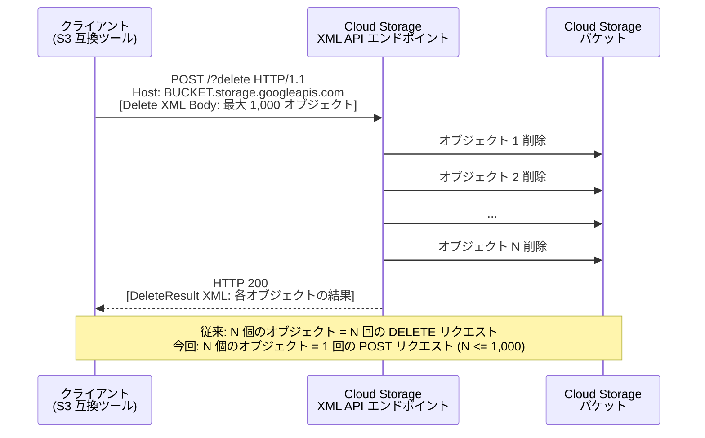

# Cloud Storage: マルチオブジェクト削除 XML API

**リリース日**: 2026-04-08

**サービス**: Cloud Storage

**機能**: マルチオブジェクト削除 XML API (Multi-Object Delete XML API)

**ステータス**: GA (一般提供)

[このアップデートのインフォグラフィックを見る](https://takech9203.github.io/google-cloud-news-summary/20260408-cloud-storage-multi-object-delete.html)

## 概要

Google Cloud は、Cloud Storage の XML API においてマルチオブジェクト削除機能の提供を開始しました。この新機能により、1 回のリクエストで最大 1,000 個のオブジェクトを一括削除できるようになります。従来の XML API では、オブジェクトの削除は 1 リクエストにつき 1 オブジェクトに限定されていたため、大量のオブジェクトを削除する場合は多数の HTTP リクエストを発行する必要がありました。

この機能は Amazon S3 互換のマルチオブジェクト削除 API (`POST /?delete`) と互換性があるため、Amazon S3 対応のツールやライブラリをそのまま Cloud Storage エンドポイントに向けて利用できます。これにより、S3 から Cloud Storage への移行ワークフローにおいて、既存の削除処理コードを変更せずに利用できるようになり、マルチクラウド環境やクラウド移行プロジェクトにおける利便性が大幅に向上します。

この機能は、Cloud Storage の XML API エンドポイント (`storage.googleapis.com`) に対して `POST /?delete` リクエストを送信することで利用でき、既存の HMAC キー認証や V4 署名プロセスと組み合わせて使用できます。

**アップデート前の課題**

- XML API では 1 回のリクエストで 1 つのオブジェクトしか削除できず、大量のオブジェクト削除時に多数の HTTP 接続が必要だった
- Amazon S3 のマルチオブジェクト削除 (`POST /?delete`) に相当する機能が Cloud Storage XML API に存在せず、S3 互換ツールの移行時に削除処理の書き換えが必要だった
- 大量削除には JSON API のバッチリクエスト、Object Lifecycle Management、Google Cloud コンソールなど別のアプローチが必要であり、XML API だけで完結できなかった

**アップデート後の改善**

- 1 回のリクエストで最大 1,000 個のオブジェクトを削除でき、HTTP 接続数とオーバーヘッドが大幅に削減された
- Amazon S3 互換のマルチオブジェクト削除 API をそのまま利用でき、S3 対応ツールやライブラリのエンドポイント変更のみで移行が完了する
- XML API の機能ギャップが解消され、S3 からの移行における互換性が向上した

## アーキテクチャ図



マルチオブジェクト削除 API は、クライアントからの単一の POST リクエストで複数のオブジェクトを一括削除し、各オブジェクトの削除結果を XML レスポンスとして返します。

## サービスアップデートの詳細

### 主要機能

1. **マルチオブジェクト一括削除**
   - 1 回の HTTP リクエストで最大 1,000 個のオブジェクトを削除可能
   - XML API の `POST /?delete` エンドポイントを使用
   - 各オブジェクトの削除結果 (成功/失敗) がレスポンスに含まれる

2. **Amazon S3 互換性**
   - Amazon S3 の Multi-Object Delete API と互換性がある
   - 既存の S3 対応ツール・ライブラリのエンドポイントを Cloud Storage に変更するだけで利用可能
   - HMAC キー認証による S3 互換認証に対応

3. **既存ワークフローとの統合**
   - S3 互換ツール (AWS CLI、Boto3、各種 S3 SDK など) との連携が可能
   - Cloud Storage の HMAC キーを設定し、エンドポイントを `storage.googleapis.com` に変更するだけで利用開始可能

## 技術仕様

### API 仕様

| 項目 | 詳細 |
|------|------|
| HTTP メソッド | POST |
| エンドポイント | `https://BUCKET_NAME.storage.googleapis.com/?delete` |
| 最大削除オブジェクト数 | 1 リクエストあたり 1,000 個 |
| リクエストボディ | XML 形式 (Delete 要素) |
| レスポンス | XML 形式 (DeleteResult 要素) |
| 認証 | OAuth 2.0 Bearer トークン、HMAC キー (V4 署名) |

### 必要な IAM 権限

| 権限 | 説明 |
|------|------|
| `storage.objects.delete` | オブジェクトの削除に必要 |
| `storage.objects.list` | (任意) 削除対象のオブジェクト一覧取得に利用 |

### リクエストボディの形式

```xml
<?xml version="1.0" encoding="UTF-8"?>
<Delete>
  <Quiet>false</Quiet>
  <Object>
    <Key>object-key-1</Key>
  </Object>
  <Object>
    <Key>object-key-2</Key>
  </Object>
  <!-- 最大 1,000 個の Object 要素 -->
</Delete>
```

## 設定方法

### 前提条件

1. Google Cloud プロジェクトで Cloud Storage API が有効化されていること
2. 対象バケットに対する `storage.objects.delete` 権限を持つサービスアカウントまたはユーザーアカウント
3. 認証情報 (OAuth 2.0 トークン、または S3 互換アクセスの場合は HMAC キー)

### 手順

#### ステップ 1: 認証情報の準備 (S3 互換ツール利用の場合)

```bash
# Cloud Storage の HMAC キーを作成
gcloud storage hmac create SERVICE_ACCOUNT_EMAIL
```

出力される Access ID と Secret を S3 互換ツールの認証情報として設定します。

#### ステップ 2: マルチオブジェクト削除リクエストの送信 (curl の場合)

```bash
curl -X POST "https://BUCKET_NAME.storage.googleapis.com/?delete" \
  -H "Authorization: Bearer $(gcloud auth print-access-token)" \
  -H "Content-Type: application/xml" \
  -d '<?xml version="1.0" encoding="UTF-8"?>
<Delete>
  <Quiet>false</Quiet>
  <Object>
    <Key>path/to/object1.txt</Key>
  </Object>
  <Object>
    <Key>path/to/object2.txt</Key>
  </Object>
</Delete>'
```

`Quiet` 要素を `true` に設定すると、エラーが発生したオブジェクトのみがレスポンスに含まれ、レスポンスサイズが削減されます。

#### ステップ 3: S3 互換ツールでの利用 (AWS CLI の場合)

```bash
# AWS CLI のエンドポイントを Cloud Storage に設定
aws s3api delete-objects \
  --bucket BUCKET_NAME \
  --delete '{"Objects":[{"Key":"object1.txt"},{"Key":"object2.txt"}]}' \
  --endpoint-url https://storage.googleapis.com
```

AWS CLI や Boto3 を使用する場合は、エンドポイント URL を `https://storage.googleapis.com` に変更し、認証情報に Cloud Storage の HMAC キーを使用します。

## メリット

### ビジネス面

- **運用コスト削減**: 大量のオブジェクト削除時のリクエスト数が最大 1/1,000 に削減され、API 呼び出しに伴うコストと時間を節約できる
- **S3 移行の加速**: Amazon S3 からの移行時に削除処理のコード変更が不要となり、移行プロジェクトの工数を削減できる
- **マルチクラウド対応**: S3 互換 API により、同一ツール・スクリプトで複数のクラウドストレージサービスを操作可能

### 技術面

- **HTTP 接続数の削減**: 1,000 個のオブジェクト削除に必要な接続数が 1,000 から 1 に削減され、ネットワークオーバーヘッドが大幅に減少
- **処理時間の短縮**: リクエストのラウンドトリップが削減されることで、大量削除処理のスループットが向上
- **S3 互換エコシステムの活用**: 既存の S3 互換ツール・SDK・ライブラリをエンドポイント変更のみで利用可能

## デメリット・制約事項

### 制限事項

- 1 リクエストあたりの削除上限は 1,000 オブジェクト。1,000 個を超える場合は複数リクエストに分割する必要がある
- XML API 経由でのみ利用可能。JSON API や gcloud CLI からは直接利用できない
- 10 万個以上のオブジェクトを一括削除する場合は、Object Lifecycle Management やコンソールからの一括削除の方が効率的な場合がある

### 考慮すべき点

- ソフトデリート (soft delete) が有効なバケットでは、削除されたオブジェクトはデフォルトで 7 日間保持され、保持期間中のストレージ料金が発生する
- オブジェクトバージョニングが有効なバケットでは、削除操作の動作が異なるため注意が必要
- オブジェクトに保持ポリシーやオブジェクトホールドが設定されている場合、削除が失敗する可能性がある

## ユースケース

### ユースケース 1: データパイプラインの一時ファイルクリーンアップ

**シナリオ**: ETL パイプラインで生成された中間ファイルを処理完了後に一括削除する必要がある場合

**実装例**:
```python
import boto3

# Cloud Storage エンドポイントを指定
s3_client = boto3.client(
    's3',
    endpoint_url='https://storage.googleapis.com',
    aws_access_key_id='GOOG_ACCESS_KEY_ID',
    aws_secret_access_key='GOOG_SECRET'
)

# 最大 1,000 個のオブジェクトを一括削除
objects_to_delete = [{'Key': f'tmp/stage/{i}.parquet'} for i in range(1000)]
response = s3_client.delete_objects(
    Bucket='my-data-pipeline-bucket',
    Delete={'Objects': objects_to_delete}
)
```

**効果**: 1,000 回の個別リクエストが 1 回に集約され、クリーンアップ処理の所要時間とリクエストコストが大幅に削減される

### ユースケース 2: S3 からの移行における既存ワークフローの再利用

**シナリオ**: Amazon S3 を利用中のシステムを Cloud Storage に移行する際、既存の S3 対応の削除スクリプトをそのまま利用したい場合

**効果**: エンドポイントと認証情報の変更のみで既存コードを再利用でき、移行の工数とリスクを最小化できる

### ユースケース 3: ログファイルの定期ローテーション

**シナリオ**: アプリケーションログを Cloud Storage に保存しており、保持期間を超えたログファイルを定期的に大量削除する場合

**効果**: 日次・週次のログ削除ジョブにおいて、数百~数千のログファイルを効率的に削除でき、ジョブの実行時間が短縮される

## 料金

マルチオブジェクト削除 API のリクエスト料金については、Cloud Storage の料金ページを参照してください。一般的に、Cloud Storage のオペレーション料金はストレージクラスに応じたクラス A / クラス B オペレーション料金が適用されます。削除オペレーションは通常無料ですが、リクエストに関連する料金が発生する場合があります。

詳細な料金情報は [Cloud Storage の料金ページ](https://cloud.google.com/storage/pricing) を確認してください。

## 利用可能リージョン

マルチオブジェクト削除 XML API は、Cloud Storage が利用可能な全てのリージョン、デュアルリージョン、マルチリージョンで利用できます。詳細は [Cloud Storage のロケーション](https://cloud.google.com/storage/docs/locations) を参照してください。

## 関連サービス・機能

- **[Object Lifecycle Management](https://cloud.google.com/storage/docs/lifecycle)**: ルールベースの自動オブジェクト削除。10 万個以上の大量削除に適している
- **[JSON API バッチリクエスト](https://cloud.google.com/storage/docs/batch)**: JSON API での複数リクエストの一括送信機能
- **[Storage Transfer Service](https://cloud.google.com/storage-transfer/docs/overview)**: S3 からの大規模データ移行サービス
- **[Storage Batch Operations](https://cloud.google.com/storage/docs/batch-operations/overview)**: 大規模なオブジェクト操作 (削除、メタデータ更新等) をジョブとして実行するマネージドサービス
- **[S3 互換 XML API](https://cloud.google.com/storage/docs/interoperability)**: Cloud Storage の XML API は S3 互換ツールとの相互運用性を提供

## 参考リンク

- [インフォグラフィック](https://takech9203.github.io/google-cloud-news-summary/20260408-cloud-storage-multi-object-delete.html)
- [公式リリースノート](https://cloud.google.com/release-notes#April_08_2026)
- [オブジェクトの削除 - ドキュメント](https://cloud.google.com/storage/docs/deleting-objects)
- [XML API POST Bucket (Multi-Object Delete)](https://cloud.google.com/storage/docs/xml-api/post-bucket)
- [S3 からの簡易移行](https://cloud.google.com/storage/docs/aws-simple-migration)
- [Cloud Storage の料金](https://cloud.google.com/storage/pricing)

## まとめ

Cloud Storage XML API のマルチオブジェクト削除機能は、1 リクエストあたり最大 1,000 オブジェクトの一括削除を可能にし、大量オブジェクトの削除処理におけるパフォーマンスと効率を大幅に向上させます。特に Amazon S3 互換の API として実装されているため、S3 対応のツールやライブラリをそのまま利用でき、S3 からの移行やマルチクラウド環境での運用において大きなメリットがあります。既存の削除ワークフローを最適化したいユーザーや、S3 からの移行を計画しているユーザーは、この機能の活用を検討してください。

---

**タグ**: #CloudStorage #XMLApi #MultiObjectDelete #S3互換 #オブジェクト削除 #マイグレーション #マルチクラウド #GCS
