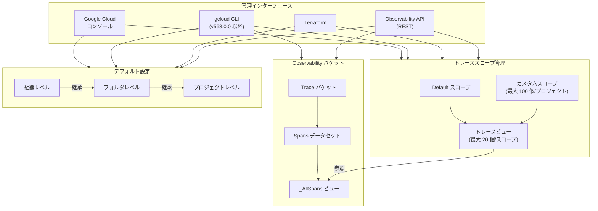

# Cloud Trace: gcloud CLI によるトレーススコープ・Observability バケット・デフォルト設定の管理

**リリース日**: 2026-04-08

**サービス**: Cloud Trace

**機能**: gcloud CLI によるトレーススコープ構成、Observability バケット管理、デフォルト Observability 設定

**ステータス**: Public Preview

📊 [このアップデートのインフォグラフィックを見る](https://takech9203.github.io/google-cloud-news-summary/20260408-cloud-trace-cli-observability.html)

## 概要

Google Cloud は、Cloud Trace における 3 つの主要な Observability 管理機能を gcloud CLI から操作可能にしたことを発表した。具体的には、トレーススコープの構成、Observability バケットのストレージ管理、およびデフォルト Observability 設定の構成が gcloud CLI で行えるようになった。これらの機能はいずれも Public Preview として提供される。

トレーススコープは、Trace Explorer ページで検索対象とするビューのセットを定義するプロジェクトレベルのリソースである。マイクロサービスアーキテクチャなどでトレースデータが複数のプロジェクトに分散する環境では、トレーススコープを使って複数プロジェクトのスパンを単一のビューから横断的に確認できる。今回のアップデートにより、これらの操作がコンソール、Terraform、Observability API に加えて gcloud CLI でも可能になり、自動化やスクリプトベースの管理が大幅に容易になった。

主な対象ユーザーは、複数プロジェクトにまたがるトレースデータの管理を行う SRE チーム、インフラストラクチャの構成を IaC (Infrastructure as Code) で管理する DevOps エンジニア、およびデータレジデンシー・コンプライアンス要件を持つ組織のクラウドアーキテクトである。

**アップデート前の課題**

- トレーススコープの作成・管理は Google Cloud コンソール、Terraform、または REST API 経由でのみ可能であり、CLI ベースの自動化が困難だった
- Observability バケットの情報取得は REST API のみで可能であり、CLI からの簡便な操作手段がなかった
- デフォルト Observability 設定 (ストレージロケーション・CMEK) の構成に gcloud CLI が対応しておらず、API を直接呼び出すか Terraform を使う必要があった
- シェルスクリプトや CI/CD パイプラインへの組み込みが REST API の直接呼び出しに依存しており、実装の複雑さが高かった

**アップデート後の改善**

- gcloud CLI の `gcloud observability trace-scopes` コマンドでトレーススコープの作成・一覧・更新・削除が可能になった
- gcloud CLI の `gcloud observability scopes` コマンドで Observability スコープの確認・更新が可能になった
- gcloud CLI からデフォルト Observability 設定の構成が可能になり、シェルスクリプトや CI/CD パイプラインへの統合が容易になった
- コンソール、gcloud CLI、Terraform、Observability API の 4 つのインターフェースから一貫した操作が可能になった

## アーキテクチャ図



gcloud CLI を含む 4 つの管理インターフェースから、トレーススコープの管理、Observability バケットの情報参照、およびデフォルト Observability 設定の構成が可能になった。トレーススコープはビューを通じて Observability バケット内のトレースデータにアクセスする。

## サービスアップデートの詳細

### 主要機能

1. **トレーススコープの構成 (コンソール、gcloud CLI、Terraform、Observability API)**
   - トレーススコープの作成・一覧・更新・削除が gcloud CLI で可能
   - 1 プロジェクトあたり最大 100 個のトレーススコープを作成可能
   - 各トレーススコープには最大 20 個のビューを含めることが可能
   - デフォルトトレーススコープ (`_Default`) の変更が可能
   - プロジェクト選択時に、そのプロジェクトのデフォルトトレースビュー (`_Trace/Spans/_AllSpans`) が自動的にスコープに追加される

2. **Observability バケットのストレージ管理 (gcloud CLI、Observability API)**
   - Observability バケットの一覧表示が可能
   - バケット上のデータセットの一覧表示が可能
   - データセット上のビューの一覧表示が可能
   - バケットの作成時刻、更新時刻、保持期間 (retentionDays) などのメタデータを確認可能

3. **デフォルト Observability 設定の構成 (gcloud CLI、Terraform、Observability API)**
   - 組織、フォルダ、プロジェクトの各レベルでデフォルトのストレージロケーションを設定可能
   - 各ロケーションに対するデフォルトの Cloud KMS キー (CMEK) を設定可能
   - リソース階層の下位リソースが上位の設定を自動的に継承
   - デフォルト設定は新規リソースにのみ適用 (既存リソースには影響しない)

## 技術仕様

### gcloud CLI コマンド一覧

| コマンド | 説明 |
|---------|------|
| `gcloud observability trace-scopes list` | トレーススコープの一覧表示 |
| `gcloud observability trace-scopes create` | トレーススコープの作成 |
| `gcloud observability trace-scopes update` | トレーススコープの更新 |
| `gcloud observability trace-scopes delete` | トレーススコープの削除 |
| `gcloud observability scopes describe` | Observability スコープの詳細表示 |
| `gcloud observability scopes update` | Observability スコープの更新 |

### 前提条件

| 項目 | 詳細 |
|------|------|
| gcloud CLI バージョン | 563.0.0 以降 |
| ロケーション | `global` (トレーススコープ) |
| 必要な IAM ロール | `roles/observability.scopesEditor` (トレーススコープの作成・閲覧) |
| デフォルト設定の変更 | `roles/observability.editor` |
| CMEK 設定 | `roles/cloudkms.admin` |

### Observability バケットのデータモデル

| 項目 | 詳細 |
|------|------|
| バケット名 | `_Trace` (システムが自動作成) |
| データセット名 | `Spans` |
| ビュー名 | `_AllSpans` (全データを含む) |
| デフォルト保持期間 | 30 日 |

## 設定方法

### 前提条件

1. gcloud CLI バージョン 563.0.0 以降がインストールされていること
2. 対象プロジェクトに対する `roles/observability.scopesEditor` ロールが付与されていること
3. Cloud Trace API が有効化されていること

### 手順

#### ステップ 1: トレーススコープの一覧表示

```bash
gcloud observability trace-scopes list \
  --location=global \
  --project=PROJECT_ID
```

プロジェクト内のすべてのトレーススコープとその詳細 (名前、リソース一覧、作成日時など) が表示される。

#### ステップ 2: カスタムトレーススコープの作成

Google Cloud コンソールの Trace Scopes タブから「Create trace scope」を選択し、対象プロジェクトとスコープ名を指定して作成する。gcloud CLI でもトレーススコープの作成が可能である。

#### ステップ 3: Observability スコープの確認と更新

```bash
# Observability スコープの現在の設定を確認
gcloud observability scopes describe _Default \
  --location=global \
  --project=PROJECT_ID

# Observability スコープのトレーススコープを更新
gcloud observability scopes update _Default \
  --log-scope=logging.googleapis.com/projects/PROJECT_ID/locations/global/logScopes/_Default \
  --trace-scope=projects/PROJECT_ID/locations/global/traceScopes/my-trace-scope \
  --location=global \
  --project=PROJECT_ID
```

Observability スコープは、Trace Explorer と Logs Explorer が開いたときに使用するデフォルトのトレーススコープとログスコープを指定するリソースである。

#### ステップ 4: デフォルト Observability 設定の構成

デフォルトのストレージロケーションと CMEK の設定は、Observability API の `updateSettings` エンドポイントまたは gcloud CLI を使用して構成する。

```text
# 組織のデフォルトストレージロケーションを設定 (API 例)
API エンドポイント: organizations.locations.updateSettings
パスパラメータ: organizations/ORGANIZATION_ID/locations/global/settings
updateMask=defaultStorageLocation
リクエストボディ: {"defaultStorageLocation": "us"}
```

## メリット

### ビジネス面

- **運用効率の向上**: gcloud CLI からのトレーススコープ管理により、手動コンソール操作が不要になり、日常的な運用タスクの効率が向上する
- **IaC との親和性**: Terraform と gcloud CLI の両方に対応したことで、インフラストラクチャのコード管理と CI/CD パイプラインへの統合がより柔軟に実現できる
- **コンプライアンス対応の効率化**: リソース階層を通じたデフォルト設定の継承により、大規模組織でも一貫したデータレジデンシーポリシーを効率的に適用できる

### 技術面

- **自動化の促進**: gcloud CLI コマンドをシェルスクリプトや CI/CD パイプラインに組み込むことで、トレーススコープの管理を自動化可能
- **マルチプロジェクトの一元管理**: 複数プロジェクトにまたがるトレースデータを単一のトレーススコープで横断的に検索・分析可能
- **一貫した操作体験**: コンソール、CLI、Terraform、API の 4 つのインターフェースで同等の機能を利用でき、チームの好みやワークフローに応じた選択が可能

## デメリット・制約事項

### 制限事項

- Observability バケットを変更・削除することはできない
- データセットの作成・削除・変更はできない
- ビューの作成・削除・変更はできない
- Google Cloud コンソールからバケット、データセット、ビュー、リンクを一覧表示することはできない (CLI または API を使用する必要がある)
- Terraform ではトレーススコープの作成・変更は可能だが、一覧表示やデフォルトトレーススコープの設定はできない
- トレーススコープは 1 プロジェクトあたり最大 100 個、1 スコープあたりのビューは最大 20 個に制限される
- デフォルト設定は新規リソースにのみ適用され、既存リソースには影響しない
- Public Preview のため、GA 前に機能や仕様が変更される可能性がある

### 考慮すべき点

- トレーススコープに含まれるすべてのビューは、トレースデータを同一のロケーションに保存している必要がある
- `roles/observability.scopesEditor` ロールにはプライベート権限が含まれており、カスタム IAM ロールに追加できない
- gcloud CLI バージョン 563.0.0 以降が必要であり、それ以前のバージョンでは使用できない

## ユースケース

### ユースケース 1: マイクロサービス環境での横断的なトレース分析

**シナリオ**: マイクロサービスアーキテクチャを採用する組織で、各サービスが個別の Google Cloud プロジェクトにデプロイされている。SRE チームがすべてのサービスのトレースデータを単一の Trace Explorer から横断的に分析したい。

**実装例**:
```bash
# カスタムトレーススコープの一覧を確認
gcloud observability trace-scopes list \
  --location=global \
  --project=sre-project

# Observability スコープを更新してカスタムトレーススコープをデフォルトに設定
gcloud observability scopes update _Default \
  --trace-scope=projects/sre-project/locations/global/traceScopes/all-services-scope \
  --location=global \
  --project=sre-project
```

**効果**: 複数プロジェクトのトレースデータを単一のスコープで検索でき、サービス間のリクエストフローを一元的に把握できる。gcloud CLI により、この設定を自動化スクリプトに組み込むことも容易である。

### ユースケース 2: CI/CD パイプラインでの Observability 構成の自動化

**シナリオ**: 新規プロジェクトの作成時に、トレーススコープの設定やデフォルト Observability 設定を自動的に適用するパイプラインを構築したい。

**効果**: gcloud CLI コマンドを CI/CD パイプライン (Cloud Build、GitHub Actions など) に組み込むことで、プロジェクト作成のたびに手動でコンソール操作を行う必要がなくなり、構成の一貫性と再現性が確保される。

## 料金

トレーススコープの構成、Observability バケットの管理、デフォルト Observability 設定の構成機能自体には追加料金は発生しない。Cloud Trace の料金は、スパンの取り込み量に基づいて計算される。CMEK を使用する場合は Cloud KMS の料金が別途発生する。

詳細な料金情報については [Google Cloud Observability 料金ページ](https://cloud.google.com/products/observability/pricing) を参照のこと。

## 利用可能リージョン

トレーススコープのロケーションは `global` に設定する必要がある。Observability バケットのロケーションについては、[Observability バケットのロケーション一覧](https://cloud.google.com/stackdriver/docs/observability/observability-bucket-locations) を参照のこと。

## 関連サービス・機能

- **Cloud Logging**: ログスコープと同様にトレーススコープを Observability スコープで統合管理可能。ログデータとトレースデータの相関分析に使用
- **Cloud Monitoring**: Observability スコープを通じてトレーススコープとログスコープのデフォルト設定を一元管理
- **Cloud KMS**: Observability バケットの CMEK (顧客管理暗号鍵) 設定に使用。暗号化キーはバケットと同じロケーションに配置する必要がある
- **BigQuery**: Observability バケットにリンクを作成すると、BigQuery からトレースデータを SQL でクエリ・分析可能
- **Terraform**: トレーススコープの作成・変更が可能。ただし、一覧表示やデフォルトトレーススコープの設定には対応していない

## 参考リンク

- 📊 [インフォグラフィック](https://takech9203.github.io/google-cloud-news-summary/20260408-cloud-trace-cli-observability.html)
- [公式リリースノート](https://cloud.google.com/release-notes#April_08_2026)
- [トレーススコープの作成と管理](https://docs.cloud.google.com/trace/docs/trace-scope/create-and-manage)
- [トレースストレージの管理](https://docs.cloud.google.com/trace/docs/storage-manage)
- [Observability バケットのデフォルト設定](https://docs.cloud.google.com/stackdriver/docs/observability/set-defaults-for-observability-buckets)
- [Google Cloud Observability 料金](https://cloud.google.com/products/observability/pricing)

## まとめ

今回のアップデートにより、Cloud Trace のトレーススコープ管理、Observability バケットの情報参照、およびデフォルト Observability 設定の構成が gcloud CLI から操作可能になった。これにより、コンソール、CLI、Terraform、API の 4 つのインターフェースで一貫した管理が実現し、特にスクリプトベースの自動化や CI/CD パイプラインへの統合が大幅に容易になる。マイクロサービスアーキテクチャを採用する組織や、コンプライアンス要件に基づくトレースデータ管理を行う組織は、gcloud CLI を活用した運用効率化を検討されたい。

---

**タグ**: #CloudTrace #Observability #gcloudCLI #トレーススコープ #ObservabilityBuckets #デフォルト設定 #PublicPreview #GoogleCloudObservability
