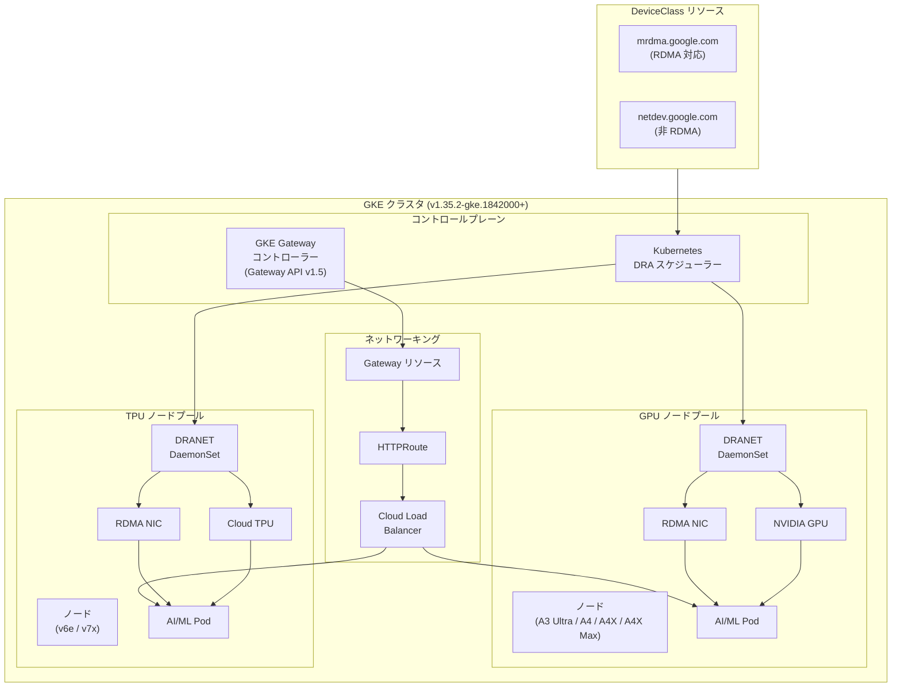

# Google Kubernetes Engine: Gateway API v1.5 サポート、マネージド DRANET GA、ログ処理ロールバック

**リリース日**: 2026-04-08

**サービス**: Google Kubernetes Engine (GKE)

**機能**: Gateway API v1.5 サポート / マネージド DRANET GA / ログ処理機能ロールバック

**ステータス**: GA (一般提供) / Feature / Change

[このアップデートのインフォグラフィックを見る](https://takech9203.github.io/google-cloud-news-summary/20260408-gke-gateway-api-dranet-ga.html)

## 概要

Google Kubernetes Engine (GKE) において、2026 年 4 月 8 日付けで 3 つの重要なアップデートが発表されました。第一に、Kubernetes Gateway API v1.5 が GKE バージョン 1.35.2-gke.1842000 以降でサポートされるようになりました。GKE Gateway コントローラーはコア適合性テスト (core conformance tests) に合格しており、Gateway API の標準仕様に準拠したトラフィック管理が可能です。

第二に、GKE マネージド DRANET が一般提供 (GA) となりました。DRANET は Kubernetes の Dynamic Resource Allocation (DRA) API をネットワーキングリソースに対して実装するもので、RDMA 対応インターフェースなどの高性能ネットワークリソースを Pod に割り当てることができます。GA では対象が拡大され、NVIDIA GPU (A3 Ultra、A4、A4X、A4X Max) および Cloud TPU (v6e、v7x) をサポートするノードプールで利用可能になりました。

第三に、2025 年 11 月 7 日に発表されたログ処理高速化機能が、基盤となる依存関係の問題によりロールバックされました。この機能を利用していた環境では、以前のログ処理動作に戻る点に注意が必要です。

**アップデート前の課題**

- Gateway API の以前のバージョンでは一部の機能や適合性が限定されており、最新の Gateway API 仕様に基づいたトラフィック管理ができなかった
- DRANET はプレビュー段階であり、対応するアクセラレーターの種類が限定されていた (A4X Max のみ)。本番環境での利用には SLA が適用されなかった
- ログ処理高速化機能が有効な環境では、依存関係の問題により予期しない動作が発生する可能性があった

**アップデート後の改善**

- Gateway API v1.5 のサポートにより、最新の Kubernetes ネットワーキング標準に基づいたロードバランシングとトラフィックルーティングが利用可能になった
- DRANET の GA 化により、NVIDIA GPU (A3 Ultra、A4、A4X、A4X Max) および Cloud TPU (v6e、v7x) 搭載ノードで RDMA 対応ネットワークインターフェースの DRA ベース割り当てが本番利用可能になった
- ログ処理高速化機能のロールバックにより、依存関係の問題に起因する潜在的な不具合が解消された

## アーキテクチャ図



GKE クラスタ内で Gateway API v1.5 によるトラフィック管理と、DRANET DaemonSet による高性能ネットワークリソースの動的割り当てが連携する構成を示しています。DRANET は GPU/TPU ノードプール上で RDMA 対応インターフェースを Pod に専有割り当てします。

## サービスアップデートの詳細

### 主要機能

1. **Gateway API v1.5 サポート**
   - GKE バージョン 1.35.2-gke.1842000 以降で利用可能
   - GKE Gateway コントローラーがコア適合性テストに合格
   - シングルクラスタおよびマルチクラスタの Gateway コントローラーをサポート
   - Cloud Load Balancing との統合により、外部/内部ロードバランシング、トラフィックルーティングを Gateway API 標準で管理可能

2. **GKE マネージド DRANET の GA (一般提供)**
   - Kubernetes Dynamic Resource Allocation (DRA) API をネットワーキングリソースに適用
   - RDMA (Remote Direct Memory Access) 対応ネットワークインターフェースを Pod に専有割り当て
   - GA で新たに対応するアクセラレーター:
     - NVIDIA GPU: A3 Ultra、A4、A4X、A4X Max
     - Cloud TPU: v6e、v7x
   - `networking-dra-driver` DaemonSet としてノード上で動作
   - DeviceClass リソース (`mrdma.google.com`、`netdev.google.com`) による宣言的なデバイス管理

3. **ログ処理高速化機能のロールバック**
   - 2025 年 11 月 7 日に発表された faster log processing 機能がロールバック
   - 原因: 基盤となる依存関係の問題
   - 影響: 該当機能を利用していた環境ではログ処理が以前の動作に戻る

## 技術仕様

### Gateway API v1.5

| 項目 | 詳細 |
|------|------|
| 対応 GKE バージョン | 1.35.2-gke.1842000 以降 |
| 適合性 | コア適合性テスト合格 |
| Gateway コントローラー | シングルクラスタ / マルチクラスタ |
| 対応 GatewayClass | `gke-l7-global-external-managed`、`gke-l7-regional-external-managed`、`gke-l7-rilb`、`gke-l7-gxlb` など |

### GKE マネージド DRANET

| 項目 | 詳細 |
|------|------|
| 対応 GKE バージョン | 1.35.2-gke.1842000 以降 (GA) |
| ステータス | GA (一般提供) |
| 対応 GPU | NVIDIA A3 Ultra、A4、A4X、A4X Max |
| 対応 TPU | Cloud TPU v6e、v7x |
| 前提条件 | GKE Dataplane V2 が有効であること |
| クラスタモード | Standard モードのみ |
| DeviceClass | `mrdma.google.com` (RDMA 対応)、`netdev.google.com` (非 RDMA) |
| DaemonSet | `networking-dra-driver` |

### DRANET の ResourceClaimTemplate 例

```yaml
apiVersion: resource.k8s.io/v1beta1
kind: ResourceClaimTemplate
metadata:
  name: rdma-interfaces
spec:
  spec:
    devices:
      requests:
      - name: rdma-nics
        deviceClassName: mrdma.google.com
        allocationMode: ExactCount
        count: 4
```

```yaml
apiVersion: v1
kind: Pod
metadata:
  name: ai-workload
spec:
  containers:
  - name: training
    image: my-training-image
    resources:
      claims:
      - name: rdma-nics
  resourceClaims:
  - name: rdma-nics
    resourceClaimTemplateName: rdma-interfaces
```

## 設定方法

### 前提条件

1. GKE クラスタがバージョン 1.35.2-gke.1842000 以降であること
2. GKE Dataplane V2 が有効であること (DRANET 利用時)
3. Standard モードのクラスタであること (DRANET 利用時)

### 手順

#### ステップ 1: DRANET ドライバーの有効化

GPU または TPU を搭載したノードプールに対して、DRANET ドライバーを有効化します。

```bash
# ノードプールに DRANET ドライバーラベルを追加
gcloud container node-pools update NODE_POOL_NAME \
  --cluster=CLUSTER_NAME \
  --node-labels=cloud.google.com/gke-networking-dra-driver=true
```

GKE が自動的に `networking-dra-driver` DaemonSet をデプロイし、DeviceClass リソース (`mrdma.google.com`、`netdev.google.com`) を作成します。

#### ステップ 2: ResourceClaimTemplate の作成

ワークロードが必要とするネットワークデバイスを定義する ResourceClaimTemplate を作成します。

```bash
kubectl apply -f - <<EOF
apiVersion: resource.k8s.io/v1beta1
kind: ResourceClaimTemplate
metadata:
  name: all-rdma-devices
spec:
  spec:
    devices:
      requests:
      - name: rdma
        deviceClassName: mrdma.google.com
        allocationMode: All
EOF
```

#### ステップ 3: Pod での ResourceClaim の参照

Pod 仕様で ResourceClaimTemplate を参照して、RDMA デバイスへのアクセスを要求します。

```bash
kubectl apply -f - <<EOF
apiVersion: v1
kind: Pod
metadata:
  name: rdma-workload
spec:
  containers:
  - name: app
    image: my-app-image
    resources:
      claims:
      - name: rdma
  resourceClaims:
  - name: rdma
    resourceClaimTemplateName: all-rdma-devices
EOF
```

#### ステップ 4: Gateway API v1.5 の利用

GKE バージョン 1.35.2-gke.1842000 以降では、Gateway API v1.5 が自動的に利用可能です。

```bash
# Gateway リソースの作成例
kubectl apply -f - <<EOF
apiVersion: gateway.networking.k8s.io/v1
kind: Gateway
metadata:
  name: my-gateway
spec:
  gatewayClassName: gke-l7-global-external-managed
  listeners:
  - name: https
    protocol: HTTPS
    port: 443
    allowedRoutes:
      kinds:
      - kind: HTTPRoute
EOF
```

## メリット

### ビジネス面

- **AI/ML ワークロードの本番運用強化**: DRANET の GA 化により、SLA に裏付けられた高性能ネットワーキングを AI/ML 本番ワークロードで利用可能
- **幅広いアクセラレーター対応**: A3 Ultra、A4、A4X、A4X Max GPU および v6e、v7x TPU という幅広いアクセラレーターで RDMA ネットワーキングが利用でき、ワークロードに最適なハードウェアを選択可能
- **Kubernetes 標準への準拠**: Gateway API v1.5 のサポートにより、ベンダーロックインを軽減し、Kubernetes エコシステムの標準に沿ったネットワーク管理が可能

### 技術面

- **宣言的なネットワークリソース管理**: DRA API により、ネットワークインターフェースを Kubernetes ネイティブな方法で宣言的に要求・割り当てが可能
- **RDMA による高帯域・低レイテンシ通信**: Pod に専有の RDMA インターフェースを割り当てることで、分散学習や推論ワークロードのノード間通信性能を最大化
- **トポロジー認識スケジューリング**: DRA スケジューラーがデバイスのトポロジーを考慮して Pod を配置するため、GPU/TPU とネットワークインターフェースの最適な組み合わせが実現

## デメリット・制約事項

### 制限事項

- **DRANET の制限**:
  - Standard モードのクラスタでのみ利用可能 (Autopilot は未対応)
  - クラスタオートスケーリングは DRANET と併用できない
  - デフォルト NIC や仮想 NIC (veth) の割り当てはできない
  - GKE マルチネットワーク API (Device タイプの Network リソース) との併用は不可
  - secondaryPodRange を設定したインターフェースでは使用不可
- **ログ処理高速化のロールバック**: 2025 年 11 月 7 日の faster log processing 機能が依存関係の問題によりロールバックされたため、ログ処理性能が以前の水準に戻る

### 考慮すべき点

- DRANET で Pod に割り当てたネットワークインターフェースは専有となり、同一ノード上の他の Pod と共有できない
- GKE Dataplane V2 が有効でない既存クラスタでは DRANET を利用する前にデータプレーンの移行が必要
- ログ処理高速化機能のロールバックにより、ログ配信の遅延が発生する可能性がある

## ユースケース

### ユースケース 1: 大規模分散 AI トレーニング

**シナリオ**: NVIDIA A4X Max GPU を搭載した複数ノードで大規模言語モデル (LLM) の分散トレーニングを実施する環境において、ノード間の勾配同期に高帯域・低レイテンシ通信が必要。

**実装例**:
```yaml
apiVersion: resource.k8s.io/v1beta1
kind: ResourceClaimTemplate
metadata:
  name: training-rdma
spec:
  spec:
    devices:
      requests:
      - name: all-rdma
        deviceClassName: mrdma.google.com
        allocationMode: All
---
apiVersion: apps/v1
kind: StatefulSet
metadata:
  name: distributed-training
spec:
  replicas: 8
  template:
    spec:
      containers:
      - name: trainer
        image: training-image:latest
        resources:
          claims:
          - name: all-rdma
          limits:
            nvidia.com/gpu: 8
      resourceClaims:
      - name: all-rdma
        resourceClaimTemplateName: training-rdma
```

**効果**: RDMA 対応インターフェースの専有割り当てにより、NCCL 等の集合通信ライブラリが GPUDirect RDMA を活用でき、分散トレーニングのスループットが向上する。

### ユースケース 2: Gateway API によるマルチサービストラフィック管理

**シナリオ**: 複数のマイクロサービスで構成されるアプリケーションにおいて、Gateway API v1.5 を使用して宣言的なトラフィックルーティングを実現する。

**実装例**:
```yaml
apiVersion: gateway.networking.k8s.io/v1
kind: Gateway
metadata:
  name: app-gateway
spec:
  gatewayClassName: gke-l7-global-external-managed
  listeners:
  - name: https
    protocol: HTTPS
    port: 443
---
apiVersion: gateway.networking.k8s.io/v1
kind: HTTPRoute
metadata:
  name: app-routes
spec:
  parentRefs:
  - name: app-gateway
  hostnames:
  - "app.example.com"
  rules:
  - matches:
    - path:
        value: /api
    backendRefs:
    - name: api-service
      port: 8080
  - matches:
    - path:
        value: /
    backendRefs:
    - name: frontend-service
      port: 80
```

**効果**: Kubernetes 標準の Gateway API を使用することで、Cloud Load Balancing との統合を維持しつつ、ポータブルで宣言的なトラフィック管理が実現できる。

## 料金

GKE の料金体系は、クラスタ管理料金とノードに使用する Compute Engine リソースの料金で構成されます。Gateway API によるシングルクラスタ Gateway コントローラーは GKE Standard / Autopilot の料金に含まれており、追加料金は発生しません。DRANET 自体にも追加料金はなく、GPU/TPU ノードの Compute Engine インスタンス料金が適用されます。

詳細な料金については以下を参照してください。

- [GKE 料金ページ](https://cloud.google.com/kubernetes-engine/pricing)
- [Compute Engine GPU 料金](https://cloud.google.com/compute/gpus-pricing)
- [Cloud TPU 料金](https://cloud.google.com/tpu/pricing)

## 利用可能リージョン

DRANET の利用可能リージョンは、対応する GPU (A3 Ultra、A4、A4X、A4X Max) および TPU (v6e、v7x) が利用可能なリージョンに依存します。Gateway API v1.5 は GKE バージョン 1.35.2-gke.1842000 以降が利用可能な全リージョンで利用できます。

- [GPU の利用可能リージョン](https://cloud.google.com/compute/docs/gpus/gpu-regions-zones)
- [TPU の利用可能リージョン](https://cloud.google.com/tpu/docs/regions-zones)

## 関連サービス・機能

- **Kubernetes Dynamic Resource Allocation (DRA)**: DRANET の基盤となる Kubernetes API。GPU やネットワークデバイスの宣言的な割り当てを提供
- **GKE Dataplane V2**: DRANET の前提条件となるデータプレーン。eBPF ベースのネットワーキングを提供
- **Cloud Load Balancing**: Gateway API の GKE Gateway コントローラーが管理するロードバランサーの基盤
- **Cloud TPU**: DRANET GA で新たに対応した v6e、v7x TPU
- **NVIDIA GPUDirect RDMA**: DRANET が提供する RDMA インターフェースと組み合わせて GPU 間の直接データ転送を実現

## 参考リンク

- [このアップデートのインフォグラフィック](https://takech9203.github.io/google-cloud-news-summary/20260408-gke-gateway-api-dranet-ga.html)
- [公式リリースノート](https://cloud.google.com/release-notes#April_08_2026)
- [Gateway API v1.5.0 リリース (GitHub)](https://github.com/kubernetes-sigs/gateway-api/releases/tag/v1.5.0)
- [GKE マネージド DRANET ドキュメント](https://docs.cloud.google.com/kubernetes-engine/docs/how-to/allocate-network-resources-dra)
- [GKE DRA 概要ドキュメント](https://docs.cloud.google.com/kubernetes-engine/docs/concepts/about-dynamic-resource-allocation)
- [ログ処理高速化に関する過去のリリースノート](https://docs.cloud.google.com/kubernetes-engine/docs/release-notes#November_07_2025)
- [GKE Gateway API コンセプト](https://docs.cloud.google.com/kubernetes-engine/docs/concepts/gateway-api)
- [GKE 料金ページ](https://cloud.google.com/kubernetes-engine/pricing)

## まとめ

今回の GKE アップデートでは、Gateway API v1.5 サポートと DRANET の GA 化という 2 つの重要な進展がありました。特に DRANET の GA 化は、NVIDIA A3 Ultra / A4 / A4X / A4X Max GPU および Cloud TPU v6e / v7x という幅広いアクセラレーターでの RDMA ネットワーキングを本番環境で利用可能にするものであり、大規模 AI/ML ワークロードを GKE 上で運用する組織にとって重要な一歩です。一方、ログ処理高速化機能のロールバックについては、依存関係の問題が解消され次第再リリースされることが期待されますが、当面はログ処理が以前の動作に戻る点に注意してください。

---

**タグ**: #GoogleCloud #GKE #GatewayAPI #DRANET #DynamicResourceAllocation #RDMA #GPU #TPU #Kubernetes #AI #ML #ネットワーキング
