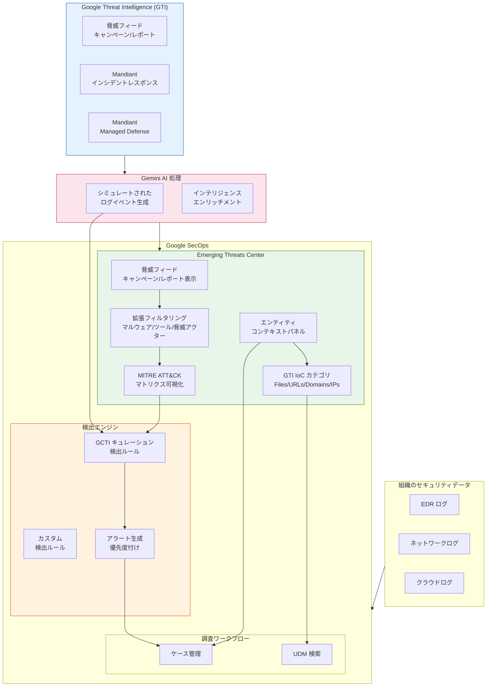

# Google SecOps: Emerging Threats Center が一般提供 (GA) に昇格

**リリース日**: 2026-04-08

**サービス**: Google SecOps (Google Security Operations)

**機能**: Emerging Threats Center - AI 駆動型脅威インテリジェンスと MITRE ATT&CK 統合

**ステータス**: GA (一般提供)

[このアップデートのインフォグラフィックを見る](https://takech9203.github.io/google-cloud-news-summary/20260408-google-secops-emerging-threats-center-ga.html)

## 概要

Google Security Operations (SecOps) の Emerging Threats Center が一般提供 (GA) となりました。Emerging Threats Center は、Google Threat Intelligence (GTI) と Gemini モデルを基盤とした AI 駆動型の脅威インテリジェンス機能であり、現在進行中および新たに出現する脅威キャンペーンが組織に与える影響を把握するための統合的なビューを提供します。Applied Threat Intelligence (ATI) の上に構築され、IoC (侵害指標)、検出ルールのマッチ、影響を受けたエンティティを含む、最も重要なグローバル脅威のキュレーションされたビューを提供します。

今回の GA リリースでは、キャンペーンフィルタリングの拡張 (マルウェア、ツール、脅威アクター対応)、MITRE ATT&CK マトリクスの可視化 (検出ルールのTTP カバレッジ、カスタマイズ可能なヒートマップメトリクス、ルール/アラートステータスによるフィルタ)、強化されたエンティティコンテキストパネル (IoC 調査、ポイントインタイム状態、関連ケース)、GTI 関連 IoC カテゴリ (ファイル、URL、ドメイン、IP) が含まれます。

対象ユーザーは、セキュリティオペレーションセンター (SOC) のアナリスト、脅威ハンター、検出エンジニア、および CISO/セキュリティマネージャーです。Emerging Threats Center は Google SecOps Enterprise Plus ライセンスでのみ利用可能です。

**アップデート前の課題**

- 脅威キャンペーンの情報を手動で収集・分析する必要があり、大量の脅威レポートを解析して検出機会を見つけ出すまでに多くの時間と労力がかかっていた
- 組織の検出ルールが既知の攻撃手法 (TTP) をどの程度カバーしているか、MITRE ATT&CK フレームワークに基づいた体系的な評価が困難だった
- IoC の調査時にコンテキスト情報が分散しており、関連するケースやエンティティの状態を横断的に把握するために複数の画面を行き来する必要があった
- 脅威キャンペーンのフィルタリングが限定的で、マルウェアファミリーや脅威アクターなどの切り口での絞り込みが十分にできなかった

**アップデート後の改善**

- Gemini が大量の生の脅威インテリジェンスフィードを実用的なインサイトに変換し、脅威データを調査ワークフロー内で直接運用可能になった
- MITRE ATT&CK マトリクス可視化により、検出ルールの TTP カバレッジのギャップを直感的に特定し、優先度の高いセキュリティ対策を迅速に実行できるようになった
- 強化されたエンティティコンテキストパネルにより、IoC 調査のコンテキストが一元化され、ポイントインタイムの状態と関連ケースを単一画面で確認可能になった
- マルウェア、ツール、脅威アクターによるキャンペーンフィルタリングが拡張され、調査対象の迅速な絞り込みが可能になった
- GTI 関連 IoC カテゴリ (ファイル、URL、ドメイン、IP) のサポートにより、多角的な IoC 調査が実現した

## アーキテクチャ図



Emerging Threats Center は、GTI からの脅威インテリジェンスを Gemini が処理・エンリッチメントし、MITRE ATT&CK マトリクスによるカバレッジ可視化と IoC 調査をシームレスに統合したセキュリティ脅威検出ワークフローを実現します。

## サービスアップデートの詳細

### 主要機能

1. **拡張キャンペーンフィルタリング**
   - マルウェアファミリー、攻撃ツール、脅威アクターによるフィルタリングが可能
   - フィルタの論理演算子 (OR/AND) を選択してキャンペーンを絞り込み
   - オブジェクトタイプ (キャンペーン/レポート)、発信地域、標的地域、標的業界、IoC マッチの有無でフィルタ可能
   - 過去 1 年以内に更新された脅威コレクションのみ表示し、最新のインテリジェンスで作業可能

2. **MITRE ATT&CK マトリクス可視化**
   - 検出ルールの TTP (戦術・技術・手順) カバレッジをマトリクス形式で表示
   - カスタマイズ可能なヒートマップメトリクスにより、カバレッジの強弱を直感的に把握
   - ルールタイプ、ライブステータス、アラートステータスによるフィルタリング
   - テクニック名または ID (例: T1059.003) での検索機能
   - サブテクニックインジケーターの色分け表示
   - MITRE ATT&CK Navigator ツール互換の JSON エクスポート機能
   - ATT&CK バージョン 17 をサポート

3. **強化されたエンティティコンテキストパネル**
   - IoC 調査時のポイントインタイム状態の表示
   - 関連するケースやエンティティの横断的な参照
   - VirusTotal コンテキスト、GCTI Priority、IC-Score、脅威アクター/マルウェアの関連付け
   - UDM エンティティフィールド名を使用した検索クエリの構築

4. **GTI 関連 IoC カテゴリ**
   - ファイル (ハッシュ値: SHA256, SHA1, MD5)
   - URL
   - ドメイン
   - IP アドレス
   - 各カテゴリで IoC マッチング、優先度付け、関連情報の表示が可能

### 詳細ビューのパネル構成

Emerging Threats の詳細ビューでは、選択したキャンペーンまたはレポートに対して以下のパネルが表示されます。

1. **Associated Rules (関連ルール) パネル**
   - キャンペーンに関連付けられた検出ルールの一覧表示 (キャンペーンのみ対象、レポートは非対応)
   - ルール名、タグ、過去 4 週間のアクティビティ、最終検出日時、重要度、アラート有無、ライブステータスを表示
   - Gemini が GTI のキャンペーンインテリジェンスに基づいてシミュレートされたログイベントを生成し、GCTI キュレーション検出ルールに対して自動的にカバレッジを評価
   - ギャップが特定された場合、Gemini が新しい検出ルールのドラフトを自動作成 (人間によるレビューと承認が必要)

2. **Disabled Rules (無効ルール) パネル**
   - 現在無効になっている関連検出ルールの表示

3. **Recent Associated Entities (関連エンティティ) パネル**
   - 脅威キャンペーンに関連するエンティティの最新情報

4. **IOCs パネル**
   - キャンペーンに関連する IoC の表示と環境内でのマッチ状況

## 技術仕様

### MITRE ATT&CK マトリクス対応戦術

| 戦術 | 説明 |
|------|------|
| Collection | データの収集 |
| Command and Control | C2 通信 |
| Credential Access | 認証情報の窃取 |
| Defense Evasion | 検出回避 |
| Discovery | 環境の探索 |
| Execution | 悪意あるコードの実行 |
| Exfiltration | データの持ち出し |
| Impact | システム・データの破壊 |
| Initial Access | 初期侵入 |
| Lateral Movement | 横展開 |
| Persistence | 永続化 |
| Privilege Escalation | 権限昇格 |
| Reconnaissance | 偵察活動 (PRE プラットフォーム選択時のみ) |
| Resource Development | リソース確立 (PRE プラットフォーム選択時のみ) |

### カスタムルールの MITRE マッピング

カスタムルールを MITRE ATT&CK マトリクスに表示し、脅威カバレッジにカウントするには、ルールのメタデータセクションにテクニック ID をマッピングする必要があります。

```yaml
metadata:
  technique = "T1548,T1134.001"
```

新しいルールは数分以内にマトリクスに反映されます。

### IoC マッチングの仕組み

| 項目 | 詳細 |
|------|------|
| マッチング方式 | Applied Threat Intelligence (ATI) による自動 IoC マッチング |
| データソース | Mandiant、VirusTotal、SafeBrowsing、OSINT フィード |
| 優先度レベル | Active Breach、High、Medium |
| エンティティタイプ | IP_ADDRESS、DOMAIN_NAME、FILE (ハッシュ)、URL |
| コンテキストタイプ | Global Context (Google 提供)、Entity Context (顧客提供) |

### 脅威カードの構成

各脅威はカード形式で表示され、以下の情報を含みます。

| 要素 | 説明 |
|------|------|
| タイトルとサマリー | 脅威活動の簡潔な説明 |
| メタデータ | 標的業界、標的地域、関連マルウェア、脅威アクター |
| IoC バッジ | 環境内の IoC マッチ状況 |
| Rules バッジ | 有効化されている検出ルール数 (例: 1/2 rules) |

## 設定方法

### 前提条件

1. Google SecOps Enterprise Plus ライセンスを保有していること
2. 適切な IAM 権限が設定されていること (Emerging Threats: `threatCollections` および `iocAssociations` の権限)
3. Google SecOps インスタンスへのログインアクセスがあること

### 手順

#### ステップ 1: Emerging Threats Center へのアクセス

Google SecOps コンソールにログイン後、ナビゲーションメニューから Emerging Threats ページにアクセスします。

#### ステップ 2: キャンペーンフィルタの設定

```
1. Emerging Threats フィードでフィルタアイコンをクリック
2. フィルタダイアログで論理演算子 (OR/AND) を選択
3. フィルタカテゴリを選択:
   - Object types (キャンペーン/レポート)
   - Source regions (発信地域)
   - Targeted regions (標的地域)
   - Targeted industries (標的業界)
   - Has IoC matches (IoC マッチの有無)
4. 適用されたフィルタがテーブル上にチップとして表示される
```

#### ステップ 3: MITRE ATT&CK マトリクスの確認

```
1. Detection > Rules & Detections に移動
2. MITRE ATT&CK Matrix タブを選択
3. ルールタイプ、ライブステータス、アラートステータスでカバレッジを絞り込み
4. テクニックカードをクリックして詳細パネルを表示
5. 必要に応じて JSON エクスポートを実行
```

#### ステップ 4: カスタムルールの MITRE マッピング

```
カスタム検出ルールの meta セクションに technique キーを追加:

rule custom_detection_example {
    meta:
        author = "Security Team"
        description = "Custom detection rule"
        technique = "T1059.001,T1486"
    events:
        ...
    condition:
        ...
}
```

## メリット

### ビジネス面

- **脅威対応時間の短縮**: GTI のリアルタイムキャンペーンデータと AI 駆動のインサイトにより、脅威の発見から対応までのリードタイムを大幅に短縮できる
- **運用コストの削減**: 脅威レポートの手動解析が不要になり、Gemini によるルール自動生成で検出エンジニアの負荷が軽減される
- **セキュリティ体制の可視化**: MITRE ATT&CK マトリクスにより、経営層やステークホルダーへのセキュリティカバレッジの報告が定量的かつ視覚的に行える

### 技術面

- **継続的な脅威可視性**: GTI のキャンペーンデータがワークスペースに継続的に反映され、新たな脅威キャンペーンの発生をリアルタイムに把握可能
- **検出カバレッジの自動評価**: Gemini がシミュレートされたログイベントを生成してGCTI キュレーション検出ルールに対するカバレッジを自動的にレポートし、ギャップを特定
- **統合調査ワークフロー**: IoC マッチ、エンティティコンテキスト、関連ケースが一元化され、外部ツールに移動することなく調査を完結可能
- **EDR データソースに基づくカバレッジ分析**: カバレッジ分析はエンドポイント検出応答 (EDR) データソースに適用される

## デメリット・制約事項

### 制限事項

- Emerging Threats Center は Google SecOps Enterprise Plus ライセンスでのみ利用可能であり、Standard および Enterprise パッケージでは利用できない
- カバレッジ分析はエンドポイント検出応答 (EDR) データソースにのみ適用され、他のデータソースでは利用できない
- フィードに表示されるレポートは GTI が作成したものに限定され、クラウドソースされたレポートは表示されない
- ルールの関連付けはキャンペーンにのみ適用され、レポートには適用されない
- 過去 1 年以内に更新された脅威コレクションのみ表示される
- Gemini が自動生成した検出ルールは、本番環境に展開する前に人間によるレビューと承認が必要

### 考慮すべき点

- Enterprise Plus ライセンスへのアップグレードコストと、得られるセキュリティ上の価値のバランスを検討する必要がある
- 適切な IAM 権限 (threatCollections、iocAssociations) の設定が必要であり、RBAC ポリシーの見直しが求められる
- EDR データソースの品質と網羅性が、MITRE ATT&CK カバレッジ分析の精度に直接影響する
- カスタムルールを MITRE マトリクスに反映させるには、technique メタデータの手動設定が必要

## ユースケース

### ユースケース 1: 新たなランサムウェアキャンペーンへの迅速な対応

**シナリオ**: CISA が新たなランサムウェアグループによる攻撃に関するアドバイザリを公開。SOC チームは自組織の検出カバレッジを緊急に評価する必要がある。

**実装例**:
```
1. Emerging Threats フィードで該当キャンペーンを特定
2. 詳細ビューの Associated Rules パネルで関連する検出ルールを確認
3. MITRE ATT&CK マトリクスで、アドバイザリに記載された TTP
   (例: T1486 Data Encrypted for Impact) のカバレッジを確認
4. カバレッジギャップが発見された場合、Gemini が生成した
   ルールドラフトをレビューし、承認して本番展開
```

**効果**: 脅威アドバイザリ公開から検出ルール展開までの時間を数日から数時間に短縮。手動での脅威レポート解析が不要となり、SOC の対応能力が向上する。

### ユースケース 2: 継続的なセキュリティ体制の改善

**シナリオ**: セキュリティエンジニアが、組織の検出ルールカバレッジを MITRE ATT&CK フレームワークに基づいて定期的に評価し、改善したい。

**実装例**:
```
1. MITRE ATT&CK マトリクスを開き、ルールカウントが 0 の
   テクニックカードを特定
2. テクニックカードをクリックしてログソースの有無を確認
3. ログソースが存在するがルールがないテクニックを
   高優先度の検出機会としてリスト化
4. 新しい検出ルールを作成し、technique メタデータを設定して
   マトリクスに反映
```

**効果**: 検出カバレッジのギャップを体系的に特定し、優先度に基づいた段階的なカバレッジ拡大が可能になる。

### ユースケース 3: インシデント調査における IoC コンテキストの活用

**シナリオ**: SOC アナリストが不審な通信先ドメインを発見し、関連する脅威キャンペーンとの関連性を調査する必要がある。

**実装例**:
```
1. Emerging Threats Center で IoC マッチフィルタを有効化
2. 環境内で IoC マッチが検出されたキャンペーンを確認
3. エンティティコンテキストパネルで該当ドメインの
   ポイントインタイム状態を確認
4. 関連する IoC カテゴリ (IP、URL、ファイルハッシュ) を
   横断的に調査
5. 関連ケースを参照して過去のインシデントとの関連性を分析
```

**効果**: IoC の関連情報が一元化されることで、調査時間が短縮され、脅威キャンペーンとの関連付けが迅速に行える。

## 料金

Emerging Threats Center は Google SecOps Enterprise Plus パッケージに含まれる機能です。Google SecOps の料金はインジェスト量に基づくサブスクリプションモデルで、以下の構成要素があります。

| コンポーネント | 説明 |
|--------------|------|
| SecOps サブスクリプション費用 | サブスクリプション契約に基づく定額料金 |
| データインジェスト使用量 | 実際に取り込まれたデータ量 (SecOps クレジットで相殺) |
| 超過使用料 | クレジットを超過した場合の従量課金 |
| データ保持延長 | 12 か月以上の保持期間を選択した場合の追加料金 |

具体的な料金については、Google Cloud の営業担当またはパートナーにお問い合わせください。詳細は [Google SecOps 料金ページ](https://cloud.google.com/security/products/security-operations) を参照してください。

## 利用可能リージョン

Google SecOps はリージョン固有の SKU を使用してデータレジデンシー要件に準拠しています。Emerging Threats Center は Google SecOps Enterprise Plus ライセンスが利用可能なすべてのリージョンで提供されます。具体的なリージョン情報については、[Google SecOps のドキュメント](https://cloud.google.com/chronicle/docs) を参照してください。

## 関連サービス・機能

- **Google Threat Intelligence (GTI)**: Emerging Threats Center の脅威インテリジェンスデータの主要なソース。Mandiant のフロントラインリサーチとインシデントレスポンスのデータを提供
- **Applied Threat Intelligence (ATI)**: GTI の IoC をセキュリティテレメトリに対して自動的に評価し、優先度付けされたアラートを生成する基盤機能
- **Gemini in Security Operations**: 自然言語によるデータ検索、ケース要約、検出ルール自動生成など、AI 駆動のセキュリティ運用支援
- **MITRE ATT&CK マトリクスダッシュボード**: 検出ルールのTTP カバレッジを可視化するダッシュボード。Emerging Threats Center と連携してカバレッジギャップの特定に活用
- **VirusTotal**: ファイル、URL、ドメイン、IP アドレスの脅威情報を提供。Enterprise Plus パッケージで完全なアクセスが可能
- **Security Command Center**: Google Cloud 環境全体のセキュリティ体制管理。Google Unified Security パッケージで SecOps と統合

## 参考リンク

- [このアップデートのインフォグラフィック](https://takech9203.github.io/google-cloud-news-summary/20260408-google-secops-emerging-threats-center-ga.html)
- [公式リリースノート](https://cloud.google.com/release-notes#April_08_2026)
- [Emerging Threats 概要ドキュメント](https://cloud.google.com/chronicle/docs/detection/emerging-threats)
- [Emerging Threats 詳細ビュー](https://cloud.google.com/chronicle/docs/detection/emerging-threats-detailed-view)
- [Emerging Threats フィード](https://cloud.google.com/chronicle/docs/detection/emerging-threats-feed)
- [MITRE ATT&CK マトリクスダッシュボード](https://cloud.google.com/chronicle/docs/detection/mitre-dashboard)
- [Google SecOps パッケージ](https://cloud.google.com/chronicle/docs/secops/secops-packages)
- [料金ページ](https://cloud.google.com/security/products/security-operations)

## まとめ

Emerging Threats Center の GA リリースは、Google SecOps の脅威検出・対応能力を大幅に強化するアップデートです。GTI と Gemini AI を組み合わせた自動化されたインテリジェンス処理、MITRE ATT&CK マトリクスによるカバレッジの可視化、拡張されたキャンペーンフィルタリングと IoC カテゴリにより、SOC チームは脅威の発見から対応までを統合的かつ効率的に実行できるようになります。Enterprise Plus ライセンスをお持ちの組織は、速やかに Emerging Threats Center の活用を開始し、検出カバレッジのギャップ特定とルール整備を進めることを推奨します。

---

**タグ**: #GoogleSecOps #EmergingThreats #ThreatIntelligence #MITRE_ATT_CK #GA #セキュリティ #脅威検出 #IoC #Gemini #GTI #EnterprisePlus #SOC
