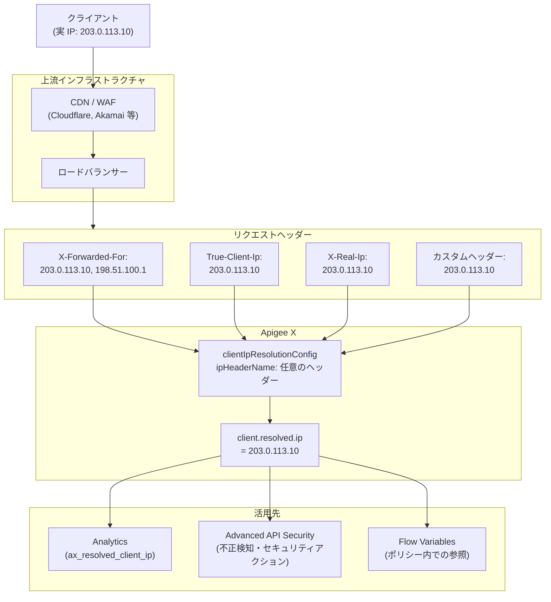

# Apigee X: クライアント IP 解決のヘッダー名制限の緩和

**リリース日**: 2026-04-09

**サービス**: Apigee X

**機能**: クライアント IP 解決におけるヘッダー名制限の緩和

**ステータス**: CHANGED

[このアップデートのインフォグラフィックを見る](https://takech9203.github.io/google-cloud-news-summary/20260409-apigee-x-client-ip-resolution.html)

## 概要

Apigee X において、クライアント IP 解決 (Client IP Resolution) のヘッダー名に関する制限が緩和されました。これまで、クライアント IP アドレスの解決には `X-Forwarded-For` ヘッダーのみがサポートされていましたが、今回の変更により任意のヘッダーからクライアント IP を解決できるようになりました。一般的に使用されるヘッダーとしては `X-Forwarded-For` や `True-Client-Ip` があります。

この変更は、API ゲートウェイとしての Apigee の柔軟性を大幅に向上させるものです。CDN やロードバランサーなどの上流インフラストラクチャは、クライアント IP アドレスをさまざまなヘッダーに格納するため、組織のネットワークトポロジーに応じた適切なヘッダーを選択できるようになりました。

このアップデートは、複雑なネットワークアーキテクチャ環境で Apigee を運用するインフラストラクチャエンジニアや、Advanced API Security を活用しているセキュリティ担当者にとって特に重要な改善です。

**アップデート前の課題**

- クライアント IP 解決には `X-Forwarded-For` ヘッダーのみがサポートされており、他のヘッダーは利用できなかった
- CDN (Cloudflare、Akamai など) が設定する `True-Client-Ip` ヘッダーや、独自のカスタムヘッダーからクライアント IP を取得するには回避策が必要だった
- ネットワークトポロジーによっては `X-Forwarded-For` ヘッダーが正確なクライアント IP を含まないケースがあり、正確な IP 解決が困難だった

**アップデート後の改善**

- `clientIpResolutionConfig` の `ipHeaderName` に任意のヘッダー名を指定可能になった
- `True-Client-Ip`、`X-Real-Ip` など、CDN やプロキシが提供するさまざまなヘッダーを直接利用してクライアント IP を解決できるようになった
- ネットワーク構成に最適なヘッダーを柔軟に選択でき、より正確なクライアント IP の特定が可能になった

## アーキテクチャ図



上流インフラストラクチャ (CDN やロードバランサー) がリクエストに付加するさまざまなヘッダーから、Apigee X が柔軟にクライアント IP を解決するフローを示しています。今回の変更により、`ipHeaderName` に任意のヘッダー名を指定できるようになりました。

## サービスアップデートの詳細

### 主要機能

1. **任意のヘッダー名によるクライアント IP 解決**
   - `clientIpResolutionConfig` の `ipHeaderName` フィールドに、`X-Forwarded-For` 以外の任意のヘッダー名を指定可能
   - CDN が設定する `True-Client-Ip` ヘッダーや、プロキシが設定する `X-Real-Ip` ヘッダーなどを直接利用可能
   - 組織のネットワークトポロジーに最適なヘッダーを選択できる

2. **環境レベルでの設定**
   - クライアント IP 解決の設定は環境 (Environment) 単位で適用
   - 同一組織内でも環境ごとに異なるヘッダーを指定可能
   - 設定変更後、最大 5 分で反映

3. **既存機能との統合**
   - 解決されたクライアント IP は `client.resolved.ip` フロー変数に格納
   - Analytics の `ax_resolved_client_ip` ディメンションにも反映
   - Advanced API Security の不正検知やセキュリティアクションにも活用

## 技術仕様

### 設定パラメータ

| 項目 | 詳細 |
|------|------|
| 設定フィールド | `clientIpResolutionConfig.headerIndexAlgorithm.ipHeaderName` |
| 変更前 | `X-Forwarded-For` のみサポート |
| 変更後 | 任意のヘッダー名を指定可能 |
| `ipHeaderIndex` | 正の数 (左から) または負の数 (右から) でインデックスを指定 |
| 反映時間 | 設定変更後、最大 5 分 |
| 対象プラットフォーム | Apigee、Apigee hybrid (1.14.0 以降) |

### 一般的なクライアント IP ヘッダー

| ヘッダー名 | 用途 | 主な設定元 |
|------|------|------|
| `X-Forwarded-For` | プロキシ経由のクライアント IP チェーン | ロードバランサー、プロキシ全般 |
| `True-Client-Ip` | 単一のクライアント IP | Cloudflare、Akamai |
| `X-Real-Ip` | 単一のクライアント IP | Nginx、リバースプロキシ |
| `CF-Connecting-IP` | Cloudflare 経由のクライアント IP | Cloudflare |
| `Fastly-Client-IP` | Fastly 経由のクライアント IP | Fastly |

### 設定例

```json
{
  "clientIpResolutionConfig": {
    "headerIndexAlgorithm": {
      "ipHeaderName": "True-Client-Ip",
      "ipHeaderIndex": 0
    }
  }
}
```

## 設定方法

### 前提条件

1. Apigee X または Apigee hybrid (バージョン 1.14.0 以降) の環境が作成済みであること
2. Apigee Management API を使用するための適切な IAM 権限を持っていること
3. 上流インフラストラクチャが使用するクライアント IP ヘッダーが特定されていること

### 手順

#### ステップ 1: 現在の設定の確認

```bash
# 現在の環境設定を取得
curl -X GET \
  "https://apigee.googleapis.com/v1/organizations/ORG_NAME/environments/ENV_NAME" \
  -H "Authorization: Bearer $(gcloud auth print-access-token)"
```

レスポンス内の `clientIpResolutionConfig` セクションを確認し、現在の設定状態を把握します。

#### ステップ 2: クライアント IP 解決の設定を更新

```bash
# 環境の clientIpResolutionConfig を更新
curl -X PATCH \
  "https://apigee.googleapis.com/v1/organizations/ORG_NAME/environments/ENV_NAME?updateMask=client_ip_resolution_config" \
  -H "Authorization: Bearer $(gcloud auth print-access-token)" \
  -H "Content-Type: application/json" \
  -d '{
    "clientIpResolutionConfig": {
      "headerIndexAlgorithm": {
        "ipHeaderName": "True-Client-Ip",
        "ipHeaderIndex": 0
      }
    }
  }'
```

`ipHeaderName` に使用したいヘッダー名を指定します。`ipHeaderIndex` は、ヘッダー内に複数の IP アドレスが含まれる場合のインデックスです。

#### ステップ 3: 設定の反映を確認

```bash
# 設定変更後、5 分以上待ってからデバッグセッションで確認
# Apigee UI のデバッグ機能で "Show all FlowInfos" を有効にして
# 以下のフロー変数を確認:
# - client_ip_resolution.resolved.ip: 解決されたクライアント IP
# - client_ip_resolution.used.fallback: フォールバックが使用されたか
# - client_ip_resolution.algorithm: 使用されたアルゴリズム
```

デバッグセッションの FlowInfo (Proxy Request Flow Started の直前) で、指定したヘッダーからクライアント IP が正しく解決されていることを確認します。

## メリット

### ビジネス面

- **マルチ CDN 環境への対応**: CDN ベンダーごとに異なるクライアント IP ヘッダーを使用している環境でも、正確な IP 解決が可能になり、セキュリティ分析の精度が向上
- **運用の柔軟性向上**: ネットワーク構成の変更やインフラストラクチャの移行時に、Apigee の IP 解決設定を柔軟に調整可能

### 技術面

- **正確なクライアント IP の特定**: ネットワークトポロジーに最適なヘッダーを選択できることで、IP スプーフィングのリスクを低減し、より信頼性の高い IP 解決を実現
- **Advanced API Security の精度向上**: 正確なクライアント IP に基づく不正検知やレート制限が可能になり、セキュリティ対策の実効性が向上
- **Analytics データの品質向上**: 正確なクライアント IP により、地理的分析やトラフィックパターン分析の精度が向上

## デメリット・制約事項

### 制限事項

- 設定変更の反映には最大 5 分を要する
- 頻繁な設定変更 (5 分ごとなど) はパフォーマンス低下の原因となるため避けるべき
- 設定は API 経由でのみ変更可能 (Apigee Console での閲覧は可能)
- Apigee hybrid の場合、バージョン 1.14.0 以降が必要

### 考慮すべき点

- 指定したヘッダーが上流インフラストラクチャによって確実に設定されていることを確認する必要がある。ヘッダーが存在しない場合、デフォルトのクライアント IP 解決にフォールバックする
- `True-Client-Ip` などの単一 IP ヘッダーを使用する場合は、そのヘッダーの信頼性を十分に確認すること。信頼できないソースからのヘッダーはスプーフィングの可能性がある
- 設定変更後、既存の Advanced API Security のセキュリティアクションルールへの影響を確認し、必要に応じてルールを再生成すること

## ユースケース

### ユースケース 1: Cloudflare CDN 経由のトラフィック管理

**シナリオ**: Cloudflare CDN をフロントに配置した Apigee API ゲートウェイ環境。Cloudflare は `True-Client-Ip` ヘッダーにオリジナルのクライアント IP を設定するが、従来は `X-Forwarded-For` からの IP 解決しかできなかった。

**実装例**:
```json
{
  "clientIpResolutionConfig": {
    "headerIndexAlgorithm": {
      "ipHeaderName": "True-Client-Ip",
      "ipHeaderIndex": 0
    }
  }
}
```

**効果**: Cloudflare が直接設定する `True-Client-Ip` ヘッダーから正確なクライアント IP を取得でき、`X-Forwarded-For` のインデックス計算が不要になる。Advanced API Security の不正検知精度も向上する。

### ユースケース 2: マルチプロキシ環境での正確な IP 解決

**シナリオ**: 複数のリバースプロキシ (Nginx) を経由してリクエストが Apigee に到達する環境。各プロキシが `X-Forwarded-For` に IP を追加するため、インデックスの管理が複雑化していた。Nginx が `X-Real-Ip` にオリジナルのクライアント IP を設定している。

**実装例**:
```json
{
  "clientIpResolutionConfig": {
    "headerIndexAlgorithm": {
      "ipHeaderName": "X-Real-Ip",
      "ipHeaderIndex": 0
    }
  }
}
```

**効果**: プロキシチェーンの長さに依存しない安定したクライアント IP 解決が実現し、ネットワーク構成変更時の設定変更が不要になる。

## 料金

Apigee X のクライアント IP 解決機能は Apigee の環境設定の一部であり、この機能自体に追加料金は発生しません。Apigee X の料金は API コール数、環境タイプ (Base、Intermediate、Comprehensive)、および追加アドオンに基づいて課金されます。Advanced API Security は別途アドオンとして提供されています。

## 関連サービス・機能

- **Apigee Advanced API Security**: クライアント IP に基づく不正検知、セキュリティスコアリング、セキュリティアクションを提供。正確な IP 解決により検知精度が向上
- **Apigee Analytics**: API トラフィックの分析ダッシュボード。`ax_resolved_client_ip` ディメンションで解決された IP に基づくトラフィック分析が可能
- **Apigee AccessControl ポリシー**: IP ベースのアクセス制御ポリシー。`True-Client-Ip` や `X-Forwarded-For` ヘッダーに基づく IP 評価をサポート
- **Cloud Armor**: DDoS 防御とWAF。Apigee の前段で IP ベースのフィルタリングを適用可能

## 参考リンク

- [インフォグラフィック](https://takech9203.github.io/google-cloud-news-summary/20260409-apigee-x-client-ip-resolution.html)
- [公式リリースノート](https://docs.cloud.google.com/release-notes#April_09_2026)
- [Client IP resolution ドキュメント](https://docs.cloud.google.com/apigee/docs/api-platform/system-administration/client-ip-resolution)
- [Apigee environments API リファレンス](https://docs.cloud.google.com/apigee/docs/reference/apis/apigee/rest/v1/organizations.environments)
- [Advanced API Security ベストプラクティス](https://docs.cloud.google.com/apigee/docs/api-security/best-practices)
- [Apigee X の料金](https://cloud.google.com/apigee/pricing)

## まとめ

今回の変更により、Apigee X のクライアント IP 解決機能が `X-Forwarded-For` ヘッダーのみの制限から解放され、`True-Client-Ip` や `X-Real-Ip` など任意のヘッダーからクライアント IP を解決できるようになりました。CDN やマルチプロキシ環境を利用している組織では、ネットワークトポロジーに最適なヘッダーを選択することで、Analytics や Advanced API Security におけるクライアント IP の精度向上が期待できます。設定変更は Apigee Management API の `updateEnvironment` または `modifyEnvironment` エンドポイントを使用して、環境単位で適用してください。

---

**タグ**: #Apigee #ApigeeX #ClientIP #IPResolution #XForwardedFor #TrueClientIP #APIセキュリティ #ネットワーク #CDN
