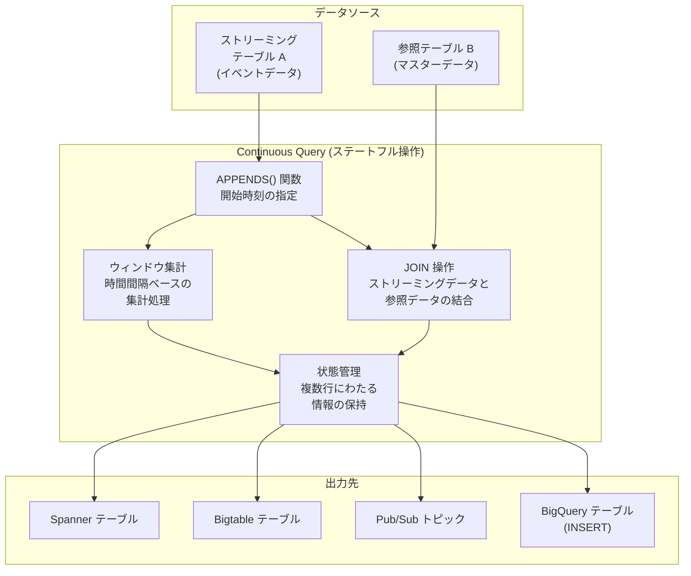

# BigQuery: Continuous Queries でのステートフル操作のサポート (JOIN / ウィンドウ集計)

**リリース日**: 2026-04-09

**サービス**: BigQuery

**機能**: Continuous Queries におけるステートフル操作 (JOIN およびウィンドウ集計)

**ステータス**: Preview

[このアップデートのインフォグラフィックを見る](https://takech9203.github.io/google-cloud-news-summary/20260409-bigquery-continuous-queries-stateful.html)

## 概要

BigQuery の Continuous Queries (継続クエリ) において、ステートフル操作が Preview として利用可能になりました。これにより、JOIN 操作やウィンドウ集計関数を使用して、複数の行や時間間隔にわたる情報を保持しながら複雑なリアルタイム分析を実行できるようになります。

Continuous Queries は、BigQuery に取り込まれたデータをリアルタイムで継続的に処理する SQL ステートメントです。これまでは各行を独立して処理するステートレスな操作のみがサポートされており、JOIN、集計関数、ウィンドウ関数といった複数行にまたがる状態管理を必要とする操作は明示的に制限事項として記載されていました。今回のアップデートにより、この制限が緩和され、ストリーミングデータに対してより高度な分析パターンを BigQuery 内で直接実行できるようになります。

この機能は、リアルタイムのデータエンリッチメント、ストリーミング集計、複数ソースのデータ結合といったユースケースを持つデータエンジニアやアナリストにとって重要なアップデートです。従来は Dataflow などの専用ストリーミング処理基盤が必要だったワークロードの一部を、BigQuery の SQL だけで実現できる可能性が広がります。

**アップデート前の課題**

- Continuous Queries はステートレスな処理のみをサポートしており、JOIN 操作が使用できなかった
- 集計関数 (GROUP BY、HAVING など) やウィンドウ関数を Continuous Queries 内で使用できなかった
- ストリーミングデータの結合や時間ウィンドウベースの集計を行うには、Dataflow などの別途ストリーミング処理基盤を構築する必要があった
- リアルタイムデータに対するマスターデータの結合 (エンリッチメント) を BigQuery 単体で実現できなかった

**アップデート後の改善**

- Continuous Queries 内で JOIN 操作が利用可能になり、ストリーミングデータと参照テーブルの結合がリアルタイムで実行できるようになった
- ウィンドウ集計を使用して、時間間隔に基づくリアルタイム集計処理が可能になった
- 複数行にまたがる状態を保持する複雑な分析ロジックを、BigQuery の SQL で直接記述できるようになった
- Dataflow を別途構築することなく、より多くのストリーミング分析パターンを BigQuery 内で完結できるようになった

## アーキテクチャ図



Continuous Query のステートフル操作では、APPENDS 関数で取得したストリーミングデータに対して JOIN やウィンドウ集計を適用し、複数行にわたる状態を保持しながらリアルタイム処理を実行します。処理結果は BigQuery テーブル、Pub/Sub、Bigtable、Spanner のいずれかに出力できます。

## サービスアップデートの詳細

### 主要機能

1. **JOIN 操作のサポート**
   - Continuous Queries 内でストリーミングデータと他のテーブルを JOIN で結合可能
   - ストリーミングイベントデータにマスターデータを付加するリアルタイムエンリッチメントが実現可能
   - 複数のストリーミングソースを結合した複合的なリアルタイム分析に対応

2. **ウィンドウ集計 (Windowing Aggregations) のサポート**
   - 時間間隔に基づくデータの集計処理が可能
   - タンブリングウィンドウ (固定長の非重複時間間隔) やホッピングウィンドウ (重複する時間間隔) など、一般的なストリーミングウィンドウパターンへの対応が期待される
   - GROUP BY 句や集計関数と組み合わせたリアルタイム集約処理

3. **状態管理 (Stateful Processing)**
   - 複数の行にわたる情報を保持しながら処理を実行
   - 時間間隔をまたいだデータの蓄積と分析が可能
   - BigQuery のマネージドインフラ上で状態管理が自動的に行われるため、ユーザーが状態ストアを管理する必要がない

## 技術仕様

### Continuous Queries の基本仕様

| 項目 | 詳細 |
|------|------|
| ステータス | Preview (ステートフル操作) |
| 必要エディション | Enterprise または Enterprise Plus |
| 課金モデル | Capacity compute pricing (スロット課金) |
| ジョブタイプ | CONTINUOUS |
| 最大実行時間 (ユーザーアカウント) | 2 日間 |
| 最大実行時間 (サービスアカウント) | 150 日間 |
| 最大スロット数 (リザベーション) | 500 スロット (上限引き上げリクエスト可能) |

### 既存のサポート済み操作 (GA)

| 操作 | 説明 |
|------|------|
| INSERT ステートメント | BigQuery テーブルへのデータ書き込み |
| EXPORT DATA (Pub/Sub) | Pub/Sub トピックへのデータエクスポート |
| EXPORT DATA (Bigtable) | Bigtable テーブルへのデータエクスポート |
| EXPORT DATA (Spanner) | Spanner テーブルへのデータエクスポート |
| AI/ML 関数 | AI.GENERATE, AI.GENERATE_TEXT, ML.UNDERSTAND_TEXT, ML.TRANSLATE |
| APPENDS 関数 | 開始時刻を指定した継続的データ処理 |
| ステートレス関数 | 変換関数など行単位の独立した処理 |

### 新規サポート操作 (Preview)

| 操作 | 説明 |
|------|------|
| JOIN 操作 | 複数テーブルの結合 |
| ウィンドウ集計 | 時間間隔に基づく集計処理 |

## 設定方法

### 前提条件

1. BigQuery Enterprise または Enterprise Plus エディションのリザベーションが作成済みであること
2. CONTINUOUS ジョブタイプのリザベーション割り当てが設定済みであること
3. `roles/bigquery.admin` または適切な IAM ロールが付与されていること

### 手順

#### ステップ 1: Enterprise リザベーションの作成

```bash
# Enterprise エディションのリザベーションを作成
bq mk --reservation \
  --project_id=PROJECT_ID \
  --location=LOCATION \
  --reservation_id=continuous_reservation \
  --slots=100 \
  --edition=ENTERPRISE
```

リザベーションは最大 500 スロットまで設定可能です。オートスケーリングを利用する場合はベースラインまたはオートスケール設定を 0 より大きい値に設定してください。

#### ステップ 2: CONTINUOUS ジョブタイプのリザベーション割り当てを作成

```bash
# CONTINUOUS ジョブタイプの割り当てを作成
bq mk --reservation_assignment \
  --project_id=PROJECT_ID \
  --location=LOCATION \
  --reservation_id=continuous_reservation \
  --assignee_id=PROJECT_ID \
  --assignee_type=PROJECT \
  --job_type=CONTINUOUS
```

#### ステップ 3: ステートフル操作を含む Continuous Query の実行

```bash
# bq コマンドで Continuous Query を実行
bq query --use_legacy_sql=false --continuous=true \
  'INSERT INTO `myproject.dataset.enriched_events`
   SELECT
     e.event_id,
     e.event_timestamp,
     e.user_id,
     u.user_name,
     u.segment
   FROM APPENDS(
     TABLE `myproject.dataset.raw_events`,
     CURRENT_TIMESTAMP() - INTERVAL 10 MINUTE
   ) AS e
   JOIN `myproject.dataset.users` AS u
     ON e.user_id = u.user_id'
```

この例では、ストリーミングで取り込まれるイベントデータとユーザーマスターテーブルを JOIN し、エンリッチメントされたデータを BigQuery テーブルに継続的に書き込みます。

#### ステップ 4: Google Cloud コンソールでの実行

1. Google Cloud コンソールで BigQuery ページを開く
2. クエリエディタの設定 (More) をクリック
3. 「Choose query mode」セクションで「Continuous query」を選択
4. ステートフル操作を含む SQL を入力
5. 「Run」をクリック

## メリット

### ビジネス面

- **ストリーミング分析基盤の簡素化**: Dataflow などの別途ストリーミング処理基盤を構築せずに、BigQuery の SQL だけでリアルタイム JOIN やウィンドウ集計を実現でき、アーキテクチャの複雑さとコストを削減
- **リアルタイムインサイトの迅速な獲得**: ストリーミングデータに対してマスターデータを即座に結合し、エンリッチメントされた情報をリアルタイムで下流のシステムに提供可能
- **SQL スキルの活用**: BigQuery の標準 SQL を使用するため、既存の SQL スキルを持つアナリストやエンジニアがストリーミング処理を実装でき、専門的なストリーミングフレームワークの学習コストを削減

### 技術面

- **マネージドな状態管理**: BigQuery が状態の管理を自動的に行うため、ユーザーが状態ストアの運用やスケーリングを行う必要がない
- **既存の BigQuery エコシステムとの統合**: リザベーション、オートスケーリング、アイドルスロット共有など、既存の BigQuery リソース管理機能がそのまま利用可能
- **多様な出力先**: JOIN やウィンドウ集計の結果を BigQuery テーブル、Pub/Sub、Bigtable、Spanner に出力でき、リバース ETL やイベント駆動アーキテクチャに対応

## デメリット・制約事項

### 制限事項

- Preview 段階であり、SLA の適用対象外。本番ワークロードでの利用には注意が必要
- オンデマンド課金モデルではサポートされず、Enterprise または Enterprise Plus エディションのリザベーションが必須
- CONTINUOUS リザベーション割り当ては最大 500 スロットに制限されている (上限引き上げは bq-continuous-queries-feedback@google.com に問い合わせ)
- ユーザーアカウントで実行した場合の最大実行時間は 2 日間に制限される
- 実行中の Continuous Query の SQL を変更することはできない
- 出力ウォーターマークラグが 48 時間を超えるとジョブが失敗する

### 考慮すべき点

- 一時的な問題により自動的な再処理が行われる可能性があり、出力に重複データが含まれることがある。下流システムでの冪等性処理を考慮する必要がある
- Bigtable、Spanner、Pub/Sub のロケーションエンドポイントへのエクスポートでは、BigQuery データセットと同じリージョンのリソースのみ対象となる制限がある
- 列レベルおよび行レベルのセキュリティ機能はサポートされていない
- Preview 段階の機能であるため、GA に向けて仕様が変更される可能性がある

## ユースケース

### ユースケース 1: リアルタイムデータエンリッチメント

**シナリオ**: EC サイトのクリックストリームデータがストリーミングで BigQuery に取り込まれている。このイベントデータにユーザー属性情報や商品マスター情報を JOIN で付加し、リアルタイムでエンリッチメントされたデータを下流システムに提供したい。

**実装例**:
```sql
INSERT INTO `myproject.analytics.enriched_clickstream`
SELECT
  c.event_id,
  c.event_timestamp,
  c.user_id,
  u.user_segment,
  u.registration_date,
  c.product_id,
  p.product_name,
  p.category
FROM APPENDS(
  TABLE `myproject.analytics.raw_clickstream`,
  CURRENT_TIMESTAMP() - INTERVAL 10 MINUTE
) AS c
JOIN `myproject.master.users` AS u
  ON c.user_id = u.user_id
JOIN `myproject.master.products` AS p
  ON c.product_id = p.product_id
```

**効果**: Dataflow パイプラインを構築せずに、BigQuery SQL だけでリアルタイムのデータエンリッチメントが実現でき、分析用のデータが即座に利用可能になる。

### ユースケース 2: リアルタイムウィンドウ集計によるモニタリング

**シナリオ**: IoT センサーから継続的に取り込まれる温度・湿度データを一定時間ごとに集計し、異常検知やダッシュボード表示用のデータを生成したい。

**効果**: ウィンドウ集計を使用して、例えば 5 分間隔のタンブリングウィンドウで平均温度や最大値を計算し、Bigtable や Pub/Sub に出力することで、リアルタイムのモニタリングパイプラインを BigQuery 内で完結できる。

### ユースケース 3: ストリーミング JOIN による不正検知

**シナリオ**: 金融取引データがリアルタイムで BigQuery に取り込まれている。取引データとブラックリストテーブルを JOIN し、疑わしい取引をリアルタイムで検出して Pub/Sub 経由でアラートシステムに通知したい。

**実装例**:
```sql
EXPORT DATA OPTIONS (
  format = 'CLOUD_PUBSUB',
  uri = 'https://pubsub.googleapis.com/projects/myproject/topics/fraud-alerts'
) AS (
  SELECT TO_JSON_STRING(
    STRUCT(t.transaction_id, t.amount, t.timestamp, b.risk_level)
  ) AS message
  FROM APPENDS(
    TABLE `myproject.finance.transactions`,
    CURRENT_TIMESTAMP() - INTERVAL 5 MINUTE
  ) AS t
  JOIN `myproject.finance.blacklist` AS b
    ON t.account_id = b.account_id
  WHERE t.amount > 10000
)
```

**効果**: 取引データとブラックリストのリアルタイム結合により、不正取引の検知レイテンシを大幅に短縮。従来は Dataflow で構築していた不正検知パイプラインを BigQuery SQL で簡潔に実装可能。

## 料金

Continuous Queries は BigQuery の Capacity compute pricing (スロットベースの課金) を使用します。ステートフル操作を含む場合も同様のスロット課金モデルが適用されます。

### 必要なリザベーション

| エディション | スロット単価 (Pay-As-You-Go) | スロット単価 (1 年コミットメント) | スロット単価 (3 年コミットメント) |
|--------|-----------------|-----------------|-----------------|
| Enterprise | $0.06/スロット時間 | $0.04/スロット時間 | $0.03/スロット時間 |
| Enterprise Plus | $0.10/スロット時間 | $0.064/スロット時間 | $0.048/スロット時間 |

Continuous Query はアイドル状態でも最低約 1 スロットを消費します。オートスケーリングにより、ワークロードに応じてスロット数が動的に調整されます。その他、データの取り込み (ストレージ書き込み API など) やストレージ料金は通常の BigQuery 料金が適用されます。出力先サービス (Pub/Sub、Bigtable、Spanner) の利用料金は各サービスの料金体系に従います。

## 利用可能リージョン

BigQuery Continuous Queries がサポートされているリージョンで利用可能です。詳細は [BigQuery continuous query locations](https://cloud.google.com/bigquery/docs/locations#continuous-query-loc) を参照してください。

## 関連サービス・機能

- **[BigQuery Continuous Queries (GA 機能)](https://cloud.google.com/bigquery/docs/continuous-queries-introduction)**: 今回のステートフル操作の基盤となる継続クエリ機能。ステートレス操作、AI/ML 関数、APPENDS 関数などは GA として提供済み
- **[Dataflow](https://cloud.google.com/dataflow)**: Apache Beam ベースのフルマネージドストリーミング/バッチ処理サービス。より高度なストリーミング処理パターン (セッションウィンドウ、カスタムウォーターマークなど) が必要な場合の選択肢
- **[Pub/Sub](https://cloud.google.com/pubsub)**: Continuous Queries の出力先の 1 つ。イベント駆動アーキテクチャやダウンストリームアプリケーションとの連携に使用
- **[Bigtable](https://cloud.google.com/bigtable)**: 低レイテンシのアプリケーションサービング向け出力先。リバース ETL のパターンで使用
- **[Spanner](https://cloud.google.com/spanner)**: グローバル分散データベースへのリアルタイムデータエクスポート先

## 参考リンク

- [インフォグラフィック](https://takech9203.github.io/google-cloud-news-summary/20260409-bigquery-continuous-queries-stateful.html)
- [公式リリースノート](https://docs.cloud.google.com/release-notes#April_09_2026)
- [Continuous Queries のステートフル操作 (ドキュメント)](https://docs.cloud.google.com/bigquery/docs/continuous-queries-introduction#supported_stateful_operations)
- [Continuous Queries の概要](https://cloud.google.com/bigquery/docs/continuous-queries-introduction)
- [Continuous Queries の作成](https://cloud.google.com/bigquery/docs/continuous-queries)
- [BigQuery エディションの概要](https://cloud.google.com/bigquery/docs/editions-intro)
- [料金ページ](https://cloud.google.com/bigquery/pricing)

## まとめ

BigQuery Continuous Queries におけるステートフル操作 (JOIN およびウィンドウ集計) のサポートは、BigQuery のリアルタイム処理能力を大幅に拡張する重要なアップデートです。これまで明示的にサポート対象外とされていた JOIN や集計関数が Preview として利用可能になったことで、Dataflow などの別途ストリーミング基盤を構築せずに、BigQuery の SQL だけでより多くのリアルタイム分析パターンを実現できるようになります。Enterprise または Enterprise Plus エディションのリザベーションが必要ですが、リアルタイムデータエンリッチメントやストリーミング集計のニーズがあるチームは、Preview 段階のうちに検証を開始することを推奨します。

---

**タグ**: #BigQuery #ContinuousQueries #ステートフル操作 #JOIN #ウィンドウ集計 #ストリーミング分析 #リアルタイム処理 #Preview #データエンリッチメント #リバースETL
