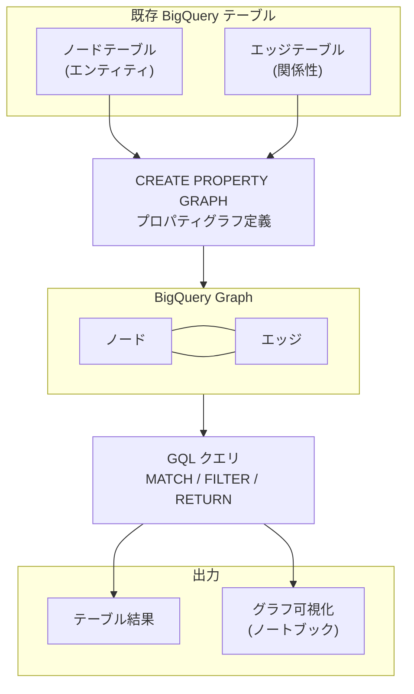

# BigQuery: BigQuery Graph (GQL によるグラフ分析)

**リリース日**: 2026-04-09

**サービス**: BigQuery

**機能**: BigQuery Graph

**ステータス**: Preview

[このアップデートのインフォグラフィックを見る](https://takech9203.github.io/google-cloud-news-summary/20260409-bigquery-graph-preview.html)

## 概要

BigQuery Graph は、BigQuery の分析能力を活用して大規模なグラフ分析を実行するための新機能である。既存の BigQuery テーブルに格納されたエンティティとエンティティ間の関係性データを、グラフ (ノードとエッジ) としてモデル化し、Graph Query Language (GQL) を使用して複雑な隠れた関係性を発見できる。

BigQuery Graph の最大の特徴は、既存のワークフローを変更したりデータを複製したりする必要がない点である。テーブルに格納されたエンティティと関係性から直接グラフを作成し、ISO GQL 標準および ISO Property Graph Queries (SQL/PGQ) 標準に準拠したクエリインターフェースで分析を行う。SQL の確立された機能とグラフパターンマッチングの表現力を組み合わせることで、リレーショナルモデルとグラフモデルの完全な相互運用性を実現している。

この機能は、不正検出、レコメンデーション、コミュニティ検出、ナレッジグラフ、顧客プロファイル、データカタログ、リネージトラッキングなどのユースケースに適している。

**アップデート前の課題**

- グラフデータがテーブルとして表現されている場合、関係性の探索にはセルフジョインや再帰ジョインが必要だった
- SQL でグラフ探索ロジックを表現すると複雑なクエリとなり、記述・保守・デバッグが困難だった
- グラフ分析のために専用のグラフデータベースへのデータ複製 (ETL) が必要で、運用オーバーヘッドが発生していた
- 大規模データに対するグラフ分析のスケーラビリティに課題があった

**アップデート後の改善**

- 既存の BigQuery テーブルから直接グラフを作成でき、データの複製や変換が不要になった
- GQL を使用することで、複雑な関係性の探索を直感的かつ簡潔に記述できるようになった
- BigQuery のスケーラブルな分散分析エンジンによりグラフ分析を大規模に実行できるようになった
- ノートブック環境でグラフスキーマやクエリ結果を視覚的に確認できるようになった
- Spanner Graph との統合により、運用グラフワークロードと分析グラフワークロードをシームレスに連携できるようになった

## アーキテクチャ図



BigQuery Graph では、既存のテーブルからプロパティグラフを定義し、GQL でクエリを実行する。結果はテーブル形式またはノートブック上のグラフ可視化として確認できる。

## サービスアップデートの詳細

### 主要機能

1. **ISO GQL 標準準拠のクエリインターフェース**
   - ISO GQL 標準および ISO Property Graph Queries (SQL/PGQ) 標準に準拠
   - MATCH、FILTER、RETURN、LET、LIMIT、ORDER BY、NEXT などのステートメントをサポート
   - 集合演算 (UNION ALL など) によるクエリの組み合わせが可能

2. **既存テーブルからのグラフ作成**
   - `CREATE PROPERTY GRAPH` DDL でノードテーブルとエッジテーブルを定義
   - 既存データの複製不要。テーブルを直接参照してグラフを構成
   - ラベルやプロパティのカスタマイズが可能

3. **グラフ可視化**
   - BigQuery Studio、Google Colab、Jupyter Notebook で可視化に対応
   - `%%bigquery --graph` マジックコマンドでクエリ結果をグラフ形式で表示
   - グラフスキーマの可視化にも対応し、ノード・エッジ・ラベル・プロパティの構造を確認可能
   - ノードやエッジをクリックしてプロパティ、近傍ノード、接続関係を詳細表示

4. **ビルトイン検索機能**
   - ベクトル検索およびフルテキスト検索をグラフと統合
   - セマンティック検索やキーワード検索をグラフ分析に活用可能

5. **Spanner Graph との統合**
   - BigQuery Graph と Spanner Graph は同一のグラフスキーマとクエリ言語を共有
   - Spanner での運用グラフワークロードと BigQuery での複雑なグラフ分析を、データの再モデリングやクエリ変換なしに連携可能

## 技術仕様

### GQL の主要ステートメント

| ステートメント | 概要 |
|------|------|
| `GRAPH` | クエリ対象のプロパティグラフを指定 |
| `MATCH` | グラフパターンに一致するデータを検索 |
| `FILTER` | 条件に基づいて結果をフィルタリング |
| `RETURN` | 線形クエリステートメントの終端。結果を返す |
| `LET` | 変数を定義し、後続クエリで使用する値を代入 |
| `WITH` | 指定カラムのみを後続に渡す (フィルタリング・リネーム可能) |
| `NEXT` | 複数の線形クエリステートメントをチェーン接続 |
| `ORDER BY` | クエリ結果をソート |
| `LIMIT` / `OFFSET` | 結果件数の制限およびスキップ |
| Set operations | `UNION ALL` 等で複数クエリを結合 |

### グラフスキーマ定義

```sql
-- ノードテーブルとエッジテーブルの作成
CREATE OR REPLACE TABLE graph_db.Person (
  id INT64,
  name STRING,
  birthday TIMESTAMP,
  country STRING,
  city STRING,
  PRIMARY KEY (id) NOT ENFORCED
);

CREATE OR REPLACE TABLE graph_db.Account (
  id INT64,
  create_time TIMESTAMP,
  is_blocked BOOL,
  nick_name STRING,
  PRIMARY KEY (id) NOT ENFORCED
);

CREATE OR REPLACE TABLE graph_db.PersonOwnAccount (
  id INT64 NOT NULL,
  account_id INT64 NOT NULL,
  create_time TIMESTAMP,
  PRIMARY KEY (id, account_id) NOT ENFORCED,
  FOREIGN KEY (id) REFERENCES graph_db.Person(id) NOT ENFORCED,
  FOREIGN KEY (account_id) REFERENCES graph_db.Account(id) NOT ENFORCED
);

-- プロパティグラフの定義
CREATE OR REPLACE PROPERTY GRAPH graph_db.FinGraph
  NODE TABLES (
    graph_db.Account,
    graph_db.Person
  )
  EDGE TABLES (
    graph_db.PersonOwnAccount
      SOURCE KEY (id) REFERENCES Person(id)
      DESTINATION KEY (account_id) REFERENCES Account(id)
      LABEL Owns
  );
```

### 必要な IAM ロール

| 操作 | 必要なロール |
|------|------|
| グラフの作成・クエリ | BigQuery Data Editor (`roles/bigquery.dataEditor`) |

## 設定方法

### 前提条件

1. Enterprise または Enterprise Plus エディションの BigQuery リザベーションが必要
2. BigQuery Data Editor (`roles/bigquery.dataEditor`) ロールが付与されていること
3. ノードテーブルとエッジテーブルを格納するデータセットが存在すること

### 手順

#### ステップ 1: データセットの作成

```sql
CREATE SCHEMA IF NOT EXISTS graph_db;
```

#### ステップ 2: ノードテーブルとエッジテーブルの作成

エンティティを表すノードテーブルと、エンティティ間の関係を表すエッジテーブルを作成する。主キーと外部キーを `NOT ENFORCED` で定義する。

#### ステップ 3: プロパティグラフの作成

```sql
CREATE OR REPLACE PROPERTY GRAPH graph_db.FinGraph
  NODE TABLES (
    graph_db.Account,
    graph_db.Person
  )
  EDGE TABLES (
    graph_db.PersonOwnAccount
      SOURCE KEY (id) REFERENCES Person(id)
      DESTINATION KEY (account_id) REFERENCES Account(id)
      LABEL Owns
  );
```

#### ステップ 4: GQL によるクエリ実行

```sql
GRAPH graph_db.FinGraph
MATCH (p:Person)-[o:Owns]->(a:Account)
FILTER p.birthday < '1990-01-10'
RETURN p.name
```

#### ステップ 5: ノートブックでの可視化 (オプション)

```python
# BigQuery magics ライブラリのインストール
!pip install bigquery_magics==0.12.1

# グラフクエリの実行と可視化
%%bigquery --graph
GRAPH graph_db.FinGraph
MATCH p = ((person:Person {name: "Dana"})-[own:Owns]->(account:Account)
  -[transfer:Transfers]->(account2:Account)<-[own2:Owns]-(person2:Person))
RETURN TO_JSON(p) AS path;
```

## メリット

### ビジネス面

- **データサイロの解消**: リレーショナルデータとグラフデータを統一プラットフォームで分析でき、ETL パイプラインの構築・運用が不要
- **迅速な不正検出**: 金融取引における複雑な関係性パターンを GQL で直感的に検出でき、不正対応のスピードが向上
- **顧客理解の深化**: 顧客の関係性・購買履歴・嗜好をグラフとして可視化し、パーソナライズされたマーケティングや推薦に活用可能

### 技術面

- **クエリの簡素化**: SQL での再帰ジョインやセルフジョインが GQL のパターンマッチングに置き換わり、クエリの可読性と保守性が大幅に向上
- **スケーラビリティ**: BigQuery の分散分析エンジンを活用するため、大規模グラフデータに対しても高いパフォーマンスを実現
- **Spanner Graph との互換性**: スキーマとクエリ言語が共通のため、OLTP (Spanner) と分析 (BigQuery) のグラフワークロードをシームレスに連携可能
- **標準準拠**: ISO GQL / SQL/PGQ 標準に準拠しており、他のグラフデータベースとの知識の移行が容易

## デメリット・制約事項

### 制限事項

- Preview 段階のため、サポートが限定的であり、SLA の対象外
- Enterprise または Enterprise Plus エディションのリザベーションが必要 (Standard エディションやオンデマンド課金では利用不可)
- グラフ可視化で表示可能なデータ量は最大 2 MB まで
- 可視化には `TO_JSON` 関数を使用してグラフ要素を JSON 形式で返す必要がある

### 考慮すべき点

- Preview 機能のため、GA までにインターフェースや動作が変更される可能性がある
- サポートやフィードバックは bq-graph-preview-support@google.com への連絡が必要
- 個別のノードやエッジではなくパス (グラフパス) を返すことで、可視化の完全性が向上する

## ユースケース

### ユースケース 1: 金融不正検出

**シナリオ**: 銀行が口座間の送金パターンを分析し、マネーロンダリングや不正な資金移動を検出する

**実装例**:
```sql
GRAPH graph_db.FinGraph
MATCH (a:Account {is_blocked: TRUE})
RETURN a
UNION ALL
MATCH (a:Account)<-[:Owns]-(p:Person {id: 2})
RETURN a
NEXT
MATCH (a:Account)-[t:Transfers]->(oa:Account)
WITH DISTINCT oa
RETURN oa.nick_name
```

**効果**: 複雑な送金ネットワークにおける不審なパターンを、SQL の再帰クエリよりも直感的かつ効率的に検出できる

### ユースケース 2: 顧客 360 レコメンデーション

**シナリオ**: EC サイトで顧客の購買履歴・関係性・嗜好をグラフとしてモデル化し、パーソナライズされた商品推薦を実現する

**効果**: 顧客とその購買行動、関連する顧客群の関係性をグラフパターンマッチングで分析し、類似顧客の購買傾向に基づいたレコメンデーションが可能になる

### ユースケース 3: サプライチェーントレーサビリティ

**シナリオ**: 製造業で部品、サプライヤー、注文、可用性、欠陥情報をグラフとしてモデル化し、影響分析やコンプライアンスチェックを実行する

**効果**: 特定の部品に欠陥が発見された場合、その部品を使用するすべての製品と影響範囲をグラフ探索で迅速に特定できる

## 料金

BigQuery Graph は BigQuery の標準的なキャパシティベースの料金モデルに従い、コンピューティングとストレージの使用量に応じて課金される。

### コンピューティング

BigQuery Graph を使用するには、Enterprise または Enterprise Plus エディションのリザベーションが必要。グラフクエリはスロットで計測される BigQuery のキャパシティコンピューティング料金で課金される。

### ストレージ

グラフの定義に使用する基盤テーブルのストレージに対してのみ課金される。同じテーブル上に複数のグラフモデルを構築しても、ストレージ料金は 1 回分のみ。料金は BigQuery の標準ストレージ料金 (アクティブストレージまたは長期ストレージ) に従う。

詳細は [BigQuery 料金ページ](https://cloud.google.com/bigquery/pricing) を参照。

## 関連サービス・機能

- **Spanner Graph**: BigQuery Graph と同一のグラフスキーマ・クエリ言語を共有。運用ワークロード (OLTP) は Spanner、分析ワークロードは BigQuery で実行可能
- **BigQuery ML**: BigQuery 内での機械学習機能。グラフ分析の結果を ML ワークフローに統合可能
- **BigQuery Studio**: ノートブック環境でのグラフ可視化やインタラクティブな分析に対応
- **Google Colab / Jupyter Notebook**: BigQuery Graph の可視化をサポートするノートブック環境

## 参考リンク

- [インフォグラフィック](https://takech9203.github.io/google-cloud-news-summary/20260409-bigquery-graph-preview.html)
- [公式リリースノート](https://docs.cloud.google.com/release-notes#April_09_2026)
- [BigQuery Graph 概要](https://docs.cloud.google.com/bigquery/docs/graph-overview)
- [グラフの作成とクエリ](https://docs.cloud.google.com/bigquery/docs/graph-create)
- [GQL 概要](https://docs.cloud.google.com/bigquery/docs/reference/standard-sql/graph-intro)
- [グラフの可視化](https://docs.cloud.google.com/bigquery/docs/graph-visualization)
- [BigQuery 料金](https://cloud.google.com/bigquery/pricing)

## まとめ

BigQuery Graph は、既存の BigQuery テーブルデータをグラフとしてモデル化し、ISO GQL 標準に準拠したクエリ言語で大規模なグラフ分析を可能にする画期的な機能である。データの複製や ETL が不要で、リレーショナルモデルとグラフモデルの完全な相互運用性を提供する点が最大の強みである。不正検出、顧客分析、サプライチェーン管理など幅広いユースケースに対応しており、Preview 段階ではあるが、Enterprise / Enterprise Plus エディションを利用している組織はぜひ評価を開始することを推奨する。

---

**タグ**: #BigQuery #BigQueryGraph #GQL #GraphQueryLanguage #GraphAnalysis #Preview #PropertyGraph #DataAnalytics
