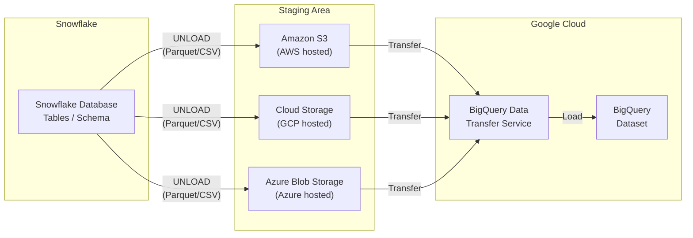

# BigQuery: Data Transfer Service - Snowflake からのデータ転送が GA に

**リリース日**: 2026-04-09

**サービス**: BigQuery

**機能**: BigQuery Data Transfer Service - Snowflake データ転送コネクタ GA

**ステータス**: GA (一般提供)

[このアップデートのインフォグラフィックを見る](https://takech9203.github.io/google-cloud-news-summary/20260409-bigquery-snowflake-data-transfer-ga.html)

## 概要

BigQuery Data Transfer Service の Snowflake コネクタが一般提供 (GA) となりました。この機能により、Snowflake から BigQuery への実データの転送をスケジュールベースで自動化できるようになります。これは 2026 年 4 月 2 日に GA となった SQL 翻訳機能 (BigQuery Migration Service) とは異なり、Snowflake のテーブルデータそのものを BigQuery に移行するための機能です。

Snowflake コネクタは、Snowflake がホストされているクラウドプロバイダ (AWS、Google Cloud、Azure) に応じて、それぞれのストレージサービスをステージングエリアとして使用し、データを BigQuery に転送します。AWS ホストの場合は Amazon S3、Google Cloud ホストの場合は Cloud Storage、Azure ホストの場合は Azure Blob Storage がステージングバケットとして利用されます。

この GA リリースにより、Snowflake から BigQuery への移行を計画している企業は、本番環境で SLA に基づいた安定したデータ転送パイプラインを構築できるようになりました。スキーマの自動検出、インクリメンタル転送、プライベート接続、CMEK 暗号化など、エンタープライズグレードの機能が揃っています。

**アップデート前の課題**

- Snowflake コネクタはプレビュー段階であり、本番環境での利用に制約があった
- Snowflake から BigQuery へのデータ移行には、手動でのエクスポート・インポート作業や、サードパーティ ETL ツールの導入が必要だった
- データ転送のスケジューリングや増分転送の仕組みを自前で構築する必要があった

**アップデート後の改善**

- Snowflake データ転送コネクタが GA となり、SLA に基づいた本番ワークロードでの利用が可能になった
- BigQuery Data Transfer Service による自動スケジューリングとマネージドな転送パイプラインが利用可能になった
- インクリメンタル転送やスキーマ自動検出により、継続的なデータ同期が容易になった

## アーキテクチャ図



Snowflake のホスティング環境に応じて、対応するクラウドストレージがステージングエリアとして使用されます。データは Snowflake からステージングバケットにエクスポートされた後、BigQuery Data Transfer Service によって BigQuery データセットにロードされます。

## サービスアップデートの詳細

### 主要機能

1. **マルチクラウド対応のステージング**
   - AWS ホストの Snowflake: Amazon S3 バケットをステージングに使用
   - Google Cloud ホストの Snowflake: Cloud Storage バケットをステージングに使用
   - Azure ホストの Snowflake: Azure Blob Storage コンテナをステージングに使用
   - いずれの環境でも BigQuery Data Transfer Service が統一的にデータ転送を管理

2. **スキーマ自動検出とマッピング**
   - BigQuery Data Transfer Service によるスキーマの自動検出機能を提供
   - Snowflake のデータ型から BigQuery のデータ型への自動マッピング
   - 翻訳エンジンを使用した手動でのスキーマ定義も可能

3. **インクリメンタル転送**
   - 初回のフル転送後、変更があったデータのみを転送する増分転送をサポート
   - 継続的なデータ同期パイプラインの構築が可能

4. **プライベート接続**
   - パブリック IP を使用しないプライベートな Snowflake データ転送に対応
   - ネットワークポリシーの設定によるセキュアな接続

5. **CMEK (顧客管理暗号鍵) サポート**
   - 転送データに対する顧客管理暗号鍵 (CMEK) の適用が可能
   - BigQuery 宛先テーブルおよび中間 Cloud Storage テナントバケットの両方を CMEK で暗号化
   - プロジェクトデフォルトキーもサポート

## 技術仕様

### 対応環境とデータ形式

| 項目 | 詳細 |
|------|------|
| Snowflake ホスティング | AWS、Google Cloud、Azure |
| ステージング形式 | Parquet (デフォルト)、CSV (Amazon S3 経由の場合) |
| 認証方式 | キーペア認証 (推奨)、パスワード認証は非推奨 |
| 転送単位 | 単一の Snowflake データベースおよびスキーマ内のテーブル |
| 最大ロードジョブサイズ | テーブルあたりデフォルト 15 TB |
| 暗号化 | CMEK サポートあり |

### 制限事項

| 項目 | 詳細 |
|------|------|
| データベース・スキーマ | 1 回の転送で単一のデータベースおよびスキーマのみ対応 |
| 未サポートデータ型 | TIMESTAMP_TZ、TIMESTAMP_LTZ (Parquet 形式の制約) |
| 転送速度 | 選択した Snowflake ウェアハウスの性能に依存 |

### 必要な IAM ロール

```
roles/bigquery.admin
```

必要な権限:
- `bigquery.transfers.update`
- `bigquery.transfers.get`
- `bigquery.datasets.get`
- `bigquery.datasets.getIamPolicy`
- `bigquery.datasets.update`
- `bigquery.datasets.setIamPolicy`
- `bigquery.jobs.create`

### Snowflake 側の権限設定例

```sql
-- カスタムロールの作成と権限付与
GRANT USAGE ON WAREHOUSE WAREHOUSE_NAME TO ROLE MIGRATION_ROLE;
GRANT USAGE ON DATABASE DATABASE_NAME TO ROLE MIGRATION_ROLE;
GRANT USAGE ON SCHEMA DATABASE_NAME.SCHEMA_NAME TO ROLE MIGRATION_ROLE;
GRANT SELECT ON TABLE DATABASE_NAME.SCHEMA_NAME.TABLE_NAME TO ROLE MIGRATION_ROLE;
GRANT USAGE ON STORAGE_INTEGRATION_OBJECT_NAME TO ROLE MIGRATION_ROLE;
```

## 設定方法

### 前提条件

1. Google Cloud プロジェクトの作成または選択
2. BigQuery Data Transfer Service の有効化
3. BigQuery データセットの作成 (転送先)
4. ステージング用バケットの準備 (Snowflake ホスティング環境に対応するストレージ)
5. 必要な権限を持つ Snowflake ユーザーの作成
6. ネットワークポリシーの設定 (必要に応じて IP アドレスのアローリスト追加)

### 手順

#### ステップ 1: ステージングバケットの準備

Snowflake のホスティング環境に応じたステージングバケットを作成し、Snowflake からの書き込みアクセスを許可します。

- **AWS ホスト**: Amazon S3 バケットを作成し、ストレージインテグレーションを設定
- **Google Cloud ホスト**: Cloud Storage バケットを作成し、ライフサイクルポリシーの設定を推奨
- **Azure ホスト**: Azure Blob Storage コンテナを作成

#### ステップ 2: Snowflake ユーザーとロールの設定

```sql
-- キーペア認証の設定 (推奨)
-- RSA キーペアを生成し、公開鍵を Snowflake ユーザーに割り当て
-- 詳細: https://docs.snowflake.com/en/user-guide/key-pair-auth
```

Snowflake のパスワードによる単要素認証の非推奨化に伴い、キーペア認証の使用を推奨します。

#### ステップ 3: BigQuery Data Transfer Service で転送を作成

Google Cloud コンソール、bq コマンドラインツール、または BigQuery Data Transfer Service API を使用して転送ジョブを設定します。

以下の情報が必要です:
- Snowflake アカウント識別子 (例: `ACCOUNT_IDENTIFIER.snowflakecomputing.com`)
- Snowflake ユーザー名および秘密鍵
- ステージングバケットの URI
- スキーママッピングファイルの Cloud Storage URI (オプション)

## メリット

### ビジネス面

- **移行コストの削減**: サードパーティ ETL ツールの導入なしで、BigQuery Data Transfer Service のマネージドサービスとして Snowflake データを移行可能
- **移行リスクの低減**: GA ステータスにより SLA が適用され、本番ワークロードでの信頼性が保証される
- **運用負荷の軽減**: スケジュールベースの自動転送により、手動でのデータ移行作業が不要に

### 技術面

- **マルチクラウド対応**: AWS、Google Cloud、Azure のいずれにホストされた Snowflake からも転送可能
- **エンドツーエンド暗号化**: CMEK サポートにより、ステージングエリアから BigQuery 宛先テーブルまで一貫した暗号化が可能
- **増分転送**: インクリメンタル転送により、変更データのみの効率的な同期が実現
- **SQL 翻訳との統合**: 別途 GA となった BigQuery Migration Service の SQL 翻訳機能と組み合わせることで、データとクエリの両方を移行可能

## デメリット・制約事項

### 制限事項

- 1 回の転送ジョブでは、単一の Snowflake データベースおよびスキーマ内のテーブルのみ転送可能。複数のデータベースやスキーマからの転送には個別のジョブ設定が必要
- Parquet 形式では TIMESTAMP_TZ および TIMESTAMP_LTZ データ型がサポートされない。これらのデータ型を含む場合は、Amazon S3 経由で CSV 形式でエクスポートし、BigQuery にインポートする回避策が必要
- テーブルあたりのデフォルトロードジョブ上限は 15 TB (Snowflake 側の圧縮により、実際のデータサイズは Snowflake のレポート値より大きくなる場合がある)

### 考慮すべき点

- Snowflake ウェアハウスとステージングバケットが異なるリージョンにある場合、Snowflake 側でエグレス料金が発生する
- AWS や Azure から Google Cloud へのデータ転送にはクラウド間エグレス料金が適用される
- Amazon S3 の整合性モデルにより、一部のファイルが転送に含まれない可能性がある
- ステージングバケットのストレージコストを最小化するため、ライフサイクルポリシーの設定を推奨

## ユースケース

### ユースケース 1: Snowflake から BigQuery への完全移行

**シナリオ**: 企業がデータウェアハウスを Snowflake から BigQuery に全面移行する場合。BigQuery Migration Service の SQL 翻訳機能でクエリを変換し、Data Transfer Service でデータを転送する包括的な移行パイプラインを構築できます。

**効果**: SQL 翻訳とデータ転送の両方が GA となったことで、エンドツーエンドの移行がマネージドサービスのみで完結し、移行プロジェクトの期間短縮とリスク低減が実現します。

### ユースケース 2: マルチクラウド環境でのデータ集約

**シナリオ**: AWS 上の Snowflake にデータが蓄積されているが、分析基盤を Google Cloud の BigQuery に統合したい場合。Data Transfer Service の Snowflake コネクタを使用して、定期的なデータ転送スケジュールを設定します。

**効果**: サードパーティの ETL ツールを導入することなく、BigQuery Data Transfer Service のみでクロスクラウドのデータ転送を自動化できます。

### ユースケース 3: ハイブリッド分析基盤の構築

**シナリオ**: 当面は Snowflake と BigQuery を併用しつつ、一部のデータを BigQuery に同期して Google Cloud の AI/ML サービス (Vertex AI など) と連携したい場合。インクリメンタル転送を活用して、必要なデータのみを継続的に BigQuery に同期します。

**効果**: インクリメンタル転送により、変更データのみを効率的に同期し、BigQuery 上で最新データを活用した分析や ML パイプラインを構築できます。

## 料金

BigQuery Data Transfer Service の料金については、[BigQuery 料金ページ](https://cloud.google.com/bigquery/pricing#data-transfer-service-pricing)を参照してください。

追加で発生する可能性のあるコスト:

| 項目 | 詳細 |
|------|------|
| Snowflake エグレス料金 | Snowflake ウェアハウスとステージングバケットが異なるリージョンの場合に発生 |
| クラウド間エグレス料金 | AWS/Azure から Google Cloud へのデータ転送時に発生 |
| ステージングバケットストレージ | ステージングバケットのデータ保存に対する各クラウドプロバイダのストレージ料金 |
| BigQuery ストレージ | 転送後のデータに対する標準の BigQuery ストレージ料金 |
| BigQuery クエリ | 転送後のデータに対する標準の BigQuery クエリ料金 |

## 利用可能リージョン

BigQuery Data Transfer Service はマルチリージョンリソースであり、BigQuery がサポートするすべてのリージョンおよびマルチリージョンで利用可能です。転送構成は宛先データセットと同じロケーションに設定されます。詳細は [BigQuery のデータセットロケーション](https://docs.cloud.google.com/bigquery/docs/locations#supported_locations)を参照してください。

## 関連サービス・機能

- **[BigQuery Migration Service (SQL 翻訳)](https://docs.cloud.google.com/bigquery/docs/migration-intro)**: Snowflake SQL から GoogleSQL への SQL 翻訳機能。データ転送と組み合わせてエンドツーエンドの移行を実現
- **[BigQuery Data Transfer Service](https://docs.cloud.google.com/bigquery/docs/dts-introduction)**: BigQuery へのデータ転送を自動化するマネージドサービス。Snowflake 以外にも多数のデータソースに対応
- **[Data Validation Tool](https://github.com/GoogleCloudPlatform/professional-services-data-validator)**: 移行後のソースと宛先テーブルの整合性検証ツール
- **[BigQuery Migration Assessment](https://docs.cloud.google.com/bigquery/docs/migration-assessment)**: データウェアハウス移行の評価・計画ツール

## 参考リンク

- [インフォグラフィック](https://takech9203.github.io/google-cloud-news-summary/20260409-bigquery-snowflake-data-transfer-ga.html)
- [公式リリースノート](https://docs.cloud.google.com/release-notes#April_09_2026)
- [Snowflake 転送のスケジュール設定 (ドキュメント)](https://docs.cloud.google.com/bigquery/docs/migration/snowflake-transfer)
- [BigQuery Data Transfer Service の概要](https://docs.cloud.google.com/bigquery/docs/dts-introduction)
- [BigQuery Migration Service の概要](https://docs.cloud.google.com/bigquery/docs/migration-intro)
- [料金ページ](https://cloud.google.com/bigquery/pricing#data-transfer-service-pricing)

## まとめ

BigQuery Data Transfer Service の Snowflake コネクタが GA となったことで、Snowflake から BigQuery への実データの転送がマネージドサービスとして本番利用可能になりました。2026 年 4 月 2 日に GA となった SQL 翻訳機能と合わせて、Snowflake から BigQuery への移行に必要な主要コンポーネント (データ転送 + SQL 変換) がすべて GA ステータスで揃ったことになります。Snowflake から BigQuery への移行を検討している組織は、まず BigQuery Migration Assessment で評価を行い、Data Transfer Service と SQL 翻訳機能を組み合わせた包括的な移行計画を策定することを推奨します。

---

**タグ**: #BigQuery #DataTransferService #Snowflake #データ移行 #GA #マルチクラウド #ETL
