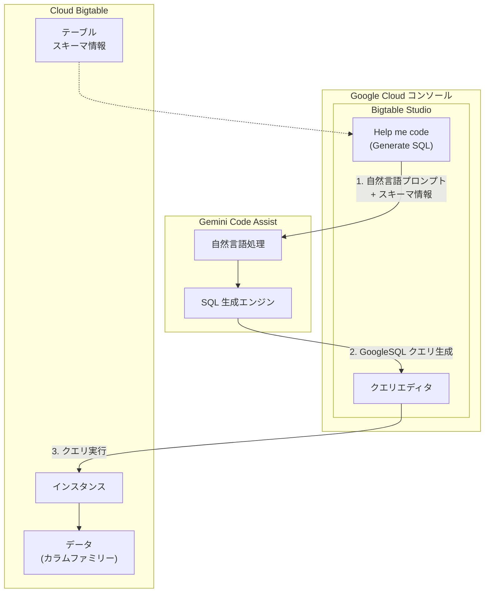

# Bigtable: Bigtable Studio で Gemini を使用した GoogleSQL クエリ作成支援が Preview に

**リリース日**: 2026-04-09

**サービス**: Cloud Bigtable

**機能**: Bigtable Studio における Gemini を活用した GoogleSQL クエリ作成支援

**ステータス**: Preview (プレビュー)

:bar_chart: [このアップデートのインフォグラフィックを見る](https://takech9203.github.io/google-cloud-news-summary/20260409-bigtable-gemini-sql-assistance.html)

## 概要

Bigtable Studio において、Gemini Code Assist を使用して自然言語プロンプトから GoogleSQL クエリを生成する AI 支援機能が Preview として利用可能になりました。この機能により、データベース管理者やデータエンジニアは、自然言語でクエリの意図を記述するだけで、Bigtable 固有の GoogleSQL 構文に準拠した SQL クエリを自動生成できます。

GoogleSQL for Bigtable は、BigQuery や Spanner でも採用されている ANSI 準拠の SQL 言語ですが、Bigtable 特有の MAP データ型やカラムファミリーの扱いなど、独自の構文を持っています。Gemini による支援は、これらの固有構文の学習コストを大幅に削減し、SQL に不慣れなユーザーでもスキーマ情報に基づいた正確なクエリを素早く作成できるようにします。

この機能は、Google Cloud コンソール内の Bigtable Studio のクエリエディタに統合されており、「Help me code」ツールを通じて利用できます。Gemini はテーブルのスキーマ情報 (テーブル名、カラム名、データ型など) をコンテキストとして使用し、パーソナライズされたクエリを生成します。

**アップデート前の課題**

- Bigtable の GoogleSQL は MAP データ型やカラムファミリーの参照方法など独自の構文があり、初学者にとって学習コストが高かった
- GoogleSQL for Bigtable は SELECT 文のみをサポートし、DML/DDL が非対応であるなど制限があり、正しいクエリ構文を把握するのが困難だった
- クエリ作成時にドキュメントを参照しながら手動で構文を確認する必要があり、開発効率が低かった

**アップデート後の改善**

- 自然言語プロンプトを入力するだけで、Bigtable のスキーマに基づいた GoogleSQL クエリが自動生成されるようになった
- Gemini がテーブルのスキーマ情報をコンテキストとして使用するため、カラムファミリーや MAP 型の参照を含む正確なクエリが生成される
- クエリエディタ内で直接 Gemini を呼び出せるため、外部ツールやドキュメントを参照する手間が削減された

## アーキテクチャ図



このフローチャートは、Bigtable Studio における Gemini を使った SQL クエリ生成の流れを示しています。ユーザーが自然言語プロンプトを入力すると、テーブルのスキーマ情報とともに Gemini Code Assist に送信され、生成された GoogleSQL クエリがクエリエディタに挿入されます。

## サービスアップデートの詳細

### 主要機能

1. **自然言語による SQL 生成 (Help me code)**
   - クエリエディタ内の「Generate SQL」ボタンから自然言語プロンプトを入力してクエリを生成
   - テーブルのスキーマ情報 (テーブル名、カラムファミリー名、データ型) がコンテキストとして自動的に含まれる
   - 生成された SQL を確認後、「Insert」でクエリエディタに挿入し「Run」で実行可能
   - プロンプトの編集と再生成にも対応

2. **Bigtable 固有構文の対応**
   - MAP データ型を使用したカラムファミリーの参照 (例: `columnFamily['qualifier']`)
   - `_key` カラムによるロウキーの参照
   - `with_history => TRUE` によるセル履歴の取得
   - GoogleSQL for Bigtable でサポートされる SELECT 文の生成

## 技術仕様

### 対応する SQL 構文

| 項目 | 対応状況 |
|------|------|
| SELECT 文 | 対応 |
| MAP データ型のカラムファミリー参照 | 対応 |
| テンポラルフィルタ (with_history) | 対応 |
| DML (INSERT, UPDATE, DELETE) | 非対応 (GoogleSQL for Bigtable の制限) |
| DDL (CREATE, ALTER, DROP) | 非対応 (GoogleSQL for Bigtable の制限) |
| サブクエリ、JOIN、UNION、CTE | 非対応 (GoogleSQL for Bigtable の制限) |

### 必要な権限

| IAM ロール | 説明 |
|------|------|
| `roles/cloudaicompanion.user` (Gemini for Google Cloud User) | Gemini を使用した SQL 生成に必要 |

### 前提条件

| 項目 | 詳細 |
|------|------|
| 必要な API | Gemini for Google Cloud API の有効化 |
| アクセス方法 | Google Cloud コンソールの Bigtable Studio |
| 対象言語 | 英語のプロンプトが推奨 |

## 設定方法

### 前提条件

1. Google Cloud プロジェクトで Gemini for Google Cloud API が有効化されていること
2. `roles/cloudaicompanion.user` IAM ロールが付与されていること
3. Bigtable インスタンスおよびテーブルが作成済みであること

### 手順

#### ステップ 1: Gemini for Google Cloud API の有効化

```bash
gcloud services enable cloudaicompanion.googleapis.com --project=PROJECT_ID
```

プロジェクトで Gemini for Google Cloud API を有効にします。

#### ステップ 2: IAM ロールの付与

```bash
gcloud projects add-iam-policy-binding PROJECT_ID \
  --member="user:USER_EMAIL" \
  --role="roles/cloudaicompanion.user"
```

対象ユーザーに Gemini for Google Cloud User ロールを付与します。

#### ステップ 3: Bigtable Studio でのクエリ生成

1. Google Cloud コンソールで Bigtable ページに移動
2. インスタンスを選択
3. ナビゲーションメニューから「Bigtable Studio」をクリック
4. 新しいタブを開き「Editor」を選択
5. 「Generate SQL」をクリック
6. 「Help me code」ダイアログで自然言語プロンプトを入力し「Generate」をクリック
7. 生成された SQL を確認し、「Insert」でクエリエディタに挿入
8. 「Run」でクエリを実行

## メリット

### ビジネス面

- **学習コストの削減**: Bigtable 固有の GoogleSQL 構文を学習しなくても、自然言語でクエリを作成できるため、チームのオンボーディング時間が短縮される
- **開発生産性の向上**: クエリの試行錯誤にかかる時間が削減され、データ分析やデバッグ作業の効率が向上する
- **現時点で追加料金なし**: コーディング支援は Gemini Code Assist Standard エディションに含まれるまで無料で利用可能

### 技術面

- **スキーマ対応の正確なクエリ生成**: Gemini がテーブルのスキーマ情報をコンテキストとして使用するため、実際のカラムファミリー名やデータ型に基づいた正確なクエリが生成される
- **コンソール統合**: Bigtable Studio のクエリエディタに直接統合されており、外部ツールへの切り替えが不要
- **セキュリティ**: データベースのスキーマとデータは Bigtable 内に留まり、Gemini に送信されない

## デメリット・制約事項

### 制限事項

- Gemini を使用した SQL クエリの自然言語による説明機能は現時点では利用できない (Cloud SQL や BigQuery では利用可能)
- Gemini が生成するクエリは GoogleSQL for Bigtable で非対応の構文 (DML、DDL、サブクエリ、JOIN、UNION、CTE) を含む場合がある
- 同じプロンプトに対して異なる構文が提案される場合がある
- Preview 段階のため、限定的なサポートとなる

### 考慮すべき点

- AI が生成するクエリは必ず検証してから実行すること。特に大量データへのクエリはコスト・パフォーマンスに影響する可能性がある
- 将来的に Gemini Code Assist Standard エディションのライセンスが必要になる可能性がある (時期は後日通知)
- GoogleSQL for Bigtable 自体の制約 (SELECT 文のみ対応、Data Boost との併用不可など) は引き続き適用される

## ユースケース

### ユースケース 1: IoT データの迅速なクエリ作成

**シナリオ**: IoT デバイスから大量のセンサーデータを Bigtable に格納しており、特定のデバイスの最新データを取得するクエリを素早く作成したい。

**実装例**:
```
プロンプト: "1GB データプランを持つデバイスの数をカウントする"

生成されるクエリ:
SELECT count(*) FROM `test_table`
WHERE cell_plan['data_plan_01gb'] = 'true'
```

**効果**: MAP データ型の参照構文を知らなくても、自然言語で意図を伝えるだけで正しい GoogleSQL クエリが生成される。

### ユースケース 2: データ品質の確認・デバッグ

**シナリオ**: 書き込まれたデータが正しいかどうかを素早く確認したい。特に、カラムファミリーの構造やセル履歴を含むクエリの作成が必要な場合。

**効果**: Bigtable のデータモデル (カラムファミリー、セルバージョニング、MAP 型) に関する深い知識がなくても、目的のデータを効率的に取得できる。

## 料金

Gemini を使用した Bigtable Studio での SQL 生成支援は、現時点では追加料金なしで利用可能です。ただし、将来的に Gemini Code Assist Standard エディションに含まれる予定であり、その時点からライセンスが必要になります。変更時期は後日通知されます。

Bigtable 自体の料金 (ノード、ストレージ、ネットワーク) は通常どおり適用されます。詳細は [Bigtable の料金ページ](https://cloud.google.com/bigtable/pricing) をご確認ください。

## 利用可能リージョン

Bigtable Studio は Google Cloud コンソールを通じてアクセスするため、Bigtable インスタンスが存在するすべてのリージョンで Gemini による SQL 支援機能を利用できます。Gemini for Google Cloud API の利用可能リージョンについては [Gemini for Google Cloud のドキュメント](https://cloud.google.com/gemini/docs/discover/supported-regions) をご確認ください。

## 関連サービス・機能

- **GoogleSQL for Bigtable**: Gemini が生成する SQL の基盤となるクエリ言語。ANSI 準拠の SQL で Bigtable データを照会可能
- **Bigtable Studio**: Google Cloud コンソール内の Bigtable データ管理ツール。クエリエディタ、テーブルブラウザ、データ可視化機能を提供
- **Gemini Code Assist**: Google Cloud 全体で利用可能な AI コーディング支援機能。BigQuery、Cloud SQL、AlloyDB でも同様の SQL 支援機能を提供
- **Gemini in BigQuery**: BigQuery で利用可能な Gemini による SQL/Python コード生成・説明・補完・エラー修正機能
- **Bigtable クライアントライブラリ**: Java、Python、Go 向けのクライアントライブラリでも executeQuery API を使用してプログラムから GoogleSQL クエリを実行可能

## 参考リンク

- :bar_chart: [インフォグラフィック](https://takech9203.github.io/google-cloud-news-summary/20260409-bigtable-gemini-sql-assistance.html)
- [公式リリースノート](https://cloud.google.com/release-notes#April_09_2026)
- [Gemini を使用した SQL クエリ作成 (Bigtable ドキュメント)](https://cloud.google.com/bigtable/docs/write-sql-gemini)
- [GoogleSQL for Bigtable 概要](https://cloud.google.com/bigtable/docs/googlesql-overview)
- [Bigtable Studio でのデータ管理](https://cloud.google.com/bigtable/docs/manage-data-using-console)
- [Bigtable 料金](https://cloud.google.com/bigtable/pricing)

## まとめ

Bigtable Studio における Gemini を活用した GoogleSQL クエリ生成支援は、Bigtable 固有の SQL 構文の学習障壁を大幅に下げる機能です。自然言語プロンプトからスキーマ情報に基づいた正確なクエリを生成できるため、データエンジニアやデータベース管理者の日常的なデータ確認・分析作業の効率が向上します。Preview 段階のため本番利用には注意が必要ですが、Gemini for Google Cloud API の有効化と適切な IAM ロールの付与だけで利用を開始できるため、まずは開発・検証環境で試してみることをお勧めします。

---

**タグ**: Bigtable, Bigtable Studio, Gemini, Gemini Code Assist, GoogleSQL, SQL, AI, 自然言語, クエリ生成, Preview, Help me code
