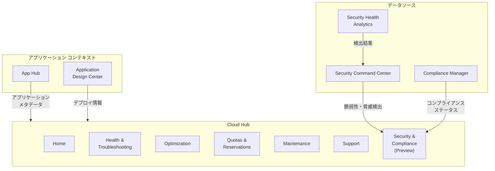

# Cloud Hub: Security & Compliance (セキュリティとコンプライアンス)

**リリース日**: 2026-04-09

**サービス**: Cloud Hub

**機能**: Security & Compliance

**ステータス**: Preview

[このアップデートのインフォグラフィックを見る](https://takech9203.github.io/google-cloud-news-summary/20260409-cloud-hub-security-compliance.html)

## 概要

Cloud Hub に「Security & Compliance」ページが Preview として追加された。Cloud Hub は DevOps および SRE チーム向けに、Google Cloud アプリケーションとリソースの運用データおよびインサイトを一元的に表示するダッシュボードサービスである。今回のアップデートにより、既存の Health & Troubleshooting、Optimization、Quotas & Reservations などのページに加え、セキュリティとコンプライアンスに関する情報も Cloud Hub 内で確認できるようになった。

この機能は、Security Command Center および Compliance Manager と統合されており、Cloud Hub のアプリケーション中心のビューの中でセキュリティ検出結果やコンプライアンスステータスを確認できる。これにより、運用チームはセキュリティチームが管理する情報を、日常の運用ワークフロー内で直接参照できるようになる。

対象ユーザーは、Google Cloud 上でアプリケーションを運用する DevOps エンジニア、SRE、セキュリティ担当者、およびコンプライアンス管理者である。特に、App Hub でアプリケーションを登録し、Security Command Center を有効化している組織にとって大きな価値を持つ。

**アップデート前の課題**

- セキュリティとコンプライアンスの情報を確認するには、Security Command Center のコンソールに個別にアクセスする必要があった
- Cloud Hub の運用ダッシュボードとセキュリティダッシュボードが分離されており、運用とセキュリティの相関分析が困難だった
- アプリケーション単位でセキュリティ検出結果やコンプライアンスステータスをまとめて確認する統合ビューが存在しなかった

**アップデート後の改善**

- Cloud Hub 内でセキュリティとコンプライアンスの情報を直接確認できるようになり、コンソール間の移動が不要になった
- アプリケーションビューやプロジェクトビューと同じコンテキストでセキュリティ情報を参照できるようになった
- 運用データ（アラート、インシデント、メンテナンス）とセキュリティデータ（脆弱性、コンプライアンス）を一元的に把握できるようになった

## アーキテクチャ図



Cloud Hub の Security & Compliance ページは、Security Command Center および Compliance Manager からセキュリティ・コンプライアンスデータを取得し、App Hub のアプリケーション コンテキストと統合して表示する。

## サービスアップデートの詳細

### 主要機能

1. **セキュリティ検出結果の統合表示**
   - Security Command Center の脆弱性検出結果を Cloud Hub 内で確認可能
   - プロジェクト単位またはアプリケーション単位でのフィルタリングに対応
   - 検出結果の重大度（Critical、High、Medium、Low）による分類表示

2. **コンプライアンスステータスの確認**
   - Compliance Manager と連携し、各種コンプライアンスフレームワークへの準拠状況を表示
   - CIS、NIST、ISO 27001、PCI DSS などの主要なセキュリティ基準に対応
   - コントロールの合格率やコンプライアンスの傾向を確認可能

3. **アプリケーション中心のセキュリティビュー**
   - App Hub に登録されたアプリケーション単位でセキュリティ情報を集約
   - アプリケーションを構成するリソースに関連するセキュリティ検出結果を一覧表示
   - 運用データとセキュリティデータの横断的な分析を支援

## 技術仕様

### 関連 IAM ロール

| ロール | 説明 |
|------|------|
| `roles/cloudhub.operator` | Cloud Hub の操作に必要な基本ロール |
| `roles/cloudsecuritycompliance.admin` | Compliance Manager の管理者ロール |
| `roles/cloudsecuritycompliance.viewer` | Compliance Manager の閲覧者ロール |
| `roles/securitycenter.admin` | Security Command Center の管理者ロール |
| `roles/securitycenter.adminViewer` | Security Command Center の閲覧者ロール |

### 必要な API

| API | 用途 |
|-----|------|
| `securitycenter.googleapis.com` | Security Command Center データの取得 |
| `cloudsecuritycompliance.googleapis.com` | Compliance Manager データの取得 |
| `apphub.googleapis.com` | App Hub アプリケーションデータの取得 |

## 設定方法

### 前提条件

1. Cloud Hub がセットアップ済みであること
2. Security Command Center が組織レベルまたはプロジェクトレベルで有効化されていること
3. 適切な IAM ロール（`roles/cloudhub.operator` および Security Command Center の閲覧ロール）が付与されていること

### 手順

#### ステップ 1: Security Command Center API の有効化

```bash
gcloud services enable securitycenter.googleapis.com \
    --project=PROJECT_ID
```

Security Command Center API を有効化することで、Cloud Hub が脆弱性検出結果やコンプライアンスデータにアクセスできるようになる。

#### ステップ 2: Cloud Hub の Security & Compliance ページにアクセス

```bash
# Google Cloud Console で Cloud Hub にアクセス
# https://console.cloud.google.com/cloud-hub/home
# 左側のナビゲーションから「Security & Compliance」を選択
```

Cloud Hub の Security & Compliance ページは Google Cloud Console から直接アクセスできる。プロジェクトまたはアプリケーションを選択して、セキュリティとコンプライアンスの情報を確認する。

## メリット

### ビジネス面

- **運用効率の向上**: セキュリティとコンプライアンスの確認を運用ワークフロー内で完結でき、複数のコンソール間を移動する必要がなくなる
- **コンプライアンス管理の簡素化**: アプリケーション単位でコンプライアンスステータスを確認でき、監査対応が効率化される
- **組織横断的な可視性**: DevOps、SRE、セキュリティチームが同じダッシュボードでデータを共有でき、組織間のコミュニケーションが改善される

### 技術面

- **統合ダッシュボード**: 運用データとセキュリティデータを単一のインターフェースで確認でき、相関分析が容易になる
- **アプリケーション中心の分析**: App Hub のアプリケーションモデルを活用し、インフラストラクチャ単位ではなくアプリケーション単位でセキュリティ状態を把握できる
- **既存サービスとの統合**: Security Command Center および Compliance Manager の機能をそのまま活用するため、追加のセキュリティツールの導入が不要である

## デメリット・制約事項

### 制限事項

- 現在 Preview ステータスであり、本番環境での利用は推奨されない場合がある
- Preview 機能は「Pre-GA Offerings Terms」の対象であり、サポートが限定される可能性がある
- Security Command Center の有効化が前提条件であり、未導入の組織では事前のセットアップが必要である

### 考慮すべき点

- Cloud Hub の Security & Compliance ページは Security Command Center のデータを参照するため、Security Command Center 側での検出設定やコンプライアンスフレームワークの構成が適切に行われている必要がある
- Compliance Manager を有効化していない場合、コンプライアンス関連の機能が制限される可能性がある
- Preview 期間中は機能の変更や削除が行われる場合がある

## ユースケース

### ユースケース 1: アプリケーション デプロイ後のセキュリティ確認

**シナリオ**: SRE チームが新しいアプリケーションのデプロイ後に、セキュリティ上の問題がないかを確認したい場合。

**効果**: Cloud Hub の Security & Compliance ページで、デプロイしたアプリケーションに関連するセキュリティ検出結果を即座に確認できる。Deployments ページでデプロイ状況を確認し、同じ Cloud Hub 内で Security & Compliance ページに移動してセキュリティ検出結果を確認するワークフローが実現される。

### ユースケース 2: 定期的なコンプライアンスレビュー

**シナリオ**: コンプライアンス担当者が月次レビューの一環として、アプリケーションごとのコンプライアンスステータスを確認し、是正が必要な項目を特定したい場合。

**効果**: Cloud Hub のアプリケーションビューで各アプリケーションのコンプライアンス準拠率を確認し、不適合なコントロールを特定できる。Compliance Manager のフレームワーク（CIS、NIST、ISO 27001 など）に対する準拠状況を一元的に把握し、是正の優先順位付けが効率化される。

### ユースケース 3: インシデント対応時のセキュリティ コンテキスト確認

**シナリオ**: 運用アラートが発生した際に、関連するセキュリティ上の脆弱性や検出結果がないかを確認したい場合。

**効果**: Cloud Hub 内で Health & Troubleshooting ページのアラート情報と Security & Compliance ページのセキュリティ検出結果を横断的に確認でき、運用上の問題とセキュリティ上の問題の関連性を迅速に把握できる。

## 料金

Cloud Hub 自体には独自の API がなく、他のサービスの API を呼び出してデータを取得する。Security & Compliance ページに関連する主な料金は以下の通りである。

| サービス | 料金体系 |
|---------|---------|
| Security Command Center (Standard) | 無料 |
| Security Command Center (Premium) | 有料（リソースベースの課金） |
| Security Command Center (Enterprise) | 有料（リソースベースの課金） |
| Compliance Manager | Security Command Center のティアに含まれる |

Security & Compliance ページの利用自体に追加料金は発生しないが、データソースとなる Security Command Center のティアに応じた料金が適用される。詳細は [Security Command Center の料金ページ](https://cloud.google.com/security-command-center/pricing) を参照。

## 関連サービス・機能

- **[Security Command Center](https://docs.cloud.google.com/security-command-center/docs)**: セキュリティ検出結果やコンプライアンスデータのソースとなるリスク管理ソリューション
- **[Compliance Manager](https://docs.cloud.google.com/security-command-center/docs/compliance-manager-overview)**: コンプライアンスフレームワークの管理・監視・監査を行うサービスで、Cloud Hub に準拠状況データを提供
- **[App Hub](https://docs.cloud.google.com/app-hub/docs/overview)**: アプリケーション中心のリソース管理を実現するサービスで、Cloud Hub にアプリケーション コンテキストを提供
- **[Security Health Analytics](https://docs.cloud.google.com/security-command-center/docs/concepts-security-health-analytics)**: Google Cloud 環境の脆弱性やミスコンフィギュレーションを自動検出するサービス
- **[Application Design Center](https://docs.cloud.google.com/application-design-center/docs/overview)**: アプリケーションの設計・デプロイを支援するサービスで、Cloud Hub の Deployments ページにデータを提供

## 参考リンク

- [インフォグラフィック](https://takech9203.github.io/google-cloud-news-summary/20260409-cloud-hub-security-compliance.html)
- [公式リリースノート](https://docs.cloud.google.com/release-notes#April_09_2026)
- [Cloud Hub Security ドキュメント](https://docs.cloud.google.com/hub/docs/security)
- [Cloud Hub 概要](https://docs.cloud.google.com/hub/docs/overview)
- [Cloud Hub セットアップ](https://docs.cloud.google.com/hub/docs/setup-cloud-hub)
- [Security Command Center 料金](https://cloud.google.com/security-command-center/pricing)
- [Compliance Manager 概要](https://docs.cloud.google.com/security-command-center/docs/compliance-manager-overview)

## まとめ

Cloud Hub の Security & Compliance ページが Preview として利用可能になったことで、運用チームはセキュリティとコンプライアンスの情報を日常の運用ワークフロー内で直接確認できるようになった。Security Command Center および Compliance Manager との統合により、アプリケーション中心の統合セキュリティビューが実現されている。Preview 段階であるため本番環境での利用には注意が必要だが、Security Command Center を既に導入している組織は、Cloud Hub のセットアップを確認し、この新しいページの活用を検討することを推奨する。

---

**タグ**: #CloudHub #Security #Compliance #SecurityCommandCenter #ComplianceManager #AppHub #Preview #セキュリティ #コンプライアンス #運用管理
