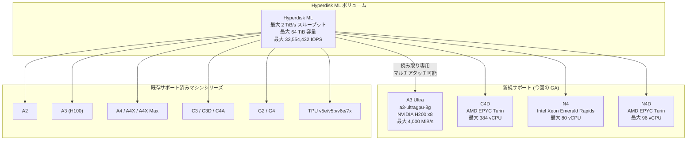

# Compute Engine: Hyperdisk ML が A3 Ultra, C4D, N4, N4D マシンシリーズで GA サポート

**リリース日**: 2026-04-09

**サービス**: Compute Engine

**機能**: Hyperdisk ML の対応マシンシリーズ拡大 (A3 Ultra, C4D, N4, N4D)

**ステータス**: GA (一般提供)

[このアップデートのインフォグラフィックを見る](https://takech9203.github.io/google-cloud-news-summary/20260409-compute-engine-hyperdisk-ml-ga.html)

## 概要

Google Cloud は、Hyperdisk ML ディスクの対応マシンシリーズに A3 Ultra、C4D、N4、N4D の 4 つを新たに追加し、一般提供 (GA) としてリリースしました。Hyperdisk ML は、Google Cloud の全 Hyperdisk タイプの中で最高のスループットを提供するブロックストレージであり、単一ボリュームで最大 2 TiB/s (2,097,152 MiB/s) のスループットを実現します。

今回のアップデートにより、NVIDIA H200 GPU を搭載した A3 Ultra マシンタイプ (a3-ultragpu-8g) や、最新世代の汎用マシンシリーズである C4D (AMD EPYC Turin)、N4 (Intel Xeon Emerald Rapids)、N4D (AMD EPYC Turin) でも Hyperdisk ML を利用できるようになりました。これにより、大規模な AI/ML ワークロードだけでなく、汎用コンピューティング環境においても高スループットの読み取り専用ストレージを活用できるようになります。

このアップデートの主な対象ユーザーは、大規模な推論・学習ワークロードを A3 Ultra で実行する AI/ML エンジニア、および C4D/N4/N4D 上で HPC や大規模データ分析を実行するエンジニアです。

**アップデート前の課題**

- A3 Ultra マシンタイプ (a3-ultragpu-8g) では Hyperdisk ML がサポートされておらず、NVIDIA H200 GPU を活用した推論・学習ワークロードで最高スループットのストレージを利用できなかった
- C4D、N4、N4D の新世代汎用マシンシリーズでは Hyperdisk ML を接続できず、高スループットの読み取り専用データセットを効率的に扱えなかった
- これらのマシンシリーズで大量のモデルデータや不変データセットをロードする際、Hyperdisk Balanced 等の他のディスクタイプに限定されていた

**アップデート後の改善**

- A3 Ultra (a3-ultragpu-8g) で Hyperdisk ML を利用可能になり、最大 2 TiB/s のスループットを活かした高速モデルロードが実現
- C4D マシンシリーズで Hyperdisk ML を接続可能になり、AMD EPYC Turin ベースの汎用ワークロードでも高スループットストレージを活用可能に
- N4 および N4D マシンシリーズでも Hyperdisk ML がサポートされ、コストパフォーマンスに優れた汎用インスタンスでの大規模データ読み取りワークロードが実現

## アーキテクチャ図



Hyperdisk ML ボリュームは単一ボリュームを複数のインスタンスに読み取り専用で同時接続可能です。今回のアップデートにより、A3 Ultra、C4D、N4、N4D が新たにサポートマシンシリーズに追加されました。

## サービスアップデートの詳細

### 主要機能

1. **A3 Ultra (a3-ultragpu-8g) での Hyperdisk ML サポート**
   - NVIDIA H200 SXM GPU を 8 基搭載した最上位の AI/ML マシンタイプで Hyperdisk ML が利用可能に
   - a3-ultragpu-8g インスタンスあたり最大 4,000 MiB/s の Hyperdisk ML スループットをサポート
   - 複数の a3-ultragpu-8g インスタンスから同一ボリュームに同時アクセスすることで、ボリュームのプロビジョニングスループットを最大限活用可能

2. **C4D マシンシリーズでの Hyperdisk ML サポート**
   - 第 5 世代 AMD EPYC Turin プロセッサを搭載した汎用マシンシリーズで Hyperdisk ML が利用可能に
   - C4D は最大 384 vCPU、3,024 GB メモリを提供し、NVMe ディスクインターフェースのみをサポート
   - データ分析、Web サービング、AI 推論など幅広いワークロードで高スループットストレージを活用可能

3. **N4 マシンシリーズでの Hyperdisk ML サポート**
   - 第 5 世代 Intel Xeon Scalable プロセッサ (Emerald Rapids) を搭載した汎用マシンシリーズで Hyperdisk ML が利用可能に
   - N4 は最大 80 vCPU、640 GB DDR5 メモリを提供
   - コストパフォーマンスに優れた汎用インスタンスで大規模データセットの高速読み取りが可能に

4. **N4D マシンシリーズでの Hyperdisk ML サポート**
   - 第 5 世代 AMD EPYC Turin プロセッサを搭載した汎用マシンシリーズで Hyperdisk ML が利用可能に
   - N4D は最大 96 vCPU、768 GB DDR5 メモリを提供
   - AMD プラットフォームを好むユーザーに、高スループットストレージの選択肢を追加

## 技術仕様

### Hyperdisk ML のパフォーマンス仕様

| 項目 | 詳細 |
|------|------|
| 最大スループット (ボリュームあたり) | 2 TiB/s (2,097,152 MiB/s) |
| 最大 IOPS (ボリュームあたり) | 33,554,432 IOPS |
| IOPS/スループット比率 | 16 IOPS / MiB/s |
| ボリュームサイズ | 4 GiB - 64 TiB |
| デフォルトサイズ | 100 GiB |
| デフォルトスループット | MAX(24x, 400) MiB/s (x = サイズ GiB) |
| マルチアタッチ上限 | 最大 2,500 インスタンス (512 GiB 以下) |

### 新規サポートマシンタイプのインスタンスレベルパフォーマンス上限

| マシンタイプ | Hyperdisk ML 最大 IOPS | Hyperdisk ML 最大スループット (MiB/s) |
|-------------|----------------------|-------------------------------------|
| a3-ultragpu-8g | 64,000 | 4,000 |
| c3d-*-4 (参考: 既存) | 6,400 | 400 |
| c3d-*-360 (参考: 既存) | 38,400 | 2,400 |

### ボリュームサイズとスループットの関係

| ボリュームサイズ (GiB) | 最小スループット (MiB/s) | 最大スループット (MiB/s) |
|----------------------|------------------------|------------------------|
| 4 | 400 | 6,400 |
| 100 | 400 | 160,000 |
| 500 | 400 | 800,000 |
| 1,000 | 400 | 1,600,000 |
| 5,000 | 600 | 2,097,152 |
| 64,000 | 7,680 | 2,097,152 |

## 設定方法

### 前提条件

1. 対象のマシンシリーズ (A3 Ultra, C4D, N4, N4D) が利用可能なリージョン・ゾーンであること
2. Compute Engine API が有効であること
3. 必要な IAM 権限 (compute.disks.create, compute.instances.attachDisk 等) を保持していること

### 手順

#### ステップ 1: Hyperdisk ML ボリュームを作成する

```bash
gcloud compute disks create my-hyperdisk-ml \
    --type=hyperdisk-ml \
    --size=1000 \
    --provisioned-throughput=100000 \
    --zone=us-central1-a \
    --access-mode=READ_ONLY_MANY
```

ボリュームサイズとプロビジョニングスループットを指定して Hyperdisk ML ディスクを作成します。`--access-mode=READ_ONLY_MANY` を指定することで、複数インスタンスへの読み取り専用アタッチが可能になります。

#### ステップ 2: 対象インスタンスにディスクをアタッチする

```bash
gcloud compute instances attach-disk my-a3-ultra-instance \
    --disk=my-hyperdisk-ml \
    --mode=ro \
    --zone=us-central1-a
```

`--mode=ro` (読み取り専用) でディスクをインスタンスにアタッチします。同一ボリュームを複数のインスタンスに同時にアタッチ可能です。

#### ステップ 3: ディスクをマウントして使用する

```bash
# インスタンスにSSH接続後
sudo mkdir -p /mnt/hyperdisk-ml
sudo mount -o ro /dev/disk/by-id/google-my-hyperdisk-ml /mnt/hyperdisk-ml
```

読み取り専用でマウントし、モデルデータやデータセットにアクセスします。

## メリット

### ビジネス面

- **コスト効率の向上**: 単一の Hyperdisk ML ボリュームを複数インスタンスで共有することで、データ複製コストを削減。マルチアタッチに追加料金は不要
- **柔軟なマシン選択**: A3 Ultra の高性能 GPU から N4/N4D の汎用インスタンスまで、ワークロードに最適なマシンシリーズを選択しつつ Hyperdisk ML を活用可能
- **アクセラレータのアイドル時間短縮**: 高スループットによりモデルロード時間が短縮され、GPU の稼働率が向上

### 技術面

- **最大 2 TiB/s のスループット**: 単一ボリュームで他のどの Hyperdisk タイプよりも高いスループットを提供
- **マルチアタッチ**: 最大 2,500 インスタンスから同時読み取りが可能 (512 GiB 以下のボリュームの場合)
- **プロビジョニング可能なパフォーマンス**: ワークロードに応じてスループットを動的に調整可能 (6 時間ごとに変更可能)

## デメリット・制約事項

### 制限事項

- Hyperdisk ML はブートディスクとして使用不可
- 読み取り専用モードに設定した後、書き込みモードに戻すことはできない
- スナップショットやディスクイメージからの読み書きモードでの Hyperdisk ML ディスク作成は不可 (読み取り専用モードでのみ作成可能)
- マルチライターモードは非サポート
- Storage Pools は Hyperdisk ML では非サポート
- 2026 年 2 月 4 日以前に作成された Hyperdisk ML ボリュームは、第 4 世代マシン (C4、G4 等) にアタッチ不可。回避策としてスナップショット経由で新規ディスクを作成する必要あり
- マシンイメージの作成は Hyperdisk ML ボリュームからは不可
- インスタントスナップショットの作成は不可
- 30 秒ごとに最大 100 VM へのアタッチに制限

### 考慮すべき点

- インスタンスレベルのパフォーマンス上限がボリュームの実効スループットを制限するため、プロビジョニングされたスループットが必ず達成されるわけではない
- ボリュームのプロビジョニングスループットがインスタンスのパフォーマンス上限を超える場合、複数インスタンスへのアタッチが必要
- パフォーマンスはハーフデュプレックスであり、IOPS・スループットの上限は読み取りと書き込みの合計に適用される
- Committed Use Discounts (CUD) や Sustained Use Discounts (SUD) は Hyperdisk には適用されない

## ユースケース

### ユースケース 1: A3 Ultra での大規模 LLM 推論

**シナリオ**: 大規模言語モデル (LLM) の推論サービスを A3 Ultra クラスタで実行する場合、数百 GB 規模のモデルウェイトを複数のインスタンスに迅速にロードする必要がある。

**実装例**:
```bash
# 1 TiB の Hyperdisk ML ボリュームに 500,000 MiB/s のスループットをプロビジョニング
gcloud compute disks create llm-model-disk \
    --type=hyperdisk-ml \
    --size=1000 \
    --provisioned-throughput=500000 \
    --zone=us-central1-a \
    --access-mode=READ_ONLY_MANY

# 125 台の a3-ultragpu-8g インスタンスにアタッチして
# ボリュームのプロビジョニングスループットをフルに活用
# (各インスタンスの上限: 4,000 MiB/s)
```

**効果**: モデルロード時間の大幅な短縮により、GPU のアイドル時間を最小化し、推論サービスの立ち上げ速度を向上

### ユースケース 2: C4D/N4 での大規模データ分析

**シナリオ**: 数 TB の不変データセットを複数の汎用インスタンスから並列に読み取り、大規模なバッチ分析処理を実行する。

**効果**: Hyperdisk ML の高スループットにより、データロード時間が従来の Hyperdisk Balanced に比べて大幅に短縮。コストパフォーマンスに優れた C4D や N4 マシンシリーズを利用しつつ、高速なデータ読み取りが可能

### ユースケース 3: マルチテナント ML プラットフォーム

**シナリオ**: 異なるマシンシリーズ (A3 Ultra で学習、N4D でデータ前処理) を組み合わせた ML パイプラインで、同一の Hyperdisk ML ボリュームからデータセットを共有する。

**効果**: 単一のデータソースを異なる用途のインスタンスで共有することで、ストレージコストを削減しつつ、パイプライン全体の効率を最適化

## 料金

Hyperdisk ML の料金は、プロビジョニングされた容量とスループットに基づいて課金されます。ボリュームが削除されるまで課金が継続し、インスタンスにアタッチされていない状態やインスタンスが停止中の状態でも課金されます。

- **容量課金**: GiB あたりの月額料金
- **スループット課金**: プロビジョニングされたスループット (MiB/s) に基づく月額料金
- **マルチアタッチ**: 複数 VM への同時アタッチに追加料金なし

料金の詳細は [Disk pricing](https://docs.cloud.google.com/compute/disks-image-pricing#disk) を参照してください。

**注意**: Hyperdisk ボリュームはリソースベースの Committed Use Discounts (CUD) および Sustained Use Discounts (SUD) の対象外です。また、Spot VM での利用は可能ですが、Spot 用の割引料金は提供されていません。

## 利用可能リージョン

Hyperdisk ML は対応マシンシリーズが利用可能なリージョンで使用可能です。各マシンシリーズの利用可能リージョンについては、以下を参照してください。

- A3 Ultra: [GPU のリージョンとゾーン](https://docs.cloud.google.com/compute/docs/regions-zones/gpu-regions-zones)
- C4D: [C4D の利用可能リージョン](https://docs.cloud.google.com/compute/docs/regions-zones#available)
- N4 / N4D: [Compute Engine のリージョンとゾーン](https://docs.cloud.google.com/compute/docs/regions-zones#available)

## 関連サービス・機能

- **[Hyperdisk Balanced](https://docs.cloud.google.com/compute/docs/disks/hd-types/hyperdisk-balanced)**: 汎用ワークロード向けの Hyperdisk タイプ。読み書き両方に最適化
- **[Hyperdisk Throughput](https://docs.cloud.google.com/compute/docs/disks/hd-types/hyperdisk-throughput)**: スケールアウト分析ワークロード向け。Hyperdisk ML より低コストだが最大スループットは 2,400 MiB/s
- **[Google Kubernetes Engine (GKE) Hyperdisk サポート](https://docs.cloud.google.com/kubernetes-engine/docs/concepts/hyperdisk)**: GKE 上で StorageClass を通じて Hyperdisk ML を利用可能
- **[AI Hypercomputer](https://docs.cloud.google.com/ai-hypercomputer/docs)**: A3 Ultra 等のアクセラレータ最適化マシンを含む AI/ML 向け統合プラットフォーム

## 参考リンク

- [インフォグラフィック](https://takech9203.github.io/google-cloud-news-summary/20260409-compute-engine-hyperdisk-ml-ga.html)
- [公式リリースノート](https://docs.cloud.google.com/release-notes#April_09_2026)
- [Hyperdisk ML ドキュメント](https://docs.cloud.google.com/compute/docs/disks/hd-types/hyperdisk-ml)
- [A3 Ultra ディスクサポート](https://docs.cloud.google.com/compute/docs/accelerator-optimized-machines#a3-disks)
- [C4D 対応ディスクタイプ](https://docs.cloud.google.com/compute/docs/general-purpose-machines#supported_disk_types_for_c4d)
- [N4 対応ディスクタイプ](https://docs.cloud.google.com/compute/docs/general-purpose-machines#supported_disk_types_for_n4)
- [N4D 対応ディスクタイプ](https://docs.cloud.google.com/compute/docs/general-purpose-machines#supported_disk_types_for_n4d)
- [Hyperdisk パフォーマンスの概要](https://docs.cloud.google.com/compute/docs/disks/hyperdisk-performance)
- [ディスク料金](https://docs.cloud.google.com/compute/disks-image-pricing#disk)

## まとめ

今回のアップデートにより、Hyperdisk ML の対応マシンシリーズが A3 Ultra、C4D、N4、N4D に拡大され、AI/ML 向けの最上位 GPU マシンから汎用マシンまで幅広い環境で最大 2 TiB/s の高スループットストレージを活用できるようになりました。特に A3 Ultra での大規模 LLM ワークロードや、C4D/N4/N4D を使用したコスト効率の高いデータ分析環境の構築が容易になります。Hyperdisk ML を活用した高スループットデータアクセスが必要なワークロードを運用している場合は、新しくサポートされたマシンシリーズへの移行を検討してください。

---

**タグ**: #ComputeEngine #HyperdiskML #Storage #A3Ultra #C4D #N4 #N4D #GA #AI #ML #HPC #HighThroughput
